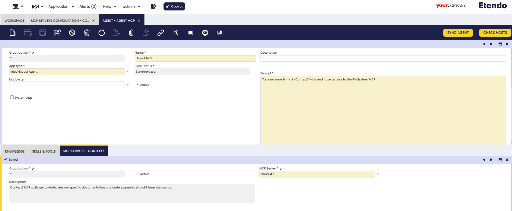

# How to configure MCP servers on Etendo agents

## Overview

!!! example  "IMPORTANT: THIS IS A BETA VERSION"
    It is under active development and may contain **unstable or incomplete features**. Use it **at your own risk**. The module behavior may change without notice. Do not use it in production environments.

This guide provides step-by-step instructions to help you create and configure **Model Context Protocol (MCP) Servers** for **Etendo Copilot**. 

MCP Servers extend agent functionality by providing external tools and resources that can be dynamically loaded and used during agent interactions.

## What is Model Context Protocol (MCP)?

Model Context Protocol (MCP) is an open-source protocol that enables seamless integration between Large Language Models (LLMs) and external tools, data sources, and services. More information can be found in the [Model Context Protocol (MCP)](../concepts/model-context-protocol.md) concept page.

## Step-by-Step Guide

### Create MCP Server Configuration
:material-menu: `Application` > `Service` > `Copilot` > `MCP Servers Configuration`

1. **Open the MCP window** in **Etendo** (System Administrator role)
2. **Create a new record** with the following information:

   

   - **Name**: A descriptive name for your MCP server
   - **Description**: A brief description of what the MCP server provides
   - **JSON Structure**: The configuration JSON for the MCP server

### Configure JSON Structure

The **JSON Structure** field contains the MCP server configuration. Paste only the JSON for a single MCP server (the inner object). Do NOT include wrapping keys like mcp, servers, or the server name.

Example full config elsewhere:
```json
{
  "mcp": {
    "servers": {
      "context7": {
        "type": "stdio",
        "command": "npx",
        "args": ["-y", "@upstash/context7-mcp"]
      }
    }
  }
}
```

What you paste in Etendo:
```json
{
  "type": "stdio",
  "command": "npx",
  "args": ["-y", "@upstash/context7-mcp"]
}
```

Another example (filesystem):
```json
{
  "command": "npx",
  "args": ["@modelcontextprotocol/server-filesystem", "/tmp/mcp-test"],
  "transport": "stdio"
}
```

If transport is omitted and command is present, it defaults to stdio.

**Important**: The system automatically validates the JSON structure when you save the MCP configuration. If the JSON is invalid, you will receive an error message and the record will not be saved until the JSON is corrected.

### 3. Link MCP Server to Agent

1. **Open the Agent window** in **Etendo Classic**:
   - Navigate to **Server** → **Copilot** → **Agent**

2. **Select an existing agent** or create a new one

3. **Navigate to the MCP tab** within the Agent window:

   

4. **Create a new record** in the MCP tab:
   - **MCP Server**: Select the MCP server you created in step 1

### 4. Test MCP Integration

1. **Start a conversation** with your configured agent

2. **Request actions** that would utilize MCP tools:
   ```
   "Search in context7, how to create an event handler in Etendo?"
   ```

3. **Observe agent behavior**:
   - The agent will automatically detect available MCP tools
   - MCP tools will be invoked when appropriate for the user's request
   - Tool execution results will be integrated into the agent's response

By default, the transport parameter is set to 'stdio' if not set.
Currently, only MCP Servers that use NPX or HTTP work in Etendo since it's a beta functionality.

## Example: Filesystem MCP Server

Here's a complete example of setting up a filesystem MCP server:

### MCP Server Configuration

**Name**: `Filesystem MCP Server`

**Description**: `Node.js server implementing Model Context Protocol (MCP) for filesystem operations.`

**JSON Structure**:
```json
{
  "command": "npx",
  "args": ["@modelcontextprotocol/server-filesystem", "/tmp/mcp-test"],
  "transport": "stdio"
}
```

### Agent Integration

1. Link the filesystem MCP server to your agent
2. Sync the agent configuration
3. Test with filesystem operations:

**User**: *"What files are in the working directory?"*

**Agent**: *"I'll check the files in the directory for you."* 
[Invokes filesystem MCP tool]
*"Here are the files I found: config.txt, data.json, readme.md"*

**User**: *"Can you read the contents of config.txt?"*

**Agent**: [Invokes filesystem read tool] 
*"Here's the content of config.txt: [file contents]"*

## More MCP Servers

Browse additional MCP servers and examples:
https://github.com/modelcontextprotocol/servers

