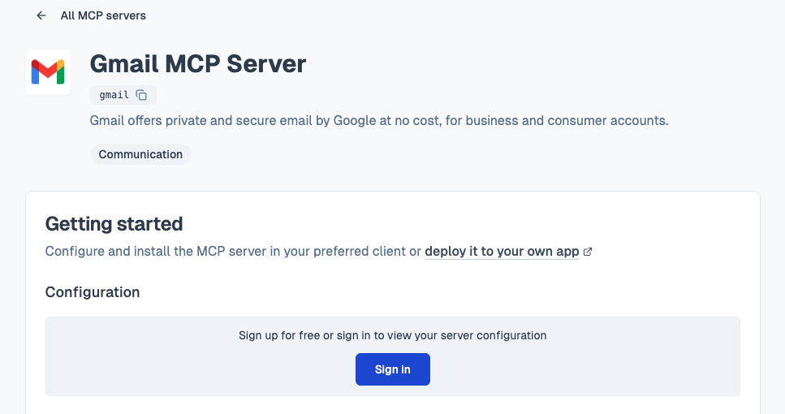
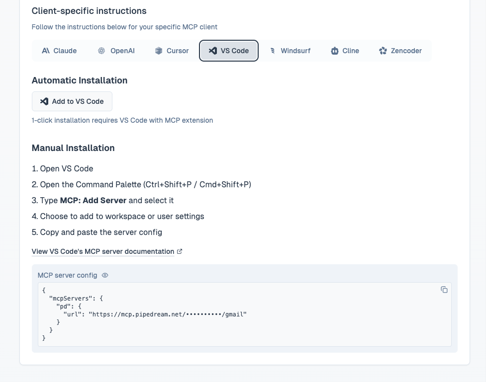
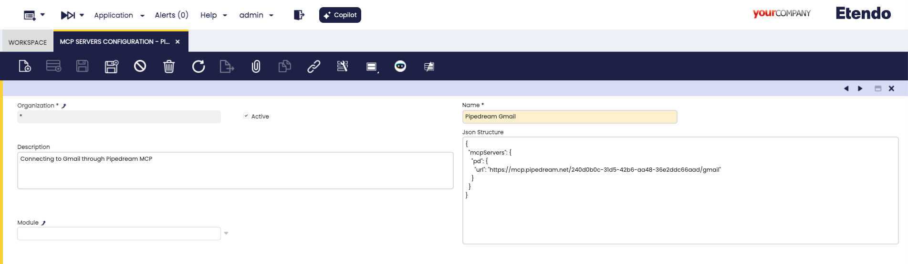
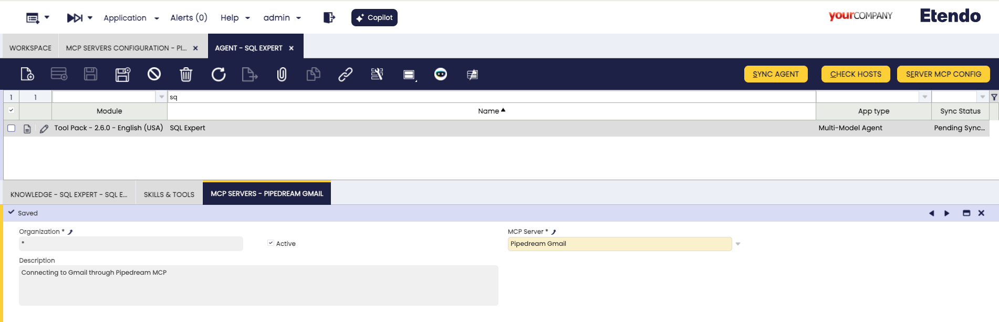
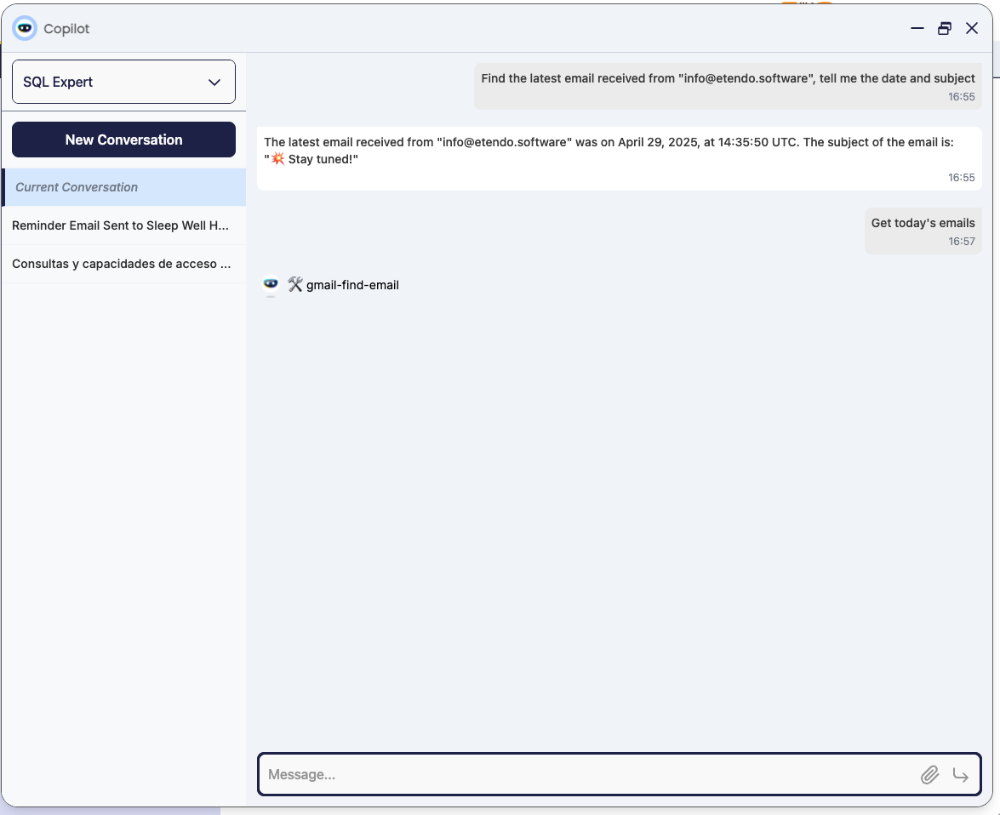
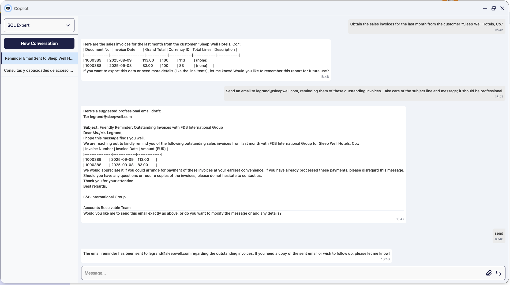
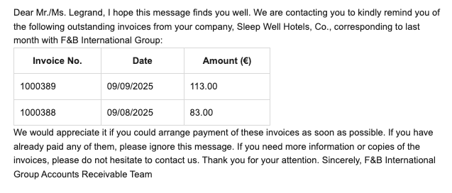

# How to Connect Etendo Copilot with Gmail via Pipedream

## Overview

<iframe width="560" height="315" src="https://www.youtube.com/embed/taAPYMPWpLM?si=_xZf1LQUnPAmQcHF" title="YouTube video player" frameborder="0" allow="accelerometer; autoplay; clipboard-write; encrypted-media; gyroscope; picture-in-picture; web-share" referrerpolicy="strict-origin-when-cross-origin" allowfullscreen></iframe>

Imagine a department manager working with Etendo Copilot who suddenly needs to check their email to review the latest client messages before making a decision.  

In the past, this required switching tabs, searching for the Gmail thread, and then returning to Copilot — a typical flow interruption.  

With the **Gmail integration** via [Pipedream](https://pipedream.com){target="_blank"}, you can simply ask the agent:

- *“List my recent Gmail emails”*
- *“Summarize all unread emails and order them by relevance”*
- *“Search sent emails to `client@example.com` and list their latest purchases”*
- *“Send an email to `client@example.com` with the most recent price list”*

The agent connects securely to your **Gmail** account (with your prior authorization), retrieves the messages, and responds inline in the chat. All without leaving Copilot.

**Why is this useful?**

- **Centralized information**: Access ERP data and emails in the same place.  
- **Time savings**: No need to switch apps or copy/paste information.  
- **More efficient**: Your agent has all the context of your emails and can assist you in composing emails, using information from any agent, and even using attachments.

## How it Works

The flow is simple but powerful:

1. [Pipedream](https://mcp.pipedream.com/){target="_blank"} manages the secure connection with Gmail and exposes the MCP configuration.  
2. In **Etendo**, you register that configuration as an MCP Server.  
3. Finally, you link the MCP to your Copilot agent.  

From that point on, any Gmail-related query is automatically redirected to the Pipedream MCP, which fetches the data and returns the response to the chat.

## Prerequisites

- Etendo and [Etendo Copilot](../installation.md) installed.  
- A Google account to connect.  
- Access to Pipedream

!!! info 
	For more information, visit [How to configure MCP servers on Etendo agents](./how-to-configure-mcp-servers-on-agents.md).  

## Connect Gmail in Pipedream

1. Open [Gmail MCP Server | Pipedream](https://mcp.pipedream.com/app/gmail).  
2. Connect your Gmail account and accept Google’s consent screen.  
	
3. Set **VS Code** option and copy the **MCP Server Config** displayed. 
	

## Create the MCP Server in Etendo 
:material-menu: `Application` > `Service` > `Copilot` > `MCP Servers Configuration`

1. Log in to **Etendo** with the **System Administrator** role.  
2. Navigate to `MCP Servers Configuration` window.  
3. Create a new record with the following values:  

   - **Name**: e.g., *Pipedream Gmail*  
   - **Description**: (Optional) e.g., *Connecting to Gmail through Pipedream MCP*
   - **JSON Structure**: Paste the configuration JSON copied from Pipedream. 
   - **Module**: (Optional) To export this configuration to a development module.

## Link the MCP to the Agent
:material-menu: `Application` > `Service` > `Copilot` > `Agent`

1. Navigate to `Agent` window.  
2. Open the agent (or create a new one) you want to give access to the Gmail account  and go to the **MCP Servers** tab.  
3. Add a new line selecting the MCP Server just created.  
4. **Save** the changes and **Sync Agent**.

## Test the Gmail Integration

-  Start a conversation with the agent and ask something Gmail-related, for example:  

	

-  Send emails directly from the agent
    
    

    

---
This work is licensed under :material-creative-commons: :fontawesome-brands-creative-commons-by: :fontawesome-brands-creative-commons-sa: [ CC BY-SA 2.5 ES](https://creativecommons.org/licenses/by-sa/2.5/es/){target="_blank"} by [Futit Services S.L.](https://etendo.software){target="_blank"}.