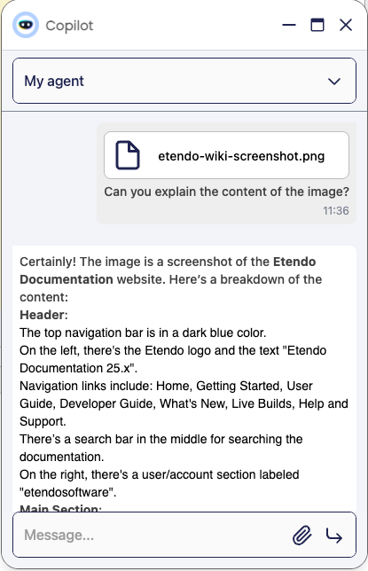

---
tags:
    - How to
    - Etendo Copilot
    - Agent
    - Create
    - LLM
    - Agent
---

# How to Create an Agent

## Overview

This article explains how to create a new agent in Etendo Copilot from scratch. The agent will be able to interact with the user and provide responses based on the user's input. This article will guide you through the process of creating a new agent, adding a knowledge base, and selecting a model.

The complete explanation of the windows used in this guide can be found in the [Setup and Usage](../../../user-guide/etendo-copilot/setup-and-usage.md) article.

## Creating a Basic Response Agent
:material-menu: `Application` > `Service` > `Copilot` > `Agent`

The Agent window allows you to define and configure Agents.

Some of the main fields to be completed are: 

- **Name**
- **Prompt**
- **App Type**:

    - **Multi-Model Agent**
    - **LangGraph**

- **Model**: Dropdown with the models available, such as OpenAI, Anthropic, etc. Go to section [Which model should I choose?](#which-model-should-i-choose) for more information.

!!!info
    The **Prompt** field can have the following dynamic variables: @ETENDO_HOST@, @ETENDO_HOST_DOCKER@ and @source.path@ 
    These variables will be replaced with the values defined in the properties.

!!!note 
    For more information on what each field is used for, visit the [Setup and Usage - Agents](../../../user-guide/etendo-copilot/setup-and-usage.md#header) guide.

### Agent Definition Example

For example, to create a new agent called **Task Definition Agent** to help users define an issue with the mandatory format for his team. The purpose of the agent is to receive a description of the task and return the task definition with the mandatory format. We will create a new agent with the following information:

- **Name**: Task Definition Agent
- **Description**: This agent helps users define a task description with the mandatory format for his team.
- **Model**: No need to select a specific model, the [default](#default-model) model will be used.
- **Temperature**: Set to `0.5` because we want to have low **creativity** in the responses.
- **Module**: This agent will not be exported to a module.
- **Prompt**:
    
    ```
    You are an agent to generate a task description based on the client's conveyed needs. This definition is intended for a developer.

    The description should follow this format:

    # Title
    - Title of the Task

    # Issue Description
    - State the primary need expressed, the problem to solve or the context of the change.

    # Solution Design
    - Outline what needs to be developed.

    # Use Cases
    * **Given**: Describe the initial context or precondition.
    * **When**: Explain the event or action taken.
    * **Then**: Describe the expected outcome.


    The goal is to generate a concise description. Be succinct and to the point.

    After creating the initial description, please answer the following questions to refine it further:
    1. Is the primary need of the client clearly and accurately stated?
    2. Does the solution design provide sufficient detail for development without ambiguity?
    3. Are the use cases comprehensive and cover all possible scenarios?
    4. Are there any assumptions or dependencies that need to be clarified?

    Separate the proposal of task  definition and the refinement questions with ---------------- for a better view

    Please provide your response in Markdown format, adhering strictly to the given template so it can be easily pasted into the issue.

    Once you respond with your answers, I will revise the description accordingly and provide additional questions for further refinement.

    Translate everything to English, because the issues must be in English.
    ```

After saving the agent, the system will automatically grant access to it. Open the Copilot Chat with the button `✨Copilot` and select the agent `Task Definition Agent`. You can start interacting with the agent.


!!! tip
    From the most basic agent, its behavior is determined by its system prompt. Therefore, in case of an undesired operation, it is important to verify that the failure is not in an incorrect, inefficient or unclear prompt. It is possible to debug LLM calls with Langsmith. Read the [How to debug an agent prompt with Langsmith](./how-to-debug-an-agent-prompt-with-langsmith.md) article for more information.
    

## Which Model Should I Choose?
Currently, Copilot supports the following providers:

- **OpenAI**: This provider is the default one and is the most used. It is the most versatile and has the best performance in most cases.
- **Anthropic**: This provider is specialized in code generation. It is the best option for code-related tasks.
- **Deepseek**: This provider is for general tasks like OpenAI, but cheaper.
- **Ovider is for users that have their own models running in their own infrastructure. The support for this provider is in experimental phase. For more information visit, [How to Use and Run Self Hosted Models with Ollama](how-to-use-run-self-hosted-models-with-ollama.md) guide.llama (Self-hosted models)**: This pro

### Default Model
The default model for Etendo Copilot is `gpt-4.1` from **OpenAI**. This model is selected automatically if the agent hasn't a specific model selected.

### AI Models Window - What Model are Available?
Etendo Copilot provides a Window where you can see the available models and their details. This window is populated when synchronizing the models. Additionally, if the provider offers models that are not present in this list, they can be added manually. 

!!! info 
    More information here [AI Models](../../../user-guide/etendo-copilot/setup-and-usage.md#ai-models)

### Image Input

{align=right width=250}

Models that support image inputs can work with images attached to the conversation. If the model does not support image inputs, it's possible to fix this by adding to the agent the `OCR Tool` that allows extracting text from images.

This tool is available in the [Etendo Copilot ToolPack](../../../developer-guide/etendo-copilot/bundles/overview.md#etendo-copilot-toolpack) module.

The OCR Tool is a tool that allows extracting text and information from images. Maybe it's necessary to **explain** to the agent how to use it in the prompt.

<br clear="all"> 

## Add a Knowledge Base
LLMs are the brains behind the agent and these come by default with knowledge gained from the model's own training. However, in many cases we need them to have specific information that they do not have, so we resort to the Knowledge Base File to conform their Knowledge Base. This will allow us to **train** our agent with certain information.

The most crucial is to determine:

- Knowledge Base File Type: Basically it is the origin or how Etendo can get that file. This is configured in the `Knowledge Base File` Window.
- Knowledge Base File behavior: Which is the way this file is integrated in the agent or in the conversation. This is configured in the `Knowledge` tab of the `Agent` window.

### Knowledge Base File Type

| Type | When to Use It | Needed Information |
|--|--|------|
|**Attached File** | Use when the file is one that never changes. | File itself, which has to be attached to the Knowledge Base File registry. |
|**Remote File** | It is highly recommended when the file can change and the latest version can be accessed from the same url. For example, a file in a repository on GitHub. | File URL |
|**HQL Query** | It is used when you want the agent to be able to read information from a table or from the result of a database query. For example, a list of Business Partners or orders. | HQL Query |
|**Text** | When the information is static and can be written directly in the window. | The text itself |
|**OpenAPI Flow Specification** | Use when the knowledge base file is the OpenAPI Specification of a Etendo Classic Flow. See [How to allow Copilot to interact with Etendo Classic](#how-to-allow-copilot-to-interact-with-etendo-classic) for more information. | Select the flow in the selector|
|**Code Index** | When the agent needs to know **Locally** stored code. | Specify the paths of the folders  |

!!! info
    More information about this window can be found in the [Knowledge Base File Window](../../../user-guide/etendo-copilot/setup-and-usage.md#knowledge-base-file-window) article.

### Advanced settings
In the Knowledge Base File window, there is an advanced settings section that allows you to configure the following options in the splitting algorithm of the content of the file: 


- **Skip Splitting**: Retrieves the entire document as one chunk, which is useful for small files.
- **Max. Chunk Size**: This option allows to set the maximum size (tokens) of the chunks that will be created when the content is split. This is useful to avoid very large chunks that can cause performance issues. Depending on the file types, the splitting algorithm checks for **separators** to split the content semantically. For example, in markdown files, the splitting is done by headers, so each chunk will contain the content of a header and its subheaders. Or in the case of Java files, the splitting is done by classes, so each chunk will contain the content of a class and its methods. When the chunk size is reached, the content is split into a new chunk in the next separator found. This is useful to avoid very large chunks that can cause problems with the token limit of the model.  
- **Chunk Overlap**: This option allows to set the overlap between chunks. This is useful to avoid losing information when the content is split into chunks. The overlap is the number of tokens that are repeated in each chunk. For example, if the chunk size is 100 and the overlap is 10, each chunk will contain 90 unique tokens and 10 repeated tokens from the previous chunk. This is useful to avoid losing information when the content is split into chunks. Can be 0 if you don't want to have overlap between chunks.


### Knowledge Base File Behavior

| Behavior | When to Use It | Functionality | Limitations |
|--|--|------|--|
|**[Agent] Append the file content to the prompt**| Its recommended when the volume of the file content can be handled by the model or the information its crucial for the agent work.| When the prompt is builded, the content of the file will be inserted in every @alias@ ocurrence inside the prompt. If the alias was not defined, the content of the file is appended at the final of the prompt.| The length of the file directly impacts the length of the system prompt, which has a limit in each module. In addition, a very large prompt can slow down the agent's responses.|
|**[Agent] Add to the agent as Knowledge Base**| Its recommended to use when the volume of information is larger than the limit of tokens that the model can handle as 'prompt'. | The agent will not "know" the content of the knowledge base file from the beginning of the execution, but will be equipped with a `Knowledge base Search` tool to search for information in the knowledge base, working as a search engine. This is so because the information is indexed in a database of vectors, proper of the agent and the search tool is the one that allows to search in it by "Meaning". | The agent will not be able to use the information in the knowledge base to generate responses without using the `Knowledge base Search` tool. The tool will return an array of results, which can be used to generate a response. The quantity of results returned can be [configured](#advanced-settings) in the agent configuration. The agent needs to **search** in the knowledge base file to find the information. This is not recommended due to the performance of the agent.|
|**[User question] Append content to each question**| It is recommended when data changes very frequently and you need to have the data at the time of each question. The content of the file should be as short as possible.|Add the content of the file at the end of each message.| It has a direct impact on the length of messages, which have character limits. It can also slow down the agent's responses if the message is very large.|
|**[Agent] SPEC: Add as agent specification**| Can be used when the file content is an OpenAPI Specification| The specification is not added to the request, but is sent to Copilot. When the agent is built, the specification is processed and tools are generated automatically (for each method and each endpoint), which are then added to the agent. In this way, the agent has tools to be able to use the Call Tool API without the need to use the Call Tool API and have all the OpenAPI Spec at the prompt.| It is currently in the experimental phase.|

!!! info
    More information about this window can be found in the [Knowledge Tab](../../../user-guide/etendo-copilot/setup-and-usage.md#knowledge-tab) section.

!!! tip
    - **Remember the Synchronization**: After adding/modifying/deleting a knowledge base file from an Agent, its necessary to synchronize the agent to apply the changes. This not only regenerates/reloads the Knowledge Base File but also updates the Agent with the latest changes.
    - **Splitting**: We the indexation in the knowledge base file is done, the content is splitted in chunks depending of the type of the file. For example, if the file is a markdown file, the content is splitted in chunks by the headers. If the files are not large, its possible to mark as `Skip Splitting` in the knowledge base file configuration. This will avoid the splitting of the content in chunks. This causes that the content of the documents is retrieved as a single chunk, which can be useful in some cases.

### Add a Knowledge Base Example

We got the example of the default Copilot agent `Bastian` that has a knowledge base file based in the Etendo Documentation from it GitHub repository. Copilot supports `.zip` format for the knowledge base file behavior, automatically extracting it and indexing the files inside.
In this case, the `ZIP` file contains the Etendo Documentation in markdown format. The agent has the knowledge base file configured as `Remote File` and the behavior as `Add to the agent as Knowledge Base`. The agent has the following configuration:

- Setting the Knowledge Base File:
    

- Setting the Knowledge Base File Behavior (Connecting the Knowledge Base File to the Agent):
    


    {align=right width=250}

- After asking the agent for information about a topic, the agent will search in the knowledge base file and return the information. The agent will use the `Knowledge Base Search` tool to search in the knowledge base file. 
    
    <br> 
    <br> 
    <br> 
    <br> 
    <br> 
    <br> 
    <br> 
    <br> 
    <br> 
    <br> 
    <br> 


    {align=right width=250}

- The agent will return a response with the information found in the knowledge base file.
   <br> 
    <br> 
    <br> 
    <br> 
    <br> 
    <br> 
    <br> 
    <br> 
     

!!! tip
    Remember, explain in the prompt that the agent must search in the knowledge base file to find the information. This will help to the agent to know how to work with the knowledge base file.


## Add Tools
When creating an agent, it is possible to add tools to it. Tools are functionalities that allow the agent to perform specific tasks. These tools can be used to interact with external systems, manipulate files, or perform other actions. The tools are added in the `Skills and Tools` tab of the `Agent` window.

!!! info "Available Tools"
    The following tools are available in Etendo Copilot there listed in the [Etendo Copilot - ToolPack](../../../developer-guide/etendo-copilot/bundles/overview.md#etendo-copilot-toolpack) module documentation. In the module **Etendo Copilot Toolpack** the are a set of tools that can be used to assist in multiple cases.

### Adding a Tool Example

To add a tool to an agent, follow these steps:

1. Open the `Agent` window.
2. Go to the `Skills and Tools` tab.
3. Add the tool by creating a record in the `Skills and Tools` tab.

For example, we will add a tool to the agent `Task Definition Agent` to allow to write a file with the task definition. The tool will be the `Write File Tool` that allows to write a file with the content provided. 


After adding the tool, the agent will have the tool available to use. The agent can use the tool to write a file with the task definition. The agent will use the tool to write the file with the task definition.


We can check the created file:


## How to allow Copilot to Interact with an API or Etendo Classic?
The most powerful and useful feature of Etendo Copilot is the ability to interact with APIs (including Etendo Classi)c. Currently the paradigm of AI agents is to automate and/or reuse what is **already done**. In other words, the utility arises from the fact that AI agents can use all the business logic that is already available.

### External API
The most usual way is based on a combination of an OpenAPI Specification and a tool that allows to make requests to that API. To do this, the following steps are needed:
- **Add the OpenAPI Specification**: The OpenAPI Specification is a standard way to describe an API. This specification is added as a Knowledge Base File. And configure it as `[Agent] Append the file content to the prompt`. This will allow the agent to know the endpoints and methods of the API.
- **Add the API Call Tool**: The API Call Tool is a tool that allows to make requests to an API. This tool is added as a tool in the agent. The agent can use this tool to make requests to the API.

### Etendo Classic  
For Etendo Classic, the process is a bit different. The main difference is that we can take advantage of the OpenAPI Specification automatically generated by the `Flows`, where we can define a set of endpoints to which we want to give access to our agent.
To know more about how to create a flow in Etendo Classic, check the [How to Document an Endpoint with OpenAPI](../../etendo-classic/how-to-guides/how-to-document-an-endpoint-with-openapi.md) guide.
The steps to allow an agent to interact with Etendo Classic are:

- **Add the OpenAPI Specification**: This specification is added as a Knowledge Base File of type `OpenAPI Flow Specification`. When this type is selected, a selector with the available flows is shown, to select the flow that we want to use. The behavior of this file can be `[Agent] Append the file content to the prompt`. This will allow the agent to know the endpoints and methods of the API.
- **Add the API Call Tool**: The API Call Tool is a tool that allows to make requests to an API. This tool is added as a tool in the agent. The agent can use this tool to make requests to the API.

!!!warning
    If the behavior of the Knowledge Base File is `[Agent] Add to the agent as Knowledge Base`, the agent will not be able to use the information in the knowledge base file to generate responses without using the `Knowledge base Search` tool. So the agent needs to **search** in the knowledge base file to find the information. This is not recommended due to the performance of the agent.

### Auto Generation of Tools

When the OpenAPI Specification is added as a Knowledge Base File of type `OpenAPI Flow Specification`, the agent will automatically generate tools for each method and endpoint of the API. These tools can be used to make requests to the API without the need to configure the API Call Tool. The agent will have a tool for each method and endpoint of the API. This functionality is currently in the experimental phase.


### Example of Copilot Interaction with Etendo
For example, we will create an agent to create Products in Etendo Classic, using an already defined flow with the endpoints needed to create Products, Product Categories and Prices. 

1. First, we will create a new Knowledge Base File of type `OpenAPI Flow Specification` and select the flow `Product Flow`.

    !!!info
        Be sure to use the agent that has the necessary permissions to interact with the data. In this case, the agent must have the necessary permissions to create products, categories and prices in Etendo Classic.

    

2. After adding the Knowledge Base File, we will create the agent with a prompt that explains its scope, strategy and the request that the user can make. Additionally, we will add the OpenAPI Specification to the prompt to allow the user to know the endpoints and methods of the API.

    

    !!!warning
        Remember to synchronize the agent to apply the changes. This not only regenerates/reloads the Knowledge Base File but also updates the Agent with the latest changes.


3. Open the Copilot Chat with the button `✨Copilot` and select the agent `Product Creator Agent`(if not shown, make sure to have access to it). 

4. You can start interacting with the agent. The agent will have the OpenAPI Specification in the prompt and will be able to use the API Call Tool to make requests to the API.

    

## Common Issues

1. **Orphan Records After Module Uninstallation**

    When uninstalling a custom module that contains an agent with which users have interacted, the `./gradlew update.database` command may fail due to orphan records in the `ETCOP_CONVERSATION` table.

    **Problem**: Although the table has an `onDelete=setNull` constraint configured, the `update.database` command does not execute this action automatically when the module is uninstalled.

    **Solution**: Manually set the `ETCOP_APP_ID` column to `null` in the `ETCOP_CONVERSATION` table before running the update.database command:

    ```sql
    UPDATE ETCOP_CONVERSATION 
    SET ETCOP_APP_ID = NULL 
    WHERE NOT EXISTS (
        SELECT 1 
        FROM ETCOP_APP 
        WHERE ETCOP_APP.ETCOP_APP_ID = ETCOP_CONVERSATION.ETCOP_APP_ID
    );
    ```

    After executing this SQL statement, you can proceed with the `./gradlew update.database` command.


---
This work is licensed under :material-creative-commons: :fontawesome-brands-creative-commons-by: :fontawesome-brands-creative-commons-sa: [ CC BY-SA 2.5 ES](https://creativecommons.org/licenses/by-sa/2.5/es/){target="_blank"} by [Futit Services S.L.](https://etendo.software){target="_blank"}.
