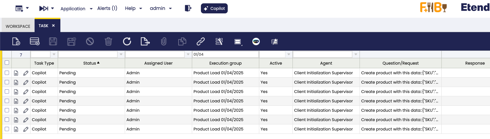
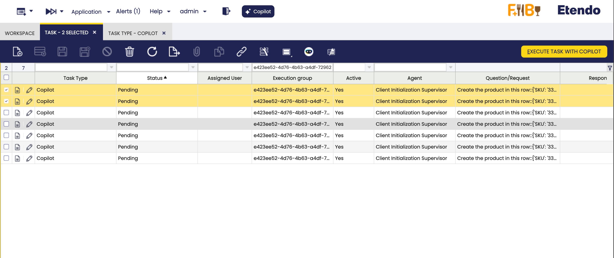
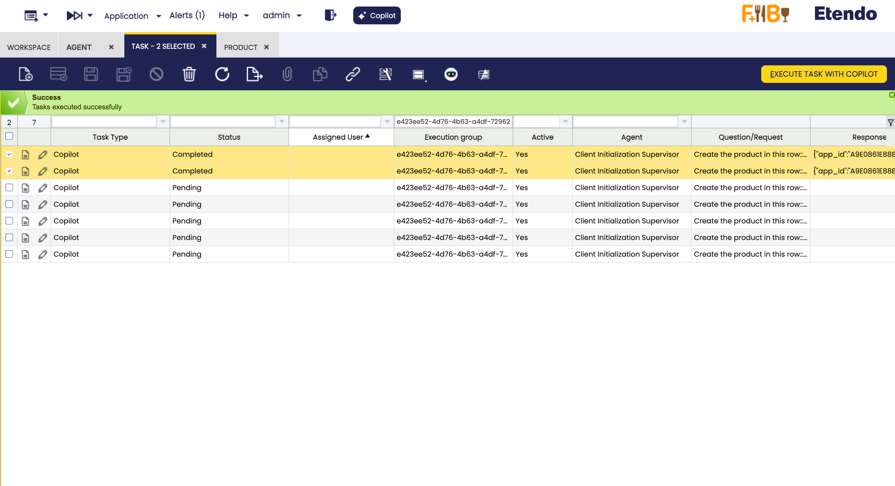
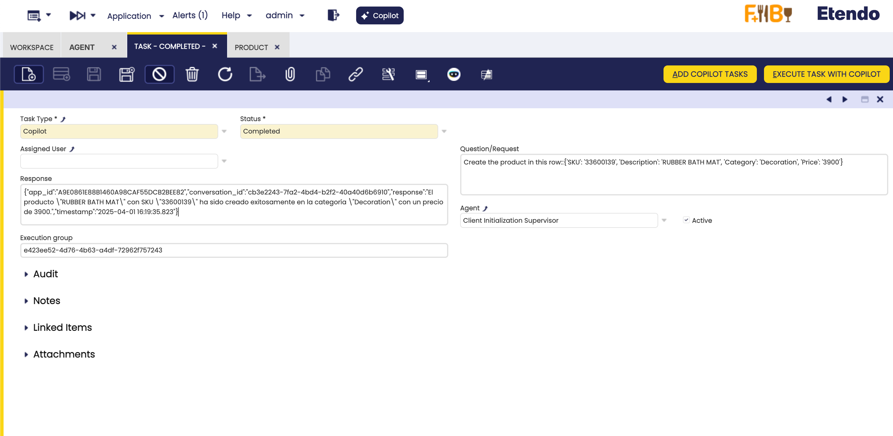
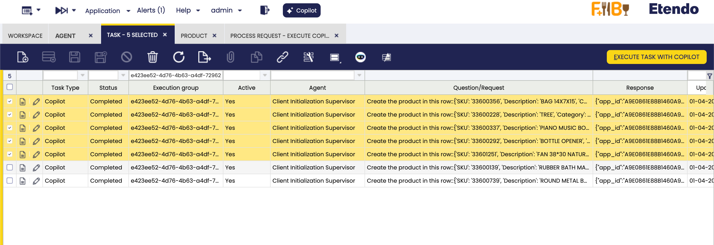

---
tags:
    - How to
    - Copilot
    - Bulk
    - Tasks
---

# How to create and work with bulk tasks for Copilot

## Overview

This article explains how to create and work with bulk tasks for Copilot. This is useful when you want to create multiple tasks at once and execute in background with Copilot

## Concept and Use Cases
When you need to make use of an AI agent to perform tasks with a high volume of iterations, it will be limited in the amount it can handle and its speed. Then the concept of Bulk tasks is born, which consists of storing requests in a window of the `Tasks` module. 

!!!warning
    It is necessary to consider that these tasks must be *isolated* from each other. That is, they do not need information from each other. For example, when loading data from an excel file, each row will be executed separately.

These requests can be executed manually or be processed in a background process already included in the Copilot module.

## How to Add Copilot Tasks
The Etendo Copilot module includes:

- **Add Copilot Task Button**: This button in the `Tasks` window allows you sent a CSV/XLSX/ZIP file to create bulk tasks.
- **Bulk Task Creator**: This agent is configured with the [Task Creator Tool](../available-tools/task-creator-tool.md) to create bulk tasks based on a zip file or a CSV/XLSX file. This agent can be added to a supervisor agent to chain with other agents.

In both options, the requirements are the same:

- **CSV/XLSX/ZIP file**: The file that contains the data to be processed.
- **Question**: The description or request that will be used as the task base. For the case of the agent `Bulk Task Creator`, it will be encharge to reform the task to convert to singular tasks. But for the other options, it is necessary to provide the task base in singular form.
- **Execution Group**: Optional group. If not set, it uses the conversation ID. Its use to identify the tasks that belong to the same group.
- **Task Type**: Optional task type ID. If not set, it auto-creates one named "Copilot". Its use to identify the type of task.
- **Status**: Optional status ID. Defaults to "Pending". Its use to identify the status of the task. After the task is processed, the status will be updated to `Completed`.
- **Agent**: The agent that will process the tasks. If the agent is not specified, will be selected the agent that used the tool. For the case of the agent `Bulk task creator`, it will be selected the supervisor agent that contains it.

!!! info
    When the tasks are created, the tasks will be created one per row in the case of CSV/XLSX files, one per file in the case of ZIP files, and one per file in the case of other files.
    The task request will be the following format: ```BASE_TASK - [FILE_NAME/ROW DATA]```

### Example
For example, if you have a CSV file with the following data:

| SKU       | Description           | Category   | Price |
|-----------|------------------------|------------|--------|
| 33601251  | FAN 38*30 NATURAL FIBER| Others     | 6100   |
| 33600292  | BOTTLE OPENER          | Others     | 10500  |
| 33600139  | RUBBER BATH MAT        | Decoration | 3900   |
| 33600228  | TREE                   | Plants     | 11500  |
| 33600739  | ROUND METAL BUCKET     | Others     | 9000   |
| 33600356  | BAG 14X7X15            | Others     | 1000   |
| 33600337  | PIANO MUSIC BOX        | Decoration | 12000  |


```csv title="products.csv"
SKU,Description,Category,Price
33601251,FAN 38*30 NATURAL FIBER,Others,6100
33600292,BOTTLE OPENER,Others,10500
33600139,RUBBER BATH MAT,Decoration,3900
33600228,TREE,Plants,11500
33600739,ROUND METAL BUCKET,Others,9000
33600356,BAG 14X7X15,Others,1000
33600337,PIANO MUSIC BOX,Decoration,12000
```

And the objetive is to insert these products in Etendo. For this example we will use the  `Data Initialization Supervisor` agent that contains the `Product Generator` agent that can create products in Etendo. The steps to create the bulk tasks are:

#### Using the `Add Copilot Task` button

1. Go to the `Tasks` window.
2. Click on the `Add Copilot Task` button. That will open a window to set the parameters for the bulk tasks.
    1. Set the **Question** parameter with the description of the task, in singular form, that will be used as the task base. For example, `Create product with this data:`.
    2. Select the **Agent**. In this case, select the `Data Initialization Supervisor` agent.
    3. Select the **File** to be processed. In this case, select the CSV file with the products data.
    4. Set an identifier for the **Execution Group**. For example, `Product Load 01/04/2025`. This can be used to identify the tasks that belong to the same group.
    5. Set an **Element separator**. This is the character that will be used to separate the data from the file CSV. For example, `,` or  `;`.

    

3. Click on `Done` button. And the tasks will be created.
    

#### Using the `Task Creator Tool` in an agent

1. Go to the agent that contains the `Task Creator Tool`.
2. Open a conversation with the agent.
3. Attach in the conversation the CSV file with the products data.
4. Send some request like:

    ``` text
    Create bulk tasks for the attached file.
    - Question/request: "Create product with this data:".
    - The group id is 'Product Load 01/04/2025'. 
    -The agent ID is 'A9E0861E88B1460A98CAF55DCB2BEE82'. 
    - Not indicate task type and status, to use the defaults.
    ```

    !!! info
    This use of the `Task Creator Tool` is an example, the agent can have assumptions or simplifications that can change the way to use it. This can be done customizing the agent prompt.

5. The agent will create the tasks based on the file data using the `Task Creator Tool`.


#### Using the `Bulk Task Creator` agent
This agent know to use the `Task Creator Tool` strategically, converting the request in singular tasks. The steps to create the bulk tasks are:

1. Add the `Bulk Task Creator` agent to a supervisor agent. In this case, we will use the `Data Initialization Supervisor` agent that contains the `Product Generator` agent.
2. Open a conversation with the supervisor agent.
3. Attach in the conversation the CSV file with the products data.
4. Send some request like: 
   
    ``` text
    Create the products in the attached file.
    ```

    

5. The supervisor agent will delegate the task to the `Bulk Task Creator` agent that will create the tasks based on the file data and then process it.

## How to Process Copilot tasks
The tasks can be processed in two ways:

- **Manual processing**: The user can process the tasks manually in the `Tasks` window. Select the tasks to be processed and click on the `EXECUTE TASK WITH COPILOT` button. After the task is processed, the status will be updated to `Completed` and the result will be shown in the `Response`.

- **Background processing**: The tasks can be processed automatically in the background. Go to `Process Request` window to schedule the background process called `Execute Copilot Bulk Tasks`. In each execution, the process will take 10 tasks to process, so it is necessary to execute the process multiple times to process all the tasks.

After the task is processed, the status will be updated to `Completed` and the result will be shown in the `Response`.

### Example

For example, we will process few tasks created in the previous example, in the manual way

1. Go to the `Tasks` window.
2. Select the tasks to be processed.
3. Click on the `EXECUTE TASK WITH COPILOT` button.
    
4. The tasks will be processed and the status will be updated to `Completed`.
    
5. In the field `Response` will be shown the result of the task.
    

For the remaining tasks, we will schedule the background process to process them.

1. Go to the `Process Request` window.
2. Create a record selecting the `Execute Copilot Bulk Tasks` process. It is recommended to schedule the process to be executed from time to time, depending on the specific need. For this case, we will do it every 10 minutes.
    
3. Click in the button `Schedule Process`.
4. The process will be scheduled and will process the tasks in the background.
    
5. The tasks selected are the tasks executed:
    

---
This work is licensed under :material-creative-commons: :fontawesome-brands-creative-commons-by: :fontawesome-brands-creative-commons-sa: [ CC BY-SA 2.5 ES](https://creativecommons.org/licenses/by-sa/2.5/es/){target="_blank"} by [Futit Services S.L.](https://etendo.software){target="_blank"}.