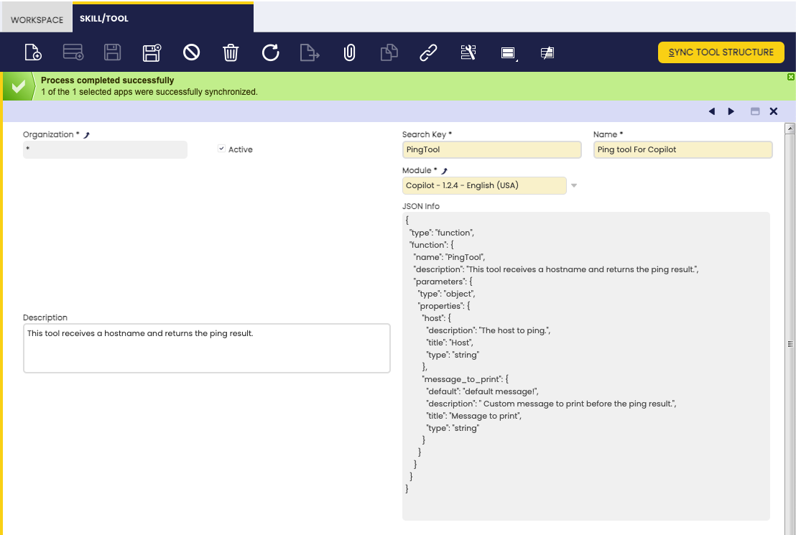

---
tags:
    - How to
    - Create Tool
    - Copilot Tool
    - Python Dependencies
---

# How to Create Copilot Tools

## Overview

This guide provides step-by-step instructions to help you create custom tools for **Etendo Copilot**. You will learn how to:

- Define the required module structure.
- Specify tool inputs and dependencies.
- Register and test your tools in **Etendo Classic**.
- Integrate your tools with **Etendo Classic** using the **Event Webhooks API**.

This enables seamless interaction between your Python-based tools and the Etendo platform.


## Etendo Copilot
The **Etendo Copilot** infraestructure allows you to create tools that extend agents functionality. These tools are developed in Python and run in the Docker container where Copilot operates.
In this guide, you will learn how to create a new Copilot tool in a dedicated module. However, it is also possible to add tools to an existing module. Each module can contain one or multiple tools.

!!! note "Etendo Copilot is based on Langchain"
    The Langchain libraries are available by default in Copilot. You can use them in your tools. See [Langchain documentation](https://python.langchain.com/){target="_blank"} for more information.

### Requirements

The **Copilot Extensions** bundle must be installed in **Etendo Classic**. If it is not already installed, follow the [Etendo Copilot Installation Guide](../../../developer-guide/etendo-copilot/installation.md){target="_blank"} to set it up.


### Create a New Tool
In this example, you will create a tool that performs a **ping** to a specified host. The tool will be called `PingTool` and will be located in the `com.etendoerp.copilot.pingtool` package.

1. Create an Etendo Classic module: All Copilot tools must be placed inside an **Etendo Classic** module. To create a new module, follow the steps in [How to Create a Module](../../etendo-classic/how-to-guides/how-to-create-a-module.md).
    
    !!! warning
        For the tool to function correctly and be recognized by the Copilot infrastructure, the module must include the `build.gradle` file. This file is created when the module is prepared to be published. See [How to publish modules to GitHub repository](../../../developer-guide/etendo-classic/how-to-guides/how-to-publish-modules-to-github-repository.md)

    
    The structure of the module will be as follows:

    ``` 
    modules
    └── com.etendoerp.copilot.pingtool
        ├── src-db 
        │   └── database
        │       └── sourcedata
        │           ├── AD_MODULE.xml
        │           ├── AD_MODULE_DBPREFIX.xml
        │           ├── AD_MODULE_DEPENDENCY.xml
        │           └── ETCOP_TOOL.xml
        ├── tools 
        │   └── PingTool.py
        ├── build.gradle
        └── tools_deps.toml
    ```

    *src-db*: Contains the database structure of the module. This folder is created automatically when creating and exporting the module from **Etendo Classic**.
   
    *tools*: Contains the tools of the module. A module can contain one or more tools.
   
    *build.gradle*: Contains module configurations.

    *tools_deps.toml*: Defines Python dependencies for the tools in the module. These dependencies are automatically installed inside the Copilot Docker container when the tool is loaded.

    

2. Create the Python tool. It is necessary to use a `Dict` as input. To do this, define a class using `pydantic` to specify the structure of the input. 
    For the `PingTool`, create a class called `PingToolInput` inside the `PingTool.py` file. Here is an example:
    
    !!! warning 
        The `SearchKey` of the tool must match the name of the class that extends the `ToolWrapper` class.

    ```python title="PingTool.py"

    import os
    from typing import Type, Dict

    from copilot.core.tool_input import ToolInput, ToolField

    from copilot.core.tool_wrapper import ToolWrapper  # Import the ToolWrapper class from the copilot.core.tool_wrapper module. This class is the one that must be extended to create a new tool.


    class PingToolInput(ToolInput):
        host: str = ToolField(
            title="Host",
            description='''The host to ping.''',
        )
        message_to_print: str = ToolField(
            default="default message!",  # Default value of the input, if there is no default value, the input is mandatory.
            title="Message to print",
            description=" Custom message to print before the ping result.",
        )


    class PingTool(ToolWrapper):
        name: str = 'PingTool'  # Name of the tool
        # Description of the tool.
        # This description tells Copilot what the tool does and based on this description it will decide if this tool will solve the user's request.
        description: str = (
            '''This tool receives a hostname and returns the ping result.''')
        args_schema: Type[ToolInput] = PingToolInput  # The args_schema attribute must be a Pydantic model that defines the inputs of the tool.
        
        #return_direct = True  # If return_direct is True, the tool will return the result directly, without execute any other tool. If return_direct is not defined, the tool output can be used as input of another tool. This is only available for tools in the Langchain agent. In the OpenAI agent, the return_direct attribute is taken into account, and the tool output can be used as input of another tool.

        def run(self, input_params: Dict, *args,
                **kwargs):  # The run method is the one that will be executed when the tool is executed.
            import requests  # Import the necessary libraries to execute the tool.
            # It is recommended to import the libraries inside the run method to avoid conflicts with other tools.
            host = input_params.get('host')  # Get the host input from the input_params dictionary.
            # Get the message_to_print input from the input_params dictionary
            # or from the args attribute that contains the default values of the inputs.
            message_to_print = input_params.get('message_to_print') or self.args.get('message_to_print').get('default')
            print('MESSAGE:' + message_to_print)
            response = requests.get(host)
            return {"status_code": response.status_code}  # The run method must return a dictionary with the outputs of the tool.
    ```
    
    !!! note "Environment variables"
        Copilot automatically reads the `gradle.properties` file of **Etendo Classic** and exposes these as environment variables (dots replaced with underscores). For example:

        - `COPILOT_PORT` → `COPILOT_PORT`
        - `bbdd.sid` → `bbdd_sid`

        You can access these environment variables in your tools.
        
    
3. Create the `tools_deps.toml` file in the root folder of the module. This file defines dependencies in TOML format:
    
    ``` toml
    [ToolName]
    dependency_name = "dependency_version"
    dependency_name = "dependency_version"
    ```
    For our example, the content of the file will be as follows:

    ``` toml
    [PingTool]
    requests = "*"
    ```

    The version can be specified with the following operators:
    
    ``` toml
    [PingTool]
    requests = "*" # Installing latest version
    requests = "==2.26.0" # Installing a specific version
    requests = ">=2.26.0" # Greater than or equal to a certain version
    requests = "<=2.26.0" # Less than or equal to a certain version
    requests = ">2.26.0" # Greater than a certain version
    requests = "<2.26.0" # Less than a certain version
    requests = ">=2.26.0,<=2.26.1" # Using version ranges
    requests = "~=2.26.0" # Tilde operator (~) for installing compatible versions
    ```
    
    !!! tip
        During the load of Copilot service, the tool will be loaded and the dependencies will be installed. Additionally, the dependencies will be tested to ensure that they are installed correctly.


    !!! warning "Different name of depedency while installing and importing"
        
        If the name of the dependency is different from the name of the package that is imported in the tool, it is necessary to specify it. 
        
        For example, if the dependency is installed with the name `pyscopg2-binary` but is imported with the name `psycopg2`, we can use a `|` to specify both names. 
        
        If this clarification is not made, the tool will not be able to import the dependency to test if it is installed correctly, this will throw a warning, but the tool will be able to run.
        
        The content of the file will be as follows:

        ``` toml
        [ToolName]
        "pyscopg2-binary|psycopg2" = "*"
        ```

4. Restart the Copilot service: 

    ``` Title="Termina"
    ./gradlew resources.stop
    ```

    ``` Title="Termina"
    ./gradlew resources.up
    ```

5. Open the **Skill/Tool** window in **Etendo Classic** (System Administrator role). Create a new record with:

    - *Search key*: Must match the tool class name.
    - *Name*: The name of the tool. Displayed in the Copilot UI.
    - *Module*: Set the module created in step 1.
    - *Description*: Populated from the Python class automatically when syncing the tool.
    - *JSON Info*: Contains a JSON description of the tool, inputs and outputs. Populated automatically when syncing the tool.

    To retrieve parameter information from the tool definition, execute **Sync Tool Structure**. 
 
    !!! Warning Before Sync Tool Structure
        It is mandatory to have copilot running and the tool loaded in the copilot container. If the tool is not loaded, the process will not retrieve the tool parameters.

    

6. After defining the tool, export the configurations to the module:
    
    ```bash title="Terminal"
    ./gradlew export.database
    ```

7. Once the **Copilot Tool** is defined, this tool must be associated to the assistant(s), to do so, a record must be created in the *tools* tab of the **Assistant** window, this record will allow us to activate or deactivate the tool.

    

    !!! note
        Remember to execute `Sync Assistant` process after linking the tool, if not, the tool will not be available in the agent.


8. To test the developed tool, you can ask an agent that has the tool associated with it to perform the required action, the agent will run the tool and return the result.


## Interacting with Etendo

When creating tools that need to interact with **Etendo Classic**, the best approach is to use the **Event Webhooks API**. This API simplifies authentication and allows your tools to trigger webhooks with data.

### Utilizing Etendo Classic Event Webhooks API

The **Etendo Classic Event Webhooks API** is a standard feature in Etendo, and it allows for easier integration with tools through Copilot utilities. For example, if you need to trigger a WebHook named `UpdateOrderDescription` to update an order in Etendo Classic, receiving a document number and a description as parameters, you can do so by creating a specific tool.

### Example Tool: UpdateSOTool

Here is an example of a tool that triggers the `UpdateOrderDescription` WebHook:

```python

from typing import Type, Dict

from copilot.core.etendo_utils import call_webhook, get_etendo_token, get_etendo_host
from copilot.core.tool_input import ToolInput, ToolField
from copilot.core.tool_wrapper import ToolWrapper, ToolOutput, ToolOutputMessage

class UpdateSOToolInput(ToolInput):
   documentNo: str = ToolField(description="DocumentNo of the Sales Order")
   description: str = ToolField(description="New description to set in the Sales Order")

class UpdateSOTool(ToolWrapper):
   name: str = "UpdateSOTool"
   description: str  = "Set description in a Sales Order by DocumentNo2"
   args_schema: Type[ToolInput] = UpdateSOToolInput
   return_direct: bool = False

   def run(self, input_params: Dict = None, *args, **kwargs) -> ToolOutput:
       documentNo = input_params['documentNo']
       description = input_params['description']
       token = get_etendo_token()
       # Build the body of the request
       body = {
           "documentNo": documentNo,
           "description": description
       }
       url = get_etendo_host()
       response = call_webhook(url=url, webhook_name="UpdateOrderDescription", access_token=token, body_params=body)
       return ToolOutputMessage(message=response)
```

### Explanation of Tool Components

The above tool leverages utilities provided by Copilot Core:

- `get_etendo_token()`: This function returns the authentication token for Etendo Classic, allowing the tool to operate within the user's session. Copilot, acting as a "proxy," manages these sessions.

- `get_etendo_host()`: This function returns the URL of the Etendo Classic instance, which is required to trigger the WebHook. This host URL is configured as `ETENDO_HOST` in the `gradle.properties` configuration file.

- `call_webhook(url:String, webhook_name:String, access_token:String, body_params:Dict)`: This function triggers the WebHook, passing the Etendo Classic URL, the WebHook name, the authentication token, and the parameters needed by the WebHook.

---
This work is licensed under :material-creative-commons: :fontawesome-brands-creative-commons-by: :fontawesome-brands-creative-commons-sa: [ CC BY-SA 2.5 ES](https://creativecommons.org/licenses/by-sa/2.5/es/){target="_blank"} by [Futit Services S.L.](https://etendo.software){target="_blank"}.