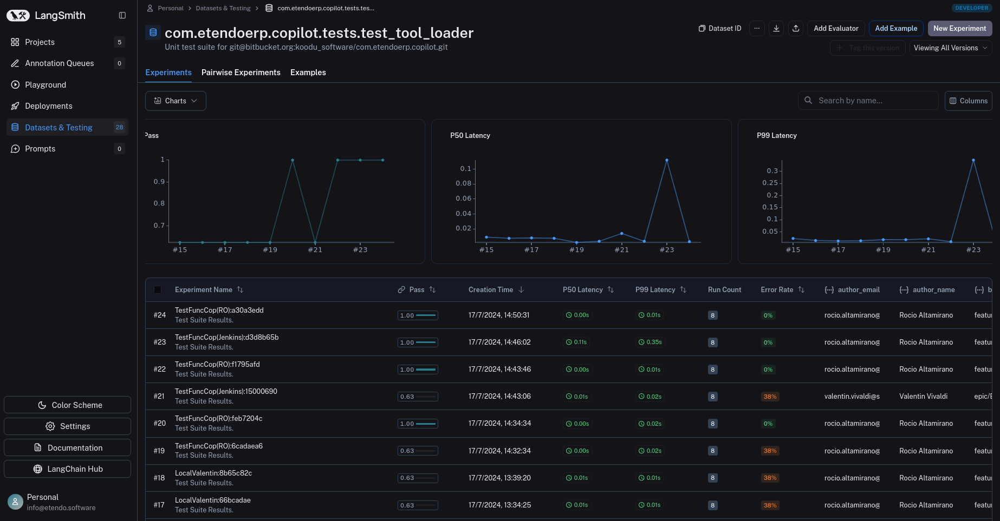
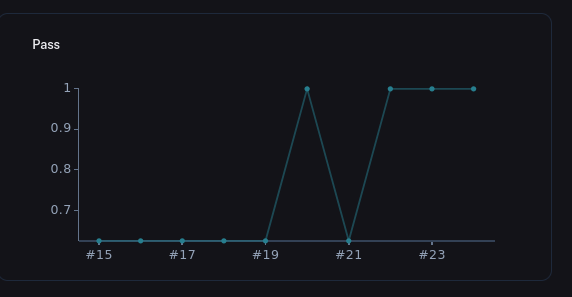
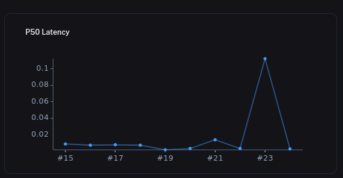
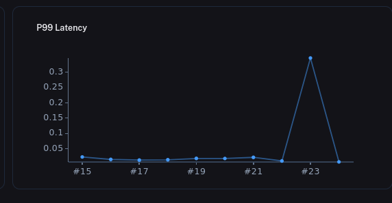
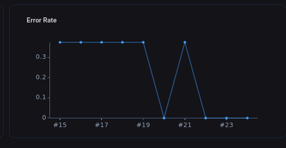
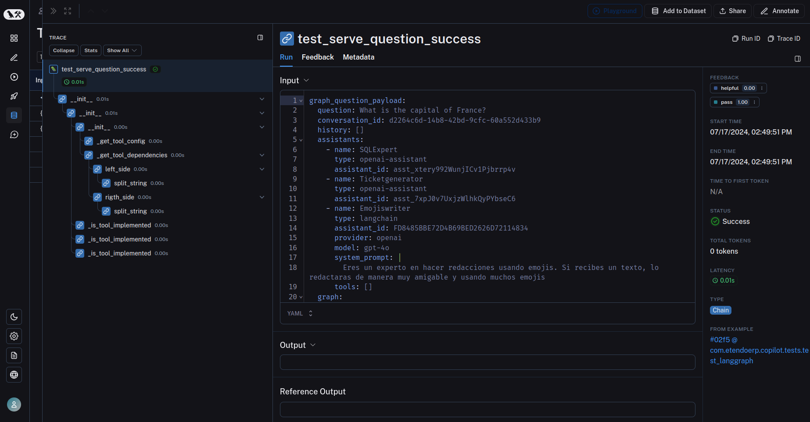
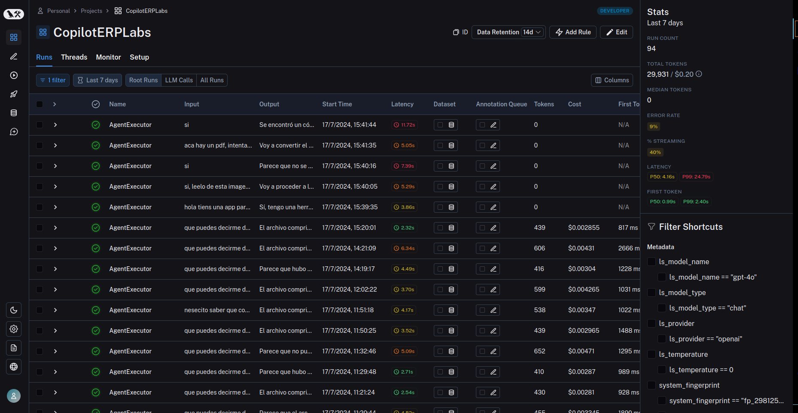
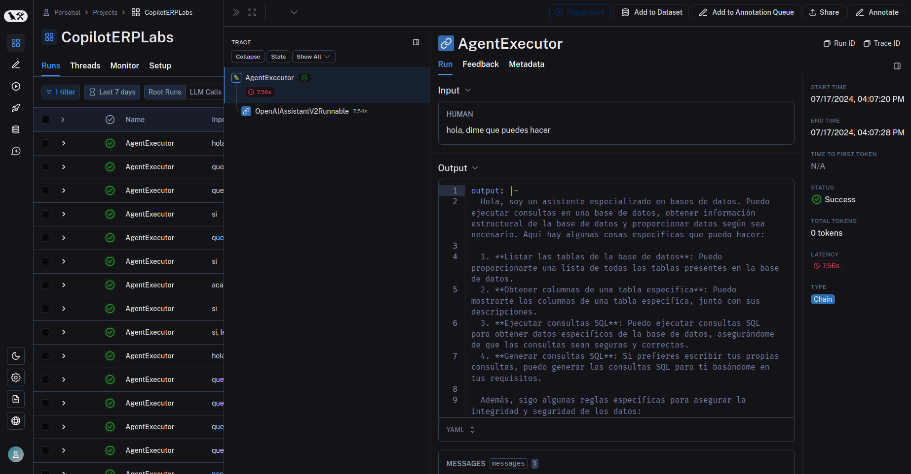

---
tags:
    - Copilot
    - IA
    - Machine Learning
    - Tests
    - Langsmith 
---

# Descriptive Summary of Unit Testing in LangSmith

## Overview

**Unit tests** in LangSmith are tools to quickly identify errors and regressions in AI systems, especially for functions and limiting cases. It is recommended to use them for any section of an AI system that **touches nondeterministic parts**, such as Language Models.

## Requirements

- LangSmith Python version >= 0.1.42

## Setup

## Writing Unit Tests

- Decoration:

    - Use the `@unit` decorator to mark test functions.
    - Optionally, use `@traceable` to trace functions within the system to be     tested.

Let's see an example:

---

        from Langsmith import unit, traceable

        @traceable
        `def generate_sql`(user_query):
        # SQL generation logic
        return "SELECT * FROM customers"

        @unit
        `def test_sql_generation_select_all()`:
        user_query = "Get all users from the customers table"
        sql = generate_sql(user_query)
        assert sql == "SELECT * FROM customers"
---

## Test Execution

Use standard frameworks such as pytest:

`pytest tests/`

LangSmith collects pass/fail rates and traces as new test suite results.

!!!info
        If you want the tests to be displayed in Langsmith you must remember to add the **`@unit` decorator to each test definition**. If you also want to see internally the functions in case of using a specific model, you must decorate with `@traceable` to the functions that use it. The tests will be executed in the Datasets and testing section with the respective test name. They will always be executed with that name, so you will eventually be able to evaluate the graphs that will show their behavior.

Some of the data over time that you will be able to see will be the tests that passed, on what date and time and the quantity, in the pass graph:

Besides, it will be possible to observe some metrics explained below:

**P50 Latency (Percentil 50 Latency)**:

- **Definition**: The 50th percentile latency, also known as the median latency.

- **Meaning**: 50% of the requests have a latency less than or equal to this value. It is a good measure of average system performance.

- **Example**: In one of the experiments in the file, the P50 Latency is 0.01 seconds, which means that 50% of the requests were processed in 0.01 seconds or less.

**P99 Latency (Percentil 99 Latency)**:

- **Definition**: The 99th percentile latency.

- **Meaning**: 99% of requests have a latency less than or equal to this value. It is a useful measure to understand the worst case latency under normal conditions.

- **Example**: In one of the experiments in the file, the P99 Latency is 0.35 seconds, indicating that 99% of the requests were processed in 0.35 seconds or less.

**Error Rate**

- **Definition**: The error rate represents the percentage of requests that fail compared to the total number of requests made.

- **Significance**: This metric is crucial in determining the reliability and stability of a system. A high error rate may indicate problems with the code, improper configurations, or system overload.

**Example File**: Different error rates for various experiments are shown in the file. 

Here are some examples:

- Experiment `TestFuncCop(Jenkins):15000690`:

    - **Error Rate**: 38%.
    - This means that 38% of the requests in this experiment failed.

### Summary

- **P50 Latency**: Indicates the latency that 50% of the requests do not exceed (the median).

- **P99 Latency**: Indicates the latency that 99% of the requests do not exceed (an indication of the worst performance under normal conditions).

- **Error Rate**: The proportion of failed requests in relation to the total number of requests. It is expressed as a percentage.

These values allow to evaluate the performance of a system under different load conditions and to identify possible bottlenecks or performance problems.

Unit test sample with internal trace:

**Examples and Advanced Features**

- Fixtures:

    - Define reusable entries with `pytest.fixture`.

---

        @pytest.fixture
        def user_query():
        return "Get all users from the customers table"

        @unit(output_keys=["expected_sql"])
        def test_sql_generation_with_fixture(user_query, expected_sql):
        sql = generate_sql(user_query)
        assert sql == expected_sql

--- 

- Test Parameterization:

    - Run the same assertions on multiple sets of inputs.

---

        @unit
        @pytest.mark.parametrize(
        "user_query, expected_sql",
         [
        ("Get all users from the customers table", "SELECT * FROM customers"),
        ("Get all users from the orders table", "SELECT * FROM orders"),
        ],
     )
    def test_sql_generation_parametrized(user_query, expected_sql):
    sql = generate_sql(user_query)
    assert sql == expected_sql

---

**Expectations with Expect**:

Defines expectations about the output of language models.

---

        from langsmith import expect

        @unit
        def test_sql_generation_select_all():
        user_query = "Get all users from the customers table"
        sql = generate_sql(user_query)
        expect(sql).to_contain("customers")

---

!!!info
    Methods such as `embedding_distance` and `edit_distance` allow detailed calculations and comparisons.

**Execution Mode and Cache**

1. **Dry-Run mode**: Run tests without synchronizing the results by setting the environment variable `LANGCHAIN_TEST_TRACKING=false`.

2. **Cache**: To save time and cost, enable caching with `LANGCHAIN_TEST_CACHE=/my/route/of/cache`.  

    For example: 
    
    `LANGCHAIN_TEST_CACHE=tests/cassettes pytest tests/my_llm_tests`. 

**Watch mode**

- Use packages such as `pytest-watch` for fast iterations.

---

        pip install pytest-watch
        LANGCHAIN_TEST_CACHE=tests/cassettes ptw tests/my_llm_tests

---

**Explanations and Metrics**

- `@unit` Decorator:

    - Convert tests into parameterized LangSmith examples, grouped into a test suite.
    - Metrics available: pass, expectation, `embedding_distance`, `edit_distance`.

- Using the LangSmith client for personalized feedback:

---

        from langsmith import unit, Client

        client = Client()
        @unit
        def test_foo():
        client.create_feedback(run_id='run_id', key="custom_feedback", score=1)

---

**Method Reference**

- **Expect**: Provides utilities for making approximate assertions and recording scores.

- **Decorator `@unit`**: Marks functions as test cases, associating example data and recording results automatically.

## How to register and view traces to LangSmith

LangSmith makes it easy to register and view traces of your **LLM application**, regardless of the language or framework you use.

### Using @traceable/ traceable

LangSmith makes it easy to log traces with minimal changes to the existing code with the **`@traceable` decorator** in Python and **traceable function** in TypeScript.

The `LANGCHAIN_TRACING_V2` environment variable must be set to **true** in order for traces to be brought into LangSmith even when using `@traceable` or `traceable`.

This allows toggling tracing on and off without changing the code.

In addition, it will be need to set the `LANGCHAIN_API_KEY` environment variable to the API key. 

!!!note
        By default, traces will be registered to a project named default. Otherwise in `.env`, you should also have this variable:
        `LANGCHAIN_PROJECT=` The name of the project you want to register with.

To view the traces, navigate to the project details page for your project (by default, all traces have been registered to the **default** project). Then, click on a row in the trace table to expand the trace. 
This will bring up a run tree, which shows the **parent-child** relationships between runs, as well as the inputs and outputs of each run. You can also view feedback, metadata and other information in the tabs. 

The image provides a detailed analysis of recent runs of the **CopilotERPLabs** project, including filters applied, performance metrics (latency and costs), and filter shortcuts for easy navigation and data analysis.