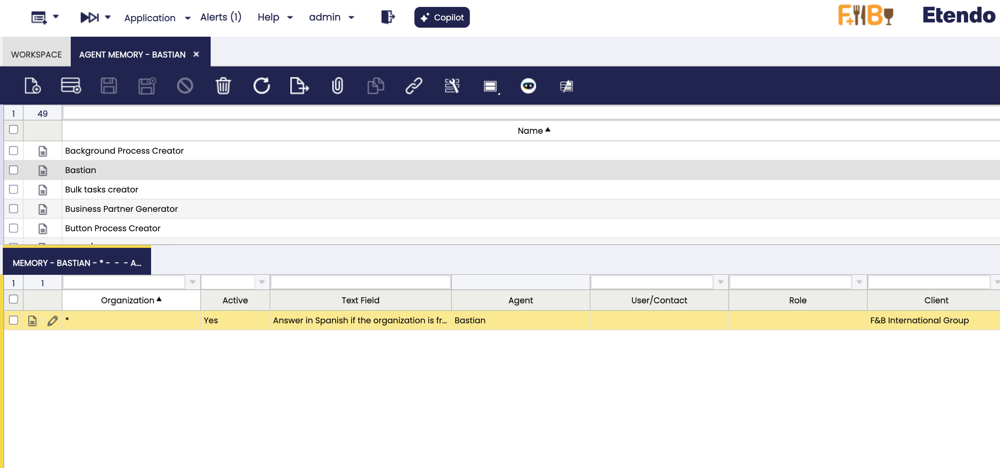
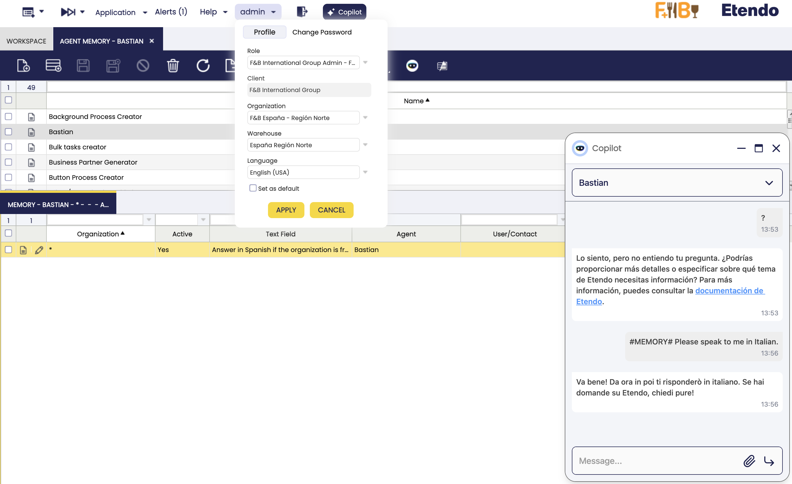
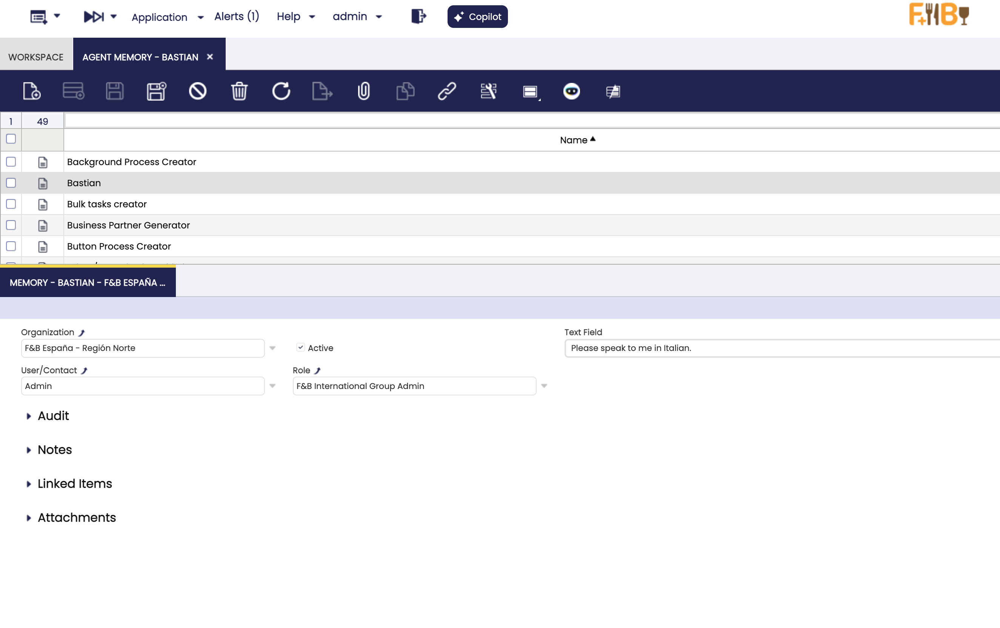
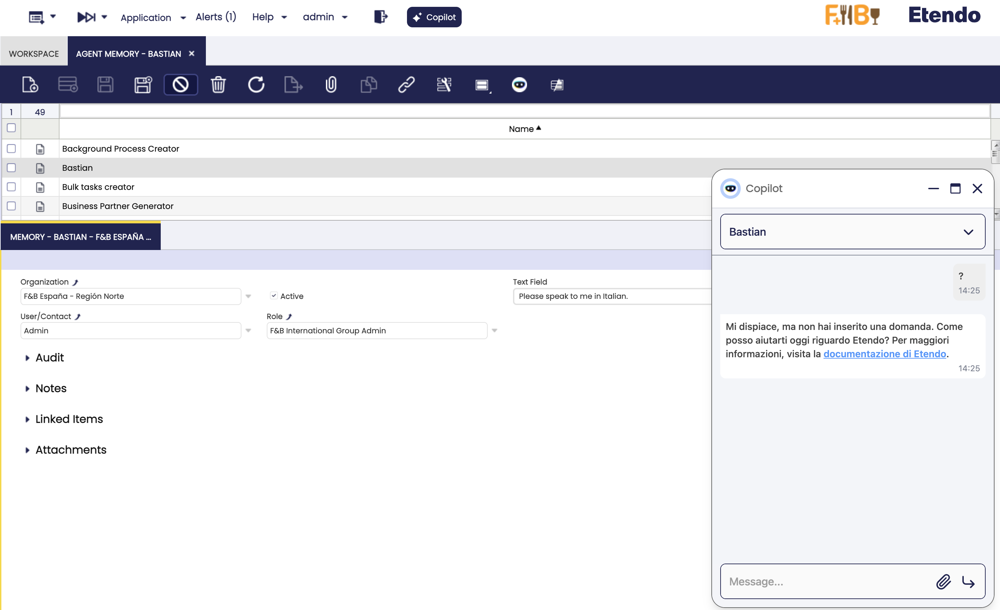

# How to Customize an Agent with Agent Memories

## Overview
This guide explains how to capture and reuse institutional knowledge for any Copilot agent by using the **Agent Memory** windows delivered with the Etendo Copilot module. Every memory you register is tied to a specific agent and is automatically injected into its answers according to your organization, role, and user context.

## Prerequisites
- Etendo Copilot module installed and synchronized.
- A Copilot App already defined (see `Application > Etendo Copilot > Copilot Apps`).
- Role with access to the **Agent Memory** menu entry.
- Optional: knowledge of the business roles that should receive each memory.

## Accessing the Agent Memory window
:material-menu: `Application` > `Etendo Copilot` > `Agent Memory`

1. Open the menu path above. The window splits into two tabs: **Agent** (header) and **Memory** (detail).
2. Use the header to select the agent you want to enrich. You can reuse search filters such as *Name*, *App Type*, or *Status* to find the correct assistant.
3. Switch to the **Memory** tab to review or create entries associated with the selected agent.



!!! info
	You can maintain Agent Memories without leaving Etendo Classic, so there is no need to edit configuration files or deploy code.

## Understanding the window layout

### Header: Agent tab
The header lists every Copilot Agent.


### Detail: Memory tab
The detail tab lists every memory attached to the selected agent. Each record represents one sentence or paragraph that Copilot will add to the user prompt whenever the filtering rules match. The following fields control the scope:

| Field | Purpose | How it affects Copilot |
| ----- | ------- | --------------------- |
| **Organization** | Defaults to the agent's organization; may be left blank for a global memory. | Copilot only injects entries that belong to the current organization tree unless the value is empty. |
| **Active** | Enables or disables the memory without deleting it. | Inactive rows never reach the conversation, which is handy for seasonal policies. |
| **User** | Optional user owner. Leave empty to expose it to everyone. | Only the selected user sees the memory; `null` makes it available to all users of that agent. |
| **Role** | Optional role filter (supports inherited roles automatically). | Any user working under the chosen role (or a child role) will receive the hint. |
| **Text Field** | The actual content Copilot will append (up to 4,000 chars). | Rendered verbatim as bullet points in the injected context. |

!!! tip
	Store short, action-oriented statements ("Always mention the delivery SLA for organization Norte") instead of long paragraphs. The hook formats each memory as a bullet inside the `Use the following relevant previous information` section, so concise text performs better.

## Creating a new memory entry
1. In the **Agent** tab, highlight the assistant to customize.
2. Move to the **Memory** tab and click **New**.
3. Fill the fields:
   - **Organization**: pick the narrowest organization that should see the hint. Leave it blank only for corporate-wide facts.
   - **User** and **Role**: optionally restrict the memory. Keeping them empty makes the entry available to everyone allowed to use the agent.
   - **Text Field**: describe the insight Copilot must remember. Mention identifiers or URLs if needed; the hook does not alter the text.
4. Save the record. The memory is stored instantly and becomes available the next time the agent receives a question.
5. Repeat for as many entries as needed. You can disable outdated instructions by unchecking **Active** without losing history.

!!! info
	When multiple memories match, Copilot lists them as bullet points under “Use the following relevant previous information.” Consider numbering procedures inside the text if the order matters.

## Editing or deleting memories
- **Edit**: change scope fields (Organization, User, Role) to tighten or relax the applicability. Save to apply instantly.
- **Deactivate**: toggle the **Active** checkbox to stop injecting the memory while keeping an audit trail.
- **Delete**: only when you are sure the instruction will not be reused. 

## Using the #MEMORY# shortcut from chat
Besides the back-office window, power users can push quick reminders straight from the Copilot chat pop-up:

1. Open any Copilot conversation.
2. Start your message with the literal token `#MEMORY#` followed by the text you want to store, for example:
   ```
   #MEMORY# Answer in Italian for me going forward.
   ```
3. Send the message. Copilot recognizes the prefix and stores the text with the current agent, organization, role, and user.
4. Copilot responds normally, but the saved memory becomes available immediately for future requests that match the same context.

!!! warning
	The shortcut always saves memories in the agent you are currently chatting with. Switch agents before using `#MEMORY#` if you need to persist the instruction elsewhere.

Example:
- You are chatting with "Bastian" (the agent for Etendo Wiki). By sending `#MEMORY# Always respond in Italian.`, the memory is saved under the "Bastian" agent and will be used in future interactions with that agent.




## Best practices
- Prefer smaller, composable memories over a single monolithic instruction; the hook can return many rows, and short bullets keep prompts under control.
- Use **User** for personal reminders and **Role** for departmental policies. Organizations can remain "*" for company-wide rules.
- Periodically review inactive entries to clean up outdated policies and keep Copilot answers trustworthy.

---
This work is licensed under :material-creative-commons: :fontawesome-brands-creative-commons-by: :fontawesome-brands-creative-commons-sa: [ CC BY-SA 2.5 ES](https://creativecommons.org/licenses/by-sa/2.5/es/){target="_blank"} by [Futit Services S.L.](https://etendo.software){target="_blank"}.
