---
tags:
  - Copilot
  - LangSmith
  - SDK
  - Observability
---

# How to Debug an Agent Prompt with LangSmith

## Introduction
Langsmith is a powerful observability tool that allows you to track and analyze the performance of your AI applications, if based on LangChain/Langgraph. It provides a comprehensive view of your application's behavior, enabling you to identify bottlenecks, optimize performance, and improve user experience.
This tutorial guides you through setting up the observability SDK to track Copilot in LangSmith.


## Create an API Key
Go to the [Langsmith Website](https://smith.langchain.com/){target=_isblank} and log in. If you don't have an account, create one.

To create an API key, navigate to the LangSmith settings page. Then, click on **Create API Key** and follow the instructions.

## Set Up Your Environment

Configure your `gradle.properties` file to include the following environment variables:

```properties
LANGCHAIN_TRACING_V2=true
LANGCHAIN_ENDPOINT="https://api.smith.langchain.com"
LANGCHAIN_API_KEY="your-langsmith-api-key"
LANGCHAIN_PROJECT="your project name"
```

- `LANGCHAIN_TRACING_V2`: Set to `true` to enable tracing.
- `LANGCHAIN_ENDPOINT`: The endpoint for LangSmith.
- `LANGCHAIN_API_KEY`: Your API key from LangSmith.
- `LANGCHAIN_PROJECT`: The name of your project in LangSmith. The executions, called traces, and events will be stored under this name. If this project does not exist, it will be created automatically. For this article, the name will be `MyLangsmithProjectForCopilot`.

Ensure you restart Copilot to set environment variables in the container.

``` bash title="Terminalß"
./gradlew resources.up --info
```

## Viewing From LangSmith

- Once in LangSmith, access to your organization's projects is available.
    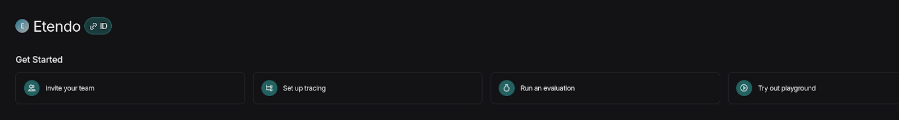
- In *Tracing Projects*, the name set in the `LANGCHAIN_PROJECT` variable should appear. This is the project where all traces will be stored.
    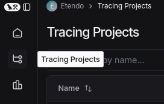
- Selecting your project allows you to view the trace of queries made in Copilot and evaluate responses.
    

## Usage Example

1. Make a request to any Copilot agent.
    
2. Upon receiving a response, if you want to evaluate internal processes or investigate issues, view the trace in LangSmith. 
    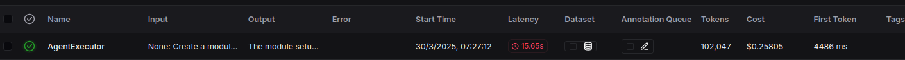
3. The most recent entry will be the last request made to the assistant. Access it to see detailed information:
    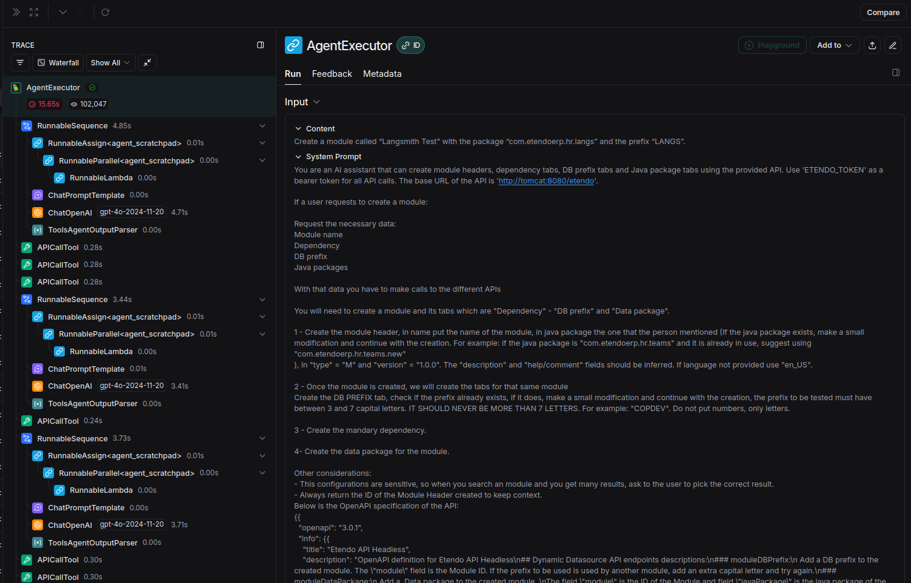
    - On the left, view all checkpoints from user interaction to response.
        
    - Access each endpoint, webhook, or tool to see how queries are formed.
        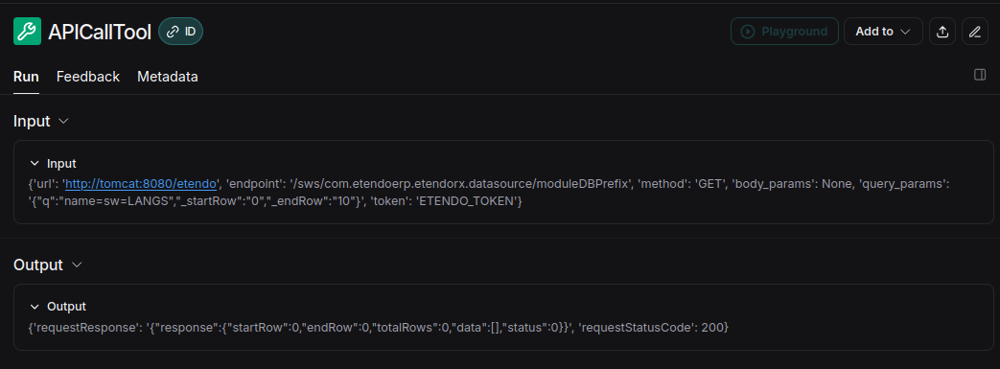
        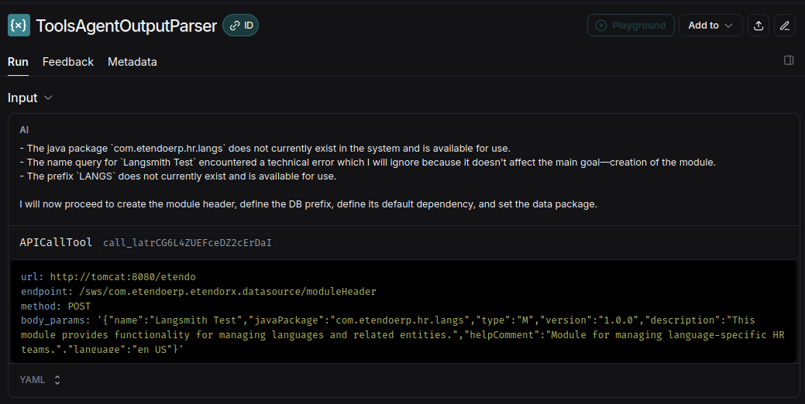

    - For interactions with OpenAI, an option called **Playground** is available.
        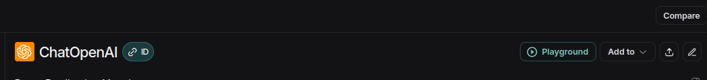

### Using the Playground

Accessing the Playground lets you experiment, test, and debug prompt chains and interactions with language models. This tool allows:

- Real-time task execution visualization.
- Model performance analysis.
- Error and inefficiency detection for optimization and improvement of Copilot.
    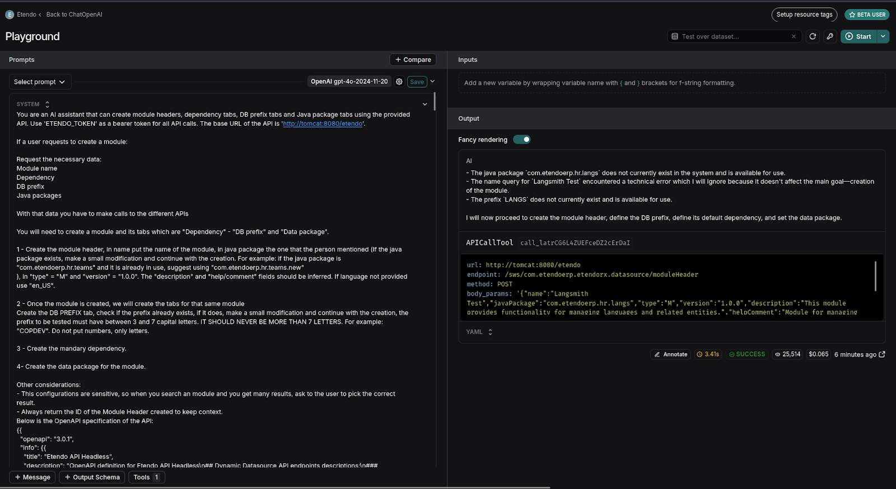

- You can test different prompts or user interactions without returning to the assistant. For instance, if you want to see how an assistant responds with a prefix like "ETHRT":

- Find the user query section in the Playground and modify the prefix.


    === "BEFORE"
        

    === "NOW"
        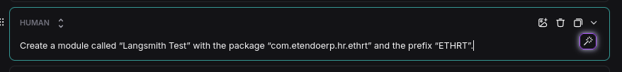

- Select **Start** to rerun with the prefix.
    

- Instantly, observe the trace executing with the prefix **ETHRT**.
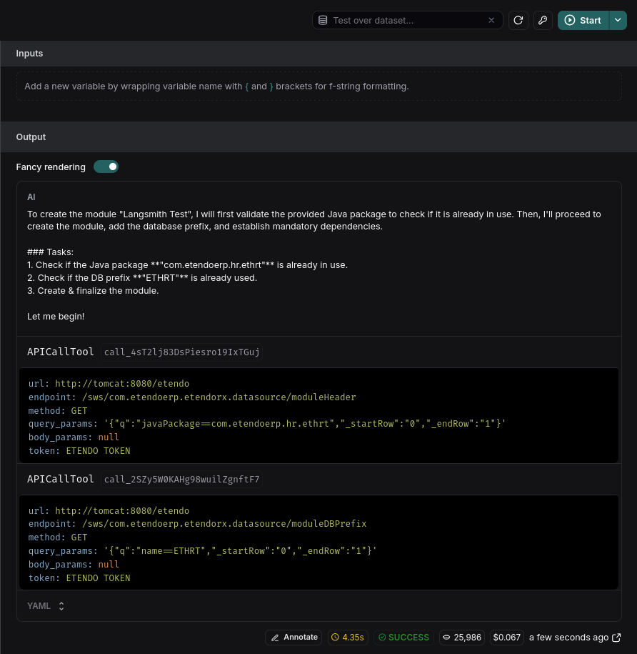

- To run multiple interactions to test assistant consistency:

    - Click the arrow next to **Start**.
    - Deselect **Enable streaming**.
    - Adjust the **Repetitions** to your desired count, such as three times.
        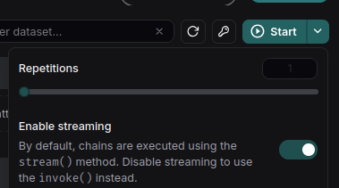
        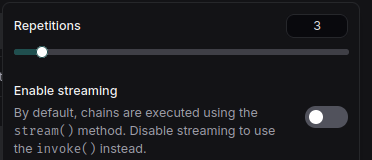
    - Press **Start** again. The query will execute thrice.
        
This feature is crucial for testing various requests and modifying prompts to meet requirements.

## System Prompt Debugging
The playground allows you to debug the prompt used in the agent. This is useful to improve the behavior of the agent in case of unexpected results.
As we have seen above, in Langsmith you can see the execution of tools and other actions performed by the assistant, which are indicated by the LLM. That is, the decision or reasoning comes from the LLM and it is at these points that we can use it. 

When loading the playground we will see:

- The system prompt.
- And the sequence of messages, tool executions and answers up to that moment.

When executing Start, what we do is to request to the LLM, its answer given that system prompt and that conversation. Where we will be able to receive an answer in text or the order to execute a tool with certain parameters.

Then, if analyzing the execution trace, we find the point where the agent “made a mistake” or “decided wrong”, we can place ourselves at that point and adjust the prompt to improve the reasoning. Additionally, we can execute this request multiple times to make sure it has decided correctly because the prompt was improved and not by chance (the LLM is not deterministic in situations not clearly defined).

### Example

In this example we will see how to improve the prompt of an agent that is not giving the expected answer.
In this case we will use the agent **Writer Agent**, and the prompt is:

```text
You task is to write notes.
The path must be ./[filename].txt
```
The request is:
```text
Create a note that remind me "call to my boss, tomorrow"
```

Inspecting the trace, can see the LLM decision to execute the tool **WriteFileTool** with the parameters:
```text
filepath: ./reminder.txt
content: call to my boss, tomorrow
override: false
```
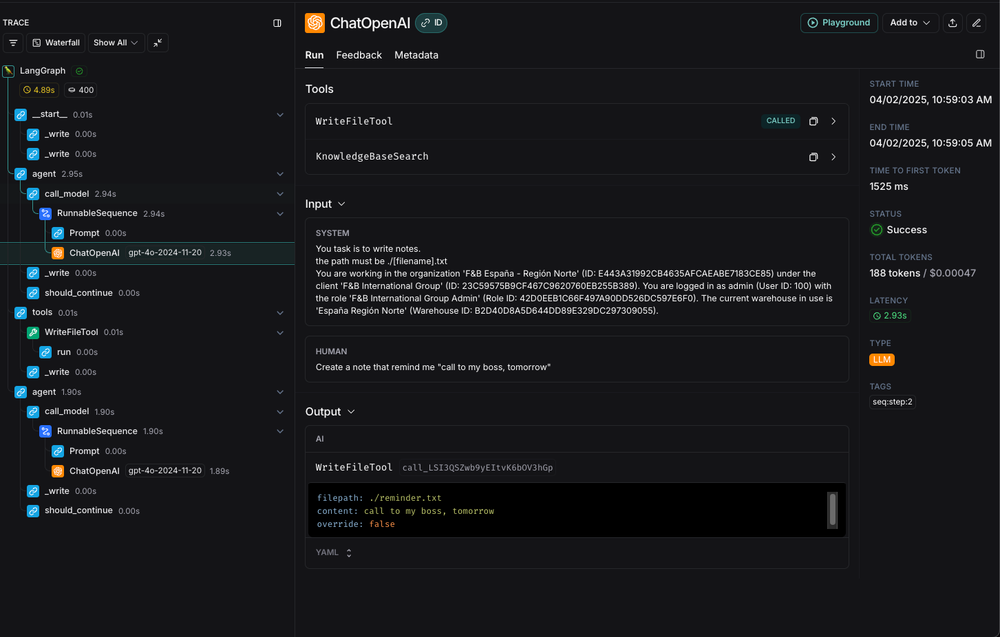

So, suppose we want to change the agent name the file to use SnakeCase, and the format of the note to be more formal and structured.
We can open the playground and see the system prompt and change it to:
```text
You task is to write notes.
the path must be ./[filename].txt

- The file name must be in snake_case.
- The format of the note is: 
DATE: 
DESCRIPTION:

```
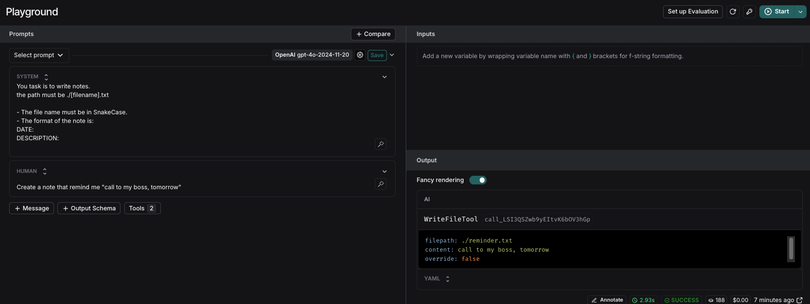

So, to see if the change was effective, we can execute the request again and see the result. For better results, we can execute the request multiple times to see if the result is consistent.

After executing the request, we can see that the file name is now in snake_case and the format of the note is more structured with the requirements we set in the prompt.
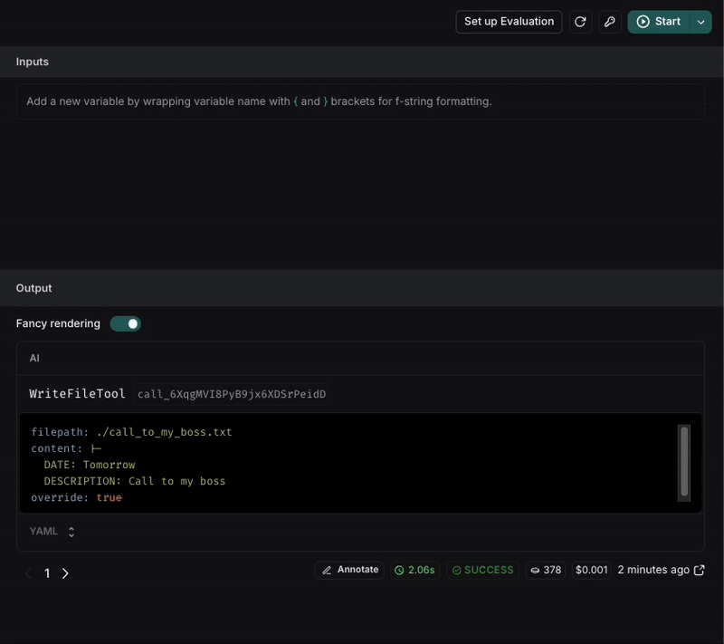

If the result is not consistent, we can keep iterating on the prompt until we get the expected result.

---
This work is licensed under :material-creative-commons: :fontawesome-brands-creative-commons-by: :fontawesome-brands-creative-commons-sa: [ CC BY-SA 2.5 ES](https://creativecommons.org/licenses/by-sa/2.5/es/){target="_blank"} by [Futit Services S.L.](https://etendo.software){target="_blank"}.