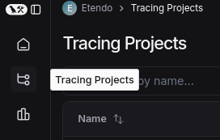
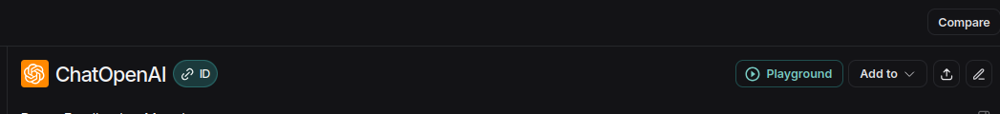
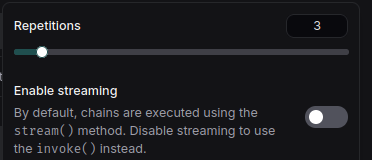
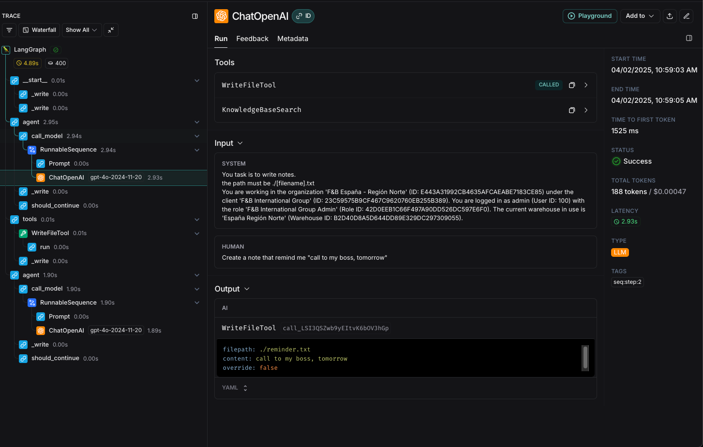
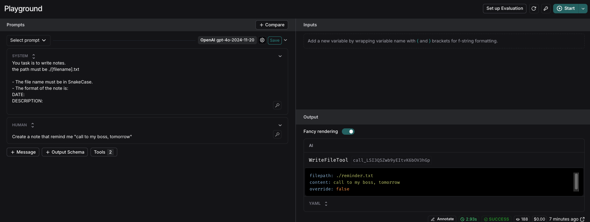

---
tags:
  - Copilot
  - LangSmith
  - SDK
  - Observability
---

# How to Debug an Agent with LangSmith

## Introduction
LangSmith is a powerful observability tool that allows you to track and analyze the performance of your AI applications, if based on LangChain/LangGraph. It provides a comprehensive view of your application's behavior, enabling you to identify bottlenecks, optimize performance, and improve user experience.
This tutorial guides you through setting up the observability SDK to track Copilot in LangSmith.


## Create an API Key
Go to the [LangSmith Website](https://smith.langchain.com/){target=_isblank} and log in. If you don't have an account, create one.

To create an API key, navigate to the LangSmith settings page. Then, click on **Create API Key** and follow the instructions.

## Set Up Your Environment

Configure your `gradle.properties` file to include the following environment variables:

```properties
LANGSMITH_TRACING=true
LANGSMITH_API_KEY="your-langsmith-api-key"
LANGSMITH_WORKSPACE_ID="your-workspace-id"
```

- `LANGSMITH_TRACING`: Set to `true` to enable tracing.
- `LANGSMITH_API_KEY`: Your API key from LangSmith.
- `LANGSMITH_WORKSPACE_ID` (Optional): Your workspace ID in LangSmith. If not provided, the "default" workspace will be used. The executions, called traces, and events will be stored under this workspace.

Ensure you restart Copilot to set environment variables in the container.

``` bash title="Terminal"
./gradlew resources.up --info
```

## Viewing From LangSmith

- Once in LangSmith, access to your organization's projects is available.
    
- In *Tracing Projects*, the traces will be stored under the workspace defined in the `LANGSMITH_WORKSPACE_ID` variable.
    
- Selecting your workspace allows you to view the trace of queries made in Copilot and evaluate responses.
    

## Usage Example

1. Make a request to any Copilot agent.
    
2. Upon receiving a response, if you want to evaluate internal processes or investigate issues, view the trace in LangSmith. 
    
3. The most recent entry will be the last request made to the agent. Access it to see detailed information:
    
    - On the left, view all checkpoints from user interaction to response.
        
    - Access each endpoint, webhook, or tool to see how queries are formed.
        
        

    - For interactions with OpenAI, an option called **Playground** is available.
        

### Using the Playground

Accessing the Playground lets you experiment, test, and debug prompt chains and interactions with language models. This tool allows:

- Real-time task execution visualization.
- Model performance analysis.
- Error and inefficiency detection for optimization and improvement of Copilot.
    

- You can test different prompts or user interactions without returning to the agent. For instance, if you want to see how an agent responds with a prefix like "ETHRT":

- Find the user query section in the Playground and modify the prefix.


    === "BEFORE"
        

    === "NOW"
        

- Select **Start** to rerun with the prefix.
    

- Instantly, observe the trace executing with the prefix **ETHRT**.


- To run multiple interactions to test agent consistency:

    - Click the arrow next to **Start**.
    - Deselect **Enable streaming**.
    - Adjust the **Repetitions** to your desired count, such as three times.
        
        
    - Press **Start** again. The query will execute thrice.
        
This feature is crucial for testing various requests and modifying prompts to meet requirements.

## System Prompt Debugging
The playground allows you to debug the prompt used in the agent. This is useful to improve the behavior of the agent in case of unexpected results.
As we have seen above, in LangSmith you can see the tool executions and other actions performed by the agent, as determined by the LLM. Since the reasoning originates from the LLM, these are the key points where we can intervene to optimize behavior. 

When loading the playground, you will see:

- The system prompt.
- The sequence of messages, tool executions, and responses up to that point.

When executing Start, you request the LLM's answer based on the system prompt and conversation. From there, you can receive a text response or an instruction to execute a tool with specific parameters.

Then, if by analyzing the execution trace we find where the agent "made a mistake" or "decided incorrectly," we can go to that point and adjust the prompt to improve its reasoning. Additionally, we can execute the request multiple times to ensure the correct decision is consistent and not due to chance, as LLMs aren't deterministic in loosely defined situations.

### Example

In this example, we will see how to improve the prompt of an agent that is not providing the expected answer.
In this case, we will use the **Writer Agent** with the following prompt:

```text
Your task is to write notes.
The path must be ./[filename].txt
```
The request is:
```text
Create a note that reminds me to "call my boss tomorrow"
```

Inspecting the trace, you can see the LLM's decision to execute the **WriteFileTool** with these parameters:
```text
filepath: ./reminder.txt
content: call to my boss, tomorrow
override: false
```


Suppose we want the agent to use snake_case for filenames and a more formal, structured format for the notes.
We can open the playground, view the system prompt, and change it to:
```text
Your task is to write notes.
The path must be ./[filename].txt

- The file name must be in snake_case.
- The format of the note is: 
DATE: 
DESCRIPTION:

```


To verify the change, we can rerun the request. For more reliable results, we can execute it multiple times to ensure the behavior is consistent.

After executing the request, we can see that the file name is now in snake_case and the format of the note is more structured with the requirements we set in the prompt.


If the result is not consistent, we can keep iterating on the prompt until we get the expected result.

---
This work is licensed under :material-creative-commons: :fontawesome-brands-creative-commons-by: :fontawesome-brands-creative-commons-sa: [ CC BY-SA 2.5 ES](https://creativecommons.org/licenses/by-sa/2.5/es/){target="_blank"} by [Futit Services S.L.](https://etendo.software){target="_blank"}.