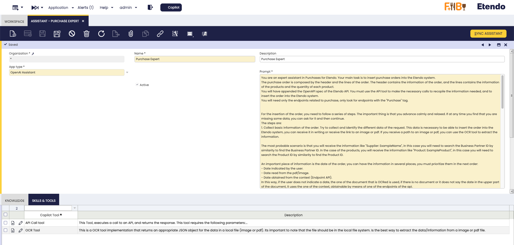
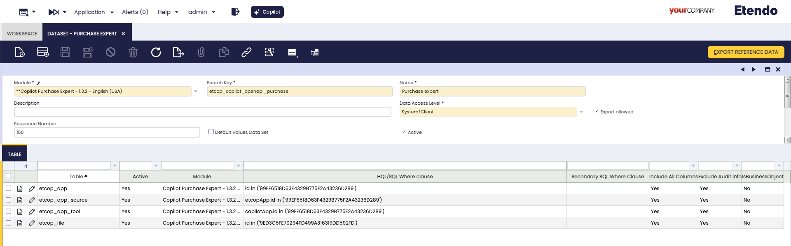
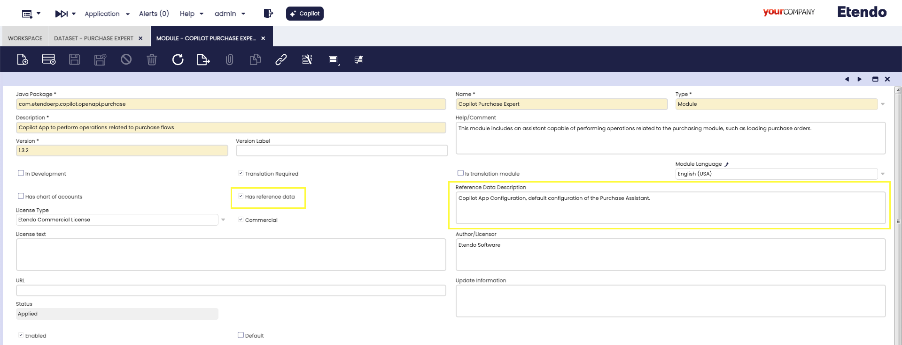
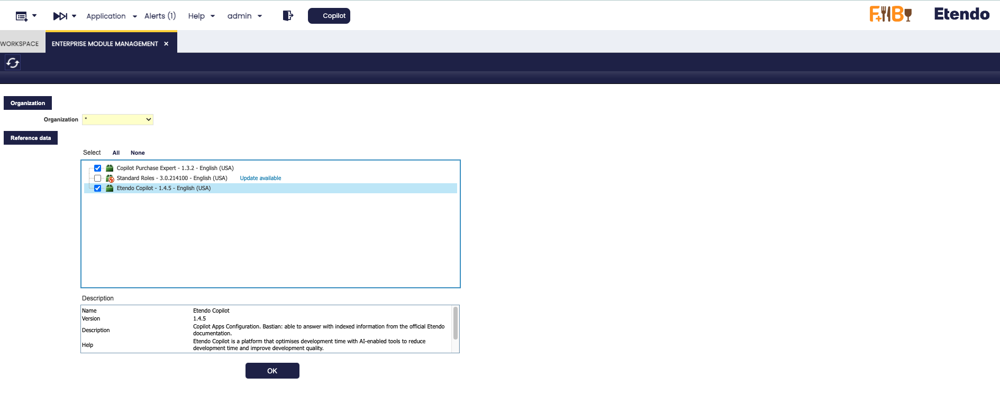
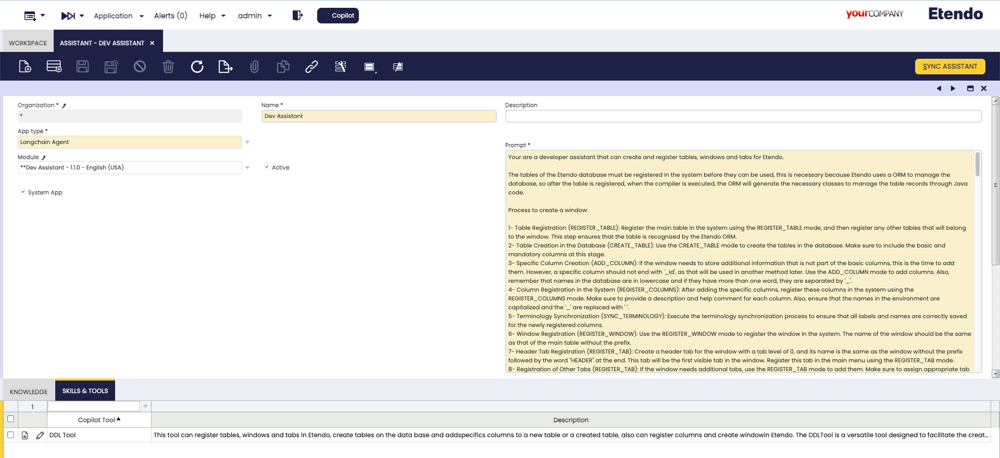
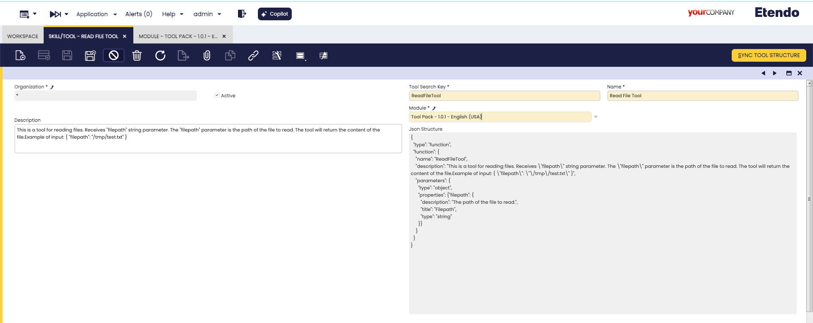

---
tags:
    - How to
    - Export Agent
    - Distribute Agent
    - Copilot
    - Datasets
    - Export Tool
    - Distribute Tool
---

# How to Export Tools and Agents

## Overview

When developing in Etendo Copilot, it is possible to export agents and tools. This documentation details how to export them and how to make sure that, when installing the module, the configurations are ready to use, allowing a **plug and play** process.

## Exporting Agents

There are two main methods for exporting agents: export it as a dataset where the configured agents is exported within an Etendo Classic dataset or export as a System Administrator, where the agent(s) defined with the System Administrator role are exported directly together with the module.

### Exporting Agents as Datasets

Agents must be exported as a dataset, in case optional installation is required and with `Client/Organization` data access level. 

1. Initial setup of the agent:
    - Configure the agent and tools in the environment where the development takes place.
    - Make sure to include all the necessary fields to be exported. Make sure to configure correctly the **Knowledge Base**, **Skills/Tools** and **Team Members** tabs, as well as the records in the **Knowledge Base File** window.

    
    <figure markdown="span">
    
  <figcaption>Agent example with complete tabs.</figcaption>
</figure>

2. Create and Configure a Dataset:
    - As System Administrator, go to the **Dataset** window and create a new record by selecting the module under development.
    - Define the **Search Key** and **Name** of the dataset.
    - Set the **Data Access Level** to **System/Organization** (recommended for user agents).

3. Add Tables to the Dataset

    For each window or tab to be exported, create a record in the **Table** tab. Specify the corresponding table and add the appropriate **HQL/SQL Where** clause.

    - **Agent:** Table `etcop_app` 
    ```sql title="Where Clause"
    id in ('<AssistantID>')
    ```
    - **Knowledge Base:** Table `etcop_app_source`
    ```sql title="Where Clause"
    etcopApp.id in ('<AssistantID>')
    ```
    - **Skills/Tools:** Table `etcop_app_tool`
    ```sql title="Where Clause"
    `copilotApp.id in ('<AssistantID>')
    ```
    - **Team Members:** Table `ETCOP_Team_Member`
    ```sql title="Where Clause"
    copilotApp.id in ('<AssistantID>')
    ```
    - **Knowledge Base File:** Table `etcop_file`
    ```sql title="Where Clause"
    id in ('<knowladgeBaseFileID>')
    ```
    
    <figure markdown="span">
    
    <figcaption>Dataset window configuration example in the module Copilot Purchase Expert</figcaption>
    </figure>

4. Export Reference Data Button
    - Execute the **Export Reference Data** process, which will create the `referencedata/` folder inside the selected module, with all the records that were exported according to the dataset configuration. 

    !!!note
        Verify that all the required records are generated in the `.XML` file.


5. Include Reference Data in the Module
    - Check the **Include Reference Data** checkbox in the module definition and add a description to the dataset referring to the exported agent.

    <figure markdown="span">
    
    <figcaption>Configuration example in the module Copilot Purchase Expert</figcaption>
    </figure>

    - When the module is installed, the dataset will be available for application in the **Enterprise Module Management** window.

    <figure markdown="span">
    
    <figcaption>Distributed datasets example</figcaption>
    </figure>


### Exporting Agents as System Administrator

When exporting agents that need to be pre-configured in a module installation, they must be created with the System Administrator role. These agents will be editable only by the System Administrator, but they can be executed either by the `System Administrator` or by users with `Client/Organization` data access levels.

1. Create Agent with System Administrator Role:

    - Log in as System Administrator.
    - Configure the agent and its tabs, ensuring to select the module (under development) in the **Module** field.
    - If the agent should be restricted to System Administrator use only, check the **System App** checkbox. Otherwise, leave it unchecked to allow execution across all data access levels.

    <figure markdown="span">
    
    <figcaption>Exported agent example and available only as System Administrator</figcaption>
    </figure>

2. **Export the Database**.
    - Execute the command `./gradlew export.database` to export the agent together with the module.

## Exporting Tools

**Tool configuration**: When defining a tool, select the module (under development) in the **Module** field, and run `./gradlew export.database` command to export the tool together with the module.

<figure markdown="span">

<figcaption>Tool configuration example</figcaption>
</figure>

!!!info
    For more information, visit [How to create a Copilot Tool](../how-to-guides/how-to-create-copilot-tools.md).

---
This work is licensed under :material-creative-commons: :fontawesome-brands-creative-commons-by: :fontawesome-brands-creative-commons-sa: [ CC BY-SA 2.5 ES](https://creativecommons.org/licenses/by-sa/2.5/es/){target="_blank"} by [Futit Services S.L.](https://etendo.software){target="_blank"}.