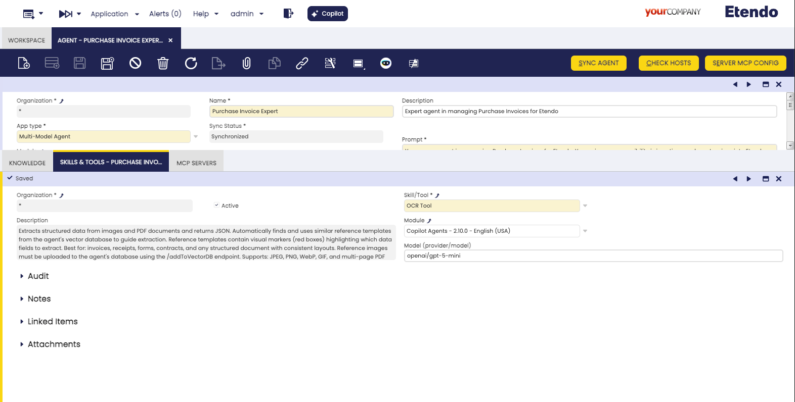
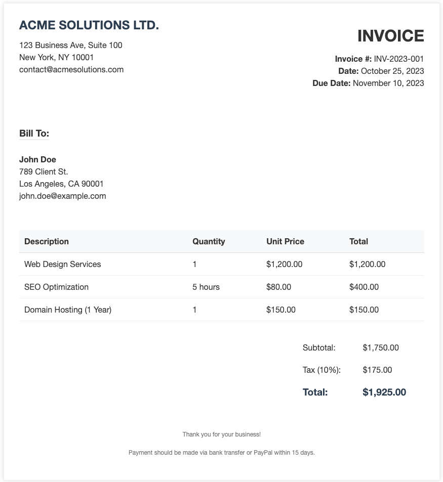
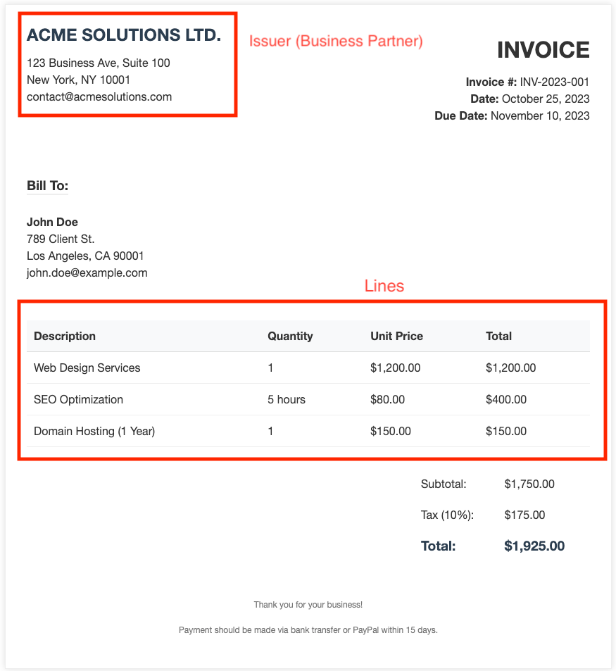

# How to Improve OCR Recognition

In simple terms, the OCR tool makes a call to a model to detect information from a document or image. However, it is not infallible. There are different methods to increase its reliability and efficiency.


The tool follows these steps:

1. **Convert to Image**: If the input is a PDF, it is converted into an image. If it is already an image, it proceeds directly.
2. **Reference Search**: It searches for reference images in the agent's knowledge base (if any are configured).
3. **LLM Call**: It calls an LLM model using a prompt (the `question` parameter of the OCR tool), which specifies exactly what the model should recognize and extract.

## Using a specific model
By default, the tool uses a model configured in the `gradle.properties` file. However, it is highly recommended to configure a specific model for the agent that will use the tool to ensure the best performance for visual tasks.

In the **Agent** window, under the **Skills and Tools** tab, you can specify a **Model** for the OCR tool. This field allows you to override the default model for that specific tool in that agent.



- **Format**: The model must be specified using the format `provider/modelname` (e.g., `openai/gpt-5-mini`).
- **Recommendation**: Use models with strong vision capabilities. New models with improved recognition accuracy and faster processing speeds are released frequently, so it is advisable to stay updated with the latest available versions.

!!! info
    The **Model** field only appears in the **Skills and Tools** tab if the tool has the **Use Model** checkbox enabled in the **Skill/Tool** window.

## Using a fixed prompt
In general, when the agent calls the OCR tool, it sends a `question` (prompt) about what it needs to recognize. The agent constructs this question dynamically based on the current context and needs. However, generating this question every time can lead to inconsistencies between executions.

To avoid this, you can "fix" the prompt for the OCR tool by instructing the agent exactly what question it should use.

- **How to do it**: In the agent's prompt, specify the exact instructions for the OCR tool. For example: *"When calling the OCR tool, use this question: 'Read the product name, quantities, tax used, and total amount of the receipt'"*.
- **Benefit**: By fixing the question, you ensure that the OCR tool always receives the same instructions, making the extraction process more predictable. Furthermore, any improvements made to this fixed question will positively impact all executions.

## Increasing DPI
When the input file is a PDF, the OCR tool must render it into an image before processing. This conversion quality is controlled by a parameter called `scale`.

- **Default Value**: The default scale is `3.0`, which corresponds to approximately **300 DPI**.
- **How to Increase it**: To improve recognition of very small text or extremely complex layouts, you can increase the rendering quality by instructing the agent in its prompt. For example, you can add: *"Use a scale of 4.0 when using OCRTool"* to achieve **400 DPI**.

Higher scale values yield better quality and more accurate extraction, but they also result in larger image sizes and slower processing times.

## Using Structured Output
The OCRTool supports **Structured Output**, which allows you to define a specific JSON schema that the model must follow when extracting information. This ensures that the output is always consistent and easy to process by other tools or systems.

To use structured output, you must:

1. **Define the Schema**: Create a Python file in the `tools/schemas/` directory located at the root of your Copilot module (e.g., `modules/my_module/tools/schemas/mail.py`). The file name will be the schema name (e.g., `mail.py`).
2. **Implement the Pydantic Model**: Inside the file, define a class that inherits from `pydantic.BaseModel`. The class name must follow the pattern `<SchemaName>Schema` (e.g., `class MailSchema(BaseModel):`).
3. **Invoke the Tool**: Specify the schema name in the `structured_output` parameter when calling the OCRTool.

### Example: Creating a "Mail" Schema

Suppose you want to extract information from scanned emails or letters. You can create a schema named `Mail`:

**File**: `tools/schemas/mail.py`

```python
from typing import List, Optional
from pydantic import BaseModel, Field

# Internal model for nested data
class MailAttachment(BaseModel):
    filename: str = Field(description="Name of the attachment file")
    size: Optional[int] = Field(description="Size of the file in bytes")

# Main schema class - Must end with 'Schema'
class MailSchema(BaseModel):
    """Schema for extracting email/mail information."""
    sender: str = Field(description="The person or entity who sent the mail")
    recipient: str = Field(description="The person or entity who received the mail")
    subject: Optional[str] = Field(description="The subject line of the mail")
    body: str = Field(description="The main content or body of the mail")
    date: Optional[str] = Field(description="The date when the mail was sent")
    attachments: List[MailAttachment] = Field(default_factory=list, description="List of attachments mentioned")
```

Once defined, you can instruct the agent to use this schema:

- **Agent Prompt**: *"When you extract information from an email image, use the OCRTool with the 'Mail' structured output."*

The tool dynamically loads the schema from the file. It converts the `structured_output` value (e.g., `Mail`) to lowercase to find the file (`mail.py`) and then looks for the class `MailSchema`.

The resulting extraction will follow the exact structure of your `MailSchema`, making it highly reliable for automated workflows.

## Adding reference data
The OCR tool includes an intelligent reference system that automatically searches for similar document templates in the agent's knowledge base. When a similar reference is found, it guides the extraction process by indicating which data fields to extract using visual markers.

To add reference data:

1. **Prepare the Reference**: Take a high-quality image of the document type (e.g., a specific supplier's invoice). If possible, highlight the key fields that need to be extracted (e.g., total amount, tax, date) using colored boxes or hints.
2. **Upload to Knowledge Base**: In the **Knowledge Base File** window, upload the image.
3. **Index the Image**: Ensure the file is synchronized with the agent. The system will automatically index it in a separate image database designed for visual similarity search.
4. **Automatic Matching**: When the agent processes a new document, the OCR tool will automatically search for the most similar reference in this database to improve extraction accuracy.

**Example: Improving Business Partner detection in Purchase Invoice Expert**

If you want to improve the detection of the Business Partner (BP) for a specific invoice format, you can add a reference image of that invoice to the agent's Knowledge Base. In this image, you should mark the sections where the BP information is located. This guides the OCR tool to look in those specific areas when it encounters a similar invoice layout, significantly increasing the reliability of the extraction.



Marked fields in the reference image to guide OCR extraction.



!!! tip
    Using reference templates is especially useful for documents with non-standard layouts where the LLM might otherwise struggle to locate specific fields.

!!! tip
    If you don't want to use reference images for a specific execution, you can disable this feature by indicating in the agent's prompt: *"When using OCRTool, do not use reference images from the knowledge base."*. The agent will disable the reference search for that execution through a parameter of the OCR tool.
