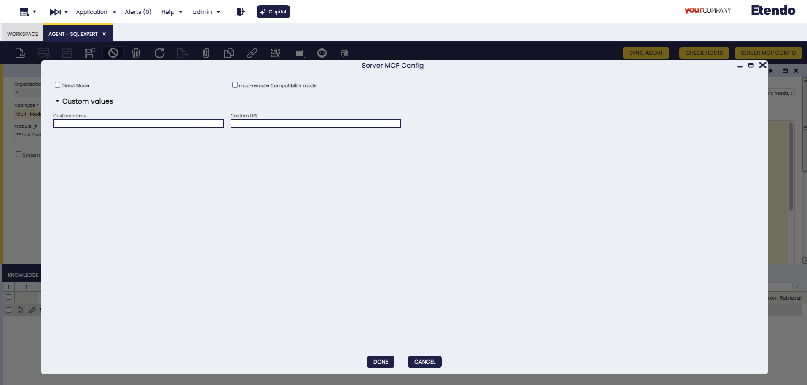
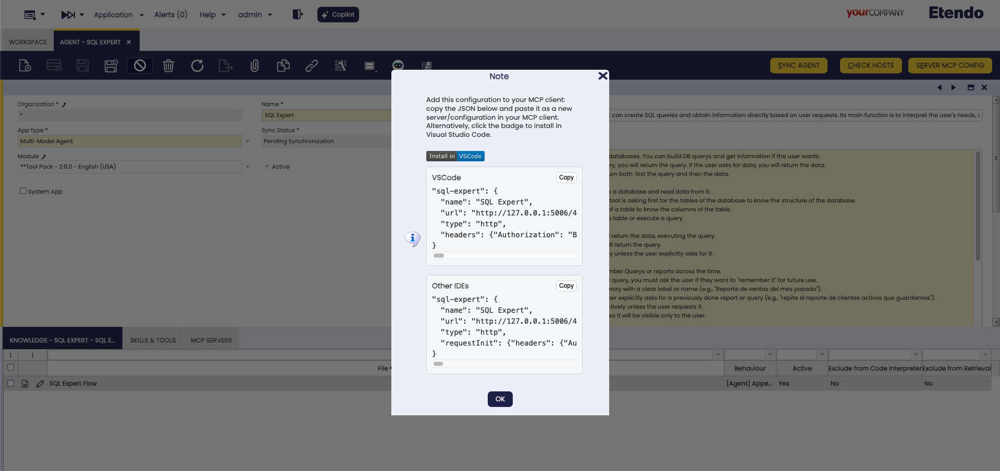

# How to use an agent as MCP Server

## Overview

!!! example  "IMPORTANT: THIS IS A BETA VERSION"
    It is under active development and may contain **unstable or incomplete features**. Use it **at your own risk**. The module behavior may change without notice. Do not use it in production environments.

This guide shows you how to connect to Etendo Copilot agents using the [Model Context Protocol (MCP)](../concepts/model-context-protocol.md). Each agent automatically exposes an MCP server that you can connect to from various MCP-compatible clients like Claude Desktop, VS Code, Gemini CLI, and custom applications.

## What is an MCP Server?

Each Etendo Copilot agent provides an MCP server endpoint that exposes:

- **Tools**: Agent capabilities (API calls, file operations, knowledge search)
- **Prompts**: Pre-configured templates for common tasks  
- **Resources**: Access to documents, configurations, and data

## Connection Modes

Choose how you want to interact with the agent:

| Mode | Description | Best for |
|------|-------------|----------|
| **Simple** | Chat naturally with the agent | Conversations, questions, general use |
| **Direct** | Execute specific tools directly | Automation, workflows, development |

## Step-by-Step Guide

## MCP Server Architecture in Etendo Copilot

Each Etendo Copilot agent automatically exposes an MCP server endpoint that provides:

  - **Interaction Tools**: Tools that facilitate communication between the agent and the MCP Client, like `ask_agent` for sending questions and receiving answers.
  - **Agent Tools**: Functions that the agent can execute.
  - **Resources**: Static or dynamic data that can be accessed (documents, configurations, logs, etc.).
  - **Prompts**: Pre-configured prompt templates for common tasks.

The MCP server runs alongside the agent and communicates using HTTP transport with optional Server-Sent Events (SSE) for streaming responses.

## Agent Types and Connection Modes

Etendo Copilot supports two kinds of agents, each with two connection modes. The agent type defines the role, and the mode defines how you interact with it.

| Agent Type        | Simple Mode (Talk)                            | Direct Mode (Control)                                      |
|-------------------|-----------------------------------------------|-----------------------------------------------------------|
| **Multi-Model**   | Use `ask_agent` to chat naturally              | Access all tools directly + `get_agent_prompt` for setup   |
| **LangGraph**     | Use `ask_agent_supervisor` to talk to supervisor | Use `ask_agent_<MemberName>` for team members + `get_agent_prompt` |

**Multi-Model Agent**

- **What it is**: A single agent that combines multiple AI models and tools.  
- **Simple Mode**: Best for natural conversations. The agent picks the right tools automatically.  
- **Direct Mode**: Best for workflows or integrations. You run tools yourself and can read the agent’s instructions.  

**LangGraph Agent**

- **What it is**: A supervisor that manages a team of specialized agents.  
- **Simple Mode**: Talk to the supervisor, who delegates tasks to the right team members.  
- **Direct Mode**: Talk directly to individual team members and see how the supervisor organizes them.  

**Choosing the Right Setup**

| Use Case                          | Recommended Setup             |
|-----------------------------------|-------------------------------|
| Conversational chat interface     | Any Agent + Simple Mode       |
| Automated business workflows      | Multi-Model + Direct Mode     |
| Complex, multi-skill analysis     | LangGraph + Simple Mode       |
| Development and debugging         | Any Agent + Direct Mode       |
| API integrations                  | Multi-Model + Direct Mode     |
| Multi-domain problem solving      | LangGraph + Simple Mode       |

## Step-by-Step Guide

### 1. Get MCP Configuration

1.  **Open the Agent window** in **Etendo Classic**:
    
    - Navigate to **Server** → **Copilot** → **Agent**

2.  **Select your agent** and click **"Server MCP Config"** button

3.  **Configure connection options**:
    
    

    - **Direct Mode**: Check for tool execution, uncheck for conversation
    - **MCP-remote compatibility**: Check for better client compatibility
    - **Custom values**: Optional URL and name overrides
    
    !!!info "MCP-remote Compatibility Mode"
        **What it does**: Uses the `mcp-remote` library to add compatibility for MCP clients that don't handle HTTP transport with authentication headers correctly.
        
        **When to use**: 
        
        - ✅ Claude Desktop - Requires this mode for proper authentication
        
        - ✅ Some IDE extensions that have HTTP transport limitations
        
        **Configuration difference**:
        
        - **Standard mode**: Direct HTTP configuration with headers
        
        - **Compatibility mode**: Uses `npx mcp-remote` wrapper command
        
        **Troubleshooting**: If you encounter connection issues with compatibility mode, try switching to standard mode by unchecking this option.

4.  **Copy the generated configuration** from the popup

    

    !!! warning "Localhost Development Warning"
        If you see this message: *"The MCP URL begins with http://localhost, which only works in development environments"*
        
        **What it means**: The generated URL is only accessible from the same machine
        
        **For production use**: Configure the `context.url.copilot.mcp` property in Etendo to use your public domain instead of localhost
        
        **For external access**: Use the **Custom URL** field in the dialog to specify your public Copilot host address


### 2. Configure Your MCP Client

#### VS Code Configuration

Add to your VS Code settings:

```json
"mcp": {
  "servers": {
    "etendoAgent": {
      "type": "http",
      "url": "http://localhost:5006/AGENT_ID/mcp",
      "headers": {
        "etendo-token": "Bearer your-token-here"
      }
    }
  }
}
```

#### Gemini CLI Configuration

Create or update your Gemini CLI config:

```json
{
  "mcpServers": {
    "etendoAgent": {
      "type": "http", 
      "httpUrl": "http://localhost:5006/AGENT_ID/mcp/",
      "headers": {
        "etendo-token": "Bearer your-token-here"
      }
    }
  }
}
```

#### Claude Desktop Configuration

Add to your Claude Desktop config:

```json
{
  "mcpServers": {
    "etendoAgent": {
      "command": "npx",
      "args": ["mcp-remote", "http://localhost:5006/AGENT_ID/mcp", "--headers", "etendo-token=Bearer your-token-here"]
    }
  }
}
```

### 3. Test the Connection

1. **Start your MCP client** (VS Code, Gemini CLI, etc.)

2. **Test basic connectivity**:
   ```
   Use the ping tool to test connection
   ```

3. **Try agent interaction**:
   
   **Simple Mode**:
   ```
   Ask the agent: "What can you help me with?"
   ```
   
   **Direct Mode**:
   ```
   Use get_agent_prompt to see agent capabilities
   Execute specific tools directly
   ```

## Connection Modes Explained

### Simple Mode
- **URL**: `http://HOST:PORT/AGENT_ID/mcp`
- **Tools**: `ask_agent`, basic utilities
- **Use**: Natural conversation with the agent

### Direct Mode  
- **URL**: `http://HOST:PORT/AGENT_ID/direct/mcp`
- **Tools**: All agent tools + `get_agent_prompt`
- **Use**: Direct tool execution and system access

## Authentication

All connections require authentication via the `etendo-token` header:

1. **Get a token**: Use Etendo's `/sws/login` endpoint
2. **Add to headers**: `"etendo-token": "Bearer your-token"`
3. **Secure usage**: Use HTTPS in production

## Examples

### Example 1: Simple Chat Interface

**User**: *"What can you help me with?"*

**Agent**: *"I can help you with Etendo Classic operations, data analysis, reporting, and more. What would you like to know?"*

**User**: *"Show me recent sales data"*

**Agent**: [Uses internal tools] *"Here's the recent sales data: [displays results]"*

### Example 2: Direct Tool Execution

**Developer**: [Uses `get_agent_prompt` tool] 
*Reads: "I am an Etendo sales assistant with access to customer data and reporting tools..."*

**Developer**: [Uses `search_customers` tool directly]
*Parameters: {"query": "enterprise clients", "limit": 10}*

**Result**: *Returns list of enterprise customers without conversational wrapper*

## Troubleshooting

### Common Issues

**Connection fails:**
- Verify the Etendo token is valid
- Check the agent ID is correct
- Ensure Copilot service is running

**Tools not available:**
- Check user permissions in Etendo
- Verify agent configuration includes required tools
- Confirm connection mode matches your needs

**Authentication errors:**
- Regenerate SWS token via `/sws/login`
- Check token format includes "Bearer " prefix
- Verify user has agent access permissions

!!! warning "Security Note"
    Always use HTTPS in production environments. Keep your SWS tokens secure and never expose them in client-side code or public repositories.

