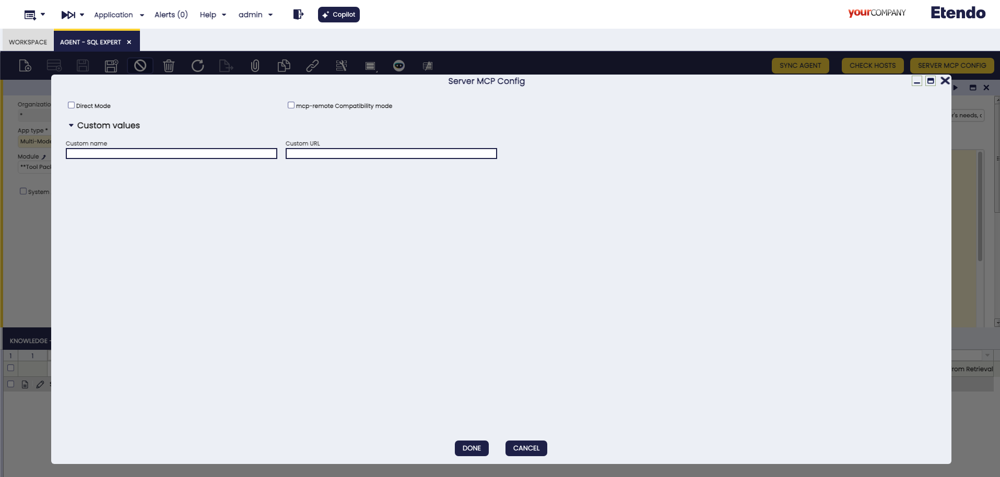
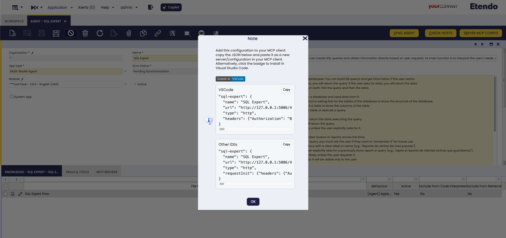
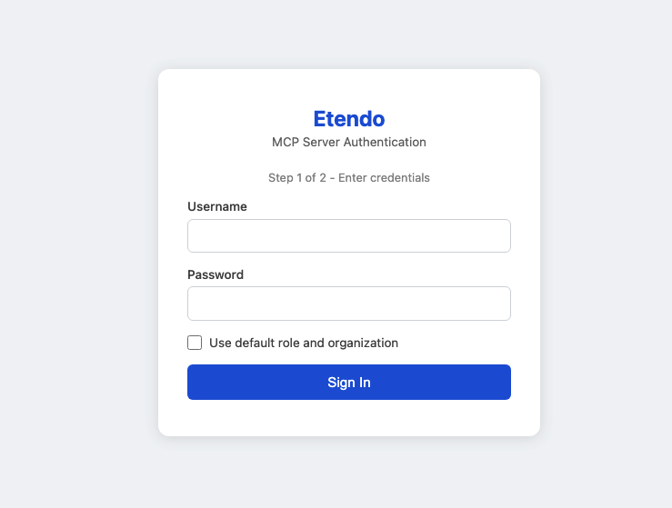
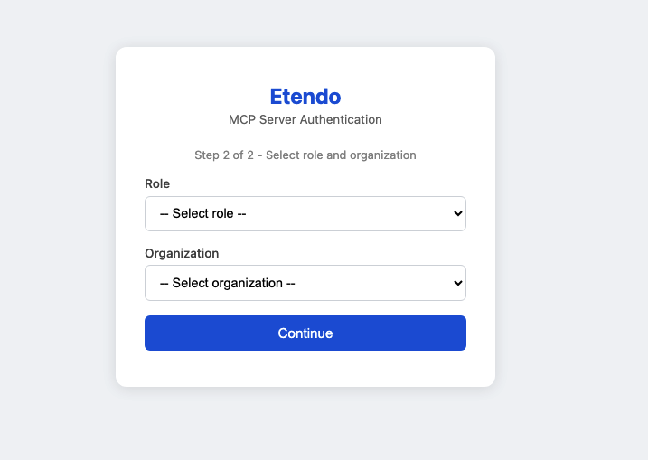

# How to use an Agent as MCP Server

## Overview

!!! example  "IMPORTANT: THIS IS A BETA VERSION"
    It is under active development and may contain **unstable or incomplete features**. Use it **at your own risk**. The module behavior may change without notice. Do not use it in production environments.

This guide shows you how to connect to Etendo Copilot agents using the [Model Context Protocol (MCP)](../concepts/model-context-protocol.md). Each agent automatically exposes an MCP server that you can connect to from various MCP-compatible clients like Claude Desktop, VS Code, Gemini CLI, and custom applications.

Each **Etendo Copilot** agent provides an MCP server endpoint that exposes:

- **Tools**: Agent capabilities (API calls, file operations, knowledge search).
- **Prompts**: Pre-configured templates for common tasks.
- **Resources**: Access to documents, configurations, and data.

### Connection Modes

There are two types of communication with the MCP server, both established through the API exposed by each agent:

- **Simple Mode**: Provides access to the agent as an external "black box". The client interacts naturally with the agent, without visibility into its internal configuration, tools, or prompt.  
- **Direct Mode**: Provides direct access to the agent’s prompt and tools. In this mode, the external client behaves as if it were an Etendo agent itself, with access to the same tools, data, and definitions available to the internal agent.

Choose how you want to interact with the agent:

| Mode | Description | Best for |
|------|-------------|----------|
| **Simple** | Chat naturally with the agent | Conversations, questions, general use |
| **Direct** | Execute specific tools directly | Automation, workflows, development |

### Authentication Modes

The MCP configuration dialog now lets you choose how the client authenticates against the agent MCP server:

| Authentication Type | How it works | Best for |
|---------------------|--------------|----------|
| **OAuth 2.1** | Uses a clean MCP URL and lets the client complete authentication through a browser login flow | Clients with native MCP OAuth support |
| **Token in Header** | Sends the Etendo token in an `Authorization` or compatible HTTP header | Clients that support custom headers |
| **Token in URL** | Appends the token as `?token=...` in the MCP endpoint URL | Clients that cannot send custom headers |


### MCP Server Architecture in Etendo Copilot

Each Etendo Copilot agent automatically exposes an MCP server endpoint that provides:

- **Interaction Tools**: Tools that facilitate communication between the agent and the MCP Client, like `ask_agent` for sending questions and receiving answers.
- **Agent Tools**: Functions that the agent can execute.
- **Resources**: Static or dynamic data that can be accessed (documents, configurations, logs, etc.).
- **Prompts**: Pre-configured prompt templates for common tasks.

The MCP server runs alongside the agent and communicates using `HTTP` transport with optional `Server-Sent Events (SSE)` for streaming responses.

When OAuth is enabled, the MCP server also exposes the OAuth discovery and authorization endpoints required by compatible MCP clients. Users authenticate through an Etendo login page, and the client receives the authorization result automatically.

The OAuth login flow includes two possible UI paths:

- **Default role and organization**: The user enters username and password, enables **Use default role and organization**, and completes authentication directly.
- **Manual role and organization selection**: The user enters username and password without enabling the checkbox. If the credentials are valid, the flow continues to a second screen where the user must choose a **Role** and an **Organization** before authentication is completed.

### Agent Types and Connection Modes

Etendo Copilot supports two kinds of agents, each with two connection modes. The agent type defines the role, and the mode defines how you interact with it.

| Agent Type        | Simple Mode (Talk)                               | Direct Mode (Control)                                              |
|-------------------|--------------------------------------------------|--------------------------------------------------------------------|
| **Multi-Model**   | Use `ask_agent` to chat naturally                | Access all tools directly + `get_agent_prompt` for setup           |
| **LangGraph**     | Use `ask_agent_supervisor` to talk to supervisor | Use `ask_agent_<MemberName>` for team members + `get_agent_prompt` |


**Multi-Model Agent**: A single agent that combines multiple AI models and tools.

- **Simple Mode**: Best for natural conversations. The agent picks the right tools automatically.  
- **Direct Mode**: Best for workflows or integrations. You run tools yourself and can read the agent’s instructions.  

**LangGraph Agent**: A supervisor that manages a team of specialized agents.

- **Simple Mode**: Talk to the supervisor, who delegates tasks to the right team members.  
- **Direct Mode**: Talk directly to individual team members and see how the supervisor organizes them.  

**Choosing the Right Setup**

| Use Case                          | Recommended Setup             |
|-----------------------------------|-------------------------------|
| Conversational chat interface     | Any Agent + Simple Mode       |
| Automated business workflows      | Multi-Model + Direct Mode     |
| Complex, multi-skill analysis     | LangGraph + Simple Mode       |
| Development and debugging         | Any Agent + Direct Mode       |
| API integrations                  | Multi-Model + Direct Mode     |
| Multi-domain problem solving      | LangGraph + Simple Mode       |


## Step-by-Step Guide

###  Get MCP Configuration
:material-menu: `Application` > `Service` > `Copilot` > `Agent`

1.  Open the Agent window in **Etendo**
2.  **Select your agent** and click **"Server MCP Config"** button.
3.  **Configure connection options**:
    
    

    - **Direct Mode**: Check for tool execution, uncheck for conversation.
    - **Authentication Type**: Choose `OAuth 2.1`, `Token in Header`, or `Token in URL`.
    - **MCP-remote compatibility**: Check for better client compatibility.
    - **Custom values**: Optional URL and name overrides. If you set a **Custom URL**, it takes priority over the default URL resolution used by Etendo.

    !!! info "Authentication Type"

        **OAuth 2.1**

        - Generates a clean MCP URL without embedding the token.
        - The MCP client handles authentication and opens a browser login flow when needed.
        - The login UI first requests username and password.
        - If **Use default role and organization** is enabled, authentication finishes immediately after a successful login.
        - If the checkbox is not enabled, the flow continues to a second page where the user selects the role and organization.
        - Recommended when your MCP client supports OAuth 2.1 for MCP servers.

        **Token in Header**

        - Sends the token through the `Authorization` header.
        - This is the default option.
        - Recommended for clients that support custom HTTP headers.

        **Token in URL**

        - Appends the token as `?token=...` in the generated MCP URL.
        - Useful for clients that cannot send custom headers.
        - Use only in trusted environments because the token becomes part of the URL.
    
    !!! info "MCP-remote Compatibility Mode"
    
        **What it does**: Uses the `mcp-remote` library to add compatibility for MCP clients that do not handle Etendo MCP `HTTP` transport directly.
        
        **When to use**: 
        
        - Claude Desktop and similar clients that need a stdio-compatible bridge.
        - IDE extensions or tools with limited native `HTTP` MCP support.
        
        **Configuration difference**:

        - **Standard mode**: Direct MCP HTTP configuration.
        - **Compatibility mode**: Uses `npx mcp-remote` as a wrapper around the generated MCP endpoint.
    

4.  **Copy the generated configuration** from the popup

    

    !!! warning "Localhost Development Warning"
        
        If you see this message: *"The MCP URL begins with `http://localhost`, which only works in development environments"*
        
        - **What it means**: The generated MCP endpoint uses `localhost`, so only clients running on the same machine can connect to it.
        - **When you will notice it most**: This warning is especially relevant for **Token in Header** and **Token in URL** configurations, because those modes generate a concrete endpoint that the client must call directly.
        - **Where it is configured**: `context.url.copilot.mcp` is read from `gradle.properties`, not from the web server or Apache configuration.
        - **What `context.url.copilot.mcp` does**: This property defines the public base URL that Etendo uses when generating MCP configuration snippets and OAuth metadata.
        - **Resolution order**: Etendo first uses the **Custom URL** field from the popup if it was provided, then `context.url.copilot.mcp` from `gradle.properties`, and finally falls back to `http://localhost:<copilot.port.mcp>` where the default MCP port is `5006`.
        - **For production or remote clients**: Configure `context.url.copilot.mcp` in `gradle.properties` with the externally reachable Copilot URL, for example `https://your-domain.example.com:5006`.
        - **For one-off tests**: You can also use the **Custom URL** field in the dialog to override the generated base URL without changing the global property.
        - **Example**: If Copilot is exposed at `https://copilot.example.com`, the generated endpoint should look like `https://copilot.example.com/AGENT_ID/mcp` instead of `http://localhost:5006/AGENT_ID/mcp`.

        Example `gradle.properties` entry:

        ```properties
        context.url.copilot.mcp=https://your-external-host:5006
        ```

    !!! info "Example Configurations" 

                Choose the example that matches the selected **Authentication Type**.

                **VS Code Configuration with OAuth 2.1**

                Add to your VS Code settings:

                ```json
                "mcp": {
                    "servers": {
                        "etendoAgent": {
                            "type": "http",
                            "url": "http://localhost:5006/AGENT_ID/mcp"
                        }
                    }
                }
                ```

                This configuration uses a clean URL. If the client supports MCP OAuth, it will open the browser login flow automatically.

                **VS Code Configuration with Token in Header**

                Add to your VS Code settings:

                ```json
                "mcp": {
                    "servers": {
                        "etendoAgent": {
                            "type": "http",
                            "url": "http://localhost:5006/AGENT_ID/mcp",
                            "headers": {
                                "etendo-token": "Bearer your-token-here"
                            }
                        }
                    }
                }
                ```

                **VS Code Configuration with Token in URL**

                ```json
                "mcp": {
                    "servers": {
                        "etendoAgent": {
                            "type": "http",
                            "url": "http://localhost:5006/AGENT_ID/mcp?token=your-token-here"
                        }
                    }
                }
                ```

                **Gemini CLI Configuration with Token in Header**

                Create or update your Gemini CLI config:

                ```json
                {
                    "mcpServers": {
                        "etendoAgent": {
                            "type": "http",
                            "httpUrl": "http://localhost:5006/AGENT_ID/mcp/",
                            "headers": {
                                "etendo-token": "Bearer your-token-here"
                            }
                        }
                    }
                }
                ```

                **Gemini CLI Configuration with Token in URL**

                ```json
                {
                    "mcpServers": {
                        "etendoAgent": {
                            "type": "http",
                            "httpUrl": "http://localhost:5006/AGENT_ID/mcp?token=your-token-here"
                        }
                    }
                }
                ```

                **Claude Desktop Configuration with MCP-remote and OAuth 2.1**

                Add to your Claude Desktop config:

                ```json
                {
                    "mcpServers": {
                        "etendoAgent": {
                            "command": "npx",
                            "args": ["mcp-remote", "http://localhost:5006/AGENT_ID/mcp"]
                        }
                    }
                }
                ```

                **Claude Desktop Configuration with MCP-remote and Token in Header**

                Add to your Claude Desktop config:

                ```json
                {
                    "mcpServers": {
                        "etendoAgent": {
                            "command": "npx",
                            "args": ["mcp-remote", "http://localhost:5006/AGENT_ID/mcp", "--header", "Authorization: Bearer your-token-here"]
                        }
                    }
                }
                ```

                **Claude Desktop Configuration with MCP-remote and Token in URL**

                ```json
                {
                    "mcpServers": {
                        "etendoAgent": {
                            "command": "npx",
                            "args": ["mcp-remote", "http://localhost:5006/AGENT_ID/mcp?token=your-token-here"]
                        }
                    }
                }
                ```

### Test the Connection

1. **Start your MCP client** [VS Code](https://code.visualstudio.com/docs/copilot/customization/mcp-servers){target="_blank"}, [Gemini CLI](https://google-gemini.github.io/gemini-cli/docs/tools/mcp-server){target="_blank"}, [Claude Desktop](https://modelcontextprotocol.io/docs/develop/connect-local-servers){target="_blank"}, etc.

2. **Confirm the server is available**:

    ```
    Verify that the MCP server connects successfully and the client can list the available tools
    ```

3. **Try agent interaction**:
   
    **Simple Mode**:
    ```
    Ask the agent: "What can you help me with?"
    ```

    **Direct Mode**:
    ```
    Use get_agent_prompt first to see agent capabilities
    Execute specific tools directly
    ```

4. **If you selected OAuth 2.1**:

    ```
    Complete the browser login flow when the client requests authentication
    ```

    The OAuth login flow works as follows:

    1. The MCP client opens the Etendo login page in the browser.
    2. The user enters username and password.

        

    3. If **Use default role and organization** is enabled, Etendo completes the authentication immediately.
    4. If the checkbox is not enabled, and the credentials are valid, Etendo opens a second page.
    5. On the second page, the user selects a **Role** and an **Organization**.

        

    6. After the selection is confirmed, the OAuth flow completes and the MCP client continues the connection.

## Connection Modes Explained

### Simple Mode
- **URL**: `http://HOST:PORT/AGENT_ID/mcp`
- **Tools**: `ask_agent` and, depending on the generated configuration, an agent-specific `ask_agent_<AgentName>` alias.
- **Use**: Natural conversation with the agent.

### Direct Mode  
- **URL**: `http://HOST:PORT/AGENT_ID/direct/mcp`
- **Tools**: Agent tools exposed directly + `get_agent_prompt`.
- **Use**: Direct tool execution and system access.

!!! tip
    In **Direct Mode**, call `get_agent_prompt` before using other tools. The prompt explains the agent purpose, capabilities, and the expected usage of the exposed tools.

## Use Cases

### Simple Chat Interface

- **User**: *"What can you help me with?"*
- **Agent**: *"I can help you with Etendo operations, data analysis, reporting, and more. What would you like to know?"*
- **User**: *"Show me recent sales data"*
- **Agent**: 
    
    [Uses internal tools] 
    
    *"Here's the recent sales data: [displays results]"*

### Direct Tool Execution

- **Developer**: 

    *Uses `get_agent_prompt` tool*

- **Result**: "I am an Etendo sales assistant with access to customer data and reporting tools..."*

- **Developer**:
    
    *Uses `search_customers` tool directly*

    *Parameters: {"query": "enterprise clients", "limit": 10}*

- **Result**: *Returns list of enterprise customers without conversational wrapper*

## Troubleshooting

### Common Issues

**Connection fails:**

- Verify the selected authentication type matches your client capabilities.
- If you use `Token in Header`, verify the Etendo token is valid.
- Check the agent ID is correct.
- Ensure Copilot service is running.

**OAuth login does not start:**

- Confirm your MCP client supports OAuth 2.1 for MCP servers.
- Verify the generated URL does not include a token if you selected `OAuth 2.1`.
- Make sure the browser can reach the Etendo login page exposed by the MCP server.

**OAuth login stops after credentials:**

- If **Use default role and organization** is disabled, expect a second page asking for **Role** and **Organization**.
- If that second page does not appear, verify the user has valid role and organization assignments in Etendo.
- If **Use default role and organization** is enabled but authentication still does not continue, verify the user has a valid default role and organization configured.

**Client cannot send headers:**

- Use `Token in URL` instead of `Token in Header`.
- If needed, enable **MCP-remote compatibility mode** and regenerate the configuration.

**Tools not available:**

- Check user permissions in Etendo.
- Verify agent configuration includes required tools.
- Confirm connection mode matches your needs.
- In Direct Mode, call `get_agent_prompt` first to understand how the toolset should be used.

**Authentication errors:**

- Regenerate the SWS token via `/sws/login` if you are using token-based authentication.
- Check token format includes `Bearer ` when sending it in a header.
- Verify user has access to the selected agent.
- If you use `Token in URL`, confirm the generated endpoint still includes the `token` query parameter.

!!! warning "Security Note"
    Always use HTTPS in production environments. Keep your SWS tokens secure and never expose them in client-side code or public repositories. Prefer **OAuth 2.1** or **Token in Header** over **Token in URL** whenever the client supports them.

---
This work is licensed under :material-creative-commons: :fontawesome-brands-creative-commons-by: :fontawesome-brands-creative-commons-sa: [ CC BY-SA 2.5 ES](https://creativecommons.org/licenses/by-sa/2.5/es/){target="_blank"} by [Futit Services S.L.](https://etendo.software){target="_blank"}.