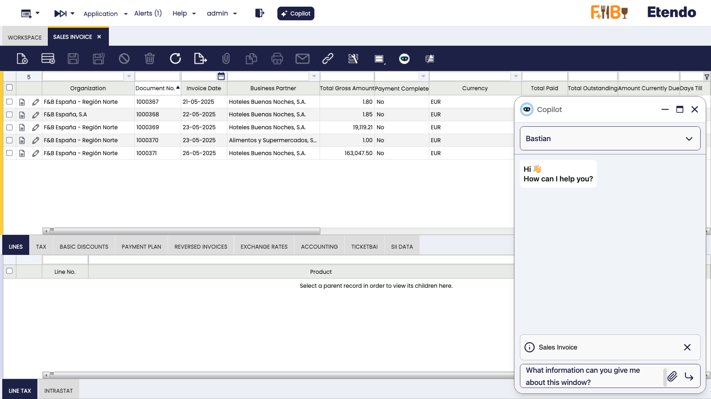

# Using Etendo Copilot Context Features

## Overview
This guide explains how to use Etendo Copilot's context-aware features to enhance user interactions in Etendo Classic. It covers how Copilot captures window, record, and user context, and how to configure default prompts for personalized responses.

## Activating Copilot

1. Open any window in the Etendo (e.g., Sales Order, Inventory).
2. Locate the **Copilot Button** in the toolbar at the top of the window.
3. Click the button to launch the Copilot interface.
4. Ask a question or provide an instruction (e.g., "What information can you give me about this window?").

!!! info
    The Copilot button is available across all Etendo windows, making it easy to access assistance wherever you are.
    


## Understanding Context in Copilot

Copilot enhances its responses by automatically capturing context based on your actions in Etendo Classic. It supports three key context types:

### 1. Active Window Context

Copilot identifies the currently active window, such as "Purchase Order" or "Product List," and includes this information in its responses. For example:

- **Action**: Open the "Sales Order" window and activate Copilot.
- **Question**: "What information can you give me about this window?"
- **Response**: Copilot provides details related to the "Sales Order" window.

### 2. Selected Record Context

When you select a record in a list or grid, Copilot captures its details (e.g., ID, name, or other relevant fields) and uses this data to assist you. For example:

- **Action**: Select a product from the "Product" grid and activate Copilot.
- **Question**: "What info can you give me about this record?"
- **Response**: Copilot returns information specific to the selected product.

### 3. Edited Record Context

If you're editing a record in a form, Copilot detects the form’s edit mode and captures the current input values, including unsaved changes. For example:

- **Action**: Edit a "Business Partner" record, change the name, and activate Copilot.
- **Question**: "What info can you give me about this record?"
- **Response**: Copilot includes the updated name and other form fieldwork.

!!! tip
    Ensure the correct window or record is active before asking Copilot a question to get the most accurate response.


## Setting a Default Prompt
:material-menu: `Application` > `General Setup` > `Application` > `Preference`

You can customize Copilot by setting a default prompt that tailors its behavior to your needs. This is done in the Etendo Classic Preferences section.

1. Navigate to the **Preferences** section in the Etendo Classic.
2. Create a new preference for **Copilot Default Context Prompt**
3. Enter a prompt using placeholders like `@ORG_NAME@` or `@USERNAME@`. For example:

``` title="Deafault Prompt"
You are working in the organization '@ORG_NAME@' (ID: @AD_ORG_ID@) under the client '@CLIENT_NAME@' (ID: @AD_CLIENT_ID@). You are logged in as @USERNAME@ (User ID: @AD_USER_ID@) with the role '@ROLE_NAME@' (Role ID: @AD_ROLE_ID@). The current warehouse in use is '@WAREHOUSE_NAME@' (Warehouse ID: @M_WAREHOUSE_ID@).
```

**Available Placeholders**

| Placeholder      | Replace with value                 |
| ---------------- | ---------------------------------- |
| @AD_CLIENT_ID@   | User client ID                     |
| @CLIENT_NAME@    | User client name                   |
| @AD_ORG_ID@      | Current organization ID selected   |
| @ORG_NAME@       | Current organization name selected |
| @AD_USER_ID@     | Current user id                    |
| @USERNAME@       | Current username                   |
| @AD_ROLE_ID@     | Selected role ID                   |
| @ROLE_NAME@      | Selected role name                 |
| @M_WAREHOUSE_ID@ | Selected warehouse ID              |
| @WAREHOUSE_NAME@ | Selected warehouse name            |

!!! info 
    Your custom prompt persists across sessions, ensuring a consistent experience.

## Examples of Use

Here are practical examples based on real-world scenarios:

### 1. Checking Window Details

- **Scenario**: You’re in the "Purchase Order" window.
- **Steps**: Click the Copilot button and ask, "What information can you give me about this window?"
- **Result**: Copilot describes the "Purchase Order" window’s purpose and key fields.

### 2. Analyzing a Selected Record

- **Scenario**: You select a customer record in the "Business Partner" grid.
- **Steps**: Click the Copilot button and ask, "What info can you give me about this record?"
- **Result**: Copilot provides the customer’s ID, name, and other details.

### 3. Reviewing an Edited Record

- **Scenario**: You’re editing a product’s price in a form.
- **Steps**: Click the Copilot button and ask, "What info can you give me about this record?"
- **Result**: Copilot reflects the new price and other edited fields.

### 4. Confirming User Context

- **Scenario**: You want to verify your configured prompt.
- **Steps**: Click the Copilot button and ask, "What is my context?"
- **Result**: Copilot returns your organization, role, and other details from the default prompt.

---
This work is licensed under :material-creative-commons: :fontawesome-brands-creative-commons-by: :fontawesome-brands-creative-commons-sa: [ CC BY-SA 2.5 ES](https://creativecommons.org/licenses/by-sa/2.5/es/){target="_blank"} by [Futit Services S.L.](https://etendo.software){target="_blank"}.