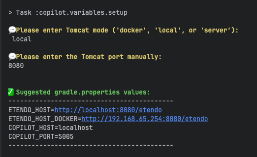
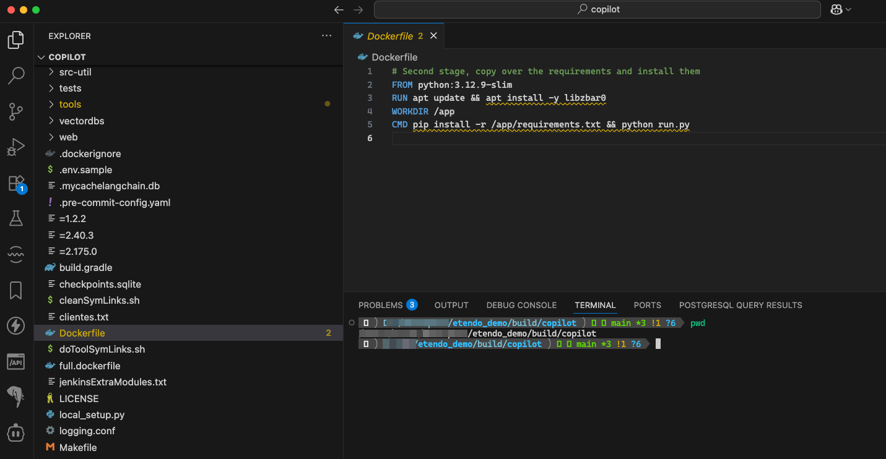
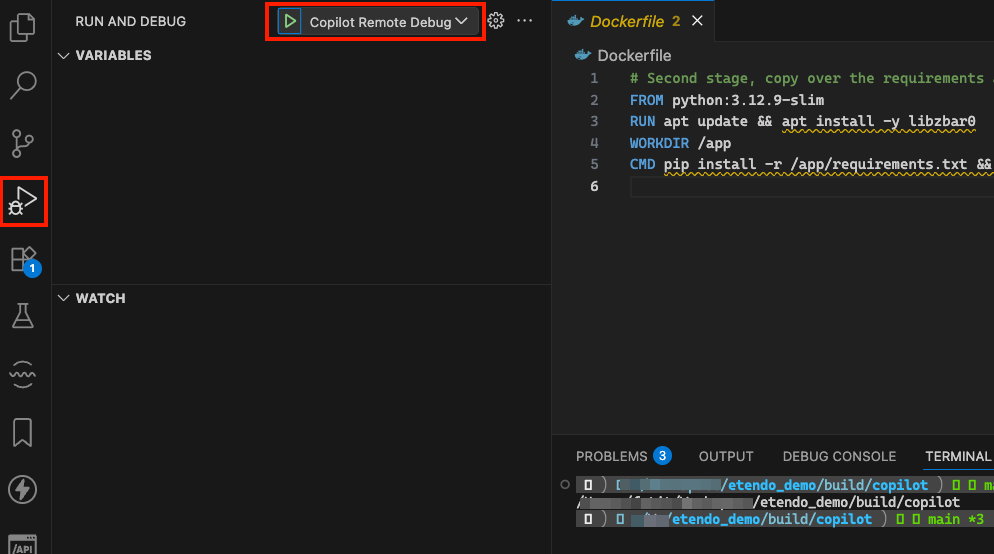
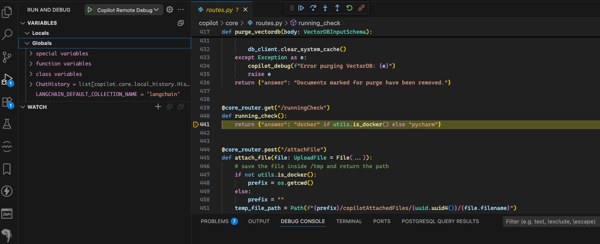

## Overview

This guide provides detailed instructions on how to get started with Etendo Copilot, an API that allows interaction with a bot capable of selecting the appropriate tools to respond to user queries. It includes the necessary requirements, instructions for adding dependencies, environment variable configurations, and steps to run Copilot on an Etendo project. Additionally, it covers optional configurations to customize Copilot's behavior and provides links to detailed installation guides for required software.

## Requirements

1. Install Etendo. For this, follow the [Etendo Installation Guide](../../getting-started/installation.md){target="_blank"}.
2. This project depends on the following tools:
    - [Docker](https://docs.docker.com/get-docker/){target="_blank"}: version `26.0.0` or higher.
    - [Docker Compose](https://docs.docker.com/compose/install/){target="_blank"}: version `2.26.0` or higher.
    - [Python 3](https://www.python.org/downloads/){target="_blank"} version `3.10` or higher.

!!!info
    The [Docker Management](../../developer-guide/etendo-classic/bundles/platform/docker-management.md) module, included as a dependency allows for the distribution of the infrastructure within Etendo modules, which include Docker containers for each service.

## Installation 
Etendo Copilot is distributed within the Copilot Extensions bundle, which in addition to including the Copilot Core functionality and infrastructure, includes default assistants and tools that can be used directly or compose their use in new agents.  

!!! info
    To be able to include this functionality, the Copilot Extensions Bundle must be installed. To do that, follow the instructions from the marketplace: [Copilot Extensions Bundle](https://marketplace.etendo.cloud/#/product-details?module=82C5DA1B57884611ABA8F025619D4C05){target="_blank"}. For more information about the available versions, core compatibility and new features, visit [Copilot Extensions - Release notes](../../../whats-new/release-notes/etendo-copilot/bundles/release-notes.md).


## Running Etendo Copilot

The simplest configuration we are going to follow as an example is to mount Copilot Dockerized and Tomcat running as a local service. Other configurations are detailed in the section, [Advanced Configurations](#advanced-configurations).

In addition, there are other **optional** variables to configure certain aspects of the copilot. If not specified, default values are used.
### Configuration Variables (`gradle.properties`)

Add the following environment variables to your `gradle.properties` file:

``` groovy title="gradle.properties"
OPENAI_API_KEY= ****
ANTHROPIC_API_KEY= ****
DEEPSEEK_API_KEY= ****
ETENDO_HOST=https://<Etendo URL>/<Context Path>
ETENDO_HOST_DOCKER=http://host.docker.internal:<Tomcat Port>/<Context Path>
COPILOT_HOST=<Copilot URL>
COPILOT_PORT=<Copilot Port>

docker_com.etendoerp.copilot=true
```

| **Environment Variable**         | **Default**     | **Required**            | **Info** |
| -------------------------------- | --------------- | ------------------------| -------- |
| `OPENAI_API_KEY`                 | `****`          | ✅ If using OpenAI       | API key for [OpenAI](https://platform.openai.com/account/api-keys). Contact Etendo or use your own. |
| `ANTHROPIC_API_KEY`              | `****`          | ✅ If using Anthropic    | API key for [Anthropic](https://docs.anthropic.com/en/api/getting-started). Only needed if using Anthropic models. |
| `DEEPSEEK_API_KEY`               | `****`          | ✅ If using DeepSeek     | API key for [DeepSeek](https://deepseek.ai/). Only needed if using DeepSeek models. |
| `ETENDO_HOST`                    | *(none)*        | ✅                       | URL where Copilot sends requests to communicate with the Etendo system. |
| `ETENDO_HOST_DOCKER`             | *(none)*        | ✅                       | Used when Copilot runs in Docker and Etendo is not accessible from a domain. |
| `COPILOT_HOST`                   | `localhost`     | ✅                       | Host for Copilot. |
| `COPILOT_PORT`                   | `5005`          | ✅                       | Port used by Copilot. |
| `docker_com.etendoerp.copilot`   | `true`          | ✅                       | Enables Etendo Copilot container. |
| `COPILOT_DEBUG`                  | `false`         | ❌ (Optional)            | Enables verbose Copilot logs in the console. |
| `COPILOT_MAX_ITERATIONS`         | `100`           | ❌ (Optional)            | Max number of agent interaction steps. |
| `COPILOT_EXECUTION_TIMEOUT`      | `0`             | ❌ (Optional)            | Timeout in seconds for agent execution (`0` = unlimited). |
| `COPILOT_STREAM_DEBUG`           | `false`         | ❌ (Optional)            | Enables real-time response log in Copilot pop-up. |
| `CONFIGURED_TOOLS_FILENAME`      | `tools_config.json` | ❌ (Optional)        | File that defines which tools are enabled. |
| `DEPENDENCIES_TOOLS_FILENAME`    | `tools_deps.toml`   | ❌ (Optional)        | File that defines dependencies between tools. |
| `COPILOT_PULL_IMAGE`             | `true`          | ❌ (Optional)            | If true, pulls Docker image from Docker Hub; if false, uses local image. |
| `COPILOT_IMAGE_TAG`              | `master`        | ❌ (Optional)            | Docker image tag to use. |
| `COPILOT_PORT_DEBUG`             | `5100`          | ❌ (Optional)            | Port for debugging Copilot (if enabled). |

!!! info
    From Etendo Classic version [24.4.0](../../whats-new/release-notes/etendo-classic/release-notes.md), the variables `ETENDO_HOST`, `COPILOT_HOST`, and `ETENDO_HOST_DOCKER` are required for communication. If they are defined, they override automatically generated values.


!!! warning
    In versions before 3.3.0, if you suffers from errors related to missing poetry, you can use the legacy docker image, with the tag `poetry`. To do that, you need to add the following variable to your `gradle.properties` file:
    ```groovy title="gradle.properties"
    COPILOT_IMAGE_TAG=poetry
    ```

    This will use the legacy docker image with poetry installed, instead of the new one with uv as the package manager installed.

1. Add to `gradle.properties` the variable `docker_com.etendoerp.copilot=true` to enable the Copilot Docker container. This variable is required to run the Copilot container.

2. The `gradle.properties` variables `ETENDO_HOST`,`ETENDO_HOST_DOCKER`, `COPILOT_HOST`, and `COPILOT_PORT` are used to configure the connection between Copilot and Etendo, so depending on your environment, you may need to adjust them. Etendo Copilot provides a gradle task to automatically set these variables based on your Etendo instance configuration. To do this, execute the following command in the terminal:

    ``` bash title="Terminal"
    ./gradlew copilot.variables.setup  --console=plain
    ```
    
    
    This command asks for charecteristics of your Etendo instance. And based on your answers, it will print the values. Copy the printed values and paste them into your `gradle.properties` file, replacing the existing values for `ETENDO_HOST`, `ETENDO_HOST_DOCKER`, `COPILOT_HOST`, and `COPILOT_PORT`.

3. The gradle.properties file should now look like this:

    ```groovy title="gradle.properties"
    docker_com.etendoerp.copilot=true
    OPENAI_API_KEY= ****. // If you are using OpenAI
    ANTHROPIC_API_KEY= **** // If you are using Anthropic
    DEEPSEEK_API_KEY= **** // If you are using DeepSeek
    ETENDO_HOST=http://localhost:8080/etendo
    ETENDO_HOST_DOCKER=http://host.docker.internal:8080/etendo
    COPILOT_HOST=copilot
    COPILOT_PORT=5005

    ```
4.  Once the Copilot Extensions Bundle dependency was added and the variables configurated, in the terminal execute the following command to apply the changes:

    ``` bash title="Terminal"
    ./gradlew setup
    ```

    Then, the copilot container needs to be created/recreated:
    ``` bash title="Terminal"
    ./gradlew resources.up
    ```

    And then recompile the environment, to ensure that the changes are applied and deployed correctly:

    ``` bash title="Terminal"
    ./gradlew update.database compile.complete smartbuild --info
    ```
    
5. To start the copilot Docker image, execute:

    ``` bash title="Terminal"
    ./gradlew resources.up
    ```

    To stop the Copilot container you can run: 
    ``` bash title="Terminal"
    ./gradlew resources.stop
    ```

    Everytime a new tool is added or the environment variables change, it's necessary to delete and create the Copilot container again. Execute the following command to delete the container: 
    ``` bash title="Terminal"
    ./gradlew resources.down
    ```

    !!! warning 
        Be aware that resources.stop and resources.down will also affect other services configured in the etendo container.

4. Try Copilot in your Etendo instance. To configure an agent to use Etendo Copilot, follow the [Copilot Setup and Usage](../../user-guide/etendo-copilot/setup-and-usage.md){target="_blank"} guide.


## Advanced Configurations 

=== "Copilot & Tomcat Dockerized"

    The `com.etendoerp.tomcat` module enables the Dockerization of Tomcat within Etendo. This module modifies Gradle tasks to automatically deploy the `WAR` file into the container when executing the `smartbuild` task.
    Follow the [Dockerized Tomcat Service](../../developer-guide/etendo-classic/bundles/platform/dockerized-tomcat-service.md) documentation to learn how to configure it.

    When using both services in docker, the environment variables should look like this:

    ```groovy title="gradle.properties"
    OPENAI_API_KEY= ****
    ETENDO_HOST=http://tomcat:<Docker Tomcat Port>/<Context Path>
    ETENDO_HOST_DOCKER=http://host.docker.internal:<Docker Tomcat Port>/<Context Path>
    COPILOT_HOST=copilot
    COPILOT_PORT=<Docker Copilot Port>

    docker_com.etendoerp.copilot=true
    docker_com.etendoerp.tomcat=true
    docker_com.etendoerp.tomcat_port=<Docker Tomcat Port>
    ```

=== "Copilot locally (for developing copilot only)"

    Requirements:
    
    - [Python](https://www.python.org/downloads/){target="_blank"} 3.10 or 3.11
    
    - [uv](https://docs.astral.sh/uv/){target="_blank"}

    We recommend using PyCharm to run copilot locally. Download and install here [PyCharm Community Edition](https://www.jetbrains.com/pycharm/download/){target="_blank"}

    1. Open PyCharm, search for the copilot module and open it.
    


    2. Open the `Run.py` file, then add a new interpreter.
    
    


    3. Add a new configuration file and select Python
    
    


    4. Select the interpreter created before. In the script field, select the `run.py` file, and in the .env field, select the `gradle.properties` file.
    
    
    
    5. Once done, open the PyCharm terminal and execute the following commands:
    ``` bash title="terminal"
    source venv/bin/activate
    uv sync
    ```
    !!! warning
        In versions before 3.3.0, the package manager used by Copilot was `poetry`, so the command to run is `poetry install` instead of `uv sync`.
    6. Execute `Run.py` from PyCharm
    


### How to Debug Etendo Copilot

There are two main ways to debug Etendo Copilot, depending on your setup.

- **Using PyCharm (Local Mode)**  
    
    If you are running Copilot locally, you can use PyCharm’s built-in debugger. Simply set breakpoints in the code and run the debugger to inspect the execution flow step by step.

- **Using VSCode (Dockerized Copilot)**
    
    If Copilot is running in a Docker container, you can debug it with VSCode using the provided `launch.json` configuration:  

    1. Make sure **VSCode** and the **Python extension** are installed and enabled.  
    2. Open the `build/copilot` directory inside the *Etendo project*.
        
        !!! note Important
            This is the directory containing the tools’ code, which is required for the debugger to locate the source files.
        
          
    3. Go to the **Run and Debug** section in VSCode. You will see a configuration named **Copilot Remote Debug**. Click the green play button to start debugging.
        
          
    4. Once the debugger is running, set breakpoints as needed and execute Copilot. The debugger will pause at your breakpoints, allowing you to inspect variables and analyze the execution flow.
        
        
    
---
This work is licensed under :material-creative-commons: :fontawesome-brands-creative-commons-by: :fontawesome-brands-creative-commons-sa: [ CC BY-SA 2.5 ES](https://creativecommons.org/licenses/by-sa/2.5/es/){target="_blank"} by [Futit Services S.L.](https://etendo.software){target="_blank"}.