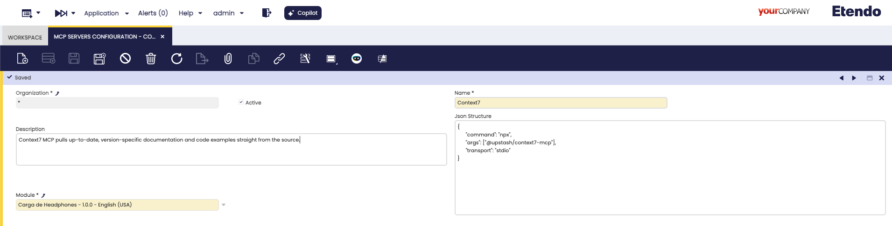
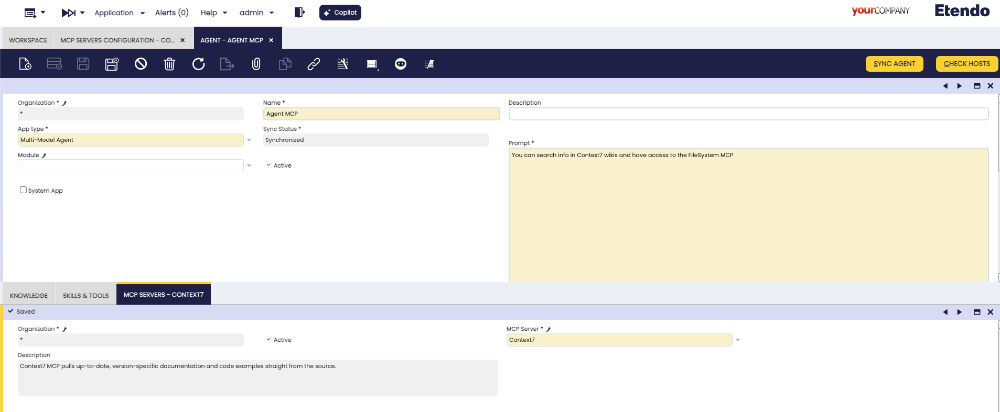

# How to Create and Configure MCP Servers

## Overview

This guide provides step-by-step instructions to help you create and configure **Model Context Protocol (MCP) Servers** for **Etendo Copilot**. 

MCP Servers extend agent functionality by providing external tools and resources that can be dynamically loaded and used during agent interactions.

## What are MCP Servers?

**Model Context Protocol (MCP)** is a standard protocol that allows AI agents to securely connect to external data sources and tools. MCP Servers act as bridges between your Etendo agents and external systems.

## Step-by-Step Guide

### 1. Create MCP Server Configuration

1. **Open the MCP window** in **Etendo Classic** (System Administrator role):
   - Navigate to **Service** → **Copilot** → **MCP Servers Configuration**

2. **Create a new record** with the following information:

   

   - **Name**: A descriptive name for your MCP server
   - **Description**: A brief description of what the MCP server provides
   - **JSON Structure**: The configuration JSON for the MCP server

### 2. Configure JSON Structure

The **JSON Structure** field contains the MCP server configuration. Here's an example for a filesystem MCP server:

```json
{
      "command": "npx",
      "args": ["@upstash/context7-mcp"],
      "transport": "stdio"
}
```

**Important**: The system automatically validates the JSON structure when you save the MCP configuration. If the JSON is invalid, you will receive an error message and the record will not be saved until the JSON is corrected.

### 3. Link MCP Server to Agent

1. **Open the Agent window** in **Etendo Classic**:
   - Navigate to **Server** → **Copilot** → **Agent**

2. **Select an existing agent** or create a new one

3. **Navigate to the MCP tab** within the Agent window:

   

4. **Create a new record** in the MCP tab:
   - **MCP Server**: Select the MCP server you created in step 1

### 4. Test MCP Integration

1. **Start a conversation** with your configured agent

2. **Request actions** that would utilize MCP tools:
   ```
   "Search in context7, how to create an event handler in Etendo?"
   ```

3. **Observe agent behavior**:
   - The agent will automatically detect available MCP tools
   - MCP tools will be invoked when appropriate for the user's request
   - Tool execution results will be integrated into the agent's response

By default, the transport parameter is set to 'stdio' if not set.
Currently, only MCP Servers that use NPX or HTTP work in Etendo since it's a beta functionality.

## Example: Filesystem MCP Server

Here's a complete example of setting up a filesystem MCP server:

### MCP Server Configuration

**Name**: `Filesystem MCP Server`

**Description**: `Node.js server implementing Model Context Protocol (MCP) for filesystem operations.`

**JSON Structure**:
```json
{
  "command": "npx",
  "args": ["@modelcontextprotocol/server-filesystem", "/tmp/mcp-test"],
  "transport": "stdio"
}
```

### Agent Integration

1. Link the filesystem MCP server to your agent
2. Sync the agent configuration
3. Test with filesystem operations:

**User**: *"What files are in the working directory?"*

**Agent**: *"I'll check the files in the directory for you."* 
[Invokes filesystem MCP tool]
*"Here are the files I found: config.txt, data.json, readme.md"*

**User**: *"Can you read the contents of config.txt?"*

**Agent**: [Invokes filesystem read tool] 
*"Here's the content of config.txt: [file contents]"*

## Conclusion

MCP Servers provide powerful extensibility for Etendo agents, allowing dynamic integration with external systems and tools. By following this guide, you can:

- Configure MCP servers for various use cases
- Integrate MCP functionality into your agents with automatic JSON validation
- Provide enhanced capabilities to end users

The flexibility of MCP allows for easy customization and extension of agent capabilities without requiring code changes to the core Copilot system.

