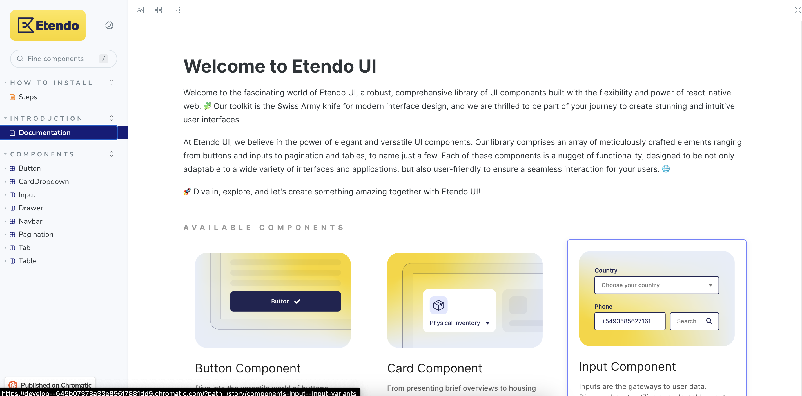

# Subapplications Structure in Etendo Mobile

## Overview
This page provides a comprehensive guide to the structure of subapplications in Etendo Mobile. It explains key concepts such as the `App.tsx` file, which serves as the main entry point for subapplications, and details how parameters from Etendo Mobile are utilized for initialization. Additionally, the guide covers language management, navigation between screens using the navigation stack, and the use of the Etendo UI Library for consistent design and functionality across subapps. These elements form the foundation for developing dynamic and well-integrated subapplications within Etendo Mobile.

## App File
In `App.tsx`, it is the main file located in the root of the subapplication. In this file, we will define the routes and the components that will be rendered in each route. In addition, this file is responsible for the initialization of the subapplication and gets the params from Etendo Mobile.


### Params from Etendo Mobile
Etendo Mobile _sends_ params to the subapplication and all of them are ready to use, they are:

!!! abstract "Params"
    - _ _id_: ID of the subapplication
    - _url_: the environment URL(setted in setting's Etendo Mobile)
    - _contextPathUrl:  the environment context path (setted in setting's Etendo Mobile)
    - _navigationContainer_: an instance of the navigation container of Etendo Mobile
    - _token_: Token
    - _language_: Language
    - _dataUser_: all data related to the user. It has a typed interface that can be found in the file `src/interfaces/index.ts`
    - _isDev_: boolean that identifies whether the application is configured in development (true) or production (false) mode.
    - _Camera_: a component previously integrated into Etendo Mobile has now been seamlessly transferred to the subapps. This particular component includes a remarkable QR code scanning capability, enhancing the overall functionality of the subapps.
    - _sharedFiles_: IFile array, if a file is shared to Etendo Mobile from an external application, sharing and selecting a sub-application will add the file to the file array of the corresponding sub-application.


### Language
The language is a string that serves as a representation of the user's selected language. This language setting is configurable within the Etendo Mobile application's settings and plays a crucial role in determining the language in which texts are presented within the subapplication. In this example, we will use the _language_ parameter received as input to initialize the remaining aspects of the application in the `App.tsx` file.

``` typescript title="App.tsx"
  locale.init();
  locale.setCurrentLanguage(locale.formatLanguageUnderscore(language));
```
!!! tip
    All subapps must be developed in English _en-US_ and may include translations such as Spanish _es-ES_.  

As you can see, we use `locale` to set the language of the subapplication. This `locale` is an instance of a custom handler of the language which is based in `i18n` and defined in the path `subapp/src/localization/locale.ts`.

``` typescript title="locale.ts"
const locale: LocaleModule = {
  currentDateLocale: null,

  i18n,
  init() {...}

  t(key, params) {...}

  setCurrentLanguage(input) {...}

};

export default locale;

```

!!! info
    - Translations folder: Translations are organized in the folder `subapp/src/lang`
    - JSON files by language: Each translation file corresponds to a language and locale, following a structure that includes the language code and region. E.g:

    ```
    └── subapp
          └── src
            └── lang
                └── enEN.json
                └── esES.json
    ```

Between the functions of the `locale` handler, some of the most important are:

- `t(key, params)`: this function receives a key (and other optional params) and returns the text translated to the language of the subapplication. This function is based on [i18n](https://github.com/fnando/i18n#readme){target="_blank"} and the keys are defined in `.json` files in `subapp/src/lang`. 

- `setCurrentLanguage(input)`: gets a language as a param and sets this language as default in the subapplication.

The translation definition files can group the information, for example, in the English translations file `/subapp/src/lang/enUS.json` we can group the messages or labels by screens, components or as it is optimal according to the development. For Example

``` json title="enUS.json"
{
  "ScreenOne": {
    "LabelOne": "Label 1 Example",
    "LabelTwo": "Label 2 Example",
  },
  "ScreenTwo": {
    "LabelOne": "Label 1 Example",
    "LabelTwo": "Label 2 Example",
  },

```

Then to use it, use the `local.t` function, E.g:  `locale.t('ScreenOne.LabelOne')`

### Navigation Stack
The navigation stack part of `App.tsx` that allows us to navigate between screens. It is a component provided by  `@react-navigation/stack` in a React Native application. Conceptually, a navigation stack manages the flow between different screens in the app, allowing users to navigate forward and backward between these screens.

**Key Concepts**

1. **Navigation Stack Initialization**:  
    The `createStackNavigator()` function from `@react-navigation/stack` is used to create a navigation stack. This stack manages a sequence of screens, and each screen is treated as a "route" within the stack.

    ```typescript
    const Stack = createStackNavigator();
    ```

2. **Screen Definitions:** Each screen in the app is defined using the `Stack.Screen` component. The `name` prop specifies the unique identifier of the screen, and the component associated with the screen is defined within the children or passed as a function using render props (`{props => <Component {...props} />}`).
    
    Example of screen definitions:

    ``` typescript
    <Stack.Screen
    name="Home"
    options={{ headerShown: false }}
    initialParams={{ dataUser }}>
    {props => <Home {...props} navigationContainer={navigationContainer} />}
    </Stack.Screen>   
    ```

3. **Initial Route:** The `initialRouteName` prop in `Stack.Navigator` specifies which screen will be loaded first when the app starts. In the following example case, the Home screen is defined as the initial route:

    ```typescript
    <Stack.Navigator initialRouteName="Home">
    ```

### Etendo UI Library
Etendo UI Library is a library of UI components following the style and design of Etendo, that should be used throughout the subapplication development. This library is based on _React Native Elements_ and it is available on [NPM - Etendo UI Library ](https://www.npmjs.com/package/etendo-ui-library){target="_blank"}. You can use it in all of your subapplications. In this library, we can find components like:  Button, Input, Navbar, Cards, Icons, etc.

!!! info 
    For more information, visit [Etendo UI Library - Storybook](https://main--65785998e8389d9993e8ec4c.chromatic.com){target="_blank"} place where you can see all the components of the library. Also, you can see the code of each component and how to use it.

    