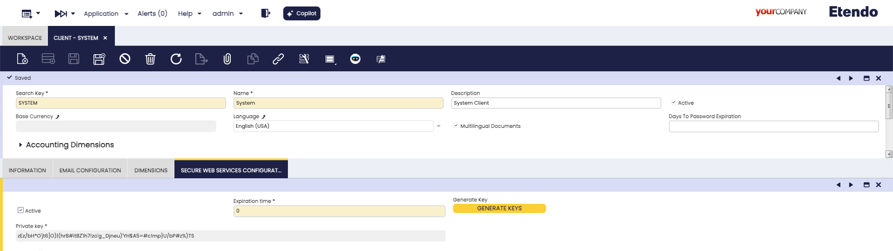

# Developer Guide - Getting Started - Etendo Mobile

## Overview

*Etendo Mobile* is a subapplication development platform that includes the possibility to log in to an *Etendo Classic* server and configure the available dynamic subapplications there according to role. 

A schematic of the infrastructure is shown here:

In this page we will first explain the step-by-step to install and configure for the first time sub-applications on a client and then what are the requirements to create a sub-application and the tools needed to develop a new sub-app.

## Initial Setup

1. ### Client Access Token
    :material-menu: `Application` > `General Setup` > `Client` > `Client`

    It is necessary to configure the encryption token for authentication. This token is required for the mobile app to start a session.

    1. Access Etendo Classic as a `System Administrator`.
    2. Navigate to `Client` > `Secure Web Service Configuration` tab.
    3. Click the **Generate Key** button to create a token. The expiration time is measured in minutes, if set to 0 the token does not expire.
    

    !!! info
        This token doesn’t require any action; it just needs to be generated for the authentication process to work properly.

2. ### Install Distributed Sub-applications in Etendo Classic

    You can find the sub-applications distributed by Etendo, available for installation and their documentation in the [Available Sub-apps to Install](../../user-guide/etendo-mobile/getting-started.md#available-sub-apps-to-install) section.

    !!!info
        The bundles that include subapps are: 

        - [Mobile Extensions Bundle](https://marketplace.etendo.cloud/#/product-details?module=55A7EF64F7FA43449B249DA7F8E14589){target="\_blank"}
        - [Copilot Extensions Bundle](https://marketplace.etendo.cloud/#/product-details?module=82C5DA1B57884611ABA8F025619D4C05){target="\_blank"}.

    To install these bundles you can follow the following guide [Install Modules in Etendo Classic](../etendo-classic/getting-started/installation/install-modules-in-etendo.md)

## Development Setup
### Requirements

- [Etendo Classic](../../developer-guide/etendo-rx/getting-started.md)
- [Etendo Mobile](../../user-guide/etendo-mobile/getting-started.md) latest version available in PlayStore or Appstore.
- [Platform Extensions Bundle](https://marketplace.etendo.cloud/#/product-details?module=5AE4A287F2584210876230321FBEE614){target=_isblank}.
- [Docker](https://docs.docker.com/get-docker/){target="_blank"}: version `26.0.0` or higher.
- [Docker Compose](https://docs.docker.com/compose/install/){target="_blank"}: version `2.26.0` or higher.
- [Yarn](https://classic.yarnpkg.com/en/docs/install/){target="_blank"} version `1.22.0` or higher
- [NodeJS](https://nodejs.org/en/download/package-manager){target="_blank"} version `16.20` or higher.
- [Java](https://www.oracle.com/ar/java/technologies/downloads/#jdk17){target="_blank"} JDK 17 

Then continue with the [Create New Subappliction](../../developer-guide/etendo-mobile/tutorials/create-new-subapplication.md){target="_blank"} tutorial.
