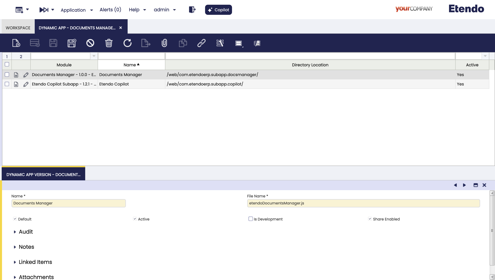

# Documents Manager Subapp (Etendo Mobile)

This page describes in detail how to **receive external files** from another application into **Etendo Mobile** using the **Documents Manager Subapp**.

> **GitHub Repository**  
> For the official Documents Manager Subapp repository, please visit: [Docs Manager Subapp on GitHub](https://github.com/etendosoftware/com.etendoerp.subapp.docsmanager/tree/develop){target="_blank"}.

## Table of Contents

1. [Overview](#overview)
2. [Dynamic App Configuration](#dynamic-app-configuration)
3. [Using `sharedFiles` in App.tsx](#using-sharedfiles-in-apptsx)
4. [Subapplication Example (`Home.tsx`)](#subapplication-example-hometsx)
5. [Workflow for Handling Shared Files](#workflow-for-handling-shared-files)
6. [Conclusion](#conclusion)

## Overview

The **Docs Manager Subapp** in Etendo Mobile is designed to handle files shared from external apps or from the device itself. Once you enable the file reception feature in **Dynamic App**, this subapplication will become an option to open files shared from other apps (e.g., from a gallery, file manager, or third-party application).

**Key Features:**

- **File Reception**: Leveraging the `sharedFiles` array, which provides metadata about the files (e.g., `filePath`, `fileName`, `fileMimeType`).
- **Preview / Playback**: Display images, PDFs, text files, or play audio content directly in the subapp.
- **Scalability**: You can integrate the subapp with other modules or services as needed (upload to servers, process metadata, etc.).

## Dynamic App Configuration

Before coding, ensure the **Dynamic App** settings are properly configured:

1. Go to **Dynamic App** in your Etendo Mobile configuration.
2. Locate the subapplication configuration (Docs Manager Subapp).
3. **Enable `Is Receive Files`** by setting it to **true**.  
   This is crucial for the subapplication to appear as a target when sharing files from external apps.



## Using `sharedFiles` in `App.tsx`

Below is an example of how to integrate `sharedFiles` into your main application (e.g., `App.tsx`). Notice how the `sharedFiles` parameter is passed all the way down to the subapp (`Home` component in this case).

```tsx
import React, { useEffect } from 'react';
import { createStackNavigator } from '@react-navigation/stack';
import locale from './src/localization/locale';
import { IData, IFile, INavigationContainerProps } from './src/interfaces';
import Home from './src/screens/home';

interface AppProps {
  language: string;
  dataUser: IData;
  navigationContainer: INavigationContainerProps;
  sharedFiles: IFile[];
}

const Stack = createStackNavigator();

const App: React.FC<AppProps> = ({
  language,
  navigationContainer,
  dataUser,
  sharedFiles,
}) => {
  useEffect(() => {
    locale.init();
  }, []);

  useEffect(() => {
    locale.setCurrentLanguage(locale.formatLanguageUnderscore(language));
  }, [language]);

  return (
    <Stack.Navigator initialRouteName="Home">
      <Stack.Screen name="Home" options={{ headerShown: false }}>
        {props => (
          <Home
            {...props}
            navigationContainer={navigationContainer}
            dataUser={dataUser}
            sharedFiles={sharedFiles}  // <-- Passing sharedFiles here
          />
        )}
      </Stack.Screen>
    </Stack.Navigator>
  );
};

export { App };
export default App;
```

**Key Point**: The **`sharedFiles`** prop is injected into the **Home** screen. If any files are shared to Etendo Mobile from an external app, they will appear in this array.

## Subapplication Example (`Home.tsx`)

Here is a comprehensive example showing how the subapp receives, displays, and handles different file types (PDF, images, audio, text). Make sure you install the required dependencies, such as [react-native-pdf](https://github.com/wonday/react-native-pdf), [react-native-fs](https://github.com/itinance/react-native-fs), and [react-native-sound](https://github.com/zmxv/react-native-sound).

```tsx
import React, { useEffect, useState, useCallback } from 'react';
import {
  View,
  Text,
  Image,
  ScrollView,
  TouchableOpacity,
  FlatList,
} from 'react-native';
import Pdf from 'react-native-pdf';
import Sound from 'react-native-sound';
import RNFS from 'react-native-fs';

import { styles } from './styles';
import { cleanFileName } from '../../utils';
import { HomeProps, IFile } from '../../interfaces';
import { ArrowLeftIcon, Button } from 'etendo-ui-library';

const Home: React.FC<HomeProps> = ({ navigationContainer, sharedFiles }) => {
  const [audioPlayer, setAudioPlayer] = useState<Sound | null>(null);
  const [isPlaying, setIsPlaying] = useState<boolean>(false);
  const [textContent, setTextContent] = useState<string>('');
  const [selectedFile, setSelectedFile] = useState<IFile | null>(null);

  // On mount or whenever sharedFiles changes
  useEffect(() => {
    if (sharedFiles && sharedFiles.length > 0) {
      if (sharedFiles.length === 1) {
        setSelectedFile(sharedFiles[0]);
      } else {
        setSelectedFile(null);
      }
    }
  }, [sharedFiles]);

  // Load file content or setup audio player
  useEffect(() => {
    let sound: Sound | null = null;

    setAudioPlayer(null);
    setIsPlaying(false);
    setTextContent('');

    const readTextFile = async (filePath: string) => {
      try {
        const content = await RNFS.readFile(filePath, 'utf8');
        setTextContent(content);
      } catch (error) {
        console.error('Error reading text file:', error);
      }
    };

    if (selectedFile) {
      if (selectedFile.fileMimeType.startsWith('text/')) {
        readTextFile(selectedFile.filePath);
      } else if (selectedFile.fileMimeType.startsWith('audio/')) {
        sound = new Sound(selectedFile.filePath, '', error => {
          if (error) {
            console.error('Error loading sound:', error);
          }
        });
        setAudioPlayer(sound);
      }
    }

    return () => {
      // Clean up the audio player if any
      if (sound) {
        sound.release();
      }
    };
  }, [selectedFile]);

  const toggleAudioPlayback = useCallback(() => {
    if (audioPlayer) {
      if (isPlaying) {
        audioPlayer.pause();
        setIsPlaying(false);
      } else {
        audioPlayer.play(success => {
          if (!success) {
            console.error('Error in playback');
          }
          setIsPlaying(false);
        });
        setIsPlaying(true);
      }
    }
  }, [audioPlayer, isPlaying]);

  const handleFileSelect = (file: IFile) => {
    setSelectedFile(file);
  };

  const renderFileContent = (file: IFile) => {
    switch (true) {
      case file.fileMimeType === 'application/pdf':
        return (
          <Pdf
            source={{ uri: file.filePath }}
            style={styles.pdf}
            onError={error => {
              console.error(error);
            }}
          />
        );

      case file.fileMimeType.startsWith('image/'):
        return (
          <Image
            source={{ uri: file.filePath }}
            style={styles.image}
            resizeMode="contain"
          />
        );

      case file.fileMimeType.startsWith('audio/'):
        return (
          <View style={styles.audioContainer}>
            <Button
              typeStyle='terciary'
              text={isPlaying ? 'Pause Audio' : 'Play Audio'}
              onPress={toggleAudioPlayback}
            />
          </View>
        );

      case file.fileMimeType.startsWith('text/'):
        return (
          <ScrollView style={styles.textContainer}>
            <Text style={styles.textContent}>{textContent}</Text>
          </ScrollView>
        );

      default:
        return (
          <View style={styles.unsupportedContainer}>
            <Text style={styles.unsupportedText}>File type not supported.</Text>
          </View>
        );
    }
  };

  const renderFileItem = ({ item }: { item: IFile }) => (
    <TouchableOpacity
      style={styles.fileItem}
      onPress={() => handleFileSelect(item)}
    >
      <Text style={styles.fileItemText}>{item.fileName}</Text>
    </TouchableOpacity>
  );

  return (
    <View style={styles.container}>
      {/* Header */}
      <View style={styles.header}>
        <Text style={styles.headerTitle}>Shared Files</Text>
        <Button
          typeStyle='terciary'
          text='Go back'
          onPress={() => {
            setSelectedFile(null);
            navigationContainer.navigate('Home');
          }}
          iconLeft={<ArrowLeftIcon />}
        />
      </View>

      {sharedFiles && sharedFiles.length > 0 ? (
        selectedFile && sharedFiles.length > 1 ? (
          <View style={styles.fileContainer}>
            <Text style={styles.fileName}>{selectedFile.fileName}</Text>
            {renderFileContent(selectedFile)}
          </View>
        ) : sharedFiles.length > 1 ? (
          <FlatList
            data={sharedFiles}
            keyExtractor={(item, index) => index.toString()}
            renderItem={renderFileItem}
            contentContainerStyle={{ paddingBottom: 16 }}
          />
        ) : (
          <View style={styles.fileContainer}>
            <Text style={styles.fileName}>{cleanFileName(sharedFiles[0].fileName)}</Text>
            {renderFileContent(sharedFiles[0])}
          </View>
        )
      ) : (
        <View style={styles.noFileContainer}>
          <Text style={styles.noFileText}>No files uploaded.</Text>
        </View>
      )}
    </View>
  );
};

export default Home;
```

**What This Code Does**:
  1. Retrieves the **`sharedFiles`** prop from the main `App.tsx`.
  2. Renders a list of shared files if multiple files are passed.
  3. Displays the contents of the selected file: 
    - PDFs using **react-native-pdf**  
    - Images using the standard `<Image>` component  
    - Audio using **react-native-sound** and Etendo’s `<Button>` for playback controls  
    - Text files using **react-native-fs** to read them and show the content in a `<ScrollView>`

## Workflow for Handling Shared Files

1. **User shares a file** from an external application.
2. The OS presents **Etendo Mobile** as a share option (since `Is Receive Files` is enabled).
3. **Etendo Mobile** opens, passing an array of files to the subapp in the **`sharedFiles`** property.
4. The subapp (`Home.tsx`) processes each file based on its MIME type (PDF, image, audio, text, etc.).
5. The user can interact with the content (view, read, listen, or handle unsupported file types accordingly).

## Conclusion

By enabling `Is Receive Files` in **Dynamic App** and properly handling the `sharedFiles` parameter in your subapplication, you can seamlessly receive and manage files shared from external apps in **Etendo Mobile**. For a more advanced or customized implementation, refer to the official **Documents Manager Subapp** repository below.

**GitHub Repository**:  
[Documents Manager Subapp](https://github.com/etendosoftware/com.etendoerp.subapp.docsmanager/tree/develop)

This approach allows you to create a comprehensive file management experience right inside your Etendo Mobile environment, empowering your users to handle a variety of file types with ease.