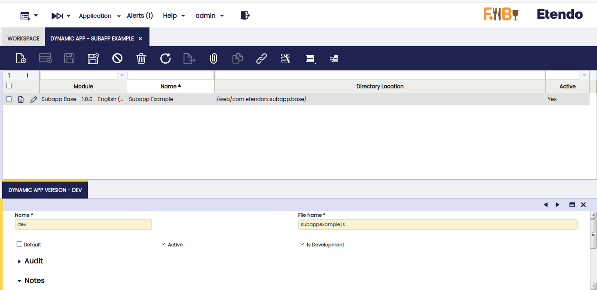
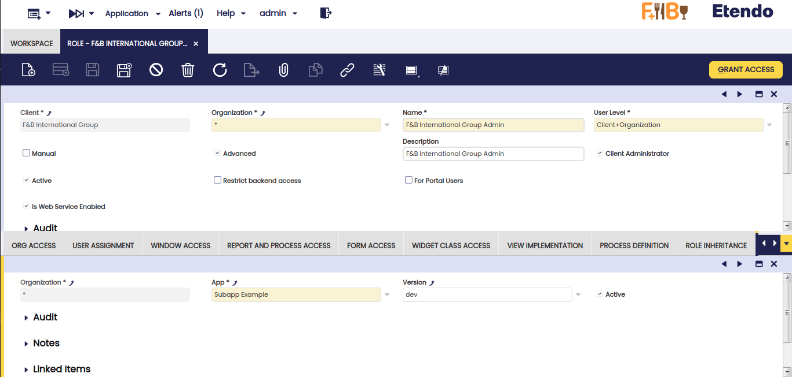
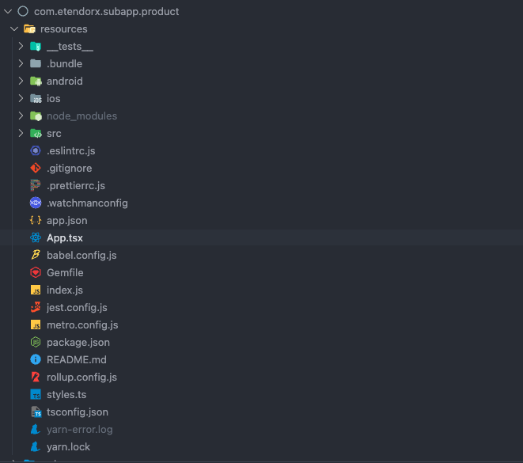
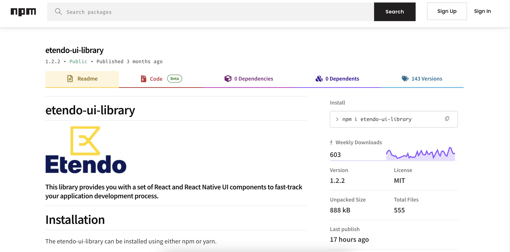
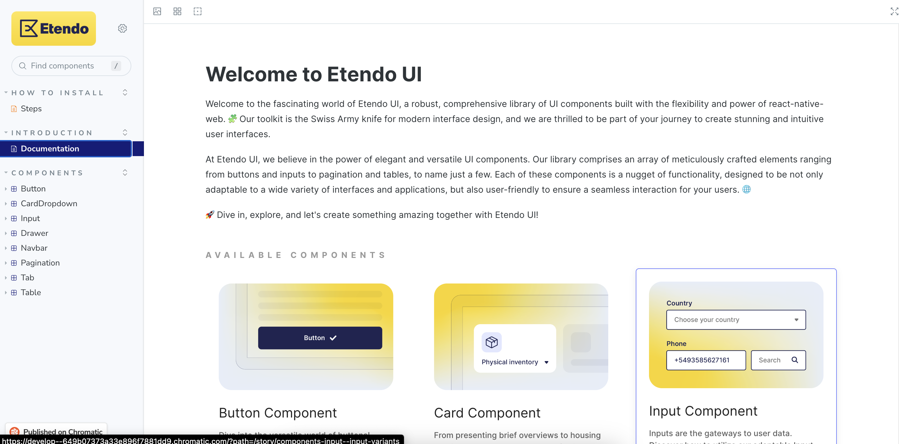
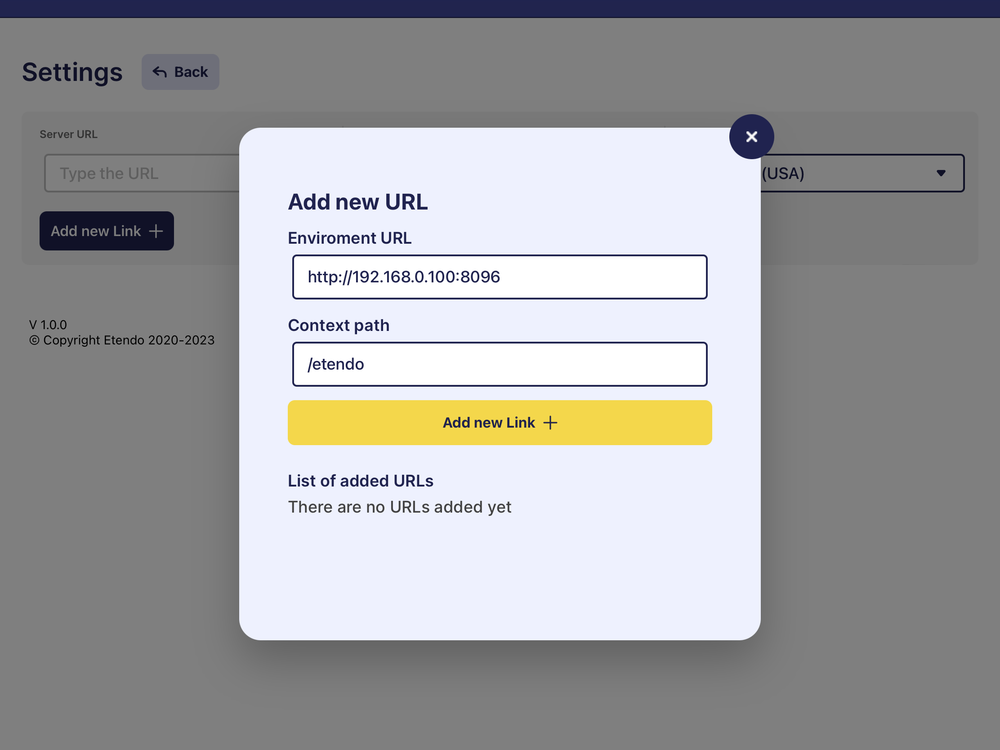
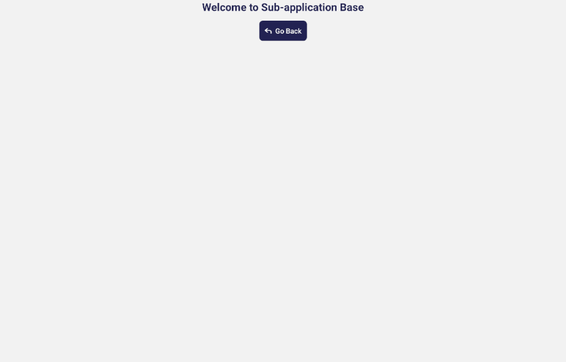
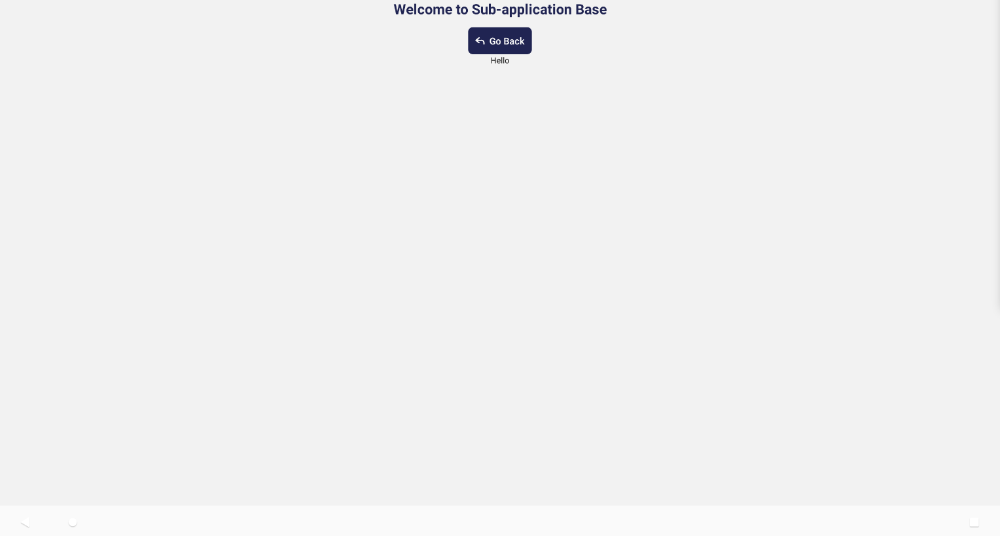

## Dynamic app window
In the `Dynamic App` window the dynamic applications are configured to use them from the Etendo Mobile application. To do this, a record is created in which the module to which it belongs, the name of the application and the location of the build of the subapplication is declared.

After selecting this record in the `Dynamic App Version` tab, we must add the version name, the name of the build file and check the box "is Development" to true, which will allow the developer to use a development URL and not a productive one inside Etendo Mobile. For more information, check the [Dynamic App](../../../user-guide/etendo-classic/basic-features/general-setup/application.md#dynamic-app){target="_blank"}.

| Variable                | Description                                                      | Example Value                          |
| ----------------------- | ---------------------------------------------------------------- | ------------------                     |
| `Module`                | Module name                                                      | Subapp Base - 1.0.0 - English (USA)    | 
| `Name`                  | Subapplication Name                                             | Subapp Example                         |
| `Dyrectory Location`    | Subapplication build location                                   | /                                      |
| `Active`                | If active                                                        | true                                   |

### Dynamic app version

| Variable                | Description                                                      | Example Value                          |
| ----------------------- | ---------------------------------------------------------------- | ------------------                     |
| `Name`                  | Version name                                                     | dev                                    | 
| `File Name`             | Bundle name                                                      | subappexample.js                       |
| `Active`                | If active                                                        | true                                   |
| `Is Development`        | Is the development mode                                          | true                                   |



Permissions must be given to the Admin role in order to view the application within the Etendo Mobile subapplication.
From the `Role` window, look for the name Admin and in the `DYNAMIC APPS - Subapp` tab, add the example record Subapp Example with dev version.

| Variable                | Description                                                      | Example Value                          |
| ----------------------- | ---------------------------------------------------------------- | ------------------                     |
| `Organization`          | Name of organization                                             | *                                      | 
| `App`                   | Name of Subapplication                                          | Subapp Example                         |
| `Version`               | Version number                                                   | dev                                    |
| `Active`                | If active                                                        | true                                   |



## Concepts

In this section, we will explain the main parts and files of the subapplication that will be used.

#### App.tsx
  This file is located in the root of the subapplication and it is the main file. In this file, we will define the routes and the components that will be rendered in each route. In addition, this file is responsible of the initialization of the subapplication and gets the params from Etendo Mobile.



#### Params from Etendo Mobile
Etendo Mobile _sends_ params to the subapplication and all of them are ready to use, they are:

!!! abstract "Params"
    - _ _id_: id of the subapplication
    - _url_: the environment url (setted in setting's Etendo Mobile)
    - _navigationContainer_: an instance of the navigation container of Etendo Mobile
    - _token_: Token
    - _language_: Language
    - _dataUser_: all data related to the user. It has a typed interface that can be found in the file `src/interfaces/index.ts`
    - _isDev_: boolean that identifies whether the application is configured in development (true) or production (false) mode.
    - _Camera_: a component previously integrated into Etendo Mobile has now been seamlessly transferred to the subapps. This particular component boasts a remarkable QR code scanning capability, enhancing the overall functionality of the subapps.

In this example, we will receive these params in App.tsx of the subapp:

``` typescript title="App.tsx"
  interface AppProps {
    language: string;
    dataUser: IData;
    navigationContainer: INavigationContainerProps;
  }

  const App = ({language, navigationContainer, dataUser}: AppProps) => {

```

#### Language
The language is a string that serves as a representation of the user's selected language. This language setting is configurable within the Etendo Mobile application's settings and plays a crucial role in determining the language in which texts are presented within the subapplication. In this example, we will use the _language parameter received as input_ to initialize the remaining aspects of the application in the "App.tsx" file.

``` typescript title="App.tsx"
  locale.init();
  locale.setCurrentLanguage(locale.formatLanguageUnderscore(language));
```
!!! tip
    All subapps have to have at least two languages: _en-US_ and _es-ES_.  

As you can see, we use `locale` to set the language of the subapplication. This `locale` is an instace of a custom handler of the language which is based in `i18n` and defined in this path `subapp/src/localization/locale.ts`.

``` typescript title="locale.ts"
const locale: LocaleModule = {
  currentDateLocale: null,

  i18n,
  init() {...}

  t(key, params) {...}

  setCurrentLanguage(input) {...}

};

export default locale;

```

Between the functions of the `locale` handler, some of the most important are:

!!! info "Functions"
    - _t(key, params)_: this function receives a key (and other optional params) and returns the text translated to the language of the subapplication. This function is based on [i18n](https://github.com/fnando/i18n#readme){target="_blank"} and the keys are defined in .json files in `subapp/src/lang`. 
    - _setCurrentLanguage(input)_: gets a language as a param and sets this language as default in the subapplication.


#### Navigation Stack
The navigation stack is a component in App.tsx that allows us to navigate between screens. It is a component provided by react-navigation. In this example, we will use only one screen called Home which is the main screen of the subapplication (initialRouteName in stack).

``` typescript title="App.tsx"
import React from 'react';
import Home from './src/screens/home';
import {createStackNavigator} from '@react-navigation/stack';
import locale from './src/localization/locale';
import {IData, INavigationContainerProps} from './src/interfaces';

interface AppProps {
  language: string;
  dataUser: IData;
  navigationContainer: INavigationContainerProps;
}

const App = ({language, navigationContainer, dataUser}: AppProps) => {
  const Stack = createStackNavigator();

  locale.init();
  locale.setCurrentLanguage(locale.formatLanguageUnderscore(language));

  return (
    <Stack.Navigator initialRouteName="Home">
      <Stack.Screen
        options={{headerShown: false}}
        name="Home"
        initialParams={{dataUser}}>
        {props => <Home {...props} navigationContainer={navigationContainer} />}
      </Stack.Screen>
    </Stack.Navigator>
  );
};

export {App};
export default App;

```

#### Etendo UI
Etendo UI is a _library of components_ that will be used throughout the example subapplication. This library is based on React Native Elements and it is available on [NPM](https://www.npmjs.com/package/etendo-ui-library){target="_blank"}. You can use it in all of your subapplications.
  In this library we can find components like:  Button, Input, Navbar etc.



For more information, visit [Etendo UI Library](https://main--65785998e8389d9993e8ec4c.chromatic.com){target="_blank"} 

_Storybook_ is a place where you can see all the components of the library. Also, you can see the code of each component and how to use it.



## Development mode setup

1. [Etendo RX](../../../developer-guide/etendo-rx/getting-started.md) should be running
      ``` bash title="Terminal"
      ./gradlew rx:rx
      ```
2. Etendo classic should be running.
3. Open the [Etendo Mobile](../../../user-guide/etendo-mobile/getting-started.md) application on a mobile device. You can use either an emulator or a physical device.

### Rollup
[Rollup](https://rollupjs.org/){target="_blank"} is a module packer for JavaScript that compiles small pieces of code into something bigger and more complex, this is already installed in the module.

Inside the project, there is a file rollup.config.js where the path where the packaged file with .js extension will be generated is defined.

It is necessary to modify this path adding the `javapackage` of the generated module.

```groovy title="rollup.config.js"
import typescript from '@rollup/plugin-typescript';
import peerDepsExternal from 'rollup-plugin-peer-deps-external';
import json from '@rollup/plugin-json';

const pkg = JSON.parse(
  require('fs').readFileSync(
    require('path').resolve('./package.json'),
    'utf-8',
  ),
);

const external = Object.keys(pkg.dependencies || {});

export default {
  input: './App.tsx',
  output: [
    {
    //Change the javapackge in the path where the application build will be generated. 
      file: '../web/<javapackage>/subappexample.js', 
      format: 'cjs',
      exports: 'auto',
      strict: false,
      sourcemap: 'inline',
    },
  ],
  plugins: [peerDepsExternal(), json({compact: true}), typescript()],
  external,
};
```

In the package.json, you define the path where the local server will be raised with [Http-server](https://www.npmjs.com/package/http-server){target="_blank"} with the `yarn dev` command.
This path must coincide with the path where the building of the application was generated. Also the local port to be exposed is defined here (in this case, port 3000).


```groovy title="package.json"
"scripts": {
    "android": "react-native run-android",
    "ios": "react-native run-ios",
    "start": "react-native start",
    "test": "jest",
    "lint": "eslint .",
    "build": "rollup -c",
    "dev": "http-server -p 3000 ../web/<javapackage>/subapp"
  },
```

In a terminal on path `modules/<javapackage>/subapp`, run the following commands to build the subapplication and deploy it to a local server.
    ``` bash title="Terminal"
    yarn build && yarn dev
    ```

### Etendo Mobile Setup
    
1. In Etendo Mobile setting up the Edge service URL (Edge is an Etendo RX service, which implements a Spring cloud-driven gateway), by default the environment url should be `http://<local-network-ip>:8096/` and the context path by default `/etendo` 

!!! info
    To find out your IP address on the local network, you can run the command `ifconfig` in a Mac or Linux terminal or `ipconfig` in Windows CMD.
  


2. Login Etendo Mobile and you will see the list of subapps. Clicking on `Subapp Example` will download the building previously generated and exposed in the environment URL.
    
3. Here is the subapplication.
    


## Applying changes workflow
1. Add any changes for example in `modules/<javapackage>/subapp/src/screens/home/index.tsx` to the prop typeStyle of the Button component change it to `secondary`.

    ```groovy title="index.tsx"
    import React from 'react';
    import {Text, View} from 'react-native';
    import locale from '../../localization/locale';
    import {styles} from './style';
    import {Button, BackIcon} from 'etendo-ui-library';

    interface NavigationContainerProps {
    navigate: (screenName: string, params?: any) => void;
    }

    interface HomeProps {
    navigationContainer: NavigationContainerProps;
    }

    const Home: React.FC<HomeProps> = ({navigationContainer}) => {
    return (
        <View style={styles.container}>
        <Text style={styles.text}>{locale.t('Home.welcome')}</Text>
        <Button
            typeStyle={'secondary'} //Change this prop
            text={locale.t('Home.back')}
            iconLeft={<BackIcon />}
            onPress={() => {
            navigationContainer.navigate('Home');
            }}
        />
        </View>
    );
    };

    export default Home;
    ```
2.  In a terminal on path `modules/<javapackage>/subapp`, run the following commands to build the subapplication and deploy it to a local server.
    ``` bash title="Terminal"
    yarn build && yarn dev
    ```
3.  Exit and re-enter the subapplication to visualize the changes.(No need to log out).
     