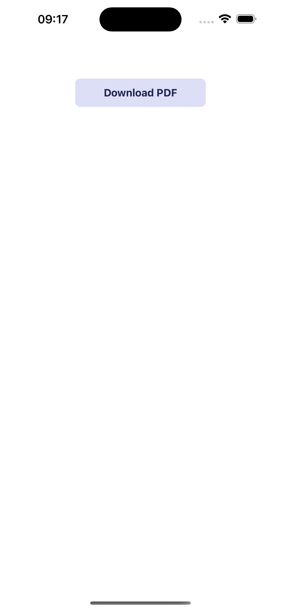
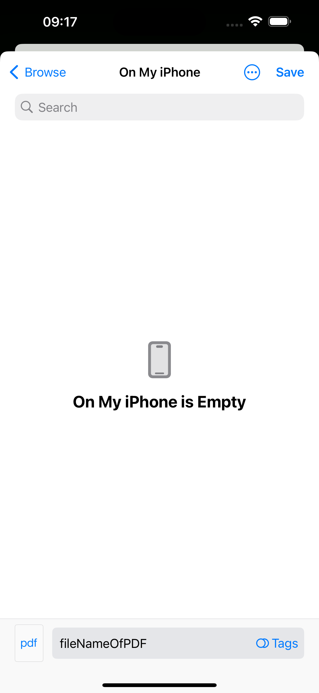
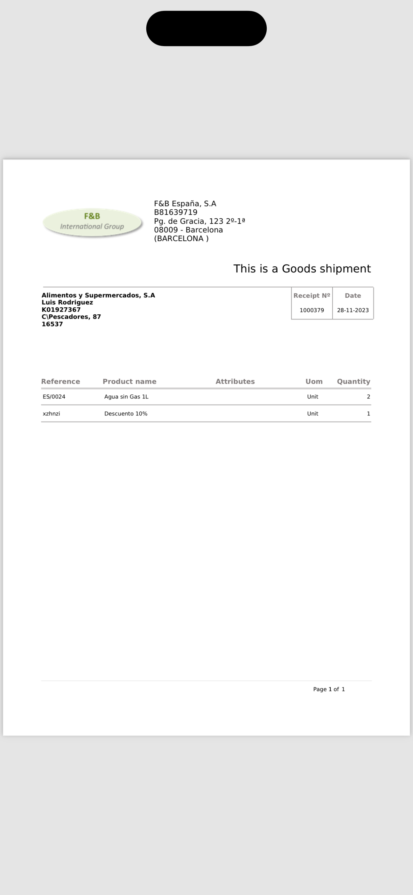

---
search:
  exclude: true
---

## Overview

In this section teaches you how to use the PDF utilities (download and preview) in a Etendo subapp.

!!! info
    This tutorial requires an already functional subapp. If you don't have the environment, please follow the steps in [Getting Started](../../../developer-guide/etendo-mobile/getting-started.md){target="_blank"} in the Etendo Mobile section.

## Setup

----------
### Checking dependencies

Before starting, make sure you have the following dependencies listed in package.json and installed:

- [react-native-blob-util](https://github.com/RonRadtke/react-native-blob-util) version 0.19.4
- [react-native-pdf](https://github.com/wonday/react-native-pdf) version 6.7.1
- [react-native-share](https://github.com/react-native-share/react-native-share) version 10.0.2


### Hook creation

In the hook folder of your subapp, create a new file called *usePDF.tsx* and paste the following code:

```typescript
import { useState } from 'react';
import { Platform } from 'react-native';
import ReactNativeBlobUtil from 'react-native-blob-util';
import Share from 'react-native-share';

// Simple verification to check if the device is Android
const isAndroidDevice = (() => {
  return Platform.OS === 'android';
})();

// Constants for the download
const MIME_TYPE = 'application/pdf';
const FILE_EXTENSION = 'pdf';

const usePDF = () => {
  // Loacal States
  const [isLoading, setIsLoading] = useState(false);
  const [isDownloadDone, setIsDownloadDone] = useState(false);
  const [_pdf, setPdf] = useState<any>(null);
  const [path, setPath] = useState('');

  const downloadPDF = async ({
    url,
    method,
    fileName,
    optionsHeader,
    description,
    callback,
  }: {
    url: string;
    method: Methods;
    fileName: string;
    optionsHeader: any;
    description?: string;
    callback?: (...params: any[]) => void;
  }) => {
    // Set the path of the file and start the loading
    const dirs = ReactNativeBlobUtil.fs.dirs;
    const pathFile = `${
      isAndroidDevice ? dirs.LegacyDownloadDir : dirs.DocumentDir
    }/${fileName}.${FILE_EXTENSION}`;
    setPath(pathFile);
    setIsLoading(true);
    // Congfigurations for the download
    const config = {
      fileCache: true,
      appendExt: FILE_EXTENSION,
      path: pathFile,
      addAndroidDownloads: {
        mime: MIME_TYPE,
        title: `${fileName}.${FILE_EXTENSION}`,
        description: description || 'PDF File is dowmloaded.',
        mediaScannable: true,
        notification: true,
      },
    };

    ReactNativeBlobUtil.config(config)
      .fetch(method, url, optionsHeader)
      .then(res => {
        const filePath = res.path();
        const fileOptions = {
          path: filePath,
          mime: MIME_TYPE,
        };
        if (isAndroidDevice) {
          ReactNativeBlobUtil.fs.scanFile([fileOptions]);
        } else {
          let shareOptions = {
            type: MIME_TYPE,
            url: filePath,
            saveToFiles: true,
          };
          return Share.open(shareOptions);
        }
      })
      .then(_res => {
        // If the file is saved, set the state to true
        // and exceute the callback(if it exists)
        setIsDownloadDone(true);
        callback && callback();
      })
      .catch(err => {
        console.log(err);
      })
      .finally(() => {
        // Finally, set the loading to false
        setIsLoading(false);
      });
  };

  return { downloadPDF, isDownloadDone, isLoading, path, setPdf };
};

export default usePDF;
```
#### Explanation
There are some things to consider in this hook:

- The hook handles only the downloading of the PDF file. To preview it, you'll need to utilize the *react-native-pdf* library, which will be explained in more detail beforehand.
- The path of the file is set in the *LegacyDownloadDir* folder for Android devices and in the *DocumentDir* folder for iOS devices. This is because the *react-native-blob-util* library has a different way of handling the download for each platform. So the file easy to find in both platforms, but you can change it if you want. For more information, please check the [react-native-blob-util documentation](https://github.com/RonRadtke/react-native-blob-util)

#### Functions and States exported
!!! abstract "List"
    - _ _downloadPDF_: is the function that handles the download of the PDF file. It receives an object with the following parameters:
        - _url_: the url of the file
        - _method_: the method of the request
        - _fileName_: the name of the file (without the *.pdf* extension)
        - _optionsHeader_: the options of the header
        - _description_: the description of the file that will be displayed on Android devices during the downloading process (optional)
        - _callback_: is a callback function that will be executed upon successful completion.(optional)
    - _isDownloadDone_: is a boolean that indicates if the download is done
    - _isLoading_: is a boolean that indicates if the download is in progress
    - _path_: is the final path of the file
    - _setPdf_: is a function that sets the PDF file (internal usage at rendering)


## Usage

----------
### Calling the hook

In the file where you want to use the hook, import it and call it:

```typescript
...
import { Button, Layout } from 'etendo-ui-library';
import usePDF from './hooks/usePDF';
...
```

!!! info "Components used"
    The components used in this example (*Button* and *Layout*) are from the [Etendo UI Library](https://www.npmjs.com/package/etendo-ui-library)


### Downloading the PDF

To download the PDF file, you need to call the *downloadPDF* function and pass the parameters. In this example, we are using a button to trigger the download:

```typescript
...
const { downloadPDF, isLoading, isDownloadDone, path, setPdf } = usePDF();

return (
  ...
  <Layout
    children={
      <Button
        typeStyle="terciary"
        text="Download PDF"
        width={200}
        onPress={() =>
          downloadPDF({
            url: `https://your-url.com/your-pdf-file.pdf`,
            method: 'GET',
            fileName: 'fileNameOfPDF',
            optionsHeader: {
              'Content-Type': 'application/json',
            },
            description: 'File description',
          })
        }
        loading={isLoading}
      />
    }
  />
);

```

This will be displayed as follows:

<figure markdown>
{ width="200", align=left style="border: 1px solid grey; border-radius: 8px;"}
{ width="200", align=right style="border: 1px solid grey; border-radius: 8px;"}
</figure>


### Previewing the PDF

To preview the PDF file, you need to use the *react-native-pdf* library. Following the example above, you can use the *path* state to set the source of the PDF file and the *setPdf* function to set the PDF file:


```typescript
...
<View style={styles.container}>
  <Pdf
    ref={pdf => {
      setPdf(pdf);
    }}
    source={
      isDownloadDone && {
        uri: path,
      }
    }
    style={styles.pdf}
  />
</View>
```

!!! info "Styles used"
    The styles used in this example (*container* and *pdf*) are the following:
    ```typescript
      ...
      const width = Dimensions.get('window').width;
      const height = Dimensions.get('window').height;
      const styles = StyleSheet.create({
        container: {
          flexDirection: 'row',
          justifyContent: 'center',
          height,
          width,
          alignItems: 'center',
          marginTop: 25,
          backgroundColor: 'red',
        },
        pdf: {
          flex: 1,
          width,
          height,
        },
      });
    ```

After save, the final result, you should see something like this:

<figure markdown>
  { width="200", align=left style="border: 1px solid grey; border-radius: 8px;"}
  { width="200", align=right style="border: 1px solid grey; border-radius: 8px;"}
</figure>

---
This work is licensed under :material-creative-commons: :fontawesome-brands-creative-commons-by: :fontawesome-brands-creative-commons-sa: [ CC BY-SA 2.5 ES](https://creativecommons.org/licenses/by-sa/2.5/es/){target="_blank"} by [Futit Services S.L](https://etendo.software){target="_blank"}.
