---

tags:
    - Etendo Mobile
    - Etendo RX
    - Dynamic App Configuration
    - Subapp
---

# Create New Subapplication

## Overview

This tutorial provides a step-by-step guide to creating a new sub-application within **Etendo Mobile**. By following these instructions, you will learn how to fully utilize the capabilities of **Etendo RX** and leverage the visual components available in the **Etendo UI Library** to build a functional sub-application.

The tutorial will guide you through the creation of the *Product Subapp*, a simple application that enables the addition, deletion, and modification of products, as well as their visualization in a grid. Upon completion, you will have the skills to create and distribute sub-applications as modules, thereby extending the mobile functionality of Etendo.


!!! info
    Before beginning, ensure that your local environment meets all necessary requirements by reviewing the Etendo Mobile [Getting Started](../getting-started.md) section.


## Module Setup 

### Create New Etendo Classic Module

:material-menu: `Application` > `Application Dictionary` > `Module`

1. As a System Administrator role, open the **Module** window and create a new register. This module will be used to develop and distribute the application.

    <figure markdown="span">
    
    <figcaption>Product Subapp module configuration example</figcaption>
    </figure>

    !!! tip
        - Notice that the name can be anything you want, but the type has to be setted as Module.
        - The _description field_ is free and also _required_.
        - In this case, start from `1.0.0` module version and set the DB Prefix as `ETSAPPP`.


### Dynamic App configuration

:material-menu: `Application` > `General Setup` > `Application` > `Dynamic App`

Configure and export dynamic applications in Etendo Classic, which are displayed dynamically in Etendo Mobile.

In the **Dynamic App** window, specify the paths and versions for each subapplication. These settings determine how subapplications are displayed when users log into Etendo Mobile.

For the example we are following, the Dynamic App in Etendo must be configured with the following form fields and corresponding values:

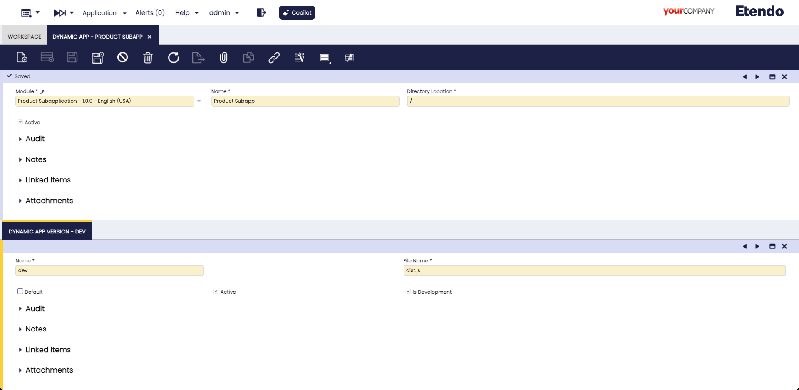

Fields to note:

- **Module**: The module that can export the window configuration, in the example **Product SubApp**.
- **Name**: Name with the application will be shown.
- **Directory Location**: The path where the compiled application bundle is located. In development, the path is empty, but in production, the path is `/<javapackage>/web/`.
- **Active**: To select if this application is active or not.


The **Dynamic App Version** tab allows the application to be versioned, enabling both development and production versions.

Fields to note:

- **Name**: Name of the application version E.g. `dev` or `1.0.0`.
- **File Name**: The bundle name of the compiled application, by default `dist.js`.
- **Default**: This check defines that this version is productive.
- **Is Development**: This check defines that this version is in development and can be deployed locally.
- **Active**: To select if this application version is active or not.


### Role configuration
:material-menu: `Application` > `General Setup` > `Security` > `Role`

Logged in as the **Group Admin** role (which is the default role for accessing Etendo Mobile in our example), the settings are applied as specified below.

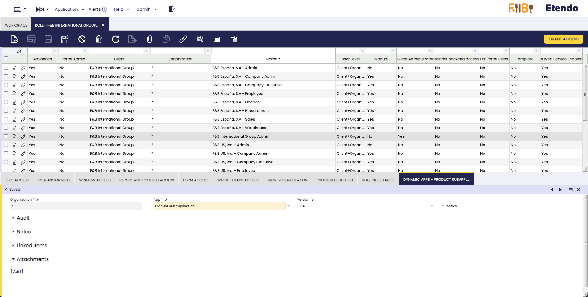

!!! warning "Important"
    Keep this dynamic app as _active_.

!!!info
    At this point, you have done with the Product Subapplication configuration.

## Export the Module

1. After saving all the configuration, you have to export the changes. Open a terminal in the root of your **Etendo Classic** project and execute the following command:
    
    ``` bash title="Terminal"
    ./gradlew export.database --info
    ```

    !!!success "Important"
        The output must be a "BUILD SUCCESSFUL" message.

3. A new module is created in the `/modules` folder, with the following structure

    ```
    modules
    └── com.etendoerp.subapp.product
        └── src-db 
    ```

## Dokerized Services

Before proceeding, it is necessary to start the **Etendo RX** services. These services provide a security layer (Auth Service) and a data access layer (Das Service), which are essential for consuming or writing data in Etendo. Additionally, by selecting the **isReact** checkbox in the previously defined module, React code will be automatically generated, allowing for easier data access.

To launch all the services, it is necessary to define the following configuration variables in the `gradle.properties` file:

```groovy title="gradle.properties"
docker_com.etendoerp.etendorx=true
```

!!!info
    For more information about how to handle Etendo Dockerizations visit [Docker Management](../../etendo-classic/bundles/platform/dependency-manager.md). 

??? Note "Tomcat and PostgresSQL Dockerized (Optional)"
    It is also possible to run the dockerized [PostgreSQL service](../platform/docker-management.md#postgres-database-service) and [Tomcat service](../platform/tomcat-dockerized-service.md), **optionally** adding the [Platform Extensions Bundle](https://marketplace.etendo.cloud/#/product-details?module=5AE4A287F2584210876230321FBEE614){target=_isblank} and the following configuration variables:

    ```groovy title="gradle.properties"
    docker_com.etendoerp.tomcat=true
    docker_com.etendoerp.docker_db=true
    ```

Then, to effectively run the services, it is necessary to **execute the command** in the terminal: 

```bash title="Terminal"
./gradlew resourses.up
```

Here, all the services and their respective logs can be seen running using [Docker Desktop](https://www.docker.com/products/docker-desktop/){target=_isblank} tool.

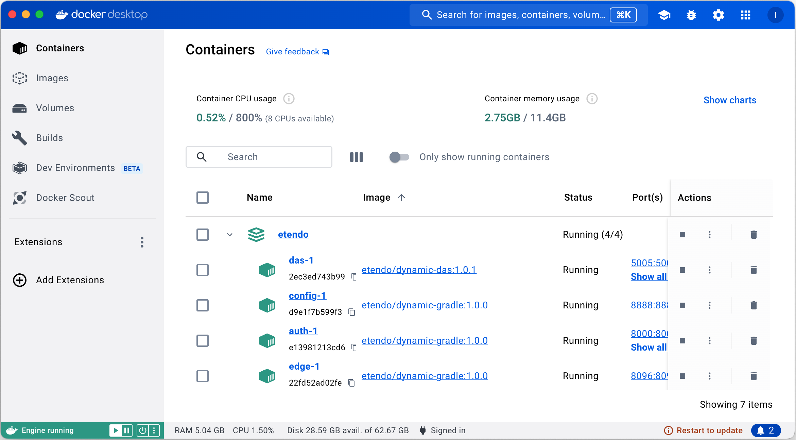

### RX Config window
:material-menu: `Application` > `Etendo RX` > `RX Config`

This configuration window stores the access data for Etendo RX services, which are crucial for the interaction between different services. In this case, two records need to be created: one for the **RX Config** service, responsible for distributing the dynamic configurations of other available services, and another for the **Auth** service, which provides security utilities. The Auth service must be accessible by the sub-application to obtain the authentication token for requests.

As `System Administrator` role, in this window, it is necessary to add two entries, one for each service to be used. The following fields should be included:

- **Service Name**: The name of each service.
- **Service URL**: The internal URL of the Docker service.
- **Updatable Configs**: Check this checkbox.
- **Public URL**: Configure the publicly accessible URL for the service.

See the configuration examples bellow and replicate them. 

!!!info
    The **Public URL** field only needs to be configured when the sub-application is set to production.

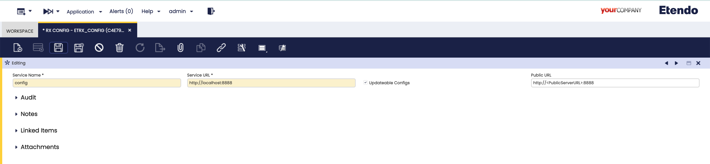

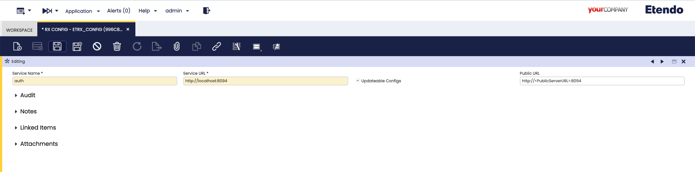

!!!info 
    If using Dockerized Tomcat, the URLs within the container's network are `http://config:8888` and `http://auth:8096`.


## Creating the Sub-application

1. Now, create the sub-application based on a template published in NPM. Execute a Gradle command to automatically create the sub-application within the module under development.

    ``` bash title="Terminal"
    ./gradlew subapp.create -Ppkg=<javapackage> --info
    ```
    In the example we are working on, use the following command:

      ```bash title="Terminal"
    ./gradlew subapp.create -Ppkg=com.etendoerp.subapp.product --info
        ```

This command uses the `subapp.create` task to generate the sub-application within the specified package. The `--info` option provides additional details during the command execution, which is useful for debugging or confirming the process.
  
A new subapplication will be created within the module, with the following structure:

    ```
    modules
    └── com.etendoerp.subapp.product
      ├── src-db 
      └── subapp
          ├── .bundle
          ├── _tests_
          ├── android
          ├── ios
          ├── lib
          ├── node_modules
          └── src

    ```

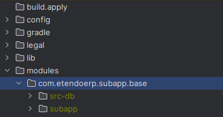


2. In a terminal on path `modules/<javapackage>/subapp` install the depedencies declared in the package.json and the following command would be executed.

    ``` bash title="Terminal"
    yarn install 
    ```

3. Finally, to run in development mode run


    ``` bash title="Terminal"
    yarn dev 
    ```


## Customizing and Programming a Sub-Application

This section explains how to customize and program a sub-application. It uses as an example the [Product sub-application](https://github.com/etendosoftware/subapp-product/releases/){target="_blank"} .

### Product subapp example

This section covers an overview about the product subapplication example screens and principal parts of the subapplication where covered in [Create New Subapplication](../../../developer-guide/etendo-mobile/tutorials/create-new-subapplication.md){target="_blank"}.

!!! info "Consideration"
    This subapplication example was developed for both platforms (phone and tablet). 
    When you create a new subapplication, you have to do the same. 
    The provided [base subapplication](../../../developer-guide/etendo-mobile/tutorials/create-new-subapplication.md){target="_blank"}  is already configured for both platforms.

#### Home
  - This is the main screen of the subapplication. It will show a list of products. Also, it will allow us to edit and remove a product, find a product by name and navigate to the detail of a product.
  - The route to this screen is `src/screens/home/index.tsx` and it can be consulted on the [Github repository](https://github.com/etendosoftware/subapp-product/blob/develop/src/screens/home/index.tsx){target="_blank"}.

**Key Components:**

1. **Navbar**: Positioned at the top, it displays the application's title and user's name, offering navigation controls.

2. **ButtonUI**: A customizable UI button from Etendo UI Library, used for actions like navigating to product details. It can be styled in terms of size, style, and includes icons.

3. **SearchContainer**: Enables product search by name, allowing the product list to be updated based on the query using the component from Etendo UI Library.

4. **TableUI**: Displays products in a table format, allowing interactions such as editing, deleting or viewing product details. Available in the tablet or web version.

5. **Cards**: Used to display product details in a card format, providing a more detailed view of the product. Only available in the mobile version.

6. **Layout and Style**: The screen is designed to be responsive for both mobile and tablet formats, with a layout comprising the navbar, button, search bar, and table. Styles are defined in the `styles` object for consistency.


    <figure markdown>
      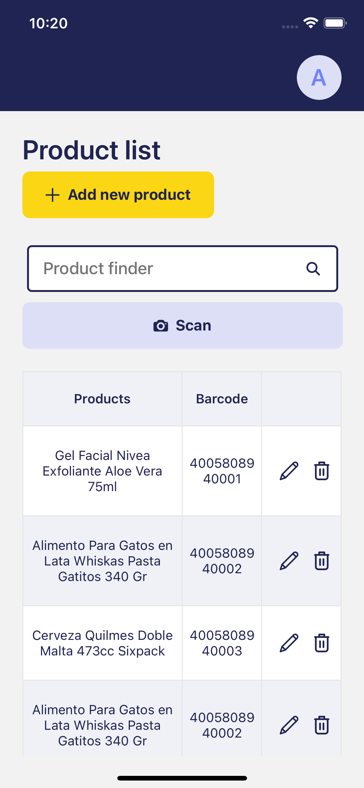{ width="300", align=left } 
      { width="300", align=right}
    </figure>
    _Tablet version_
    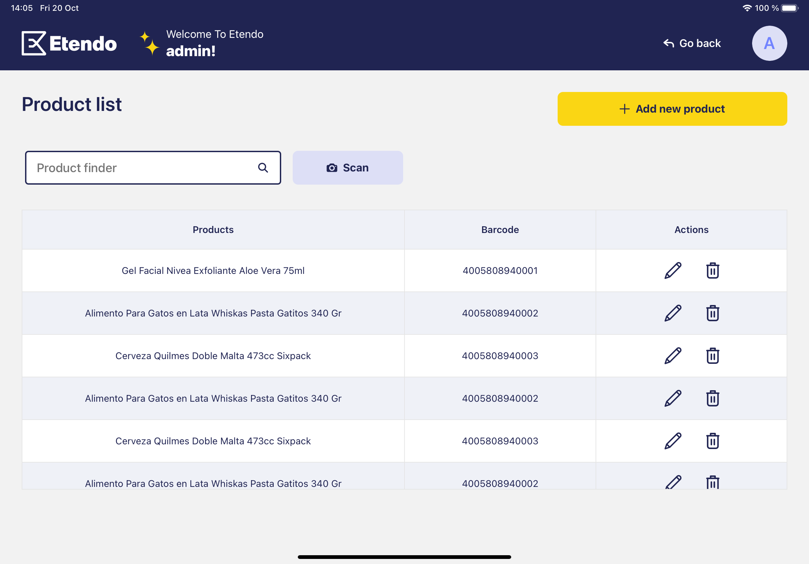

#### ProductDetail
  - This screen will show the detail of a product. Also, it will allow us to edit the product.
  - It's the same screen used to create a new product. there is a flag to know if the product is new or not (productItem).
  - The route to this screen is `src/screens/productDetail/index.tsx` and it can be consulted on the [Github repository](https://github.com/etendosoftware/subapp-product/blob/develop/src/screens/productDetail/index.tsx){target="_blank"}.
    <figure markdown>
      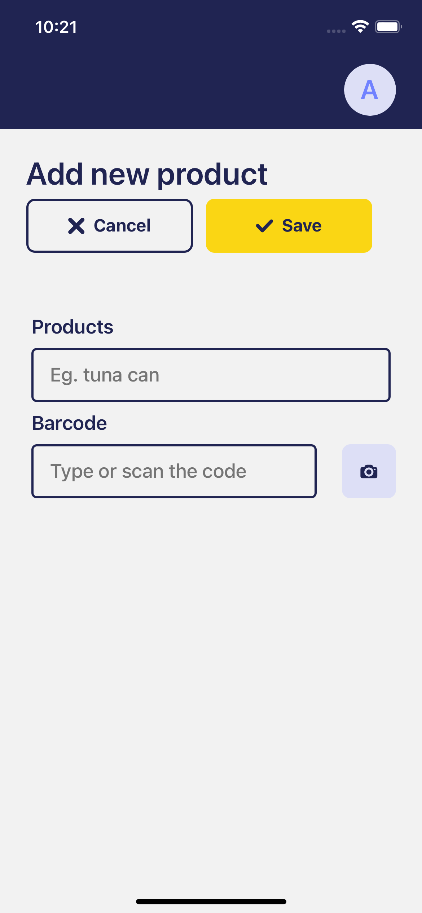{ width="300", align=left } 
      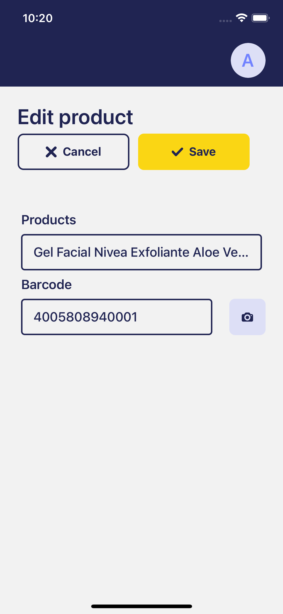{ width="300", align=right}
    </figure>
    _Tablet version_
    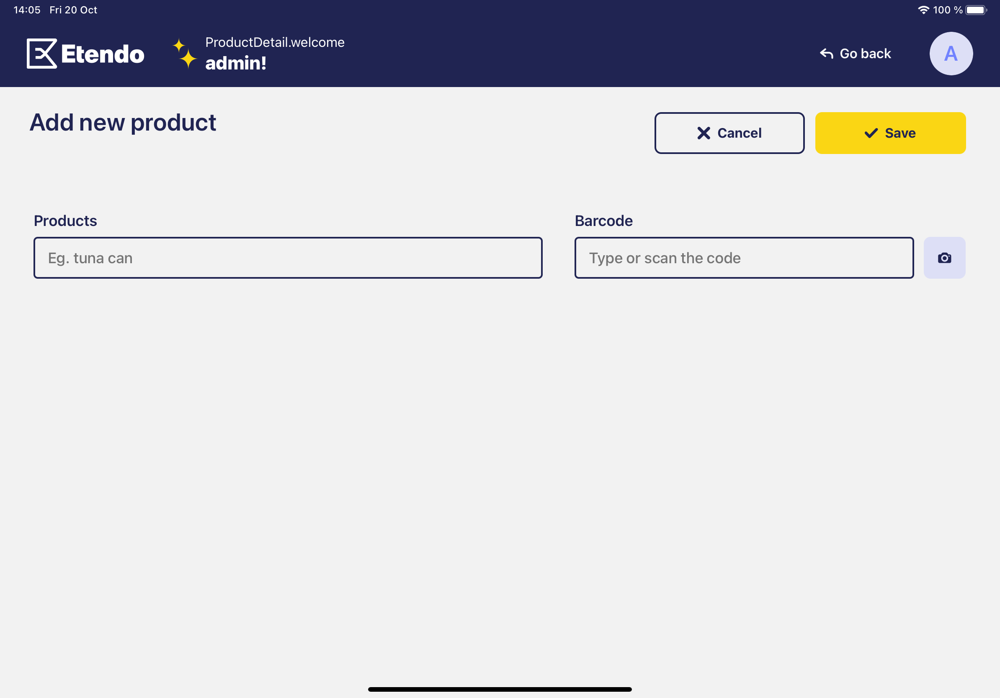

# Projections, Repository and Search
!!! info
    In this section we will explain how to configure the projections, repository and search needed in this example. For more info visit Projections, Repository And Search official documentation. 

## Create a projection

It is required to create projections that reflect partial views of the root class and contain only the necessary properties.
To do this we will go to the `Projections` window and create a projection with the following properties:


  | Field       | Value                                               |
  | ----------- | ----------------------------------------------------|
  | Module      |`Subapp Product Module - 1.0.0 - English (USA)`      |
  | Name        |`ProdSubApp`                                         |
  | Description |`-`                                                  |


  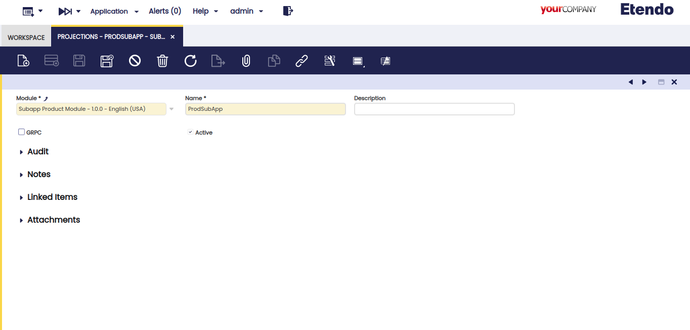


### Adding the projection and mapping

Having created the projection, we now need to map it to a table from which we want to extract data. To do this, we open the Projections and Mappings window.

Next, we add a new record with the following values:

  | Field        | Value                                            |
  | ----------   | -------------------------------------------------|
  | Organization | `*`                                              |
  | Module       | `Product Subapplication - 1.0.0 - English (USA)` |
  | Name         | `prodsubapp`                                     |
  | GRPC         | `false`                                          |
  | description  | `-`                                              |
  | active       | `false`                                          |


  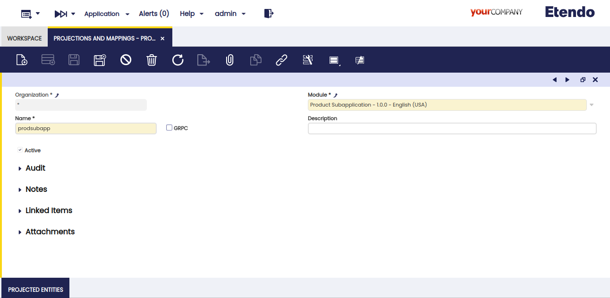


### Adding projected entities

Now with the projection selected add in the Projected Entities tab the write and read projections of Product and Product_Category in which we can specify the required values from the M_Product table.

=== "Product - Read"
    
    | Name                |  Property                   |
    | ------------------- | ----------------------------|
    | Organization        |`*`                          |
    | Name                |`PRODSUBAPP - Product - Read`|
    | Table               |`M_Product`                  |
    | Identity            |`false`                      |
    | Mapping Type        |`Etendo to external system`  |
    | Is Rest Endopoint   |`true`                       |
    | External_Name       |`Product`                    |
    | Active              |`true`                       |

=== "Product - Write"
  
    | Name                |  Property                    |
    | ------------------- | -----------------------------|
    | Organization        |`*`                           |
    | Name                |`PRODSUBAPP - Product - Write`|
    | Table               |`M_Product`                   |
    | Identity            |`false`                       |
    | Mapping Type        |`External system to Etendo`   |
    | Is Rest Endopoint   |`true`                        |
    | External_Name       |`Product`                     |
    | Active              |`true`                        |

=== "Product_Category - Read"
    
    | Name                |  Property                              |
    | ------------------- | ---------------------------------------|
    | Organization        |`*`                                     |
    | Name                |`PRODSUBAPP - M_Product_Category - Read`|
    | Table               |`M_Product_Category`                    |
    | Identity            |`false`                                 |
    | Mapping Type        |`Etendo to external system`             |
    | Is Rest Endopoint   |`true`                                  |
    | External_Name       |`M_Product_Category`                    |
    | Active              |`true`                                  |

=== "Product_Category - Write"
  
    | Name                |  Property                               |
    | ------------------- | ----------------------------------------|
    | Organization        |`*`                                      |
    | Name                |`PRODSUBAPP - M_Product_Category - Write`|
    | Table               |`M_Product`                              |
    | Identity            |`false`                                  |
    | Mapping Type        |`External system to Etendo`              |
    | Is Rest Endopoint   |`true`                                   |
    | External_Name       |`Product`                                |
    | Active              |`true`                                   |

  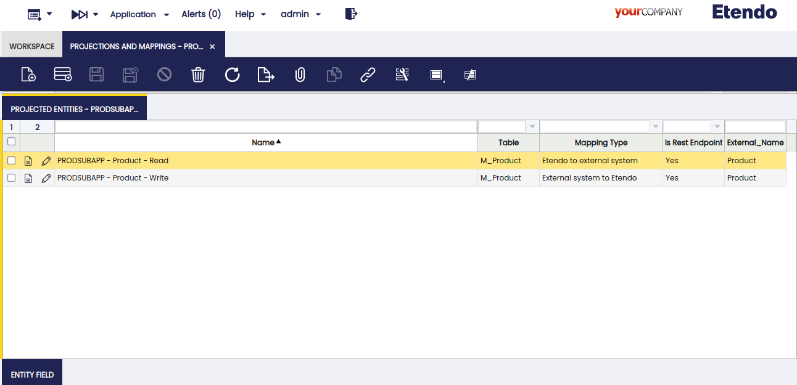

Now we define which fields we want to retrieve in the Entity Field tab by adding the following fields:

This is the M_Product - Read fields.

=== "id"

    | Name                         |  Property                                       |
    | -----------------------------| ------------------------------------------------|
    | Module                       |`Product Subapplication - 1.0.0 - English (USA)` |
    | Organization                 |`*`                                              |
    | Line                         |`10`                                             |
    | Property                     |`id`                                             |
    | Name                         |`id`                                             |
    | Is Mandatory                 |`false`                                          |
    | Identifies Record Univocally |`true`                                           |
    | Field Mapping                |`Direct mapping`                                 |
    | Constant Value               |`-`                                              |
    | Active                       |`true`                                           |

=== "name"

    | Name                         |  Property                                       |
    | -----------------------------| ------------------------------------------------|
    | Module                       |`Product Subapplication - 1.0.0 - English (USA)` |
    | Organization                 |`*`                                              |
    | Line                         |`20`                                             |
    | Property                     |`name`                                           |
    | Name                         |`name`                                           |
    | Is Mandatory                 |`false`                                          |
    | Identifies Record Univocally |`false`                                          |
    | Field Mapping                |`Direct mapping`                                 |
    | Constant Value               |`-`                                              |
    | Active                       |`true`                                           |

=== "productCategory"

    | Name                         |  Property                                       |
    | -----------------------------| ------------------------------------------------|
    | Module                       |`Product Subapplication - 1.0.0 - English (USA)` |
    | Organization                 |`*`                                              |
    | Line                         |`30`                                             |
    | Property                     |`productCategory`                                |
    | Name                         |`productCategory`                                |
    | Is Mandatory                 |`false`                                          |
    | Identifies Record Univocally |`false`                                          |
    | Field Mapping                |`Entity Mapping`                                 |
    | Related Projection Entity    |`PRODSUBAPP - M_Product_Category - Read`         | 
    | Constant Value               |`-`                                              |
    | Active                       |`true`                                           |

=== "uPCEAN"

    | Name                         |  Property                                       |
    | -----------------------------| ------------------------------------------------|
    | Module                       |`Product Subapplication - 1.0.0 - English (USA)` |
    | Organization                 |`*`                                              |
    | Line                         |`40`                                             |
    | Property                     |`uPCEAN`                                         |
    | Name                         |`uPCEAN`                                         |
    | Is Mandatory                 |`false`                                          |
    | Identifies Record Univocally |`false`                                          |
    | Field Mapping                |`Direct mapping`                                 |
    | Constant Value               |`-`                                              |
    | Active                       |`true`                                           |

=== "active"

    | Name                         |  Property                                       |
    | -----------------------------| ------------------------------------------------|
    | Module                       |`Product Subapplication - 1.0.0 - English (USA)` |
    | Organization                 |`*`                                              |
    | Line                         |`50`                                             |
    | Property                     |`active`                                         |
    | Name                         |`active`                                         |
    | Is Mandatory                 |`false`                                          |
    | Identifies Record Univocally |`false`                                          |
    | Field Mapping                |`Direct mapping`                                 |
    | Constant Value               |`-`                                              |
    | Active                       |`true`                                           |

This is the M_Product - Write fields.

=== "id"

    | Name                         |  Property                                       |
    | -----------------------------| ------------------------------------------------|
    | Module                       |`Product Subapplication - 1.0.0 - English (USA)` |
    | Organization                 |`*`                                              |
    | Line                         |`10`                                             |
    | Property                     |`id`                                             |
    | Name                         |`id`                                             |
    | Is Mandatory                 |`false`                                          |
    | Identifies Record Univocally |`true`                                           |
    | Field Mapping                |`Direct mapping`                                 |
    | Constant Value               |`-`                                              |
    | Active                       |`true`                                           |

=== "name"

    | Name                         |  Property                                       |
    | -----------------------------| ------------------------------------------------|
    | Module                       |`Product Subapplication - 1.0.0 - English (USA)` |
    | Organization                 |`*`                                              |
    | Line                         |`20`                                             |
    | Property                     |`name`                                           |
    | Name                         |`name`                                           |
    | Is Mandatory                 |`false`                                          |
    | Identifies Record Univocally |`false`                                          |
    | Field Mapping                |`Direct mapping`                                 |
    | Constant Value               |`-`                                              |
    | Active                       |`true`                                           |

=== "uPCEAN"

    | Name                         |  Property                                       |
    | -----------------------------| ------------------------------------------------|
    | Module                       |`Product Subapplication - 1.0.0 - English (USA)` |
    | Organization                 |`*`                                              |
    | Line                         |`30`                                             |
    | Property                     |`uPCEAN`                                         |
    | Name                         |`uPCEAN`                                         |
    | Is Mandatory                 |`false`                                          |
    | Identifies Record Univocally |`false`                                          |
    | Field Mapping                |`Direct mapping`                                 |
    | Constant Value               |`-`                                              |
    | Active                       |`true`                                           |

=== "searchKey"

    | Name                         |  Property                                       |
    | -----------------------------| ------------------------------------------------|
    | Module                       |`Product Subapplication - 1.0.0 - English (USA)` |
    | Organization                 |`*`                                              |
    | Line                         |`40`                                             |
    | Property                     |`searchKey`                                      |
    | Name                         |`searchKey`                                      |
    | Is Mandatory                 |`false`                                          |
    | Identifies Record Univocally |`false`                                          |
    | Field Mapping                |`Java Mapping`                                   |
    | Java Mapping                 |`PRODSUBAPPProductValueWrite`                    |
    | Constant Value               |`-`                                              |
    | Active                       |`true`                                           |

=== "active"

    | Name                         |  Property                                       |
    | -----------------------------| ------------------------------------------------|
    | Module                       |`Product Subapplication - 1.0.0 - English (USA)` |
    | Organization                 |`*`                                              |
    | Line                         |`50`                                             |
    | Property                     |`active`                                         |
    | Name                         |`active`                                         |
    | Is Mandatory                 |`false`                                          |
    | Identifies Record Univocally |`false`                                          |
    | Field Mapping                |`Direct mapping`                                 |
    | Constant Value               |`-`                                              |
    | Active                       |`true`                                           |

This is the M_Product_Category - Read fields.

=== "id"

    | Name                         |  Property                                       |
    | -----------------------------| ------------------------------------------------|
    | Module                       |`Product Subapplication - 1.0.0 - English (USA)` |
    | Organization                 |`*`                                              |
    | Line                         |`10`                                             |
    | Property                     |`id`                                             |
    | Name                         |`id`                                             |
    | Is Mandatory                 |`false`                                          |
    | Identifies Record Univocally |`true`                                           |
    | Field Mapping                |`Direct mapping`                                 |
    | Constant Value               |`-`                                              |
    | Active                       |`true`                                           |

=== "name"

    | Name                         |  Property                                       |
    | -----------------------------| ------------------------------------------------|
    | Module                       |`Product Subapplication - 1.0.0 - English (USA)` |
    | Organization                 |`*`                                              |
    | Line                         |`20`                                             |
    | Property                     |`name`                                           |
    | Name                         |`name`                                           |
    | Is Mandatory                 |`false`                                          |
    | Identifies Record Univocally |`false`                                          |
    | Field Mapping                |`Direct mapping`                                 |
    | Constant Value               |`-`                                              |
    | Active                       |`true`                                           |

This is the M_Product_Category - Write fields.

=== "id"

    | Name                         |  Property                                       |
    | -----------------------------| ------------------------------------------------|
    | Module                       |`Product Subapplication - 1.0.0 - English (USA)` |
    | Organization                 |`*`                                              |
    | Line                         |`10`                                             |
    | Property                     |`id`                                             |
    | Name                         |`id`                                             |
    | Is Mandatory                 |`false`                                          |
    | Identifies Record Univocally |`true`                                           |
    | Field Mapping                |`Direct mapping`                                 |
    | Constant Value               |`-`                                              |
    | Active                       |`true`                                           |


  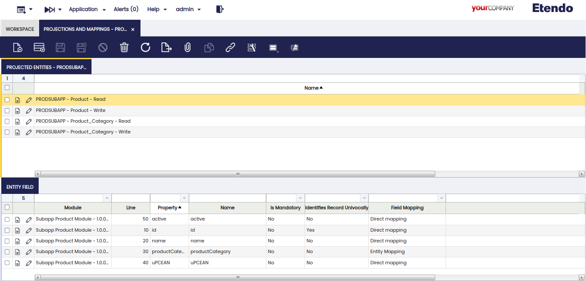


## Create a New Repository

Now to interact with a data warehouse we have to create a repository in the Tables and Columns window select the table `M_Product`, go to the `Repository` tab and create a new record with the following values:

| Field       | Value                                             |
| ----------- | --------------------------------------------------|
| Module      |`Subapp Product Module - 1.0.0 - English (USA)`    |


  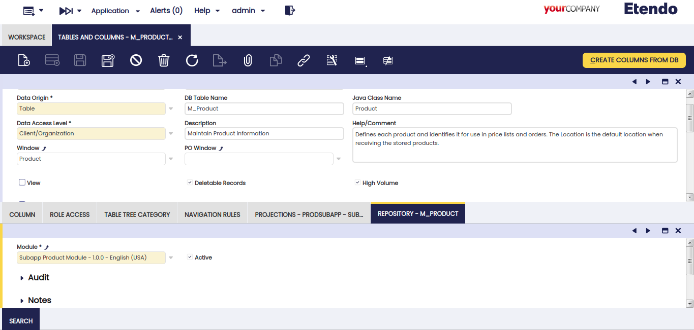

## Create a New Search

Next we will define a search method to be used later when we want to consume the products. To create this new filter/search method, in the Repository tab of the `M_Product` table, create a new record with the following data:

| Field       | Value                                                                                            |
| ----------- | ------------------------------------------------------------------------------------------------ |
| Method Name |`getFilteredProducts`                                                                             |
|  Query      |`SELECT e FROM Product e WHERE (e.active = true) AND (lower(e.name) LIKE lower('%' || :name || '%') OR lower(e.uPCEAN) LIKE lower('%' || :name || '%')) order by e.updated desc`   |


  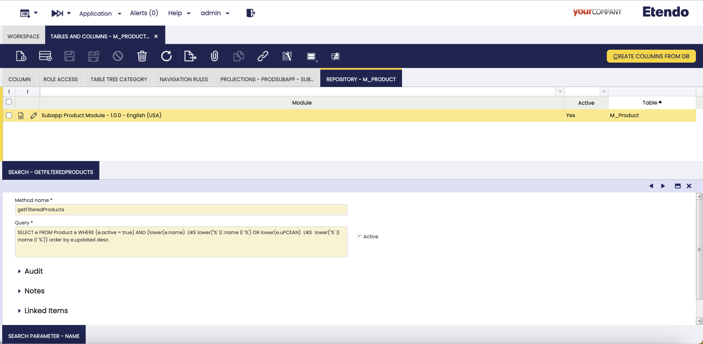

### Creating a New Search Parameter

  To define the parameter we defined in the previous query we need to create a new row in the Search Parameter tab and add the following record:

| Field | Value         |
| ----- | ------------- |
| Line  |`10`           |
| Name  |`name`         |
| Type  |`String`       |


  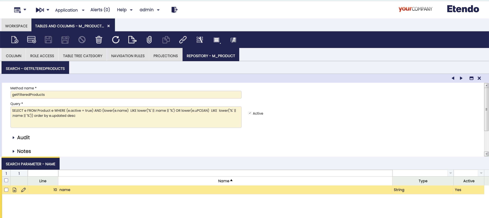


## Setting up the Development Environment

Before customizing and programming your sub-application, ensure your development environment is properly set up. The following steps detail how to do this:

1. **Create a Java Package:** 
   Create a Java package in the `modules_rx` directory of your Etendo environment. This package should match the Etendo RX Java package created in Etendo Classic for your sub-application. For instance, if you're developing a product sub-application, you could create a package like `com.etendorx.subapp.product`.   
  
2. **Generate Entities Using Etendo RX:**
   Use Etendo RX to generate entities for your sub-application's data structure. Run the command `./gradlew rx:generate.entities` in the root of your Etendo environment. This generates essential directories and files like `lib`, `src-db`, and `src-gen` in your Java package.
   
    Run the following command in the root of your Etendo environment:

    ```bash title="Terminal"
    ./gradlew rx:generate.entities
    ```

    Once generated `com.etendoerx.subapp.product` inside `modules_rx` add a file named `build.gradle` and the `src/main/java/com/etendorx/subapp/product/javamap` folders inside add the `ProductValue.java` mapping java class. 
    
    ```
    modules-rx
    └── com.etendoerx.subapp.product
        ├── build 
        ├── lib
        ├── src
        │   └── main
        │       └── java
        │           └── com
        │               └── etendorx
        │                   └── subapp
        |                       └── product
        |                           └── javamap
        |                               └── ProductValue.java
        ├── src-gen
        └── build.gradle
    ```

    ```java title="ProductValue.java"
    package com.etendorx.subapp.product.javamap;

    import com.etendorx.entities.jparepo.FinancialMgmtTaxCategoryRepository;
    import com.etendorx.entities.jparepo.OrganizationRepository;
    import com.etendorx.entities.jparepo.ProductCategoryRepository;
    import com.etendorx.entities.jparepo.UOMRepository;
    import com.etendorx.entities.mapper.lib.DTOWriteMapping;
    import com.etendorx.entities.mappings.PRODSUBAPPM_ProductDTOWrite;
    import org.apache.commons.lang3.StringUtils;
    import org.openbravo.model.common.plm.Product;
    import org.springframework.stereotype.Component;

    @Component("PRODSUBAPPProductValueWrite")
    public class ProductValue implements DTOWriteMapping<Product, PRODSUBAPPM_ProductDTOWrite> {

      private final OrganizationRepository organizationRepository;
      private final ProductCategoryRepository productCategoryRepository;
      private final UOMRepository uomRepository;
      private final FinancialMgmtTaxCategoryRepository financialMgmtTaxCategoryRepository;

      public ProductValue(OrganizationRepository organizationRepository,
          ProductCategoryRepository productCategoryRepository,
          FinancialMgmtTaxCategoryRepository financialMgmtTaxCategoryRepository,
          UOMRepository uomRepository) {
        this.organizationRepository = organizationRepository;
        this.productCategoryRepository = productCategoryRepository;
        this.financialMgmtTaxCategoryRepository = financialMgmtTaxCategoryRepository;
        this.uomRepository = uomRepository;
      }

      @Override
      public void map(Product entity, PRODSUBAPPM_ProductDTOWrite dto) {
        if (StringUtils.isEmpty(entity.getSearchKey())) {
          entity.setSearchKey("TEST " + Math.random());
        }
        if (StringUtils.isEmpty(entity.getDescription())) {
          entity.setDescription("default");
        }
        if (entity.getOrganization() == null) {
          entity.setOrganization(
              organizationRepository.findById("B843C30461EA4501935CB1D125C9C25A").orElse(null));
        }
        if (entity.getProductCategory() == null) {
          entity.setProductCategory(
              productCategoryRepository.findById("DC7F246D248B4C54BFC5744D5C27704F").orElse(null));
        }
        if (StringUtils.isEmpty(entity.getProductType())) {
          entity.setProductType("I");
        }
        if (entity.getTaxCategory() == null) {
          entity.setTaxCategory(
              financialMgmtTaxCategoryRepository.findById("E020A69A1E784DC39BE57C41D6D5DB4E")
                  .orElse(null));
        }
        if (entity.getUOM() == null) {
          entity.setUOM(uomRepository.findById("100").orElse(null));
        }
      }
    }

    ```

    ``` groovy title="build.gradle"
    plugins {
      id 'java'
      id 'org.springframework.boot'
      id 'io.spring.dependency-management'
    }

    group = 'com.etendorx.subapp'
    version = "1.0.0"
    sourceCompatibility = JavaVersion.VERSION_17

    java {
      sourceCompatibility = '17'
    }

    ext {
        includeInDasDependencies = true
    }

    repositories {
      mavenCentral()
      maven {
        url = "https://maven.pkg.github.com/etendosoftware/etendo_rx"
        credentials {
          username = "${githubUser}"
          password = "${githubToken}"
        }
      }
      maven {
        url = "https://repo.futit.cloud/repository/etendo-snapshot-jars"
        credentials {
          username = "${nexusUser}"
          password = "${nexusPassword}"
        }
      }
    }

    ext {
      set('springCloudVersion', "2022.0.4")
      includeInDasDependencies = true
    }

    dependencies {
      implementation 'org.springframework.cloud:spring-cloud-starter-config'

      compileOnly 'org.projectlombok:lombok:1.18.22'
      annotationProcessor 'org.projectlombok:lombok:1.18.22'

      implementation project(path: ':com.etendorx.entities')
      annotationProcessor 'org.projectlombok:lombok:1.18.22'

      implementation "com.etendorx:das_core:" + findProperty("rx.version")
      implementation project(path: ':com.etendorx.entities')

      implementation 'org.springframework.boot:spring-boot-starter-data-jpa'
      testImplementation 'org.springframework.boot:spring-boot-starter-data-rest:2.5.10'
      testImplementation 'org.springframework.boot:spring-boot-starter-test'
      testImplementation 'org.testcontainers:postgresql:1.17.3'
      testImplementation 'org.testcontainers:junit-jupiter:1.17.3'
      testImplementation ('com.etendorx:das') {
        transitive = false
        exclude group: 'com.etendorx.test.grpc'
      }
      testImplementation (':com.etendorx.utils:auth') {
        exclude group: 'org.slf4j', module: '*'
      }
      implementation 'org.springdoc:springdoc-openapi-starter-webmvc-ui:2.2.0'
    }

    dependencyManagement {
      imports {
        mavenBom "org.springframework.cloud:spring-cloud-dependencies:${springCloudVersion}"
      }
    }

    tasks.named('test') {
      useJUnitPlatform()
    }

    ```
    Verify the completion of this process and the accurate creation of all essential files and directories.

3. **Migrate the 'lib' Directory:**
    Move the `lib` directory from `modules_rx/<RXJavapackage>/lib` to `modules/<javapakage>/<subapp-name>/lib`. In our particular example, from the root of your Etendo environment, execute the following command to move the `lib` folder:

    ```bash title="Terminal"
    mv modules_rx/com.etendorx.subapp.product/lib/ modules/com.etendoerp.subapp.product/subapp-product/
    ```

    ```
    modules
    └── com.etendoerx.subapp.product
        ├── src-db 
        └── subapp-product
            ├── .bundle
            ├── _tests_
            ├── android
            ├── ios
            ├── lib
            ├── node_modules
            └── src
    ```

    Completing this step ensures that the libraries are correctly placed in the project, promoting efficient integration of your sub-application.
    

    !!! warning "Important"
        Consider moving the generated files and directories to the location described in the previous step after each execution of `./gradlew rx:generate.entities`. Otherwise, your sub-application may work incorrectly. It is strongly recommended to check and confirm the location of these files after each entity generation.

  4. In the `rxconfig/das.yaml` file you must declare the javapackage of the world you are developing with the following code:

    ``` groovy title="das.yaml"
    scan:
	    basePackage: com.etendorx.subapp.product
    ``` 
  
  5. **Restart the Etendo RX Service:**
    After successfully migrating the `lib` directory, restart the Etendo RX service to recognize the new changes. To do this, first stop the currently running Etendo RX service, and then restart it using the following command from the root of your Etendo environment:

    ```bash title="Terminal"
    ./gradlew rx:rx
    ```

    Executing this command will relaunch the Etendo RX service with the newly integrated libraries and configurations.

# Integrating Etendo RX with Etendo Sub-Application

This section details the integration of Etendo RX generated TypeScript entities with the Etendo Sub-Application, focusing on backend-frontend interactions.

### Custom Hooks in React Native

Custom hooks are a fundamental aspect of React Native, offering a modular approach to managing logic in applications. These hooks allow for creating, updating, and deleting functionalities, and are instrumental in abstracting complex interactions with the backend, thereby enhancing code maintainability and readability.

#### Overview of Custom Hooks

Custom hooks, such as `useProduct`, exemplify the integration between frontend components and backend services.

### Implementing Custom Hooks

Here's an example of how custom hooks are utilized:

```typescript title="useProduct.ts"
import { useState, useEffect } from 'react';
import { Product } from '../../lib/data_gen/product.types';
import ProductService from '../../lib/data_gen/productservice';

// Custom hook for managing products
export const useProduct = () => {
  const [products, setProducts] = useState<Product[]>([]);

  // Fetching data
  useEffect(() => {
    const fetchData = async () => {
      const data = await ProductService.BACK.getFilteredProducts(); 
      setProducts(data);
    };
    fetchData();
  }, []);

  // Function to handle product update
  const handleUpdateProduct = async (updatedProduct: Product) => {
    await ProductService.BACK.updateProduct(updatedProduct);
    // Optionally, update the products state to reflect the changes
  };

  // Function to get filtered products (if needed)
  const getFilteredProducts = async (filterCriteria: any) => {
    const filteredProducts = await ProductService.BACK.getFilteredProducts(filterCriteria);
    setFilteredProducts(filtered);
    return filteredProducts; // This line is optional, allowing the function to return the filtered products
  };

  return {
    products,
    handleUpdateProduct,
    getFilteredProducts,
  };
};
```

## Implementing `useProduct` Hook in `Home` Component

The `Home` component serves as a central hub for product management within our React Native application, which allows interacting with product data. The `useProduct` custom hook provides functions for retrieving and updating products, which the `Home` component uses to maintain its state and user interface.

### Example Usage

Using the Table component from [Etendo UI Library](https://www.npmjs.com/package/etendo-ui-library){target="_blank"}, the `Home` component lists the products, displaying a loading spinner while the data is being fetched. The `useProduct` hook is used to manage the data and loading state, ensuring that the component remains responsive and user-friendly.

```typescript title="Home.tsx"
import React, { useEffect, useState } from 'react';
import { View } from 'react-native';
import useProduct from '../../hooks/useProduct';
import { Table } from 'etendo-ui-library';

const Home = () => {
  // data is the list of products, as a result of a RX consult in useProduct
  // loading is a boolean that indicates if the data is being loaded
  const { data, loading } = useProduct();
  ...
  return (
    <View>
    ...
      <TableUI
        columns={dataColumns}
        data={data} // here is used to list the products
        isLoading={loading} // here is used to show a loading spinner
        onLoadMoreData={onLoadMoreData}
        commentEmptyTable={locale.t('Table.textEmptyTable')}
        textEmptyTable={locale.t('Table.commentEmptyTable')}
        pageSize={PAGE_SIZE}
      />
      ...
    </View>
  );
};

export default Home;
```

Based on this, the `Home` component is presented as an efficient product data manager, highlighting the main actions of obtaining and visualizing products, presenting a sub-application design and allowing real-time updates and fluid interactions with the user.

### Conclusion

The integration of Etendo RX with Etendo Sub-Applications using custom hooks like `useProduct` enhances the development process and the user experience. It provides a seamless connection between backend services and a React Native frontend

In the `Home.tsx` component, we observed the practical application of these hooks, which resulted in a dynamic, responsive, and user-friendly interface. This approach not only streamlines the development process but also ensures that the code remains maintainable and readable.

While the example focused on listing products using a table, it's important to note that the distributed code includes additional functionalities. These include **editing**, **adding**, and **deleting** products, further demonstrating the versatility and comprehensive nature of the `useProduct` hook within the application.

Attached below is an example of **F&B International Group's products**, obtained through Etendo RX, demonstrating the efficiency between backend and frontend operations in a practical sub-application context.

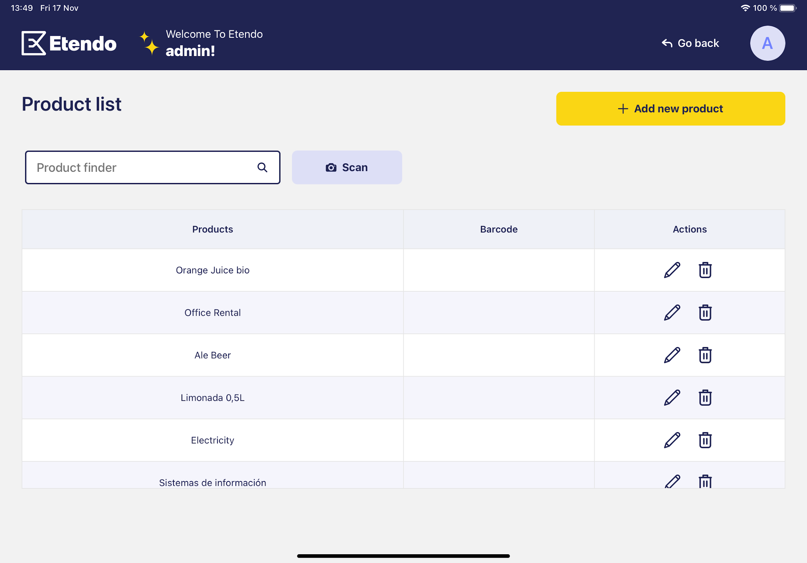

In essence, this integration is a significant stride in creating robust, scalable, and intuitive mobile applications within the Etendo ecosystem.