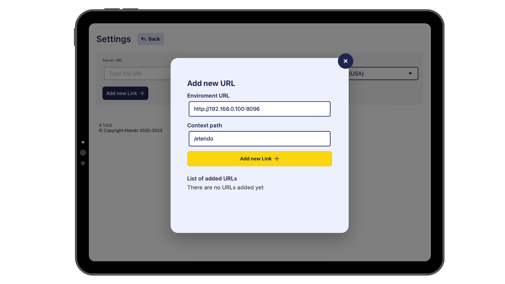
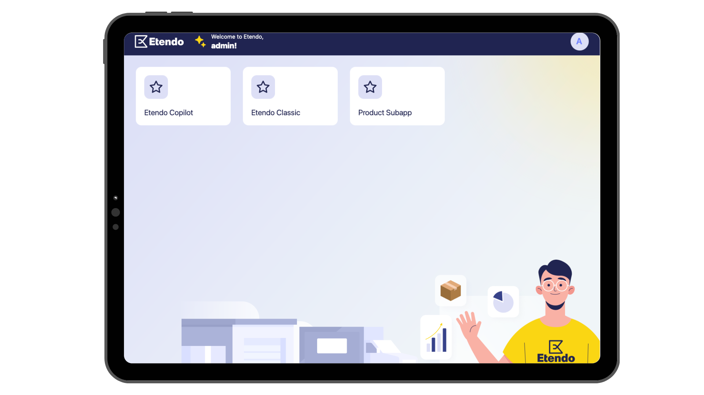
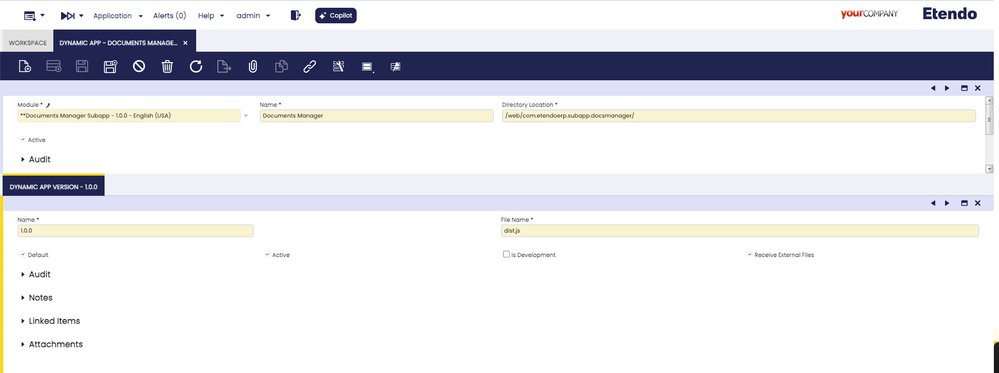

---

tags:
    - Etendo Mobile
    - Etendo RX
    - Dynamic App Configuration
    - Subapp
---

# Create New Subapplication

## Overview

This tutorial provides a step-by-step guide to creating a new subapplication within **Etendo Mobile**. By following these instructions, you will learn how to fully utilize the capabilities of **Etendo RX** and leverage the visual components available in the **Etendo UI Library** to build a functional subapplication.

The tutorial will guide you through the creation of the *Product Subapp*, a simple application that enables the addition, deletion, and modification of products, as well as their visualization in a grid. Upon completion, you will have the skills to create and distribute subapplications as modules, thereby extending the mobile functionality of Etendo.


!!! info
    Before beginning, ensure that your local environment meets all necessary requirements by reviewing the Etendo Mobile [Getting Started](../getting-started.md) section.


## Module Setup 

### Create New Etendo Classic Module

:material-menu: `Application` > `Application Dictionary` > `Module`

1. As a System Administrator role, open the **Module** window and create a new register. This module will be used to develop and distribute the application.

    <figure markdown="span">
    
    <figcaption>Product Subapp module configuration example</figcaption>
    </figure>

    !!! tip
        - Notice that the name can be anything you want, but the type has to be set as Module.
        - The _description_ field is free and also _required_.
        - The _Is Rx_ checkbox indicates that this module will include RX service configurations, the RX service Javapackage must be specified.
        - The _Is React_ checkbox indicates that this module includes a subapplication and React Native code is generated.
        - In this case, start from `1.0.0` module version and set the DB Prefix as `ETSAPPP`.


### Dynamic App configuration

:material-menu: `Application` > `General Setup` > `Application` > `Dynamic App`

Configure and export dynamic applications in Etendo Classic, which are displayed dynamically in Etendo Mobile.

In the **Dynamic App** window, specify the subapplication path and version. 

For the example we are following, the Dynamic App in Etendo must be configured with the following form fields and corresponding values:


Fields to note:

- **Module**: The module that can export the window configuration. In our example case, set `Product SubApp`.
- **Name**: Name with the application will be shown. In our example case, set `Product Subapp`
- **Directory Location**: The path where the compiled application bundle is located. In development, the path is empty `/`, but in production, the path is `/<javapackage>/web/`. In our example case, set `/`
- **Active**: To select if this application is active or not. In our example case, set `true`


The **Dynamic App Version** tab allows the application to be versioned, enabling both development and production versions.

Fields to note:

- **Name**: Name of the application version E.g. `dev` or `1.0.0`. In our example case, set `dev`
- **File Name**: The bundle name of the compiled application, by default `dist.js`.
- **Default**: This check defines that this version is productive. In our example case, set `false`
- **Is Development**: This check defines that this version is in development and can be deployed locally. In our example case, set in `true`
- **Active**: To select if this application version is active or not. In our example case, set `true`

!!! info
    For more information visit the [Dynamic App](../../etendo-classic/bundles/platform/dynamic-app.md) developer guide.

### Role configuration
:material-menu: `Application` > `General Setup` > `Security` > `Role`

Logged in as the **Group Admin** role (which is the default role for accessing Etendo Mobile), the settings are applied as specified below.


!!! warning "Important"
    Keep this dynamic app as _active_.

### Export the Module

1. After saving all the configuration, you have to export the changes. Open a terminal in the root of your **Etendo Classic** project and execute the following command:
    
    ``` bash title="Terminal"
    ./gradlew export.database --info
    ```

    !!!success "Important"
        The output must be a "BUILD SUCCESSFUL" message.

3. A new module is created in the `/modules` folder, with the following structure

    ```
    modules
    └── com.etendoerp.subapp.product
        └── src-db 
    ```

## Dockerized Services

Before proceeding, it is necessary to start the **Etendo RX** services. These services provide a security layer (Auth Service), a data access layer (Das Service), which are essential for consuming or writing data in Etendo and Edge Service . Additionally, by selecting the **isReact** checkbox in the previously defined module, React code will be automatically generated, allowing for easier data access.

To launch all the services, it is necessary to define the following configuration variables in the `gradle.properties` file:

```groovy title="gradle.properties"
docker_com.etendoerp.etendorx=true
```

!!!info
    For more information about how to handle Etendo Dockerizations, visit [Docker Management](../../etendo-classic/bundles/platform/dependency-manager.md). 

??? Note "Tomcat and PostgresSQL Dockerized (Optional)"
    It is also possible to run the dockerized [PostgreSQL service](../platform/docker-management.md#postgres-database-service) and [Tomcat service](../platform/tomcat-dockerized-service.md), **optionally** adding the [Platform Extensions Bundle](https://marketplace.etendo.cloud/#/product-details?module=5AE4A287F2584210876230321FBEE614){target=_isblank} and the following configuration variables:

    ```groovy title="gradle.properties"
    docker_com.etendoerp.tomcat=true
    docker_com.etendoerp.docker_db=true
    ```

Then, to effectively run the services, it is necessary to **execute the command** in the terminal: 

```bash title="Terminal"
./gradlew resources.up
```

Here, all the services and their respective logs can be seen running using [Docker Desktop](https://www.docker.com/products/docker-desktop/){target=_isblank} tool.


### RX Config window
:material-menu: `Application` > `Etendo RX` > `RX Config`

This configuration window stores the access data for Etendo RX services, which are crucial for the interaction between different services. In this case, two records need to be created: one for the **RX Config** service, responsible for distributing the dynamic configurations of other available services, and another for the **Auth** service, which provides security utilities. The Auth service must be accessible by the subapplication to obtain the authentication token for requests.

As `System Administrator` role, in this window, it is necessary to add two entries, one for each service to be used. The following fields should be included:

- **Service Name**: The name of each service.
- **Service URL**: The internal URL of the Docker service.
- **Updatable Configs**: Check this checkbox.
- **Public URL**: Configure the publicly accessible URL for the service.

See the configuration examples bellow and replicate them. 

!!!info
    The **Public URL** field only needs to be configured when the subapplication is set to production.


!!!info 
    If using Dockerized Tomcat, the URLs within the container's network are `http://config:8888` and `http://auth:8096`.


## Projections and Search

This section covers the creation of projections, mappings, and searches, which enable the generation of a dynamic REST API in the RX DAS service. These configurations allow for reading, writing, and filtering data. Projections are applied to Etendo Classic tables, creating a subset of data that can be interacted with through the API.


### Create a Projection
:material-menu: `Application` > `Etendo RX` > `Projections and Mappings`

1.  As a `System Administrator` role, it is required to create a projection that reflect partial views of the Product class and contain only the necessary properties.

2. To do this, we will go to the `Projections and Mappings` window and create a new projection, select the module under development `Product SubApplication - 1.0.0 - English (USA)`, where these configurations will be exported and in the name field we define `ProdSubApp`.

3. Now, with the selected projection we add in the tab `Projected Entities` two projections, one for reading data, selecting the table `M_Product` and in the Mapping Type field we select `Etendo to external system` and another projection for writing data, selecting again the table `M_Product` and in the Mapping Type field `External system to Etendo`.  The other fields are auto-completed with respect to these values.

<figure markdown="span">
 	
	<figcaption>Projection and Projected Entities configuration example</figcaption>
</figure>

### Creating Entity Fields

1. Now, we define which fields we want to retrieve. To do this, we start by selecting the data reading projection `PRODSUBAPP - Product - Read` and run the `Create Projection Fields` process, in the pop-up we will select the fields to project. In our example case: 

    - active
    - id
    - name
    - productCategory
    - searchkey
    - taxCategory
    - UOM
    - UPCEAN

    !!! note
        While not all of these fields will be displayed in the application, as record editing is allowed, we are also selecting all the mandatory fields to create a product.

    <figure markdown="span">
    
    <figcaption>Create read projection fields process execution example</figcaption>
    </figure>


2. Now we define which fields should be saved when creating or editing a record, in this case we select the write projection ` PRODSUBAPP - Product - Write` and run the process `Create Projection Fields` selecting the same fields as for the read one

    - active
    - id
    - name
    - productCategory
    - searchkey
    - taxCategory
    - UOM
    - UPCEAN


    <figure markdown="span">
    
    <figcaption> Entity fields created example</figcaption>
    </figure>

3. In the case of the `productCategory`, `taxCategory` and `UOM` fields in the application they will not be editable, but they must be autocompleted with a default value, for this we can use constant mappings. If new Products are created, these default values will be used.

    To do this, we go to the `application` > `Etendo RX` > `Constant Values` window and define constant IDs of default values. Here are some example IDs:

    | Name       | Default Value                              |
    | ---------------- | ------------------------------------ |
    | `ProductCategory`|`DC7F246D248B4C54BFC5744D5C27704F`    |
    | `taxCategory`    |`43A120C9377B4537B5D1976D9B1233D7`    |
    | `uOM`            |`100`                                 |
   
    <figure markdown="span">
     
    <figcaption>Constant values definition example</figcaption>
    </figure>
    

4. Finally selecting the `PRODSUBAPP - Product - Write` write projection, edit the `productCategory`, `taxCategory` and `UOM` records, modify the `Field Mapping` field to `Constant Mapping`, delete the `Jsonpath` and select the corresponding value in the `Constant Value` drop-down list, defined in the previous step.

    <figure markdown="span">
    
    <figcaption>Entity field tab, constant values definition example</figcaption>
    </figure>


### Create a Search in Projected Data

Now, when reading data, it is possible to create filters, for this we have to associate these filters to a table and it is possible to export this filter in the module under development. 
To do this, we open the `Tables and Columns` window, in our example select the `M_Product` table, go to the `Repository` tab and create a new record with the development module.  Then we create a new record in the `Search` tab

<figure markdown="span">
    
    <figcaption>Repository Creation Example</figcaption>
</figure>

### Create a New Search and Search Parameter

Next, we will define a search method to be used when we want to consume the products. To create this new filter/search method, in the Repository tab of the `M_Product` table, create a new record with the method name `getFilteredProducts` and the hql query filter. 

```
SELECT e FROM Product e WHERE (e.active = true) AND (lower(e.name) LIKE lower('%' || :name || '%') OR lower(e.uPCEAN) LIKE lower('%' || :name || '%')) order by e.updated desc
```
This query filters active products by name or bar code. 

As we can see in the query, it receives the`:name` parameter of String type that we define in the `Search Parameter` tab.

<figure markdown="span">
    
    <figcaption>Search and Search Parameter creation example</figcaption>
</figure>

### Restart the Etendo RX Service

Restart the Das RX service to recognize the projections and mappings.

```bash title="Terminal"
./gradlew rx.das.restart
```

!!! info 
    By accessing [http://localhost:8092/swagger-ui/index.html](http://localhost:8092/swagger-ui/index.html), the RX DAS Service Swagger can be visualized. This interface allows for consultation of the endpoints generated based on the previously made configurations.

    


## Creating the Subapplication

1. Now, create the subapplication based on a template published in NPM, [Etendo Subapp Data Template Typescript ](https://www.npmjs.com/package/etendo-subapp-data-template-typescript){target="_blank"}. Execute the Gradle command to automatically create the subapplication within the module under development.

    ``` bash title="Terminal"
    ./gradlew subapp.create -Ppkg=<javapackage> --info
    ```
    In the example we are working on, use the following command:

    ```bash title="Terminal"
    ./gradlew subapp.create -Ppkg=com.etendoerp.subapp.product --info
    ```
    
    A new subapplication will be created within the module, with the following structure:

    ```
    modules
    └── com.etendoerp.subapp.product
      ├── src-db 
      └── subapp
          ├── .bundle
          ├── _tests_
          ├── android
          ├── ios
          ├── lib
          ├── node_modules
          └── src
          └── App.tsx
    ```


## Product Subapp Example
This section covers an overview about the product subapplication example screens and principal parts of the subapplication.

!!! info "Consideration"
    The applications must be developed for both platforms: phone and tablet. 
   
### Home Screen 
 
- This is the main screen of the subapplication. It will show a list of products. Also, it will allow us to edit and remove a product, find a product by name and navigate to the detail of a product.

**Phone View**
<figure markdown>
{ width="300", align=left } 
{ width="300", align=right}
</figure>
**Tablet View**


- The route to this screen is `src/screens/home/index.tsx` and the content:

``` javascript title="src/screens/home/index.tsx"
import React from 'react';
import TableList from '../../components/table/list';
import { NavigationProp } from '@react-navigation/native';
import { INavigationContainerProps } from '../../interfaces';
import locale from '../../localization/locale';
import useProduct from '../../lib/data_gen/useProduct';
import { Product } from '../../lib/data_gen/product.types';

interface TableListProps {
  navigation: NavigationProp<any>;
  route: any;
  navigationContainer: INavigationContainerProps;
}

const Home = (props: TableListProps) => {
  const { getFilteredProducts, updateProduct } = useProduct();
  return (
    <TableList
      deleteDataItem={async (item: Product) => {
        item.active = false;
        await updateProduct(item);
      }}
      {...props}
      columns={[
        {
          key: 'id',
          primary: true,
          visible: false,
        },
        {
          key: 'name',
          label: locale.t('Table.products'),
          visible: true,
          width: '50%',
        },
        {
          key: 'uPCEAN',
          label: locale.t('Table.barcode'),
          visible: true,
          width: '30%',
        },
      ]}
      getData={getFilteredProducts}
      labels={{
        dataName: 'Product',
        navbarTitle: locale.t('Home.welcome'),
        containerTitle: locale.t('Home.productList'),
        buttonNew: locale.t('Home.newProduct'),
        searchPlaceholder: locale.t('Home.typeProduct'),
        successfulDelete: locale.t('Success.deleteProduct'),
        errorDelete: locale.t('Error.deleteProduct'),
      }}
    />
  );
};

export default Home;
```

### Product Detail

{ width="300"}

- This screen will show the detail of a product. Also, it will allow us to edit the product.
- It is the same screen used to create a new product, if the prop does not have ID.
- The route to this screen is `src/screens/productDetail/index.tsx`,  add the content:

``` javascript title="src/screens/productDetail/index.tsx"
import React, { useState } from 'react';
import TableDetail from '../../components/table/detail';
import { NavigationProp } from '@react-navigation/native';
import locale from '../../localization/locale';
import useProduct from '../../lib/data_gen/useProduct';

interface TableDetailProps {
  navigation: NavigationProp<any>;
  route: any;
}

const ProductDetail = (props: TableDetailProps) => {
  const { createProduct, updateProduct } = useProduct();
  const [id, setId] = useState<string>('');
  const [searchKey, setSearchKey] = useState<string>('');
  const [name, setName] = useState<string>('');
  const [uPCEAN, setUPCEAN] = useState<string>('');
  return (
    <TableDetail
      {...props}
      createData={async () => {
        await createProduct({ searchKey, name, uPCEAN });
      }}
      updateData={async () => {
        await updateProduct({ id, searchKey, name, uPCEAN });
      }}
      fields={[
        {
          key: 'id',
          visible: false,
          setValue: setId,
          getValue: id,
          labels: {
            title: '',
            placeholder: '',
          },
        },
        {
          key: 'searchKey',
          setValue: setSearchKey,
          getValue: searchKey,
          labels: {
            title: locale.t('ProductDetail.searchKey'),
            placeholder: locale.t('ProductDetail.searchKeyExample'),
          },
        },
        {
          key: 'name',
          setValue: setName,
          getValue: name,
          labels: {
            title: locale.t('ProductDetail.products'),
            placeholder: locale.t('ProductDetail.nameExample'),
          },
        },
        {
          key: 'barcode',
          setValue: setUPCEAN,
          getValue: uPCEAN,
          labels: {
            title: locale.t('ProductDetail.barcode'),
            placeholder: locale.t('ProductDetail.barcodePlaceholder'),
          },
        },
      ]}
      labels={{
        editTitle: locale.t('ProductDetail.editProduct'),
        newTitle: locale.t('ProductDetail.newProduct'),
        errorTitle: locale.t('Error.product'),
        successUpdateTitle: locale.t('Success.updateProduct'),
        successCreateTitle: locale.t('Success.saveProduct'),
        connectionError: locale.t('Error.connection'),
        navbarTitle: locale.t('Home.welcome'),
        cancel: locale.t('Common.cancel'),
        save: locale.t('Common.save'),
        successTitle: id
          ? locale.t('Success.updateProduct')
          : locale.t('Success.createProduct'),
      }}
    />
  );
};

export default ProductDetail;

```
    
### Navegation 

In addition, it is necessary to add the navigation configuration in the `app.tsx` file, in the return statement. This configuration provides the infrastructure to navigate between the different screens of the application.

``` javascript title="App.tsx"
<Stack.Navigator initialRouteName="Home">
      <Stack.Screen
        options={{ headerShown: false }}
        name="Home"
        initialParams={{ dataUser }}>
        {props => <Home {...props} navigationContainer={navigationContainer} />}
      </Stack.Screen>
      <Stack.Screen
        options={{ headerShown: false }}
        name="ProductDetail"
        initialParams={{ dataUser }}>
        {props => <ProductDetail {...props} />}
      </Stack.Screen>
</Stack.Navigator>
```

!!! info 
    For more information, visit [Navegation Stack](../concepts/subapp-structure.md#navigation-stack) concept in Subapplication Structure Page.

!!! info 
    For more information about the language management and translations, visit [Languague](../concepts/subapp-structure.md#language) concept.

!!! info 
    For more information about Subapplication Params, visit [Params from Etendo Mobile](../concepts/subapp-structure.md#params-from-etendo-mobile) concept.

### Running the Sub-application
1. Once the subapplication is created, the react-native code must be generated, with types and functions that interact with the RX DAS Service, for this we execute the command Gradle : 

    !!! info
        Make sure that the Etendo RX services are running and without errors before executing this command.

    ``` bash title="Terminal"
    ./gradlew subapp.build -Ppkg=<javapackage> 
    ```

    In our example case 
    ``` bash title="Terminal"
    ./gradlew subapp.build -Ppkg=com.etendoerp.subapp.product --info
    ```
    As we can see, it will be generated in the `/subapp/src/libs/` folder the functions and types that will be used for reading and writing `GET` and `POST` data.

    ```
    modules
    └── com.etendoerp.subapp.product
      ├── src-db 
      └── subapp
          └── src
            └── lib
                └── base
                    └── baseservice.ts
                    └── baseservice.types.ts
                └── data_gen
                    └── product.types.ts
                    └── productservice.ts
                    └── useProduct.ts      
    ```

2. In a terminal on path `modules/<javapackage>/subapp`, install the depedencies declared in the `package.json`,  following the command: 

    ``` bash title="Terminal"
    yarn install 
    ```

3. Then, to run the subapplication in development mode execute: 

    ``` bash title="Terminal"
    yarn dev 
    ```
    !!! note
        By default, the application run in development mode on `localhost` at port `3000`. Additionally, changes in the `/src` directory are automatically scanned, enabling dynamic updates to the application during development. This ensures that any modifications are reflected in real-time without restarting the application.


### Visualizing the subapplications

1. Open the [Etendo Mobile](../../../user-guide/etendo-mobile/getting-started.md) application on a mobile device. You can use either an emulator or a physical device.
    
2. In Etendo Mobile setting up the Edge service URL (Edge is an Etendo RX service, which implements a Spring cloud-driven gateway), by default the environment URL should be `http://<local-network-ip>:8096/` and the context path by default `/etendo`.

    !!! info
        To find out your IP address on the local network, you can run the command `ifconfig` in a Mac or Linux terminal or `ipconfig` in Windows CMD.
  
    

3. Login Etendo Mobile and you will see the list of subapps. Clicking on `Product Subapp` will access to development mode app.
    

4. Now you can view, filter, create, edit and delete products.

## Receiving Shared Files from Etendo Mobile

In this section, we will explain how to receive external files from another application into **Etendo Mobile** using as example new subapplication called **Documents Manager Subapp**.

!!! warning "Important"
    Ensure that the **Receive External Files** checkbox is set to `true` in the **Dynamic App** window. This is crucial for the subapplication to appear as an option when sharing external files.
    
    
The `sharedFiles` parameter is passed to the subapplication and used to process the received files. Below is the important excerpt from `App.tsx` where `sharedFiles` is handled:

Attached is the source code of the example application and the explanation of how to implement the file sharing functionality in your own sub-application. For more information visit [Documents Manager Subapp](https://github.com/etendosoftware/com.etendoerp.subapp.docsmanager){target="_blank"} repository.

