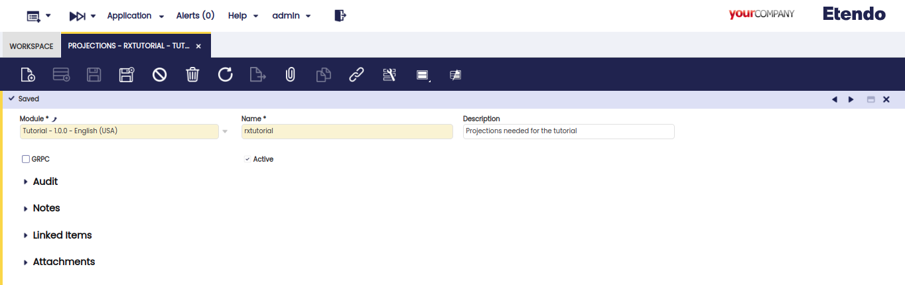

---
tags:
    - Etendo RX
    - DAS service
    - Projections
    - Mappings
    - Connector
    - Search
    - API
---

# Projections and Mappings

## Overview

When using Spring Data JPA to implement the persistence layer, the repository typically returns one or more instances of the root class. However, more often than not, we do not need all the properties of the returned objects.

In such cases, we might want to retrieve data as objects of customized types. These types reflect partial views of the root class, containing only the necessary properties. This is where projections are useful.

Start by opening *Projections* windows and creating a new projection with the following properties: ??

| Field       | Value                                 |
| ----------- | ------------------------------------- |
| Module      |`tutorial - 1.0.0 - English (USA)`     |
| Name        |`rxtutorial`                           |
| Description |`Projections needed for the tutorial`  |

  

### Header

A **projection** is a set of specific fields from an entity or combine fields from multiple entities. Projections are useful when we need to retrieve only a subset of data, as it reduces the amount of data we need to retrieve from the database, leading to improved performance.

To create a new projection in Etendo, it is necessary to complete the fields in the header of the **Projections and Mappings** window.

 TO UPDATE
+ Description

- Organization:
- Name:
- Module:
- GRPC: a checkbox that indicates this option is used instead of APIrest. [gRPC](https://grpc.io/){target="\_blank"} is a modern open source high performance Remote Procedure Call (RPC) framework that can run in any environment.
- Description:
- Active:

### Projected Entities

In this tab, the entities to be projected can be defined. They can have the Write type or the Read type.

VA?

Fields to note:

- Organization:
- Name: This fields is autocompleted according to the options selected in the Table and Mapping Type fields.
- Table:
- Identity:
- Mapping Type:
- Is Rest Endpoint: Checkbox
- External_Name:
- Active:

#### Create Projection Fields

With this button...

#### Entity Field

In this subtab, it...

VA?

Fields to note:

- Module:
- Organization:
- Property:
- Name:
- Is Mandatory: Checkbox
- Identifies Record Univocally: Checkbox

Mapping Configuration

- Field Mapping:
- Jsonpath:
- Constant Value:
- Active: Checkbox

#### Search

### Adding Entity Fields

When a projection is created, we need to define which fields we want to retrieve.
In our case, we will need the record ID, Business Partner name, Document No, Document Type name, and the Grand total.
Under the Projection tab navigate to the *Entity Field* tab and add the following fields:

|  Field Name         |  Property             |
| ------------------- | --------------------- |
| id                  |`id`                   |
| businessPartnerName |`businessPartner.name` |
| documentNo          |`documentNo`           |
| documentTypeName    |`documentType.name`    |
| grandTotalAmount    |`grandTotalAmount`     |

!!!note
    The *Property* field of this tab is handled with an Entity Mapping, this is like a Hibernate property.
    So, you can navigate the entities related from here. E.g. To get the Business Partner name, you can have it by accessing the entity *businessPartner* and then, adding the field that you want to filter, *name* in this case.

  

------------------------------------------------------------------

## Repository

In Spring Data, a repository is an abstraction that provides the operations relative to a domain class to interact with a data store.
To create the repository for our purpose, and the same as we did for projections, we need to go to Tables and Columns and look for `C_Order` table.

### Creating a New Repository

After selecting a table, in this case `C_Order`, we need to go to *Repository* tab and create a new record with the following values:

| Field       | Value                                |
| ----------- | ------------------------------------ |
| Module      |`tutorial - 1.0.0 - English (USA)`    |

 

------------------------------------------------------------------

## Search

### Creating a New Search

Next, we will define a search method to use later when we want to consume the orders. This query is taken as a filter for retrieving the orders.
To create this new filter/search method, under Repository tab of the `C_Order` table, create a new record with the following data:

| Field       | Value                                                                                  |
| ----------- | -------------------------------------------------------------------------------------- |
| Method Name |`findSalesOrder`                                                                        |
|  Query      |`select o from Order o where o.documentType.id = :documentType order by o.documentNo`   |

  

### Creating a New Search Parameter

As you can see in the query above, we use a parameter called `:documentType`. 
We can add this type of parameter to use it later by adding a corresponding value to it and filtering depending on the current needs.
To define the parameter, we need to create a new row on the *Search Parameter* tab of the *Search* tab. Fill it with the following settings:

| Field | Value         |
| ----- | ------------- |
| Line  |`10`           |
| Name  |`documentType` |
| Type  |`String`       |

In our case, we will filter depending on the Document Type of the orders.

  
