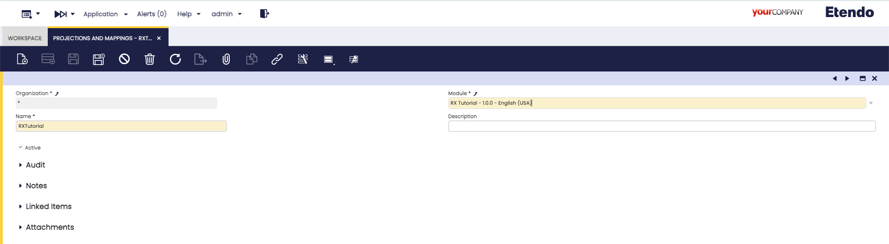
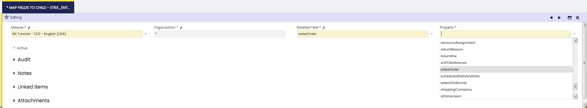
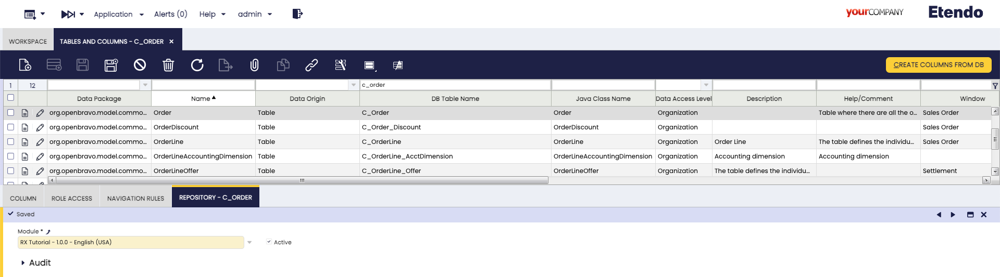

---
tags:
    - Etendo RX
    - DAS service
    - Projections
    - Mappings
    - Connector
    - Search
    - API
---

# Projections and Mappings

## Overview

When using Spring Data JPA to implement the persistence layer, the repository typically returns one or more instances of the root class. However, more often than not, we do not need all the properties of the returned objects.

In such cases, we might want to retrieve data as objects of customized types. These types reflect partial views of the root class, containing only the necessary properties. This is where projections are useful.

## Projections and Mappings Window

:material-menu: `Application` > `Etendo RX` > `Projections and Mappings`

A **projection** is a set of specific fields from an entity or combined fields from multiple entities. Projections are useful when we need to retrieve only a subset of data, as it reduces the amount of data we need to retrieve from the database, leading to improved performance.

This window allows the creation of data reading and writing endpoints in Etendo, using the DAS service. This service, based on this window configurations, dinamically generates the endpoints when launched.

To create a new projection in Etendo, it is necessary to complete the fields in the header of the **Projections and Mappings** window.

- Organization: Organizational entity within client.
- Name: It describes the name of the projection. The maximum amount of characters for this field is 10.
- Module: It indicates the module the element forms part of. This is the module in which the configuration is exported.
- Description: Description of the projection.
- Active: A check to indicate whether this projection is available or disabled.

### Projected Entities Tab

In this tab, the entities to be projected can be defined. They can have two types of projections: Read and Write. This means that, when interacting with an external system, it is possible to read the information in the Etendo Classic database to expose it to the other system. The other option is to write information into the Etendo Classic database, that is, to extract external system information to use it in Etendo.

When referring to an entity to project, this entity is related to a specific table.

!!!warning
    Remember,  it is always necessary to create both records, a write type one and read type one, so the generated endpoints work properly.

Fields to note:

- Organization: The corresponding organization of the entity
- Name: This field is autocompleted according to the options selected in the Table and Mapping Type fields, adding _Read_ or _Write_ accordingly.
- Table: It is the identifier that connects the Etendo entity to project with the database table, responsible to store the entity information.
- Mapping Type: In this case, there are two options: Etendo to external system and External system to Etendo. In the case of the Read type, the option to select is Etendo to external system. In the case of the Write type, the option to select is External system to Etendo.
- Is Rest Endpoint: Checkbox to allow the service to generate the endpoint or not.
    
    !!!info
        This box should not be checked, for example, when it is not necessary to expose a subentity endpoint.
- External_Name: parameter to call the API. It must be unique but it is possible to have more than one name for each entity. By default, it is autogenerated with the entity name, but in case of generating more than one, they should have different names.
- Active: A check to indicate whether this record is available or not.

#### Create Projection Fields Button

With this button, a pop up window is shown where you can find a list of all the fields to project and select the necessary ones. This process does not include List and Identity type projections.

!!!info
    The mandatory fields to project can be filtered with the _Is mandatory_ column.

#### Entity Field Subtab

In this subtab, each entity field to be included in the projection can be defined by the developer.

=== "Read Type"

    Fields to note:

    - Module: It indicates the module the element forms part of. This is the module in which the configuration is exported.
    - Organization: The corresponding organization of the entity
    - Property: This field has 3 types of options:
        - `_identifier`: This option allows projecting the field/s defined as identifier in the Tables and Columns window. This option always projects a string.
        - Standard: In this case, it is possible to select all the standard fields from the projected entity. Ex: string, number, date types, etc. Also, it is possible to navigate through the different entities. Ex: product.name, businessPartner.name, etc
        - `*List`: The properties that finish in "List", allow projecting a list of related entities. These lists are autogenerated from the columns with the Link to Parent Column checkbox selected. Ex: the property `OrderLineList` of the Order entity is generated since the `C_Order_ID` column from the `C_OrderLine` table is related with `C_Order` table.
    - Name: Output JSON Key. It must be unique but it is possible to have more than one name for each property. By default, it is autogenerated with the property name, but in case of generating more than one, they should have different names.
    - Identifies Record Univocally: Checkbox to use this record as an identifier. If no field has this check selected, the database ID of the table will be used.

    Mapping Configuration

    - Field Mapping: 
      - Direct Mapping: each property is shown as it is.
      - Java Mapping: It is a customizable mapping and can be configured through the Java Mappings window. If this option is chosen, it allows you to define more complex mappings or implement a specific logic The result of the mapping will be Json type. 
      - Entity Mapping: this option is used when it is necessary to relate two different projections. In this case, the Related Projection Entity field is enabled to select the projected entity. In case of projecting a list of elements, the selected entity is assigned to each item of the list.
      - Constant Mapping: If you choose this option, the constant value defined in the corresponding field is projected.
    - Related Projection Entity: Extra field shown when Entity Mapping option above is selected. Here, you can select the property to be projected for each entity in the mapping.
    - Constant Value: Only available when Constant Mapping is selected as the Mapping type. Here, you define the constant value to be used in the mapping.
    - Related Projection Identifiers: Extra field shown when Entity Mapping option above is selected. It is an information field to revise the identifier of the mapped entity.
    - Active: A check to indicate whether this record is available or disabled.

=== "Write Type"

    Fields to note:

    - Module: It indicates the module the element forms part of. This is the module in which the configuration is exported.
    - Organization: The corresponding organization of the entity
    - Property: This field has 3 types of options:
        - `_identifier`: This option allows projecting the field/s defined as identifier in the Tables and Columns window. This option always projects a string.
        - Standard: In this case, it is possible to select all the standard fields from the projected entity. Ex: string, number, date types, etc. Also, it is possible to navigate through the different entities. Ex: product.name, businessPartner.name, etc
        - `*List`: The properties that finish in "List", allow projecting a list of related entities. These lists are autogenerated from the columns with the Link to Parent Column checkbox selected. Ex: the property `OrderLineList` of the Order entity is generated since the `C_Order_ID` column from the `C_OrderLine` table is related with `C_Order` table.
    - Name: Output JSON Key. It must be unique but it is possible to have more than one name for each property. By default, it is autogenerated with the property name, but in case of generating more than one, they should have different names.
    - Is Mandatory: Checkbox only available for "Write" projections. This indicates that the projected property is mandatory when a new item is created.
    - Identifies Record Univocally: Checkbox to use this record as an identifier. If no field has this check selected, the database ID will be used.

    Mapping Configuration

    - Field Mapping: 
      - Direct Mapping: each property is shown as it is.
      - Java Mapping: It is a customizable mapping and can be configured through the Java Mappings window. If this option is chosen, it allows you to define more complex mappings or implement a specific logic The result of the mapping will be Json type. 
      - Entity Mapping: this option is used when it is necessary to relate two different projections. In this case, the Related Projection Entity field is enabled to select the projected entity. In case of projecting a list of elements, the selected entity is assigned to each item of the list.
      - Constant Mapping: If you choose this option, the constant value defined in the corresponding field is projected.
    - Create related: It enables the creation of related elements from a selected entity. Only available for Write type mappings.
    - Related Projection Entity: Extra field shown when Entity Mapping option above is selected. Here, you can select the property to be projected for each entity in the mapping.
    - Jsonpath: language to extract properties from Json objects. For more information, visit [Json](https://en.wikipedia.org/wiki/JSONPath){target="_blank"}.
    - Constant Value: Only available when Constant Mapping is selected as the Mapping type. Here, you define the constant value to be used in the mapping.
    - Related Projection Identifiers: Extra field shown when Entity Mapping option above is selected. It is an information field to revise the identifier of the mapped entity.
    - Active: A check to indicate whether this record is available or disabled.

    **Map Fields to Child**

    This subtab is shown if the Create related check in the Entity Field subtab is selected. It allows the possibility to provide information from the parent fields to the child records. The records created in this subtab are useful to connect the projected entity fields to properties that belong to parent entities.

    Fields to note:

    - Module: It indicates the module the element forms part of. This is the module in which the configuration is exported.
    - Organization: The corresponding organization of the entity.
    - Related Field: Shows field options of the related projected entity already defined.
    - Property: If it is necessary to create a new field, this is the property to use to create it.
    - Active: A check to indicate whether this record is available or disabled.

    **Example:**

 	
    

    In this example, when writing a projection on the C_OrderLine table and projecting the orderLineTaxList (with the list of applicable taxes for each line), it is necessary to first select the Create Related checkbox. This option will create the related elements in the input list. However, the tax lines require a mandatory reference to the header, specifically the Order.
    
    For this, the information must be transmitted from the source entity to the mapped entity. This can be done by adding a new record in the Map Fields to Child tab. In the Related Field, select the child entity field corresponding to the projected entity (e.g., the Sales Order field in the OrderLineTax entity). In the Property field, select the field from the source entity (e.g., Sales Order from OrderLine entity).
    
    This setup ensures that when new order lines are created, the related taxes reference the original order. This configuration is only necessary if the mapped column does not have the Link to Parent Column checkbox selected. In this example, this refers to the Sales Order column in the C_OrderLineTax table.
	

## Tables and Columns Window

:material-menu: `Application` > `Application Dictionary` > `Tables and Columns`

In this window, it is possible to define table associated searches. These are custom filters with HQL queries. 

This window also allows the creation of search endpoints, using the DAS service. This service, based on this window configurations, dinamically generates the endpoints when launched.

### Repository Tab

In Spring Data, a repository is an abstraction that provides the operations relative to a domain class to interact with a data store.
To create the repository for our purpose, we need to go to Tables and Columns, select a table and, in the *Repository* tab, create a new record defining the module in development where the configurations are exported. 

#### Search Subtab

Then, we can define searches to get filtered data from the selected table. 

<figure markdown="span">
 	
	<figcaption>Search example in the C_Order table</figcaption>
</figure>

Fields to note:

- Method Name: the name of the search which is used in the endpoint generation.
- Query: HQL query to filter the table elements.

##### Search Parameter Subtab

In this subtab, it is possible to define parameters to use in the search.

<figure markdown="span">
 	
	<figcaption>Parameter example used in the previous section search</figcaption>
</figure>

Fields to note:

- Name: Parameter name
- Type: Parameter type. It is a dropdown with the available base types.

## Constant Values Window

:material-menu: `Application` > `Etendo RX` > `Constant Values`

In this window, it is possible to define constant values to be used for [entity fields](#entity-field-subtab) in which the information must not be modified. This configuration is done in the [Projections and Mappings](#projections-and-mappings) window.

Fields to note:

- Module: It indicates the module the value forms part of. This is the module in which the configuration is exported.
- Organization: Organizational entity within client.
- Name: It describes the identifier name of the value.
- Constant Value: It describes the value to set, for example, an entity ID.