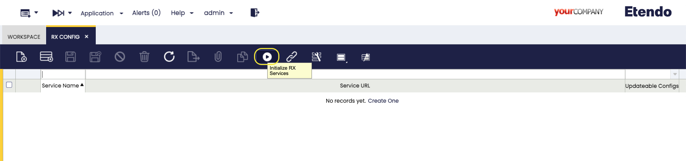

## Overview

This guide will help you set up Etendo, including both the Etendo Classic functionalities and Etendo RX, our reactive platform capable of executing microservices with database interaction and asynchronous actions.

## Requirements

1. Install Etendo Classic. For this, follow the [Etendo Classic installation guide](../../getting-started/installation.md).
2. Install the [Platform Extensions Bundle](https://marketplace.etendo.cloud/#/product-details?module=5AE4A287F2584210876230321FBEE614){target="_blank"}.
3. This project depends on the following tools:
    - [Docker](https://docs.docker.com/get-docker/){target="_blank"}: version `26.0.0` or higher.
    - [Docker Compose](https://docs.docker.com/compose/install/){target="_blank"}: version `2.26.0` or higher.


## Dockerized Services

In the platform bundle, you can find the Dockerized Services module, which provides the necessary architecture to distribute infrastructure. In this case, in this bundle, the module Etendo RX is also included and, to launch the Services distributed in it, a certain configuration is needed. In the `gradle.properties` file, add the following variable:

``` groovy title="gradle.properties"
docker_com.etendoerp.etendorx=true
```

!!!info
    For more information about how to handle Etendo Dockerizations, visit [Docker Management](../etendo-classic/bundles/platform/docker-management.md). 

??? Note "Tomcat and PostgresSQL Dockerized (Optional)"
    It is also possible to run the dockerized [PostgreSQL service](../platform/docker-management.md#postgres-database-service) and [Tomcat service](../platform/tomcat-dockerized-service.md), **optionally** adding the [Platform Extensions Bundle](https://marketplace.etendo.cloud/#/product-details?module=5AE4A287F2584210876230321FBEE614){target=_isblank} and the following configuration variables:

    ```groovy title="gradle.properties"
    docker_com.etendoerp.tomcat=true
    docker_com.etendoerp.docker_db=true
    ```

    If you want to debug Tomcat locally with IntelliJ, visit [Tomcat Dockerized Service](../../developer-guide/etendo-classic/bundles/platform/tomcat-dockerized-service.md).


###  Etendo RX Configurations

Before starting the dockerized services, there are some configurations that need to be done in Etendo Classic

### Client Setup 
:material-menu: `Application` > `General Setup` > `Client` > `Client`

It is necessary to configure the encryption token for the authentication in the `Client` window with the `System Administrator` role.
If the expiration time is equal to `0` the tokens do not expire.

Generate a random key with the **Generate key** button.


### RX Config window
:material-menu: `Application` > `Etendo RX` > `RX Config`

This configuration window stores the access data for Etendo RX services, which are crucial for the interaction between different services. As `System Administrator` role, in this window, run the `Initialize RX Services` process in the toolbar. 



After the execution of this process the default configuration variables are completed, depending on the configuration of the instance and the infrastructure, even the default parameters required by each service are configured.


!!!info
    The **Public URL** field only needs to be configured when the services is set to production.


### Launch RX services

Then, to effectively run the services, it is necessary to **execute the command** in the terminal: 

```bash title="Terminal"
./gradlew resources.up
```

Here, all the services and their respective logs can be seen running using [lazydocker](https://github.com/jesseduffield/lazydocker#installation){target="_blank"} or [Docker Desktop](https://www.docker.com/products/docker-desktop/){target="_blank"} for a simple and fast container management. 


By default, the following services should be up and running:

- Config
- Auth
- Edge
- Das

!!! success
    You have successfully set up the Etendo RX services. For more information, visit [Projections and Mappings](./concepts/projections.md) and [Creating a New Microservice](../../developer-guide/etendo-rx/tutorials/creating-a-new-microservice.md) page in the developer guide section.

