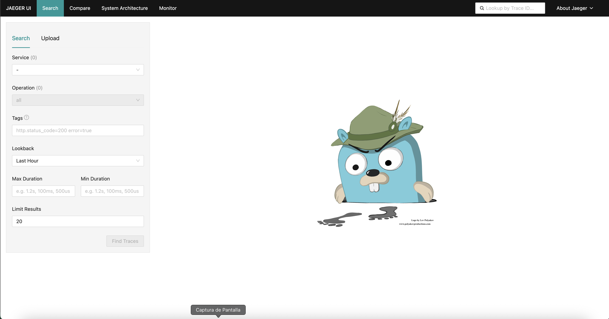
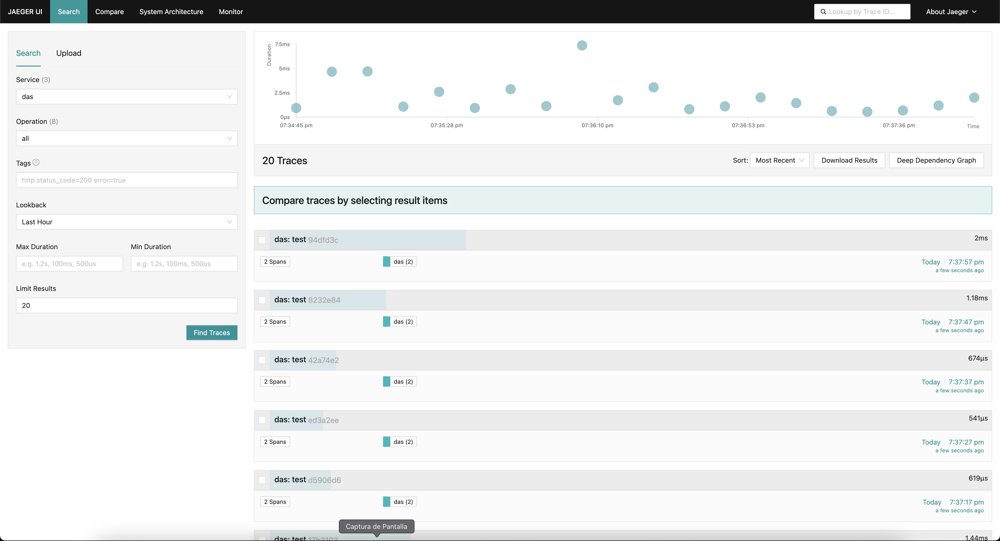
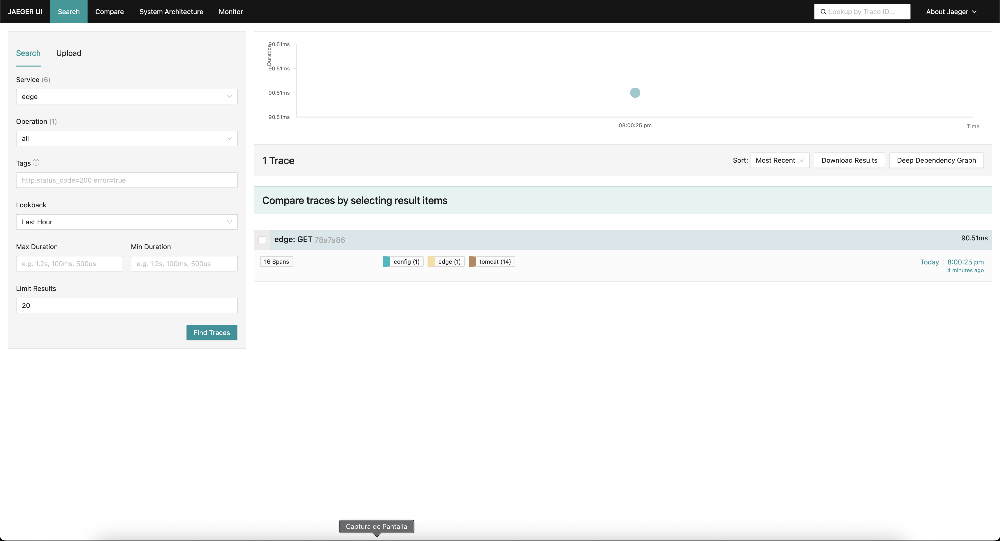
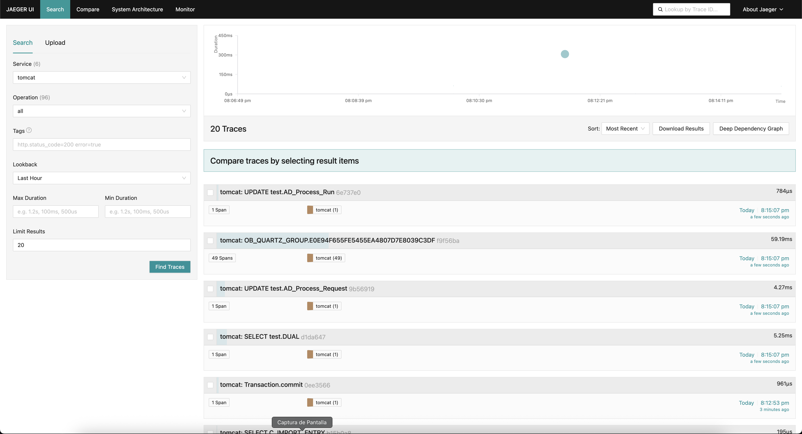

---
tags:
  - Etendo Rx
  - Docker
  - OpenTelemetry
  - Tomcat
  - Dynamic Das
  - Dynamic Gradle
status: beta
---
# How to Use OpenTelemetry (BETA)

!!! example  "IMPORTANT:THIS IS A BETA VERSION"
    - It is under active development and may contain **unstable or incomplete features**. Use it **at your own risk**, especially in production environments.
    - It should be used with **caution**, and you should always **validate backups** before executing any critical operation.

## Overview

OpenTelemetry is an open-source observability framework that defines a set of vendor-neutral APIs, SDKs, and instrumentation libraries for generating, collecting, and exporting telemetry data—namely **traces**, **metrics**, and **logs**. It provides a consistent programming model across applications and services, enabling you to capture detailed runtime behavior without coupling to any specific back end.

## Key Concepts

- **Span**: A single unit of work or operation, such as a database query or an HTTP request.
- **Trace**: A tree of spans representing an end-to-end request flow through multiple services.
- **Context Propagation**: The mechanism by which trace context (trace ID, span ID, baggage) is passed along asynchronous or remote calls.

## Why Use OpenTelemetry

- **Standardization**: Write instrumentation once; switch or combine back-ends at will.
- **End-to-End Visibility**: Correlate distributed operations across microservices, threads, and async boundaries.
- **Performance Analysis**: Identify latency hotspots, error rates, and service dependencies.
- **Extensibility**: Plug in custom exporters, processors, and samplers to fit your needs.

## Sending Traces to a Back End

1. **Instrument Your Code**
   - Add the OpenTelemetry Java SDK (or auto-injection agent) to your Rx-based services.
   - Create spans around critical operations (e.g., upstream requests, reactive pipelines like `Flux`/`Mono`).

2. **Configure an Exporter**
   - Use the **Jaeger exporter** provided by OpenTelemetry to batch and send spans over UDP or HTTP.
   - Point the exporter at your Jaeger collector’s address and port.

3. **Propagate Context**
   - Ensure that each downstream call carries the current trace context so that spans nest correctly.

## Jaeger: Distributed Tracing Back End

Jaeger is an open-source distributed tracing system originally developed by Uber. It provides:

- **Collector**: Receives spans from instrumented applications.
- **Storage**: Persists trace data (e.g., in Elasticsearch or Cassandra).
- **Query Service & UI**: Allows developers and operators to search, visualize, and analyze traces in real time.

## Prerequisites

1. Install Etendo Rx. For this, follow the [Etendo Rx installation guide](../getting-started.md).
2. Install the [Platform Extensions Bundle](https://marketplace.etendo.cloud/#/product-details?module=5AE4A287F2584210876230321FBEE614){target="_blank"}.
3. This project depends on the following tools:
    - [Docker](https://docs.docker.com/get-docker/){target="_blank"}: version `26.0.0` or higher.
    - [Docker Compose](https://docs.docker.com/compose/install/){target="_blank"}: version `2.26.0` or higher.

## Step 1: Configure Jaeguer Service

1. **Enable Utils Services**: Enable the necessary util service modules.In the `gradle.properties` file, add the following variable:

``` groovy title="gradle.properties"
docker_com.etendoerp.etendorx_utils=true
```

Once the Rx utils service is enabled, execute the following command in your terminal:

```bash
./gradlew resources.up
```

This will launch the Docker container running Jaeger. To access the Jaeger UI, navigate to `http://localhost:16686`



Initially, there will be no services exporting data to Jaeger. In the next step, we will cover how to enable trace export to Jaeger.

2. **Dynamic Das Services**: Services based on the Dynamic Das Docker image; currently, the only service using this image is `das`. To enable and configure trace export to Jaeger, edit the `gradle.properties` file adding the following variable:

   ``` groovy title="gradle.properties"
   otel.das.enable=true
   ```

   Optionally, you can add additional properties to the `gradle.properties` file to further configure the OpenTelemetry agent in the DAS service.

| Name                                                        | Description                                                                                              | Type     | Allowed Values                                                      | Default                                      | Notes                                                                                                                                                        |
|-------------------------------------------------------------|----------------------------------------------------------------------------------------------------------|----------|---------------------------------------------------------------------|----------------------------------------------|-------------------------------------------------------------------------------------------------------------------------------------------------------------|
| `otel.das.name`                                              | Das service name                                                           | string   |                                                  | *das*                                       |
| `otel.das.otlp.endpoint`                                              | string   | Any URL                                                             | `http://jaeger:4318`                         | Automatically appends `/v1/traces\|metrics\|logs}` depending on the signal type                                                                             |
| `otel.das.otlp.protocol`                                              | Transport protocol for OTLP                                                                              | enum     | `grpc`, `http/protobuf`, `http/json`                                | `http/protobuf`                              | —                                                                                                                                                            |
| `otel.das.otlp.timeout`                                              | Timeout (ms) for OTLP data export (traces, metrics, logs)                                                | integer  | Any positive number                                                 | `10000`                                      | —                                                                                                                                                            |
| `otel.das.metrics.exporter`                                              | Metrics exporter                                                                                         | enum     | `otlp`, `prometheus`, `console`, `logging`, `none`                  | `none`                                       | —                                                                                                                                                            |
| `otel.das.logs.exporter`                                              | Logs exporter                                                                                            | enum     | `otlp`, `console`, `logging`, `none`                                | `none`                                       | —                                                                                                                                                            |
| `otel.das.traces.exporter`                                              | Traces exporter                                                                                          | enum     | `otlp`, `zipkin`, `console`, `logging`, `none`                      | `otlp`                                       | —                                                                                                                                                            |


   Once OpenTelemetry is enabled in the Das service, execute the following command in your terminal:

   ```bash
   ./gradlew resources.up
   ```

   - This configuration enables trace export from the Das service to the Jaeger back end. Now, in the Jaeger UI, this service will be selectable.

   

!!! warning
    This functionality is only available starting from the `etendo/dynamic-das:1.1.0` image. For more information, see [Dynamic DAS v1.1.0](../getting-started.md/#dynamic-das-v110).

3. **Dynamic Gradle Services**:Services based on the Dynamic Gradle Docker image currently are `config`, `edge`, `auth`, `asyncprocess`, `obconnsrv` and `worker`.
To enable and configure trace export to Jaeger, add whichever variables you consider necessary to the `gradle.properties` file:

   ``` groovy title="gradle.properties"
   otel.config.enable=true
   otel.edge.enable=true
   otel.auth.enable=true
   otel.asyncprocess.enable=true
   otel.obconnsrv.enable=true
   otel.worker.enable=true
   ```

   Optionally, you can add additional properties to the `gradle.properties` file to further configure the OpenTelemetry agent in each service.

| Name                                                        | Description                                                                                              | Type     | Allowed Values                                                      | Default                                      | Notes                                                                                                                                                        |
|-------------------------------------------------------------|----------------------------------------------------------------------------------------------------------|----------|---------------------------------------------------------------------|----------------------------------------------|-------------------------------------------------------------------------------------------------------------------------------------------------------------|
| `otel.config.name`                                              | Config service name                                                           | string   |                                                  | *config*                                       |
| `otel.config.otlp.endpoint`                                              | string   | Any URL                                                             | `http://jaeger:4318`                         | Automatically appends `/v1/traces\|metrics\|logs}` depending on the signal type                                                                             |
| `otel.config.otlp.protocol`                                           | Transport protocol for OTLP                                                                              | enum     | `grpc`, `http/protobuf`, `http/json`                                | `http/protobuf`                              | —                                                                                                                                                            |
| `otel.config.otlp.timeout`                                              | Timeout (ms) for OTLP data export (traces, metrics, logs)                                                | integer  | Any positive number                                                 | `10000`                                      | —                                                                                                                                                            |
| `otel.config.metrics.exporter`                                              | Metrics exporter                                                                                         | enum     | `otlp`, `prometheus`, `console`, `logging`, `none`                  | `none`                                       | —                                                                                                                                                            |
| `otel.config.logs.exporter`                                              | Logs exporter                                                                                            | enum     | `otlp`, `console`, `logging`, `none`                                | `none`                                       | —                                                                                                                                                            |
| `otel.config.traces.exporter`                                              | Traces exporter                                                                                          | enum     | `otlp`, `zipkin`, `console`, `logging`, `none`                      | `otlp`                                       | —                                                                                                                                                            |
| `otel.edge.name`                                              | Edge service name                                                           | string   |                                                  | *edge*                                       |
| `otel.edge.otlp.endpoint`                                              | string   | Any URL                                                             | `http://jaeger:4318`                         | Automatically appends `/v1/traces\|metrics\|logs}` depending on the signal type                                                                             |
| `otel.edge.otlp.protocol`                                           | Transport protocol for OTLP                                                                              | enum     | `grpc`, `http/protobuf`, `http/json`                                | `http/protobuf`                              | —                                                                                                                                                            |
| `otel.edge.otlp.timeout`                                              | Timeout (ms) for OTLP data export (traces, metrics, logs)                                                | integer  | Any positive number                                                 | `10000`                                      | —                                                                                                                                                            |
| `otel.edge.metrics.exporter`                                              | Metrics exporter                                                                                         | enum     | `otlp`, `prometheus`, `console`, `logging`, `none`                  | `none`                                       | —                                                                                                                                                            |
| `otel.edge.logs.exporter`                                              | Logs exporter                                                                                            | enum     | `otlp`, `console`, `logging`, `none`                                | `none`                                       | —                                                                                                                                                            |
| `otel.edge.traces.exporter`                                              | Traces exporter                                                                                          | enum     | `otlp`, `zipkin`, `console`, `logging`, `none`                      | `otlp`                                       | —                                                                                                                                                            |
| `otel.auth.name`                                              | Auth service name                                                           | string   |                                                  | *auth*                                       |
| `otel.auth.otlp.endpoint`                                              | string   | Any URL                                                             | `http://jaeger:4318`                         | Automatically appends `/v1/traces\|metrics\|logs}` depending on the signal type                                                                             |
| `otel.auth.otlp.protocol`                                           | Transport protocol for OTLP                                                                              | enum     | `grpc`, `http/protobuf`, `http/json`                                | `http/protobuf`                              | —                                                                                                                                                            |
| `otel.auth.otlp.timeout`                                              | Timeout (ms) for OTLP data export (traces, metrics, logs)                                                | integer  | Any positive number                                                 | `10000`                                      | —                                                                                                                                                            |
| `otel.auth.metrics.exporter`                                              | Metrics exporter                                                                                         | enum     | `otlp`, `prometheus`, `console`, `logging`, `none`                  | `none`                                       | —                                                                                                                                                            |
| `otel.auth.logs.exporter`                                              | Logs exporter                                                                                            | enum     | `otlp`, `console`, `logging`, `none`                                | `none`                                       | —                                                                                                                                                            |
| `otel.auth.traces.exporter`                                              | Traces exporter                                                                                          | enum     | `otlp`, `zipkin`, `console`, `logging`, `none`                      | `otlp`                                       | —                                                                                                                                                            |
| `otel.asyncprocess.name`                                              | Asyncprocess service name                                                           | string   |                                                  | *asyncprocess*                                       |
| `otel.asyncprocess.otlp.endpoint`                                              | string   | Any URL                                                             | `http://jaeger:4318`                         | Automatically appends `/v1/traces\|metrics\|logs}` depending on the signal type                                                                             |
| `otel.asyncprocess.otlp.protocol`                                           | Transport protocol for OTLP                                                                              | enum     | `grpc`, `http/protobuf`, `http/json`                                | `http/protobuf`                              | —                                                                                                                                                            |
| `otel.asyncprocess.otlp.timeout`                                              | Timeout (ms) for OTLP data export (traces, metrics, logs)                                                | integer  | Any positive number                                                 | `10000`                                      | —                                                                                                                                                            |
| `otel.asyncprocess.metrics.exporter`                                              | Metrics exporter                                                                                         | enum     | `otlp`, `prometheus`, `console`, `logging`, `none`                  | `none`                                       | —                                                                                                                                                            |
| `otel.asyncprocess.logs.exporter`                                              | Logs exporter                                                                                            | enum     | `otlp`, `console`, `logging`, `none`                                | `none`                                       | —                                                                                                                                                            |
| `otel.asyncprocess.traces.exporter`                                              | Traces exporter                                                                                          | enum     | `otlp`, `zipkin`, `console`, `logging`, `none`                      | `otlp`                                       | —                                                                                                                                                            |
| `otel.obconnsrv.name`                                              | Obconnsrv service name                                                           | string   |                                                  | *obconnsrv*                                       |
| `otel.obconnsrv.otlp.endpoint`                                              | string   | Any URL                                                             | `http://jaeger:4318`                         | Automatically appends `/v1/traces\|metrics\|logs}` depending on the signal type                                                                             |
| `otel.obconnsrv.otlp.protocol`                                           | Transport protocol for OTLP                                                                              | enum     | `grpc`, `http/protobuf`, `http/json`                                | `http/protobuf`                              | —                                                                                                                                                            |
| `otel.obconnsrv.otlp.timeout`                                              | Timeout (ms) for OTLP data export (traces, metrics, logs)                                                | integer  | Any positive number                                                 | `10000`                                      | —                                                                                                                                                            |
| `otel.obconnsrv.metrics.exporter`                                              | Metrics exporter                                                                                         | enum     | `otlp`, `prometheus`, `console`, `logging`, `none`                  | `none`                                       | —                                                                                                                                                            |
| `otel.obconnsrv.logs.exporter`                                              | Logs exporter                                                                                            | enum     | `otlp`, `console`, `logging`, `none`                                | `none`                                       | —                                                                                                                                                            |
| `otel.obconnsrv.traces.exporter`                                              | Traces exporter                                                                                          | enum     | `otlp`, `zipkin`, `console`, `logging`, `none`                      | `otlp`                                       | —                                                                                                                                                            |
| `otel.worker.name`                                              | Worker service name                                                           | string   |                                                  | *worker*                                       |
| `otel.worker.otlp.endpoint`                                              | string   | Any URL                                                             | `http://jaeger:4318`                         | Automatically appends `/v1/traces\|metrics\|logs}` depending on the signal type                                                                             |
| `otel.worker.otlp.protocol`                                           | Transport protocol for OTLP                                                                              | enum     | `grpc`, `http/protobuf`, `http/json`                                | `http/protobuf`                              | —                                                                                                                                                            |
| `otel.worker.otlp.timeout`                                              | Timeout (ms) for OTLP data export (traces, metrics, logs)                                                | integer  | Any positive number                                                 | `10000`                                      | —                                                                                                                                                            |
| `otel.worker.metrics.exporter`                                              | Metrics exporter                                                                                         | enum     | `otlp`, `prometheus`, `console`, `logging`, `none`                  | `none`                                       | —                                                                                                                                                            |
| `otel.worker.logs.exporter`                                              | Logs exporter                                                                                            | enum     | `otlp`, `console`, `logging`, `none`                                | `none`                                       | —                                                                                                                                                            |
| `otel.worker.traces.exporter`                                              | Traces exporter                                                                                          | enum     | `otlp`, `zipkin`, `console`, `logging`, `none`                      | `otlp`                                       | —                                                                                                                                                            |

   Once OpenTelemetry is enabled on any of these services, execute the following command in your terminal:

   ```bash
   ./gradlew resources.up
   ```

   - This configuration enables trace export from these services to the Jaeger back end. Now, in the Jaeger UI, these services will be selectable.

   

!!! warning
    This functionality is only available starting from the `etendo/dynamic-gradle:1.1.0` image. For more information, see [Dynamic Gradle v1.1.0](../getting-started.md/#dynamic-gradle-v110).

3. **Tomcat**:The Tomcat service can be configured to send traces to Jaeger. In the `gradle.properties` file, add the following variable:

   ``` groovy title="gradle.properties"
   otel.tomcat.enable=true
   ```

   Optionally, you can add additional properties to the `gradle.properties` file to further configure the OpenTelemetry agent in the Tomcat service.

| Name                                                        | Description                                                                                              | Type     | Allowed Values                                                      | Default                                      | Notes                                                                                                                                                        |
|-------------------------------------------------------------|----------------------------------------------------------------------------------------------------------|----------|---------------------------------------------------------------------|----------------------------------------------|-------------------------------------------------------------------------------------------------------------------------------------------------------------|
| `otel.tomcat.name`                                              | Tomcat service name                                                           | string   |                                                  | *tomcat*                                       |
| `otel.tomcat.otlp.endpoint`                                              | string   | Any URL                                                             | `http://jaeger:4318`                         | Automatically appends `/v1/traces\|metrics\|logs}` depending on the signal type                                                                             |
| `otel.tomcat.otlp.protocol`                                              | Transport protocol for OTLP                                                                              | enum     | `grpc`, `http/protobuf`, `http/json`                                | `http/protobuf`                              | —                                                                                                                                                            |
| `otel.tomcat.otlp.timeout`                                              | Timeout (ms) for OTLP data export (traces, metrics, logs)                                                | integer  | Any positive number                                                 | `10000`                                      | —                                                                                                                                                            |
| `otel.tomcat.metrics.exporter`                                              | Metrics exporter                                                                                         | enum     | `otlp`, `prometheus`, `console`, `logging`, `none`                  | `none`                                       | —                                                                                                                                                            |
| `otel.tomcat.logs.exporter`                                              | Logs exporter                                                                                            | enum     | `otlp`, `console`, `logging`, `none`                                | `none`                                       | —                                                                                                                                                            |
| `otel.tomcat.traces.exporter`                                              | Traces exporter                                                                                          | enum     | `otlp`, `zipkin`, `console`, `logging`, `none`                      | `otlp`                                       | —                                                                                                                                                            |

   Once OpenTelemetry is enabled in the Tomcat service, execute the following command in your terminal:

   ```bash
   ./gradlew resources.up
   ```

   - This configuration enables trace export from the Tomcat service to the Jaeger back end. Now, in the Jaeger UI, this service will be selectable.

   

### Conclusion

OpenTelemetry and Jaeger together form a powerful observability stack for Etendo Rx microservices. By instrumenting your reactive pipelines with OpenTelemetry, you capture detailed spans and traces across asynchronous boundaries. Exporting this telemetry to Jaeger’s collector and UI gives you real-time visibility into request flows, enabling rapid identification of errors, latency hotspots, and service dependencies. As a result, developers can accelerate feature delivery, improve system reliability, and proactively troubleshoot performance issues in complex distributed environments.
