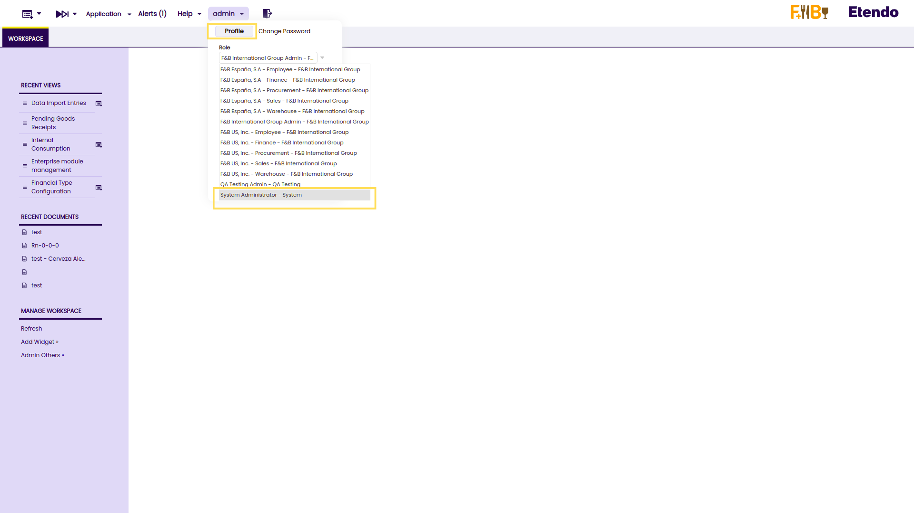
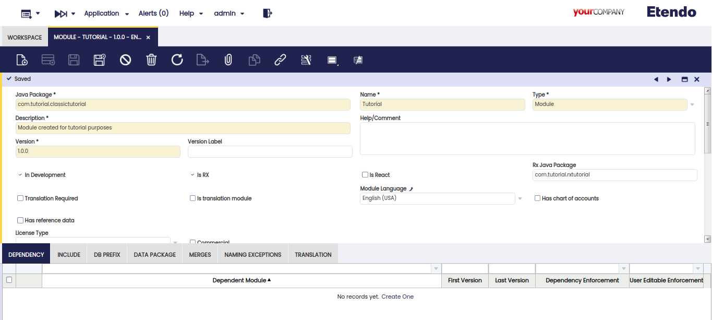
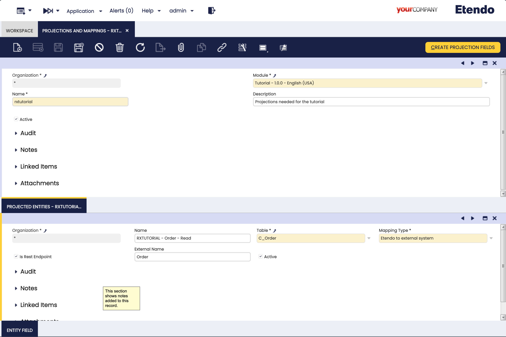
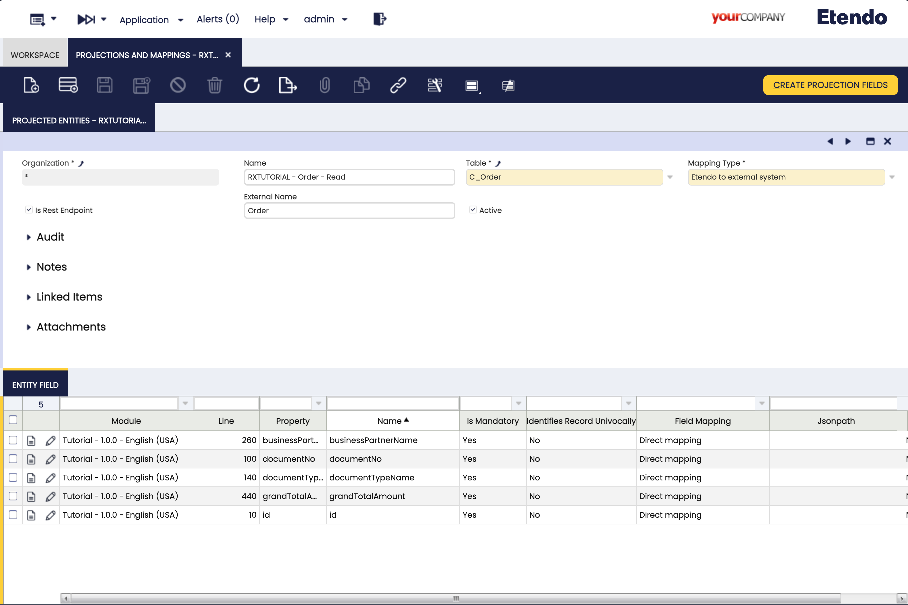
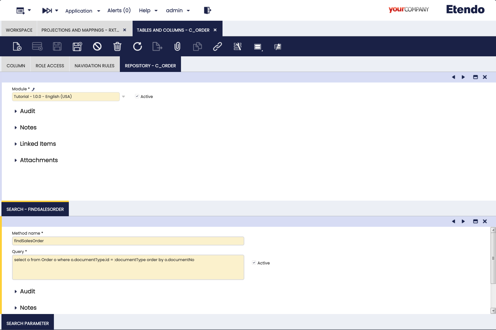
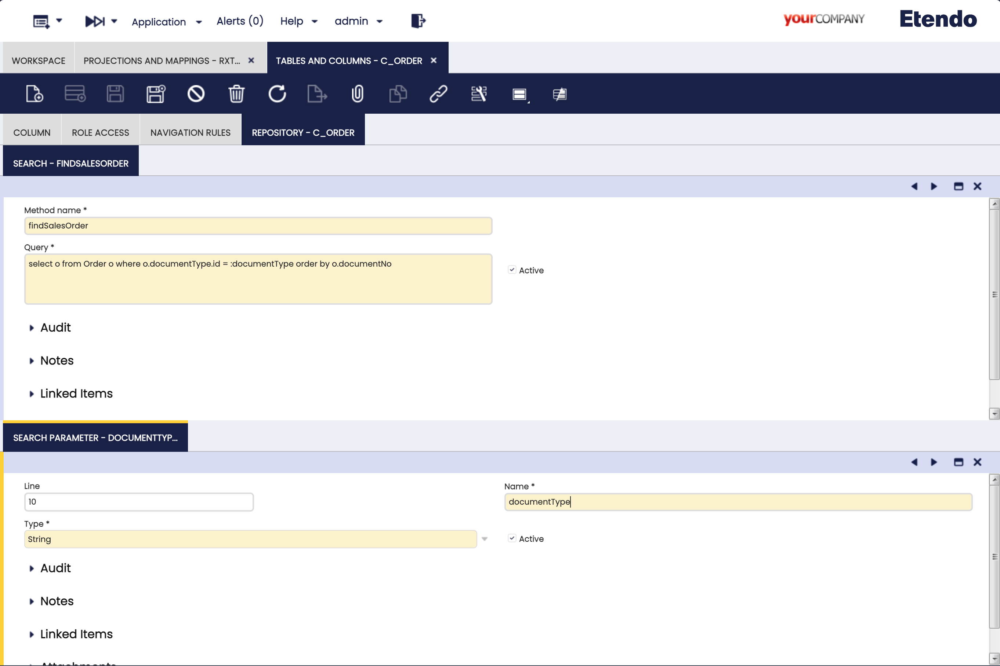
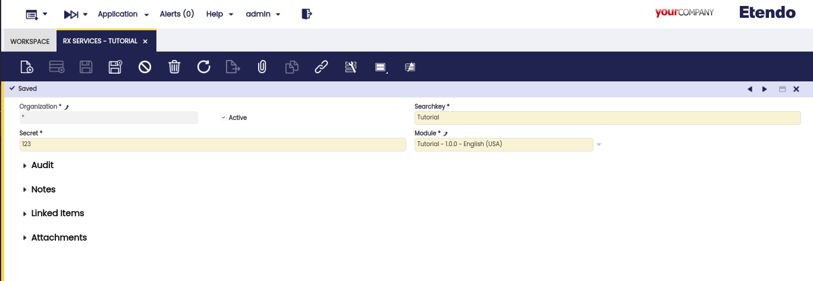
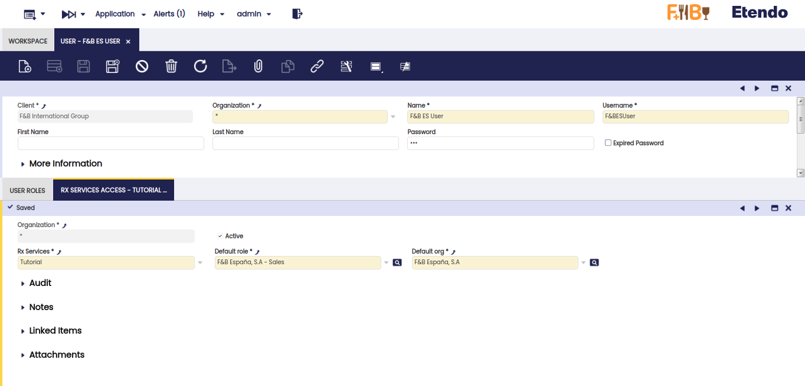
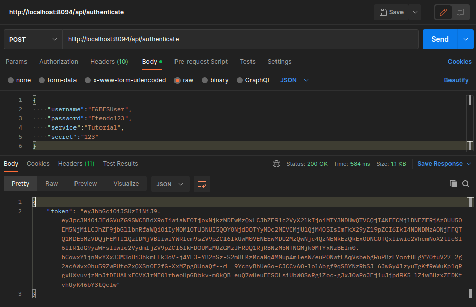

## Overview

This section provides a step-by-step guide for working with Etendo RX, which involves creating a new module with RX capabilities and building a Spring Boot project to consume orders making use of projections, repository and other JPA resources that we will create on our Etendo Classic.

------------------------------------------------------------------

## Building a New Module for RX Capabilities

!!!note
    Make sure to complete the [Getting Started section in the developer guide](../../../developer-guide/etendo-rx/getting-started.md) to set up the Etendo Platform.


### Accessing as Admin User

After setting the local environment up, as described in the [**install etendo development environment**](../../../developer-guide/etendo-classic/getting-started/installation/install-etendo-development-environment.md), we will need to log in to the system with administration permissions to create the new module, projections, repository, etc.

Log in to your account as an administrator. The default login credentials for this administrative account are:

- Username: `admin`
- Password: `admin`

Once you are logged in, switch your role to *System Administrator*, as the image shows:

  


The *System Administrator* role allows us to access some windows and permission to create and manipulate the system to fulfill our needs.

### Creating a New Module

Now we will create a new module. It is a self-contained unit of code that performs a specific function and, in our case, it contains all the resources needed in this guide.
To create a new module, go to the Module window, and add a new record providing the following information:

| Parameter       | Value                                 |
| --------------- | ------------------------------------- |
| Java Package    |`com.tutorial.classictutorial`         |
| Name            |`Tutorial`                             |
| Description     |`Module created for tutorial purposes` |
| Version         |`1.0.0`                                |
| Is RX           |`True`                                 |
| Rx Java Package |`com.tutorial.rxtutorial`              |


It should look like this:

  


With our new module created, we will start working with *Projections*.

------------------------------------------------------------------

## Projection and mappings

When using Spring Data JPA to implement the persistence layer, the repository typically returns one or more instances of the root class. However, more often than not, we do not need all the properties of the returned objects.

In such cases, we might want to retrieve data as objects of customized types. These types reflect partial views of the root class, containing only the necessary properties. This is where projections come in handy.

Start by opening *Projections and mappings* window and creating a new projection with the following properties:

| Field       | Value                                 |
| ----------- | ------------------------------------- |
| Module      |`tutorial - 1.0.0 - English (USA)`     |
| Name        |`rxtutorial`                           |
| Description |`Projections needed for the tutorial`  |


  

### Adding the projection to a table

As we create the projection, now we need to assign it to a table where we want to extract data.
For this, in the tab *Entity Field*, we need to create a new record selecting the table `C_Order`, which is the table that stores the sales orders in Etendo Classic.

### Adding a projected entity

Next, navigate to the tab *Projected Entities* under the *Projection and mappings* tab and create a new record with the following values:

| Field      | Value                                          |
| ---------- | ---------------------------------------------- |
| Table      |`C_Order`                                      |
| Mapping Type | `Etendo to external system`                          |

The fields *Name* and *External Name* will be auto filled with default values you can customize if needed.

  

### Adding Entity Fields

When a projection is created, we need to define which fields we want to retrieve.
In our case, we will need the record ID, Business Partner name, Document No, Document Type name, and the Grand total.
Under the Projection tab navigate to the *Entity Field* tab and add the following fields:

|  Field Name         |  Property             |
| ------------------- | --------------------- |
| id                  |`id`                   |
| businessPartnerName |`businessPartner.name` |
| documentNo          |`documentNo`           |
| documentTypeName    |`documentType.name`    |
| grandTotalAmount    |`grandTotalAmount`     |

!!!note
    The *Property* field of this tab is handled with an Entity Mapping, this is like a Hibernate property.
    So, you can navigate the entities related from here. E.g. To get the Business Partner name, you can have it by accessing the entity *businessPartner* and then, adding the field that you want to filter, *name* in this case.


  

------------------------------------------------------------------

## Repository

In Spring Data, a repository is an abstraction that provides the operations relative to a domain class to interact with a data store.
To create the repository for our purpose, and the same as we did for projections, we need to go to Tables and Columns and look for `C_Order` table.

### Creating a New Repository

After selecting a table, in this case `C_Order`, we need to go to *Repository* tab and create a new record with the following values:

| Field       | Value                                |
| ----------- | ------------------------------------ |
| Module      |`tutorial - 1.0.0 - English (USA)`    |


 

------------------------------------------------------------------

## Search

### Creating a New Search

Next, we will define a search method to use later when we want to consume the orders. This query is taken as a filter for retrieving the orders.
To create this new filter/search method, under Repository tab of the `C_Order` table, create a new record with the following data:

| Field       | Value                                                                                  |
| ----------- | -------------------------------------------------------------------------------------- |
| Method Name |`findSalesOrder`                                                                        |
|  Query      |`select o from Order o where o.documentType.id = :documentType order by o.documentNo`   |


  

### Creating a New Search Parameter

As you can see in the query above, we use a parameter called `:documentType`. 
We can add this type of parameter to use it later by adding a corresponding value to it and filtering depending on the current needs.
To define the parameter, we need to create a new row on the *Search Parameter* tab of the *Search* tab. Fill it with the following settings:

| Field | Value         |
| ----- | ------------- |
| Line  |`10`           |
| Name  |`documentType` |
| Type  |`String`       |

In our case, we will filter depending on the Document Type of the orders.

  

------------------------------------------------------------------

## Applying the RX Plugin

Before creating the RX module structure, you need to apply the RX Gradle plugin to your project.

Add the RX plugin to your root `build.gradle` file:

```groovy title="build.gradle"
plugins {
    // ... other plugins
    id 'com.etendorx.gradlepluginrx' version '<<latest-version>>'
}
```
Replace `<<latest-version>>` with the latest version of the RX Gradle plugin available.

After applying the plugin, verify it's available by running:

```bash
./gradlew tasks --all | grep rx
```

You should see the RX tasks listed:
- `rx.init` - Initialize src-rx structure
- `rx.new.module` - Create a new RX module

------------------------------------------------------------------


## Creating the RX Module Structure

After configuring the module in Etendo Classic and applying the RX plugin, we will now create the RX module structure using Gradle tasks.

### Step 1: Initialize src-rx Structure

First, initialize the `src-rx` directory structure by running:

```bash title="Terminal"
./gradlew rx.init
```

This task will:

- Create the `src-rx` directory with the necessary `build.gradle`, `settings.gradle`, and `gradle.properties.template`
- Create the `rxconfig` directory
- Copy `config/Openbravo.properties` to `src-rx/src/main/resources/openbravo.properties`
- Create `src-rx/gradle.properties` from `Openbravo.properties` with RX configuration:
    - `rx.generateCode=true` - Enable entity generation
    - `rx.path=.` - RX project path
    - `rx.computedColumns=true` - Include computed columns
    - `rx.views=true` - Include database views
- Create the base modules in `src-rx/modules_gen/`:
    - `com.etendorx.entities` - JPA entities generated from database
    - `com.etendorx.clientrest` - REST client models
    - `com.etendorx.entitiesModel` - Entity model classes
    - `com.etendorx.grpc.common` - gRPC common definitions
- Update the root `settings.gradle` to include the `:rx` subproject and module directories

### Step 2: Create the Tutorial Module

Now, create the tutorial module structure using the `rx.new.module` task with the simplified `-Pmodule` parameter:

```bash title="Terminal"
./gradlew rx.new.module -Pmodule=com.tutorial.rxtutorial
```

This will automatically:

- Create the directory `modules_rx/com.tutorial.rxtutorial/`
- Generate the `build.gradle` with proper Spring Boot configuration
- Create the `src/main/java/com/tutorial/rxtutorial/TutorialApplication.java` main class
- Generate the `src/main/resources/application.properties` configuration file

!!!info
    The generated `build.gradle` includes:
    
    - Spring Boot and dependency management plugins
    - Spring Cloud BOM version `2021.0.8` (compatible with Spring Boot 2.7.18)
    - All necessary dependencies (spring-boot-starter-web, openfeign, hateoas, clientrest_core)
    - Source sets configured to include `src-gen/main/java`

### Step 3: Verify Generated Structure

After running both tasks, verify your project structure looks like this:

```
etendo_base/
├── src-rx/
│   ├── build.gradle
│   ├── settings.gradle
│   ├── gradle.properties.template
│   ├── gradle.properties          (copied from config/Openbravo.properties)
│   ├── rxconfig/
│   ├── modules_gen/               (created by rx.init)
│   │   ├── com.etendorx.entities/
│   │   │   └── build.gradle
│   │   ├── com.etendorx.clientrest/
│   │   │   └── build.gradle
│   │   ├── com.etendorx.entitiesModel/
│   │   │   └── build.gradle
│   │   └── com.etendorx.grpc.common/
│   │       ├── build.gradle
│   │       └── grpc.gradle
│   └── src/main/resources/
│       └── openbravo.properties
└── modules_rx/
    └── com.tutorial.rxtutorial/     (created by rx.new.module)
        ├── build.gradle
        └── src/
            ├── main/
            │   ├── java/com/tutorial/rxtutorial/
            │   │   └── TutorialApplication.java
            │   └── resources/
            │       └── application.properties
            └── src-gen/main/java/ (will be created after entity generation)
```

### Step 4: Generate Entities

After running `rx.init`, the `:rx` subproject is ready to generate entities:

```bash
./gradlew :rx:generate.entities
```

!!!note
    The `:rx:` prefix specifies that the task runs in the `:rx` subproject context.

This will generate Java entity classes in `src-rx/modules_gen/` based on your Etendo Classic database tables and projections.


------------------------------------------------------------------

## Configuring a Spring Boot Project

Now we will configure the new spring boot project to define how it will run.

### Updating the application.properties file

Modify your `application.properties` file, under the new spring boot project created on the previous steps, with the following configurations:

```groovy title="application.properties"
config.server.url=http://localhost:8888
spring.config.import=configserver:${config.server.url}
spring.application.name=rxtutorial
server.port=8101
token=
```

The token is empty, but now we will generate a new one. 

### Adding the token value

To generate the token value we need to follow these steps:

  1. As *System Administrator* role on Etendo Classic, go to *RX Services* window.
  2. Create a new row with the following values:

    |  Field Name         |  Property                      |
    | ------------------- | ------------------------------ |
    | Searchkey           |Tutorial                        |
    | Secret              |123                             |
    | Module              |Tutorial - 1.0.0 - English (USA)|

    

  3. Change to *F&B International Group Admin* role.
  4. Go to *User* window.
  5. Choose a user, e.g. F&B ES User
  
    !!! info
        Change the password for this record, you will need it later.
        Also, check that the user is active.

  6. In the tab *RX Services Access* create a new row and fill it with the following values:
    
    | Field Name           |  Property                     |
    | ------------------- | ------------------------------ |
    | Organization        |*                               |
    | RX Services         |Tutorial                        |
    | Default Role        |F&B España, S.A - Sales         |
    | Default Org         |F&B España, S.A                 |

    

  7. Let's run RX so we can make the request to the Auth service:

    > Follow the [**Getting Started**](https://docs.etendo.software/developer-guide/etendo-rx/getting-started/){target="_blank"} guide to start the environment.

  8. Open Postman and we will make an authenticate request.
    
    ```json
    Verbose: POST
    URL: http://localhost:8094/api/authenticate
    Body:
    {
      "username":"F&BESUser",
      "password":"EtendoAdmin1",
      "service":"Tutorial",
      "secret":"123"
    }
    ```

    !!!warning
        Remember the password changed before.

    
  
  9. Take the token under the response and fill in the *token* property on the `application.properties` of the tutorial module.


------------------------------------------------------------------

## Creating a New Spring Boot Service

In this last step before launching the microservice, we will create the logic to consume the orders using the projection and all the JPA resources that we defined in the previous steps. 
Follow the instructions below to create a new service:

1. Create a new file at the following path:

    ```java
    modules_rx/com.tutorial.rxtutorial/src/main/java/com/tutorial/rxtutorial/RxtutorialService.java
    ```

2. Then, copy and paste the following code into the file:

    ```java
    package com.tutorial.rxtutorial;

    import org.springframework.beans.factory.annotation.Autowired;
    import org.springframework.web.bind.annotation.GetMapping;
    import org.springframework.web.bind.annotation.RequestMapping;
    import org.springframework.web.bind.annotation.RestController;

    import com.etendorx.clientrest.base.RestUtils;
    import com.etendorx.clientrest.base.RestUtilsException;
    import com.tutorial.rxtutorial.entities.org.openbravo.model.common.order.OrderRxtutorialModel;

    @RestController
    @RequestMapping(path = "/api")
    public class TutorialService {
      @Autowired
      RestUtils restUtils;

      @GetMapping(path = "/")
      public String get() throws RestUtilsException {
        String url = "/Order/search/findSalesOrder?documentType=AB22CE8FFA5E4AF29F2AC90FCDD400D8&projection=rxtutorial";
        var orders = restUtils.getList(url, OrderRxtutorialModel.class);
        StringBuilder html = new StringBuilder("<html>");
        html.append("<head>");
        html.append("<style type=\"text/css\">html {font-family: sans-serif;}</style>");
        html.append("</head>");
        html.append("<title>Orders</title></head>");
        html.append("<body>");
        html.append("<h2>Orders</h2>");
        html.append("<table>");
        for (OrderRxtutorialModel o : orders) {
          html.append(
              "<tr>" +
                  "<td>" + o.getDocumentNo() + "</td>" +
                  "<td>" + o.getBusinessPartnerName() + "</td>" +
                  "<td>" + o.getDocumentTypeName() + "</td>" +
                  "<td>" + o.getGrandTotalAmount() + "</td>" +
                  "</tr>"
          );
        }
        html.append("</table></body></html>");
        return html.toString();
      }
    }
    ```

    This file will display a simple HTML page with the retrieved orders.
    But first, we will take a look at the class that we just created.

      ```java
      String url = "/Order/search/findSalesOrder?documentType=AB22CE8FFA5E4AF29F2AC90FCDD400D8&projection=rxtutorial";
      ```
      This URL is the one that the process will use to consume the service, as you can see, we add here the *Search* filter that we created before and give it the document type parameter, with one document type id of the order that we will filter. Also, we are adding the projection to use too, same as before, it is the one created before.

      
      ```java
      var orders = restUtils.getList(url, OrderRxtutorialModel.class);
      ```

      The orders variable will store all the orders that will be filtered with our request, as you can see, the method `getList` receives two parameters, the first one is the URL that we will use to make the request, and the second one is the model class of the retrieved object.

3. Then, we simply create a StringBuilder as an HTML page that will be shown on the browser.

------------------------------------------------------------------

## Run RX Services

To simplify RX executions you have a simplified run task:

> Follow the [**Getting Started**](https://docs.etendo.software/developer-guide/etendo-rx/getting-started/){target="_blank"} guide to start the environment.

!!!warning
    Remember to configure the Auth service as described on the [Getting Started](../../../developer-guide/etendo-rx/getting-started.md#configure-auth-project) page.

## Run tutorial project

Now we are able to run our new microservice. For that, execute the following task:

``` bash title="Terminal"
./gradlew :com.tutorial.rxtutorial:bootRun
```

Open your browser and you can view the generated page with the following URL: [**http://localhost:8101/api/**](http://localhost:8101/api/)

!!! success
    You have successfully created a fully working RX service.

---
This work is licensed under :material-creative-commons: :fontawesome-brands-creative-commons-by: :fontawesome-brands-creative-commons-sa: [ CC BY-SA 2.5 ES](https://creativecommons.org/licenses/by-sa/2.5/es/){target="_blank"} by [Futit Services S.L](https://etendo.software){target="_blank"}.

