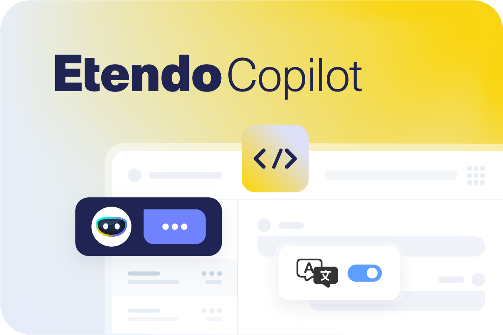

# 
## Welcome to the Developer's Section

Welcome to the Developer's Documentation Corner, a dedicated space crafted exclusively for you! Here, you'll find insights, resources, and guidelines tailored to fuel your creative endeavors and empower you to customize Etendo according to our specific product types.

Discover how you can wield the power of Etendo to craft unique experiences. From insightful APIs to advanced integration techniques we've meticulously adapted to your development needs.

So, roll up your sleeves and ignite your creativity.

---

<figure markdown>
{align=right width=400}
  
### Here you will find exclusive information for developers, from key concepts to how-to guides, as well as how to install enhancements for Etendo platform features.
</figure>

---

<figure markdown>
{align=left width=400}
  
### This section is exclusively dedicated to our reactive platform capable of executing microservices with database interaction and asynchronous actions: Etendo RX.                                          
</figure>

---

<figure markdown>
{align=right width=400}
  
### You will find information on how to develop the Etendo mobile subapplications and Etendo RX based subapplications.
</figure>

---

<figure markdown>
{align=left width=400}
 
### In this section, you will find everything about our Copilot project. Currently, you have getting started information as well as data about the XML Translator tool, and also, how to develop new copilot tools. 
</figure>

---
This work is licensed under :material-creative-commons: :fontawesome-brands-creative-commons-by: :fontawesome-brands-creative-commons-sa: [ CC BY-SA 2.5 ES](https://creativecommons.org/licenses/by-sa/2.5/es/){target="_blank"} by [Futit Services S.L](https://etendo.software){target="_blank"}.
