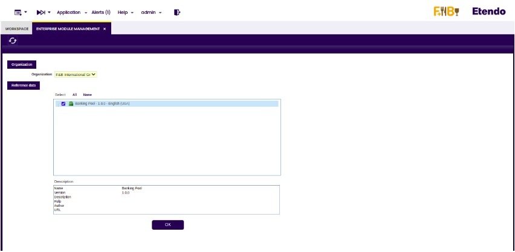
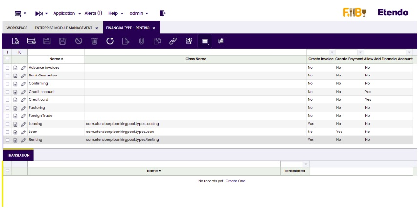

# Tipo financiero

:material-menu: `Aplicación` > `Gestión Financiera` > `Contabilidad` > `Configuración` > `Tipo financiero`

!!! info
    Para poder incluir esta funcionalidad, debe instalarse el bundle Financial Extensions Bundle. Para ello, siga las instrucciones del marketplace: [Financial Extensions Bundle](https://marketplace.etendo.cloud/#/product-details?module=9876ABEF90CC4ABABFC399544AC14558){target="_blank"}. Para más información sobre las versiones disponibles, la compatibilidad con el core y las nuevas funcionalidades, visite [Financial Extensions - Notas de la versión](../../../../../../whats-new/release-notes/etendo-classic/bundles/financial-extensions/release-notes.md).

## Visión general

En esta ventana, el usuario puede configurar las diferentes opciones que se utilizarán en la ventana Configuración del tipo financiero.

!!! info
    Para más información, visite [Configuración del tipo financiero](../../../financial-management/accounting/transactions.md#financial-type-configuration).

### Cómo instalar el conjunto de datos de tipo financiero
 
Vaya a la ventana Gestión de módulos de empresa y seleccione la organización necesaria para importar los datos por defecto. A continuación, marque el conjunto de datos denominado "Pool bancario" y haga clic en el botón OK. 

Se muestra la información importada desde la ventana Tipo financiero. 

