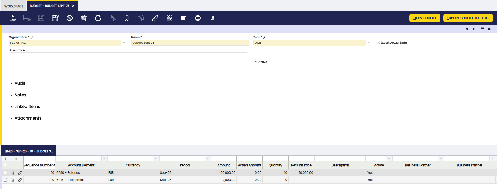
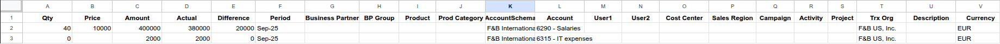

---
tags:
  - Etendo Classic
  - Financial Management
  - Accounting
  - Budget
  - Financial Extensions
---

# Presupuesto { #budget }

:material-menu: `Aplicación` > `Gestión Financiera` > `Contabilidad` > `Transacciones` > `Presupuesto`

<iframe width="560" height="315" src="https://www.youtube.com/embed/2VFxpx8j8Sk?si=TuLZUdBGrOCSpXIE" title="YouTube video player" frameborder="0" allow="accelerometer; autoplay; clipboard-write; encrypted-media; gyroscope; picture-in-picture; web-share" referrerpolicy="strict-origin-when-cross-origin" allowfullscreen></iframe>

## Descripción general { #overview }

!!! info
    Para poder incluir esta funcionalidad, es necesario instalar el Financial Extensions Bundle. Para ello, siga las instrucciones del marketplace: [Financial Extensions Bundle](https://marketplace.etendo.cloud/#/product-details?module=9876ABEF90CC4ABABFC399544AC14558){target="_blank"}. Para más información sobre las versiones disponibles, compatibilidad con el core y nuevas funcionalidades, visite [Financial Extensions - Notas de la versión](../../../../../whats-new/release-notes/etendo-classic/bundles/financial-extensions/release-notes.md).

!!! warning
    Si no dispone del módulo **Financial Report Budget** del [Financial Extensions Bundle](https://marketplace.etendo.cloud/#/product-details?module=9876ABEF90CC4ABABFC399544AC14558){target="_blank"}, esta ventana permanecerá en una versión antigua con funcionalidad limitada. No será posible incluir elementos de libro mayor en los valores reales considerados en el informe de presupuesto, el informe no tendrá la columna de diferencia y las dimensiones para filtrar el informe no incluirán todas las dimensiones contables como en este caso.

Permite crear y gestionar presupuestos, tanto de ingresos como de gastos, con fines de reporte, ofreciendo a los usuarios la posibilidad de comparar los valores presupuestados con los valores reales contabilizados en el correspondiente Libro Mayor.

!!! example
    Se puede definir un presupuesto, por ejemplo, asignando un gasto previsto de 400.000 EUR en salarios y 2.000 $ en servicios de Internet para el mes de septiembre de 2025.

    

    Al final del período, los usuarios pueden verificar el valor real y analizar la diferencia respecto al presupuesto definido.

    

Los valores reales considerados incluyen tanto asientos contables como asientos manuales (Elemento de libro mayor), lo que garantiza una visión completa de la ejecución presupuestaria.

## Cabecera { #header }

La cabecera define los datos principales de cada presupuesto:

- **Organización**: organización a la que pertenece el presupuesto.
- **Nombre**: nombre identificativo del presupuesto.
- **Año**: ejercicio fiscal al que aplica el presupuesto.
- **Descripción**: información adicional o explicativa sobre el presupuesto.
- **Activo**: casilla de verificación que habilita o deshabilita el presupuesto.
- **Exportar Datos Reales**: casilla de verificación que, cuando está marcada, exporta las cantidades reales a Excel además de las cantidades presupuestadas.

## Líneas { #lines }

En la pestaña Líneas, el usuario puede añadir líneas de presupuesto. Cada línea puede hacer referencia a un período específico, proyectando y comparando gastos/ingresos según la cuenta contable seleccionada. Las dimensiones contables están disponibles como filtros, seleccionables de una en una, en la sección Dimensiones (tercero, producto, etc.)

Campos a destacar:

- **Número de Secuencia**: número de secuencia de la línea.
- **Libro Mayor**: libro mayor contable asociado.
- **Elemento Contable**: cuenta contable vinculada. Este elemento determina si el presupuesto corresponde a un ingreso o a un gasto.
- **Moneda**: moneda en la que se expresa el presupuesto.
- **Período**: período contable al que corresponde la línea.
- **Importe**: importe presupuestado. Es el número que se considera al expresar la diferencia entre el importe presupuestado y el importe real en el informe de presupuesto generado.
- **Importe Real**: importe real registrado. Esta información se actualiza una vez generado el informe, solo si se seleccionó la casilla Exportar Datos Reales.
- **Cantidad**: cantidad presupuestada. Es un valor opcional.
- **Precio Unitario Neto**: precio unitario neto. Es un valor opcional.
- **Descripción**: información adicional sobre la línea.
- **Activo**: casilla de verificación que habilita o deshabilita la línea.

## Botones { #buttons }

**Exportar presupuesto a excel**: genera un documento Excel como informe con la información del presupuesto.

**Copiar Presupuesto**: duplica líneas de presupuestos creados anteriormente.

## Informe { #report }

El informe de presupuesto permite comparar los importes presupuestados y reales. Incluye una columna Diferencia, que muestra el resultado de restar el valor real al valor presupuestado, facilitando así el análisis de desviaciones.

Los campos presentados en el informe son:

- **Cant.**: cantidad presupuestada.
- **Precio**: precio unitario.
- **Importe**: importe presupuestado.
- **Real**: importe real registrado.
- **Diferencia**: diferencia entre los importes presupuestado y real.
- **Período**: período contable correspondiente.
- **Dimensiones contables**: filtros aplicados por dimensiones (p. ej., tercero, centro de costos, producto, proyecto, etc.).
- **Organización**: organización a la que corresponde el presupuesto.
- **Descripción**: información adicional sobre la línea.
- **Moneda**: moneda en la que se expresa el presupuesto.

Ejemplo de resultados del informe:

---

This work is a derivative of [Financial Management](http://wiki.openbravo.com/wiki/Financial_Management){target="\_blank"} by [Openbravo Wiki](http://wiki.openbravo.com/wiki/Welcome_to_Openbravo){target="\_blank"}, used under [CC BY-SA 2.5 ES](https://creativecommons.org/licenses/by-sa/2.5/es/){target="\_blank"}. This work is licensed under [CC BY-SA 2.5](https://creativecommons.org/licenses/by-sa/2.5/){target="\_blank"} by [Etendo](https://etendo.software){target="\_blank"}.
