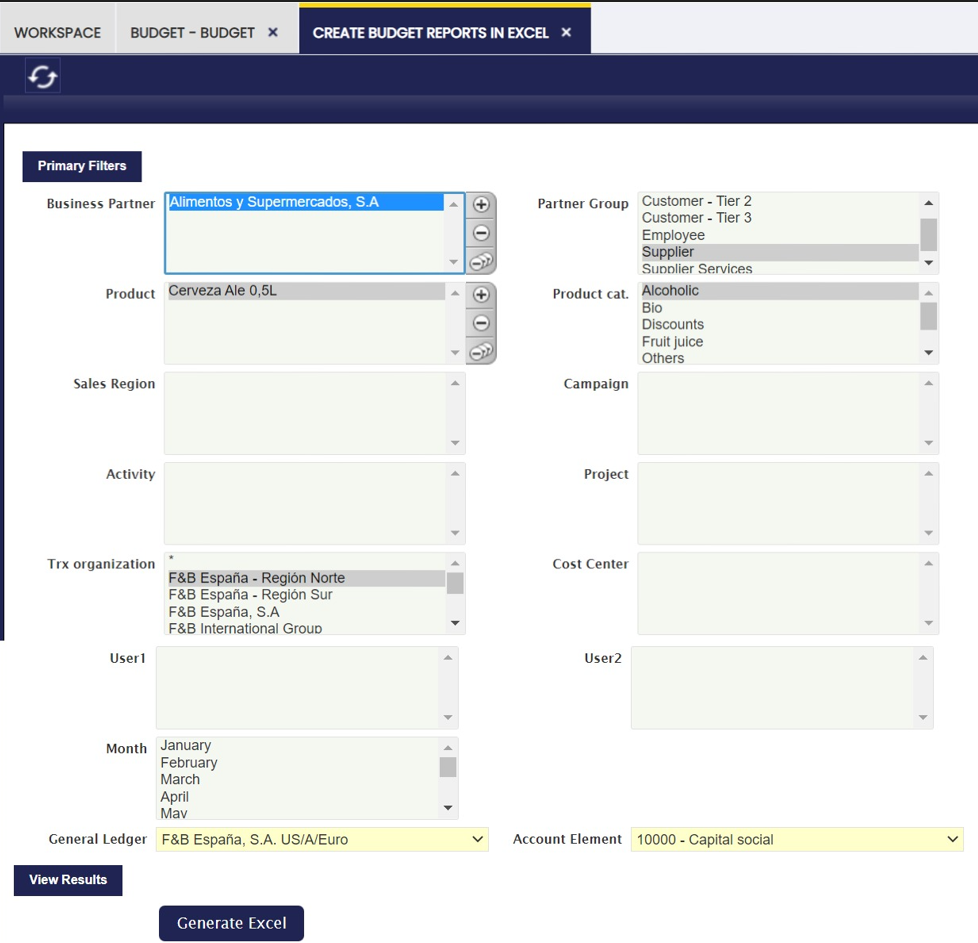

---
tags:
  - Etendo Classic
  - Financial Management
  - Accounting
  - Budget
  - Excel Reports
---

# Generador Excel de Presupuestos { #create-budget-reports-in-excel }

:material-menu: `Aplicación` > `Gestión Financiera` > `Contabilidad` > `Transacciones` > `Generador excel de presupuestos`

## Descripción general { #overview }

Utilizando los filtros necesarios, como tercero, producto, grupo de terceros, categoría de producto, etc., el usuario puede generar informes de presupuesto en Excel para utilizarlos con fines específicos.

---

This work is a derivative of [Financial Management](http://wiki.openbravo.com/wiki/Financial_Management){target="\_blank"} by [Openbravo Wiki](http://wiki.openbravo.com/wiki/Welcome_to_Openbravo){target="\_blank"}, used under [CC BY-SA 2.5 ES](https://creativecommons.org/licenses/by-sa/2.5/es/){target="\_blank"}. This work is licensed under [CC BY-SA 2.5](https://creativecommons.org/licenses/by-sa/2.5/){target="\_blank"} by [Etendo](https://etendo.software){target="\_blank"}.
