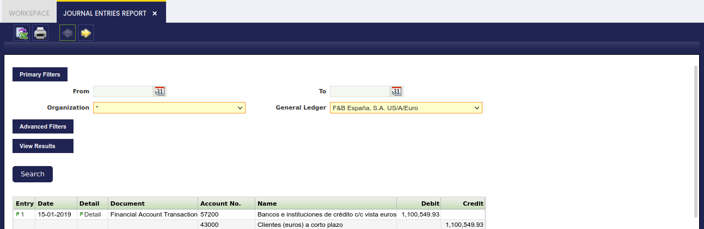
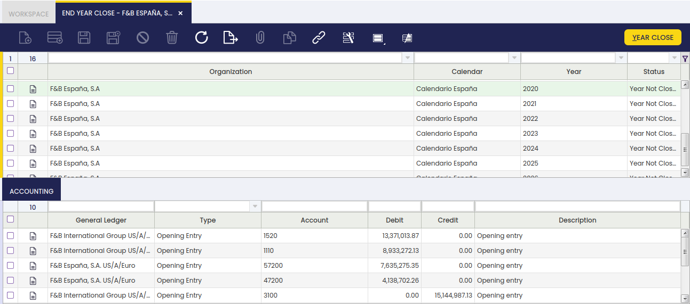
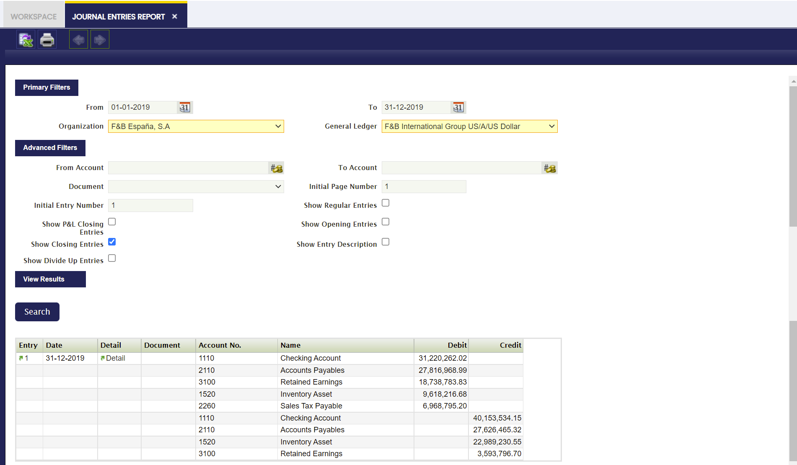
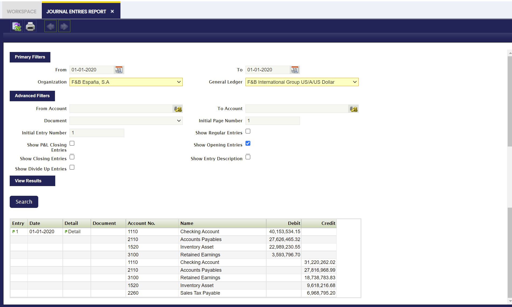
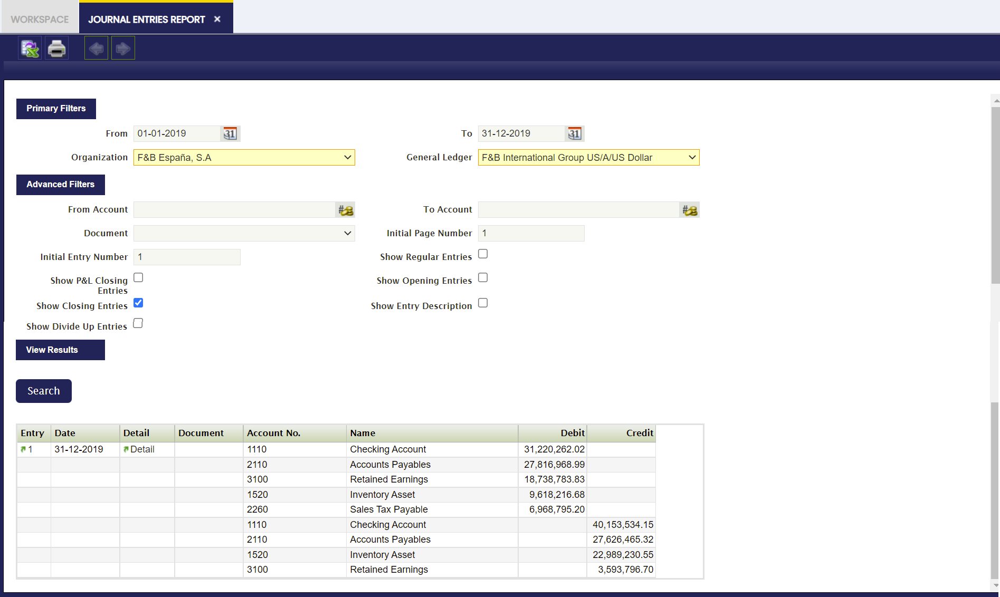
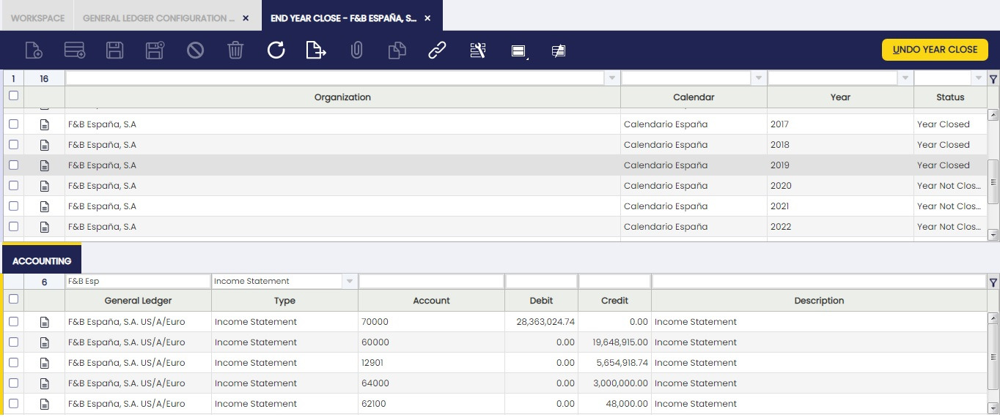
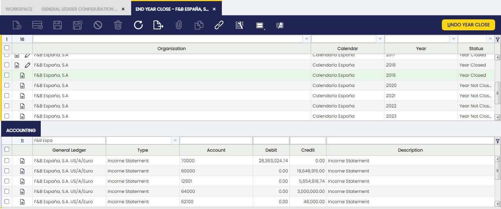
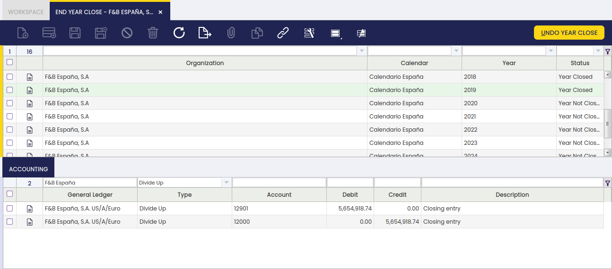

---
tags:
  - Etendo Classic
  - Financial Management
  - End Year Close
  - Fiscal Year
  - Accounting Transactions
---

# Cierre de año { #end-year-close }

:material-menu: `Aplicación` > `Gestión Financiera` > `Contabilidad` > `Transacciones` > `Cierre de año`

## Descripción general { #overview }

El proceso **Crear asiento de regularización** permite al usuario cerrar un ejercicio fiscal. Este proceso también cierra de forma permanente todos los períodos del año (tanto los estándar como los de ajuste).

Es importante destacar que no es obligatorio cerrar los períodos estándar de un año antes de cerrar dicho año; sin embargo, puede ayudar a llevar un seguimiento de los períodos del año ya revisados y cerrados.

El proceso de cierre de año requiere que el año siguiente esté iniciado y que su primer período esté abierto.

!!! info
    Una vez cerrado un año, el estado de ese año y de todos sus períodos se puede revisar en la ventana Abrir/Cerrar periodos.

Como ya se ha mencionado, todos los períodos del año se muestran con **Estado del Período** = **Cerrado Permanentemente**, lo que significa que no es posible registrar ninguna transacción dentro de ese año, a menos que se ejecute el proceso **Borrar asiento de regularización** para ese año.

El proceso **Crear asiento de regularización** crea los siguientes asientos contables:

1\. El asiento de **Cierre de Pérdidas y Ganancias**.

-   Este asiento contable restablece todos los tipos de cuenta de **Ingresos** y **Gastos**, y la diferencia se registra en la cuenta de Resumen de contabilidad.
    -   En otras palabras, las cuentas de **Gastos** se **Abonan** y las cuentas de **Ingresos** se **Cargan**, y la diferencia, si la hubiera, se registra en la cuenta de Resumen de contabilidad.
        Tomemos una cuenta de gastos con saldo deudor de 500,00. El asiento de cierre de PyG crea un abono de 500,00 en la cuenta de gastos del ejemplo, con lo que su saldo queda en cero.
        Si el saldo total de las cuentas de ingresos es mayor que el saldo total de las cuentas de gastos, esa diferencia se abona en la cuenta de Resumen de contabilidad, lo que significa un resultado positivo o beneficio.
        Si el saldo total de las cuentas de ingresos es menor que el saldo total de las cuentas de gastos, esa diferencia se carga en la cuenta de Resumen de contabilidad, lo que significa un resultado negativo o pérdida.
-   Este asiento se registra el último día del último período del año que se cierra, es decir, el **Período de Ajuste** o **Período 13** del año.
-   Etendo no crea un asiento de Asientos manuales para este asiento contable, solo el propio asiento.

2\. El asiento de **Cierre** o asiento de **Cierre de Balance**.

-   Este asiento contable abona todas las cuentas con saldo deudor y carga todas las cuentas con saldo acreedor. El objetivo de este asiento es que las cuentas de Activo y Pasivo queden con saldo cero.
    -   Dicho de otro modo, tomemos una cuenta de Activo con saldo deudor de 8.000,00. El asiento de cierre crea un abono de 8.000,00 en la cuenta de activo del ejemplo.
-   Este asiento se registra el último día del último período del año que se cierra, es decir, el **Período de Ajuste** o **Período 13** del año.
-   Etendo no crea un asiento de Asientos manuales para este asiento contable, solo el propio asiento.
-   Este asiento solo se crea si la casilla Invertir Saldos de Cuentas Permanentes está marcada como sí.

Por último, si se especifica una cuenta de Reservas para la configuración del libro mayor general, se crea un asiento adicional con fecha en el último día del año.

Este asiento traslada el saldo de la cuenta de Resumen de contabilidad a la cuenta de **Reservas**.

3\. Y el asiento de **Apertura** o asiento de **Apertura de Balance**.

-   Este asiento contable es el asiento de reversión del asiento de cierre.
    -   Siguiendo el ejemplo del punto 2 anterior, el asiento de apertura crea un cargo de 8.000,000 en la cuenta de activo del ejemplo. Ese importe es el saldo de apertura de la cuenta de activo para el nuevo año.
-   Este asiento se registra el primer día del primer período del año siguiente.
-   Este asiento solo se crea si la casilla Invertir Saldos de Cuentas Permanentes está marcada como sí.

##### Ejemplo del proceso de cierre de año { #end-year-close-process-example }

Este ejemplo describe el proceso de **cierre del ejercicio 2019** de una organización legal de muestra con una organización contable.

Este artículo describe el proceso de cierre de año manteniendo intencionalmente la actividad de la organización de la forma más sencilla posible.

La empresa de este ejemplo inició su actividad antes de 2019, por lo que se puede crear un asiento de Asientos manuales configurado como **Apertura** para registrar el asiento de apertura de 2019 y publicarlo en el libro mayor.

Para simplificar, la empresa de este ejemplo ejecutó actividades **regulares** detalladas que generaron los correspondientes asientos de diario **regulares** en el libro mayor general:

Imaginemos que **F&B España** cierra los períodos estándar en cuanto finaliza cada uno de ellos, incluso para el último período estándar, que es **diciembre de 2019**.

Los contables pueden utilizar el **Período 13** para registrar ajustes contables en el libro mayor mediante el registro de Asientos manuales, antes de ejecutar el proceso **Cierre del año**.

Una vez finalizado 2019 y listo para cerrarse, la empresa de este ejemplo puede ejecutar el proceso de **Cierre del año** 2019 desde la ventana Cierre de año.

El botón de proceso **Cierre del año** ejecuta el proceso de cierre de año para esta organización de muestra.

##### Invertir Saldos de Cuentas Permanentes configurado como **Sí** { #reverse-permanent-account-balances-set-to-yes }

Etendo crea los **asientos de cierre** detallados a continuación si la casilla **Invertir Saldos de Cuentas Permanentes** del libro mayor general de la organización está configurada como **Sí** antes de ejecutar el proceso **Crear asiento de regularización**.

!!! info
    Tenga en cuenta que los asientos contables indicados a continuación también se pueden revisar en la ventana **Cierre de año**, en la pestaña Contabilidad.

-   Con fecha en el último día del año, el asiento de **Cierre de Pérdidas y Ganancias**.
    Este asiento restablece todas las cuentas de **Ingresos** y **Gastos**, y se registra en la cuenta definida como Resumen de contabilidad.
    

-   Con fecha en el último día del año, el siguiente asiento de **Cierre**.
    Este asiento restablece todas las cuentas de **Activo**, **Pasivo** y **Patrimonio Neto**. Además, se crea un asiento adicional para trasladar el saldo de la cuenta de Resumen de contabilidad a la cuenta de Reservas:
    

-   Con fecha en el primer día del año siguiente (01-01-2022), el siguiente asiento de **Apertura**. Este asiento es el asiento de reversión del asiento de cierre anterior:
    
    La organización de este ejemplo puede generar los informes de Balance de 2020 y de Pérdidas y Ganancias de 2021 desde la ventana de estructura Balance y PyG:

Balance de 2020:

Pérdidas y Ganancias de 2021:

##### Invertir Saldos de Cuentas Permanentes configurado como **No** { #reverse-permanent-account-balances-set-to-no }

Etendo crea los siguientes asientos de **cierre** si la casilla **Invertir Saldos de Cuentas Permanentes** del libro mayor general de la organización está configurada como **No** antes de ejecutar el proceso **Crear asiento de regularización**.

!!! info
    Tenga en cuenta que los asientos contables indicados a continuación también se pueden revisar en la ventana **Cierre de año**, en la pestaña Contabilidad.

-   Con fecha en el último día del año (31-12-2019), el siguiente asiento de **Cierre de Pérdidas y Ganancias**:
 

-   y con fecha en el último día del año (31-12-2019), el siguiente asiento, ya que se ha definido una cuenta de Reservas para el libro mayor general de la organización:
 

La organización de este ejemplo puede generar los informes de Balance de 2019 y de Cuenta de Resultados de 2019 desde la ventana de estructura Balance y PyG. Obtendrá el mismo Balance y la misma Cuenta de Resultados que los mostrados en el escenario **Invertir Saldos de Cuentas Permanentes configurado como Sí**.

### Cierre de año { #end-year-close_1 }

En la ventana **Cierre de año**, se muestran todos los Años creados previamente en la ventana Calendario Fiscal. Dichos años pueden cerrarse en esta ventana.

Los registros mostrados en esta ventana se filtran por su **Estado** y la **Organización**, mostrando únicamente los Años que no están cerrados todavía y que pertenecen a la Organización en la que el usuario ha iniciado sesión. Estos filtros se pueden eliminar haciendo clic en el icono de embudo.

Esta ventana muestra dos pestañas. La primera pestaña muestra todos los Años existentes. Una vez seleccionado un registro en esta pestaña, la pestaña inferior muestra los asientos contables relacionados, es decir, los asientos de cierre generados por el proceso Crear asiento de regularización, así como los correspondientes asientos de apertura del año siguiente.

De esta manera, es más fácil y rápido ver la contabilidad generada cuando se cierra un Año. Se puede encontrar más información en la pestaña Contabilidad que se describe a continuación.

El procedimiento para Cerrar un Año es:

-   Utilizar los filtros de la grilla para mostrar el Año a cerrar.
-   Seleccionar el Año.
-   Hacer clic en el botón Cierre del año y hacer clic en Aceptar.

Una vez realizado, Etendo informa de que el proceso se ha completado correctamente.

Todos los Períodos de ese Año y esa Organización quedarán cerrados permanentemente. El procedimiento para Deshacer el Cierre del Año es el mismo, pero haciendo clic en Borrar asiento de regularización.

Como se muestra en la imagen anterior, los campos principales de esta ventana son:

-   Organización.
-   Calendario.
-   Año.

### Borrar asiento de regularización { #undo-close-year }

Si un año (por ejemplo 2019) está cerrado, no será posible realizar ningún registro dentro de ese año a menos que se ejecute el proceso **Borrar asiento de regularización** para ese año.

Este proceso abre el año y todos los períodos del año. También revierte todos los asientos del libro mayor registrados por el proceso de cierre de año; por lo tanto, los asientos de cierre/apertura ya no se muestran en el Diario asientos, a menos que se ejecute de nuevo el proceso de cierre de año para el año correspondiente.

-   Estado: puede ser **Año No Cerrado** o **Año Cerrado**

### Contabilidad { #accounting }

En la pestaña **Contabilidad** de la ventana Cierre de año, se muestran todos los asientos contables generados cuando un Año se Cierra o se Abre, agrupados por Cuenta. Estos asientos de cuenta pueden ser:

-   Asientos de Apertura
-   Cuentas de Resultados
-   Asientos de Cierre
-   Asientos Regulares
-   Distribución

De esta manera, es más fácil revisar los asientos contables realizados en el Proceso de Cierre de Año.

Como se muestra en la imagen anterior, los campos principales de esta ventana son:

-   Libro Mayor.
-   Tipo. Puede ser Asiento de Apertura, Asiento de Cierre, Cuenta de Resultados, Asiento Regular o Distribución.
-   Cuenta. Tenga en cuenta que **los asientos de cuenta están agrupados por Cuenta**, mostrando solo un registro.
-   Debe.
-   Haber.

Para explicar esta pestaña, es preferible seguir el mismo ejemplo que en la sección de Introducción y mostrar cómo esta pestaña presenta los resultados.

##### Invertir Saldos de Cuentas Permanentes configurado como **Sí** { #reverse-permanent-account-balances-set-to-yes_1 }

Etendo crea los siguientes **asientos de cierre** si la casilla **Invertir Saldos de Cuentas Permanentes** del libro mayor general de la organización está configurada como **Sí**:

-   Con fecha en el último día del año (31-12-2019), el siguiente asiento de **Cierre de Pérdidas y Ganancias**.
    Este asiento restablece todas las cuentas de **Ingresos** y **Gastos**.

 

-   Con fecha en el último día del año (31-12-2019), el siguiente asiento de **Cierre**.
    Este asiento restablece todas las cuentas de **Activo**, **Pasivo** y **Patrimonio Neto**.
 

-   Con fecha en el primer día del año siguiente (01-01-2020), el siguiente asiento de **Apertura**.
    Este asiento es el asiento de reversión del asiento de cierre anterior:
 

##### Invertir Saldos de Cuentas Permanentes configurado como **No** { #reverse-permanent-account-balances-set-to-no_1 }

Etendo crea los siguientes asientos de **cierre** si la casilla **Invertir Saldos de Cuentas Permanentes** del libro mayor general de la organización está configurada como **No**:

-   Con fecha en el último día del año (31-12-2019), el siguiente asiento de **Cierre de Pérdidas y Ganancias**:
 

-   y con fecha en el último día del año (31-12-2019), el siguiente asiento, ya que se ha definido una cuenta de Reservas para el libro mayor general de la organización:
 

---

This work is a derivative of [Financial Management](http://wiki.openbravo.com/wiki/Financial_Management){target="\_blank"} by [Openbravo Wiki](http://wiki.openbravo.com/wiki/Welcome_to_Openbravo){target="\_blank"}, used under [CC BY-SA 2.5 ES](https://creativecommons.org/licenses/by-sa/2.5/es/){target="\_blank"}. This work is licensed under [CC BY-SA 2.5](https://creativecommons.org/licenses/by-sa/2.5/){target="\_blank"} by [Etendo](https://etendo.software){target="\_blank"}.
