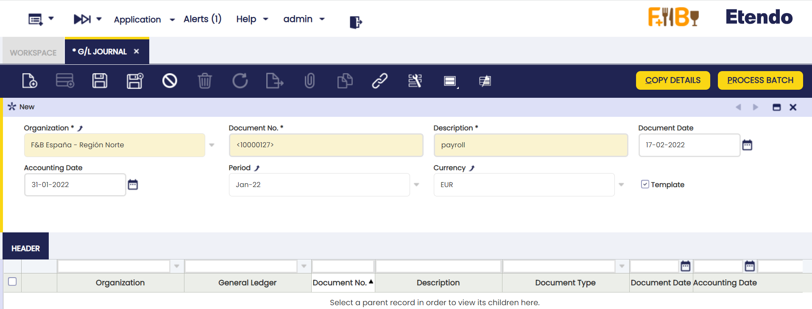
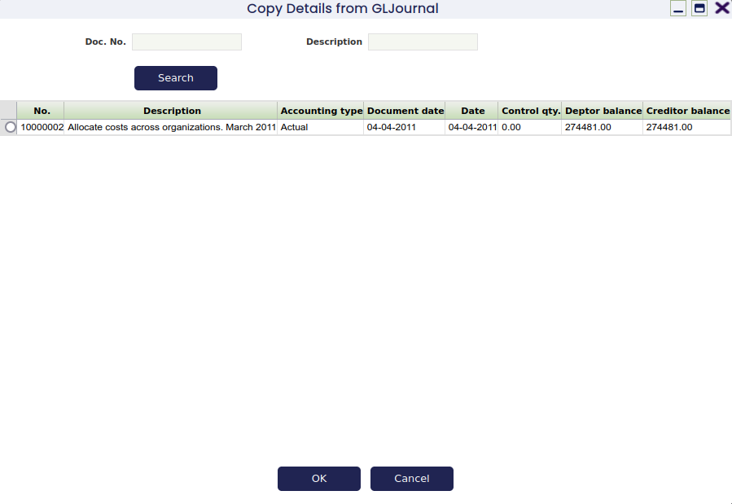
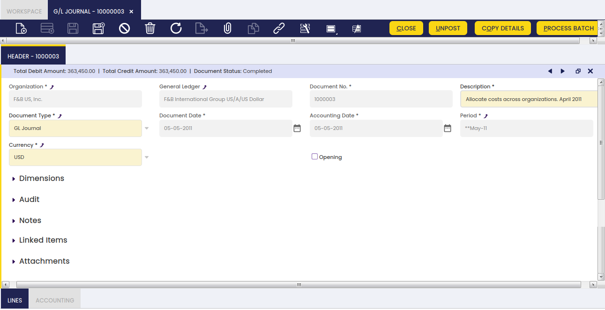
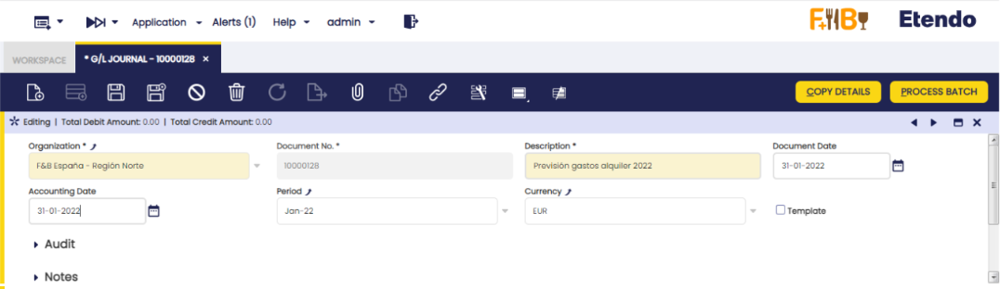
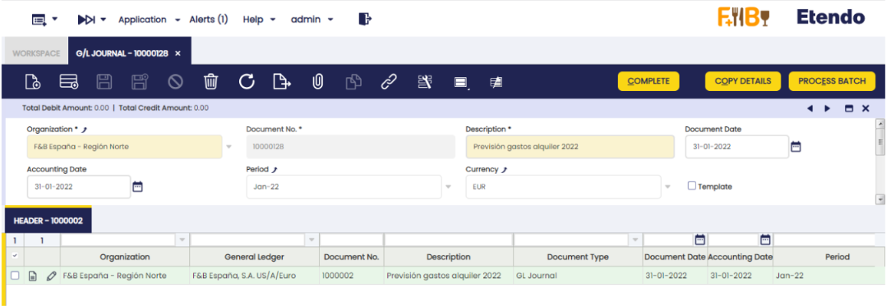
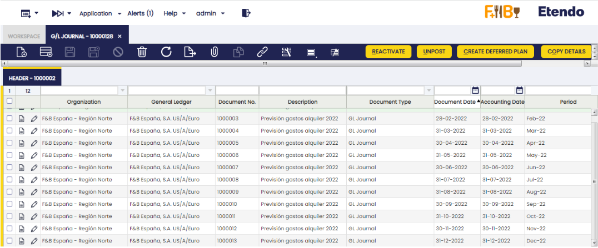
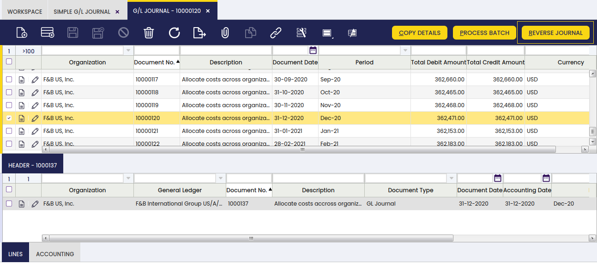
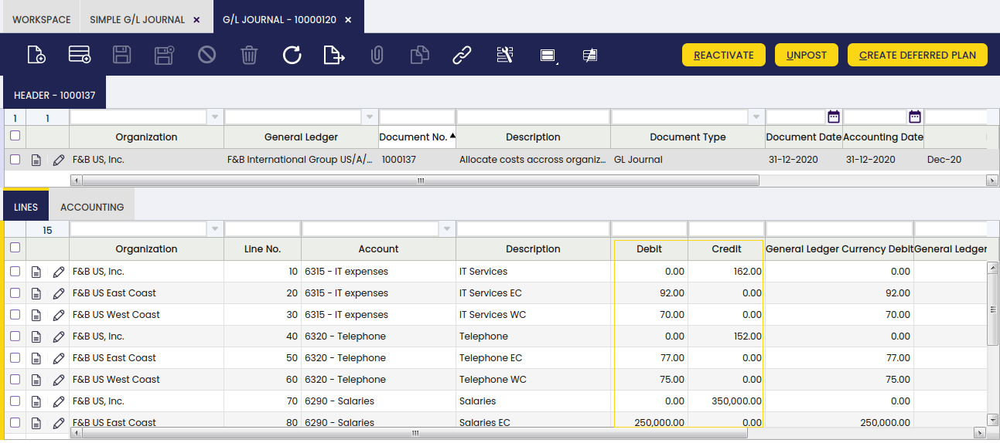
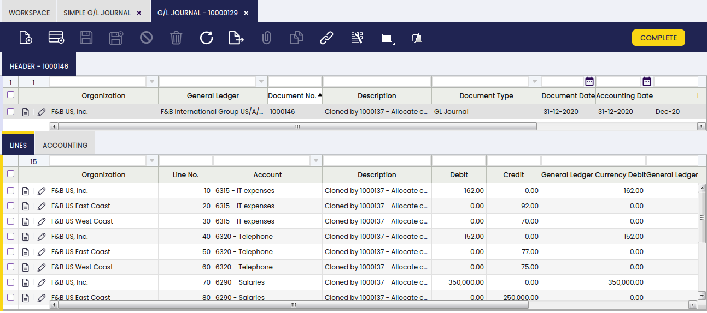

---
tags:
  - Etendo Classic
  - Financial Management
  - G/L Journal
  - General Ledger
  - Accounting Transactions
---

# Asientos manuales

:material-menu: `Aplicación` > `Gestión Financiera` > `Contabilidad` > `Transacciones` > `Asientos manuales`

## Descripción general

Un asiento de diario (Libro Mayor) permite al usuario registrar asientos en el libro mayor y crear pagos de conceptos contables.

Como ya se ha explicado, la mayoría de los asientos contables se crean al contabilizar documentos como facturas de compra, facturas de venta, etc.

Los asientos contables que no corresponden a un Tipo de Documento existente deben registrarse en el libro mayor mediante un asiento de Asientos manuales.

Además, un asiento de Asientos manuales puede utilizarse para crear **Pagos de Concepto Contable** o pagos no relacionados con pedidos o facturas.

!!! info
    Esta funcionalidad es muy útil al registrar la nómina de los empleados en el libro mayor, ya que el pago de la nómina puede crearse al mismo tiempo.

Por último, un asiento de Asientos manuales también puede configurarse como **plantilla**.

Esta funcionalidad permite al usuario crear los mismos asientos que los contenidos en el asiento de Asientos manuales configurado como plantilla.

Esta funcionalidad también es muy útil al registrar la nómina de los empleados, por ejemplo.

### Lote

Un lote de asientos manuales permite al usuario agrupar asientos de características similares que pueden procesarse todos al mismo tiempo.

Como se muestra en la imagen anterior, un *lote de asientos manuales* puede contener los siguientes datos:

-   el **período contable**
-   la **fecha contable**
-   y la **moneda**

Ninguno de los datos anteriores es obligatorio en este punto, ya que un asiento puede contener varios diarios con diferentes períodos y fechas contables. Lo mismo se aplica a la moneda, ya que un asiento puede contener varios diarios de distintas configuraciones de libro mayor general.

Una vez creado y guardado un lote, es posible crear tantos asientos de Asientos manuales como se requiera, que una vez listos pueden completarse y procesarse al mismo tiempo como un lote **único**.

Un asiento de Asientos manuales y, por tanto, su contenido puede configurarse como **Plantilla**; esa plantilla puede utilizarse posteriormente al crear un nuevo asiento mediante el botón de proceso **Copiar detalles** tal como se describe en la siguiente sección.

##### Asiento de Asientos manuales configurado como "Plantilla"

Como ya se ha mencionado, un asiento de Asientos manuales y, por tanto, su contenido puede configurarse como **Plantilla**. Para ello, es necesario seguir los pasos que se describen a continuación:

**1.** **Crear un asiento de Asientos manuales** para contabilizar la nómina del empleado correspondiente al período de enero de 2022, por ejemplo. Ese asiento debe marcarse como **Plantilla**.

**2.** Crear un **nuevo asiento de Asientos manuales** para contabilizar la nómina del empleado correspondiente al período de enero de 2022. Introduzca una **Fecha Contable** y un **Período**:

**3.** Presione el botón de proceso **Copiar detalles**.

Se muestra una nueva ventana con todas las plantillas disponibles:

!!! info
    Tenga en cuenta que es posible buscar una plantilla utilizando el número de documento del asiento de Asientos manuales configurado como plantilla y los campos de descripción.

**4.** **Seleccione una plantilla y haga clic en Aceptar**. Después de esto, Etendo rellena el asiento de Asientos manuales creado más recientemente con los mismos asientos; solo las fechas son diferentes.

Puede ser necesario cambiar los importes de los asientos. Para ello, es posible editar las Líneas del asiento de Asientos manuales y modificar los importes.

El último paso es contabilizar el asiento de Asientos manuales, de modo que los asientos correspondientes se registren en el libro mayor.

## Cabecera

Una cabecera de asiento de Asientos manuales puede incluir diarios, que pueden contener varias líneas de asiento.

Una cabecera de asiento de Asientos manuales contiene los siguientes datos:

-   La organización y la configuración del Libro Mayor General de la organización que, una vez seleccionada, establece por defecto el campo **Moneda** con la de la configuración del libro mayor general, por ejemplo USD. Sin embargo, la moneda puede cambiarse a EUR, por ejemplo. Etendo aplicará la tasa de conversión EUR -> USD correspondiente, ya que el registro en el libro mayor debe realizarse en USD.
-   La *fecha del documento*, que no tiene que ser la misma que la fecha contable.
    La fecha del documento se rellena automáticamente con la fecha actual por defecto, pero siempre puede cambiarse.
-   El *período contable* y la *fecha contable* dentro de ese período. Estas fechas pueden rellenarse automáticamente con los valores introducidos en el lote del diario, si lo hubiera; sin embargo, siempre pueden cambiarse.

Existe una casilla de verificación denominada ***Apertura*** que puede marcarse simplemente para indicar que un diario contiene **asientos de saldo de apertura de cuentas.**

Existe una **lista de acciones** que pueden ejecutarse desde la cabecera del asiento de Asientos manuales:

-   El botón **Copiar detalles** permite al usuario copiar los asientos de un diario configurado como ***Plantilla*** al diario actual.
-   El botón **Completar** permite al usuario completar el asiento de Asientos manuales una vez introducidas las líneas de diario correspondientes, siempre que el importe total del debe coincida con el importe total del haber.
-   El botón **Contabilizar/Descontabilizar** permite al usuario Contabilizar/Descontabilizar un asiento de Asientos manuales una vez completado.
-   El botón **Cerrar** permite al usuario cerrar un asiento de Asientos manuales para el que no se requiere ninguna otra acción, o reactivarlo si no está ya contabilizado.
-   El botón **Procesar lote** completa el/los asiento/s de Asientos manuales del lote.

!!! info
    Tenga en cuenta que al **completar un asiento de Asientos manuales, se creará un pago de **Concepto Contable**** para cada línea de diario que tenga marcada la casilla **Partidas Abiertas**, tal como se explica en la sección de creación de pagos de concepto contable.

!!! info
    El asiento se completará aunque falle la creación de alguno de los Pagos. En este caso, se muestra un mensaje de error indicando las Líneas que intentaron crear un Pago pero fallaron.

## Líneas

La pestaña de líneas permite al usuario introducir los asientos del diario, así como la información relacionada con el pago del concepto contable.

### Contabilidad

Información contable relacionada con el asiento de Asientos manuales.

## Asientos manuales diferidos
### Duplicar asientos manuales

!!! info
    Para poder incluir esta funcionalidad, es necesario instalar el Financial Extensions Bundle. Para ello, siga las instrucciones del marketplace: [Financial Extensions Bundle](https://marketplace.etendo.cloud/#/product-details?module=9876ABEF90CC4ABABFC399544AC14558){target="\_blank"}. Para más información sobre las versiones disponibles, compatibilidad con el core y nuevas funcionalidades, visite [Financial Extensions - Notas de la versión](../../../../../whats-new/release-notes/etendo-classic/bundles/financial-extensions/release-notes.md).

<iframe width="560" height="315" src="https://www.youtube.com/embed/K7XOBkmRLAQ?si=l-p9u_IvzFmMc46F" title="YouTube video player" frameborder="0" allow="accelerometer; autoplay; clipboard-write; encrypted-media; gyroscope; picture-in-picture; web-share" referrerpolicy="strict-origin-when-cross-origin" allowfullscreen></iframe>

Esta funcionalidad permite al usuario duplicar un asiento de Asientos manuales tantas veces como sea necesario, indicando la regularidad y el período en que se debe realizar la primera copia. A partir de la segunda copia, la duplicación tendrá lugar con la regularidad correspondiente.
A continuación se muestra el proceso para crear un asiento de Asientos manuales desde cero y duplicarlo posteriormente.

1- Acceda a la ventana "Asientos manuales" y cree una cabecera:

2- Cree un nuevo registro:

3- Cree las líneas (a registrar) y complete el asiento. Una vez realizados estos tres pasos, el botón "Crear Plan Diferido" se mostrará en el margen superior derecho.

4 - Haga clic en el botón y se mostrará una ventana emergente con tres campos:
• Tipo de Plan de Gastos: regularidad de las copias.
    • Nº Período: número de copias requerido.
    • Período: período en el que se realizará la primera copia.

5 - Una vez introducida esta información, haga clic en el botón "Listo" y se generarán tantos registros como el número de copias indicado.

Por defecto, esta funcionalidad solo está disponible para la ventana "Asientos manuales", ya que las copias de registros se agrupan bajo una única cabecera. También es posible duplicar estos asientos en los "Asientos Manuales Simplificados" solo si hay una preferencia configurada en la ventana "Preferencias" con la propiedad "Display Create Deferred Plan Button" y el valor "Y".

Una vez configurada esta preferencia, el botón se habilitará en los "Asientos Manuales Simplificados". El flujo es el mismo, pero las copias duplicadas no se crearán bajo una cabecera. Es decir, esta información no se mostrará en la ventana "Asientos manuales", excepto si la información a copiar ya se encuentra en ella, en cuyo caso se mostrará.

## Anulación de asiento de Asientos manuales

!!! info
    Para poder incluir esta funcionalidad, es necesario instalar el Financial Extensions Bundle. Para ello, siga las instrucciones del marketplace: [Financial Extensions Bundle](https://marketplace.etendo.cloud/#/product-details?module=9876ABEF90CC4ABABFC399544AC14558){target="\_blank"}. Para más información sobre las versiones disponibles, compatibilidad con el core y nuevas funcionalidades, visite [Financial Extensions - Notas de la versión](../../../../../whats-new/release-notes/etendo-classic/bundles/financial-extensions/release-notes.md).

Esta funcionalidad es especialmente útil para empresas que realizan un cierre mensual, en lugar de un cierre de año, pero con pagos pendientes (entrantes o salientes). Permite al usuario abrir o cerrar el período sin tener en cuenta los pagos hasta que se realicen.

Para utilizar esta funcionalidad, tanto en las ventanas "Asientos manuales" como en "Asientos Manuales Simplificados", el usuario puede hacer clic en el botón "Anular Asiento" en la barra de herramientas al seleccionar un asiento.

De esta manera, Etendo crea automáticamente un asiento de reversión que compensa el importe en las columnas de haber y debe.
>
!!! note
    Por defecto, el documento de reversión se crea como borrador. Por eso Etendo muestra la opción "Procesar Documento" al hacer clic en el botón "Anular Asiento". De esta manera, el usuario puede completar el documento.

Como se puede observar a continuación, Etendo muestra una notificación de éxito en verde con el nuevo número de asiento de Asientos manuales.

Al comparar el asiento de Asientos manuales original con el asiento de Asientos manuales de anulación, las columnas de debe y haber muestran la compensación, ya que los importes están invertidos.

##### Asiento de Asientos manuales original

##### Asiento de Asientos manuales de anulación

Esto resulta útil para distinguir entre el asiento de Asientos manuales original y el de anulación.

## Contabilización masiva

!!! info
    Para poder incluir esta funcionalidad, es necesario instalar el Financial Extensions Bundle. Para ello, siga las instrucciones del marketplace: [Financial Extensions Bundle](https://marketplace.etendo.cloud/#/product-details?module=9876ABEF90CC4ABABFC399544AC14558){target="\_blank"}. Para más información sobre las versiones disponibles, compatibilidad con el core y nuevas funcionalidades, visite [Financial Extensions - Notas de la versión](../../../../../whats-new/release-notes/etendo-classic/bundles/financial-extensions/release-notes.md).

La funcionalidad de Contabilización masiva permite al usuario contabilizar o descontabilizar múltiples registros seleccionando los registros correspondientes y haciendo clic en el botón **Contabilización masiva**.

Además, el Estado de Contabilización del/los registro/s se muestra en la barra de estado, en vista de formulario, o en una columna, en vista de grilla.
>
!!! info
    Para más información, visite [la guía del usuario del módulo Contabilización masiva](../../../../optional-features/bundles/financial-extensions/bulk-posting.md).

---

This work is a derivative of [Financial Management](http://wiki.openbravo.com/wiki/Financial_Management){target="\_blank"} by [Openbravo Wiki](http://wiki.openbravo.com/wiki/Welcome_to_Openbravo){target="\_blank"}, used under [CC BY-SA 2.5 ES](https://creativecommons.org/licenses/by-sa/2.5/es/){target="\_blank"}. This work is licensed under [CC BY-SA 2.5](https://creativecommons.org/licenses/by-sa/2.5/){target="\_blank"} by [Etendo](https://etendo.software){target="\_blank"}.
