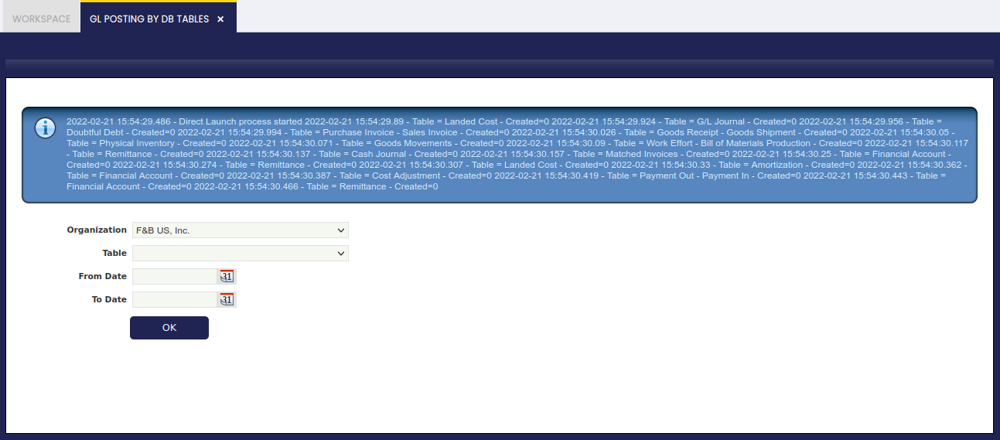

---
tags:
  - Etendo Classic
  - Financial Management
  - Accounting
  - GL Posting
  - Ledger Entries
---

# Proceso contable

:material-menu: `Aplicación` > `Gestión Financiera` > `Contabilidad` > `Transacciones` > `Proceso contable`

## Descripción general

El Proceso contable permite al usuario contabilizar masivamente las transacciones relacionadas con una tabla transaccional determinada o con todas ellas.

Como se muestra en la imagen anterior, la funcionalidad **Proceso contable** permite al usuario:

-   seleccionar una Organización o todas ellas si no se selecciona una organización concreta
-   seleccionar una Tabla o todas ellas si no se selecciona una tabla concreta
-   y seleccionar una **Fecha Desde** y **Fecha Hasta**; si no se seleccionan fechas, se contabilizarán todas las transacciones disponibles.

Tras ejecutar el proceso, Etendo informa sobre el número de asientos del libro mayor registrados en el libro mayor para cada tabla, con el fin de contabilizar de nuevo la/s tabla/s transaccional/es en el libro mayor.

Este proceso puede lanzarse cuando sea necesario:

-   Puede ejecutarse si hay transacciones pendientes de contabilizar de forma masiva cuando el Proceso de Servidor de Contabilidad no está habilitado o no lo está para un conjunto determinado de tablas.
-   También puede ejecutarse tras ejecutar el proceso Reinicializar cuentas, como forma de regenerar los asientos del libro mayor.

---

This work is a derivative of [Financial Management](http://wiki.openbravo.com/wiki/Financial_Management){target="\_blank"} by [Openbravo Wiki](http://wiki.openbravo.com/wiki/Welcome_to_Openbravo){target="\_blank"}, used under [CC BY-SA 2.5 ES](https://creativecommons.org/licenses/by-sa/2.5/es/){target="\_blank"}. This work is licensed under [CC BY-SA 2.5](https://creativecommons.org/licenses/by-sa/2.5/){target="\_blank"} by [Etendo](https://etendo.software){target="\_blank"}.
