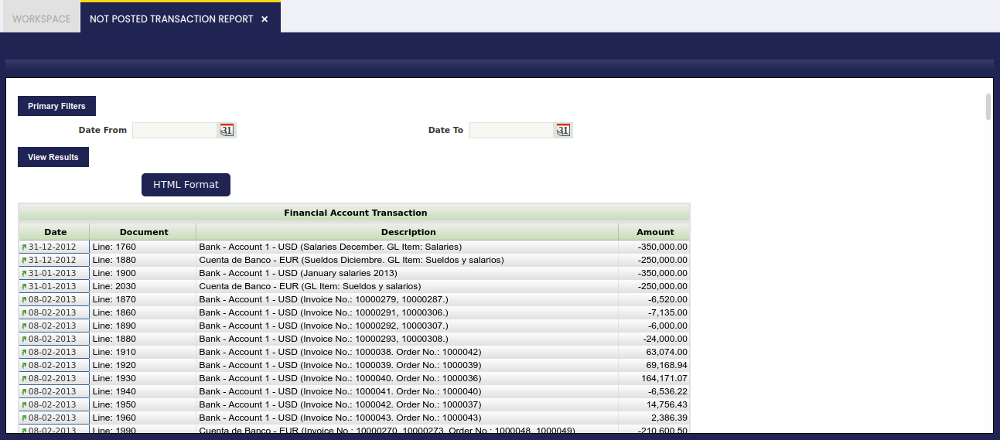

---
tags:
  - Etendo Classic
  - Financial Management
  - Accounting
  - Not Posted Transactions
  - Accounting Reports
---

# Documentos no contabilizados

:material-menu: `Aplicación` > `Gestión Financiera` > `Contabilidad` > `Transacciones` > `Documentos no contabilizados`

## Descripción general

El informe Documentos no contabilizados lista las transacciones y/o documentos en estado **Completo** que no han sido contabilizados todavía.

Este informe puede utilizarse para asegurarse de que no hay documentos pendientes de contabilizar:

-   al cerrar un período contable o un ejercicio fiscal, ya que una vez cerrado un período no es posible contabilizar dentro de ese período
-   al ejecutar informes financieros, ya que las transacciones o documentos no contabilizados no se tendrán en cuenta en los informes financieros

Las transacciones y/o documentos no contabilizados mostrados están divididos por tipo, por ejemplo:

-   Asientos manuales
-   Factura de Proveedor
-   Factura o factura de cliente
-   Pago a Proveedor
-   Transacción Financiera
-   Cobros o pago recibido
-   etc.

y es posible navegar al documento no contabilizado y, por tanto, contabilizarlo haciendo clic en el campo **Fecha** junto al documento o transacción.

Por último, es importante destacar que:

-   Los filtros **Fecha Desde** y **Fecha Hasta** permiten al usuario acotar las transacciones no contabilizadas que se muestran en el informe teniendo en cuenta su fecha de transacción o de documento.
-   No es necesario introducir una **configuración de libro mayor general** para acotar la información contable, porque:
    -   si un documento no está contabilizado, no lo está para ninguno de los libros mayores generales en los que debería estarlo
    -   y si un documento está contabilizado, lo está para todos los libros mayores generales en los que debería estarlo.

---

This work is a derivative of [Financial Management](http://wiki.openbravo.com/wiki/Financial_Management){target="\_blank"} by [Openbravo Wiki](http://wiki.openbravo.com/wiki/Welcome_to_Openbravo){target="\_blank"}, used under [CC BY-SA 2.5 ES](https://creativecommons.org/licenses/by-sa/2.5/es/){target="\_blank"}. This work is licensed under [CC BY-SA 2.5](https://creativecommons.org/licenses/by-sa/2.5/){target="\_blank"} by [Etendo](https://etendo.software){target="\_blank"}.
