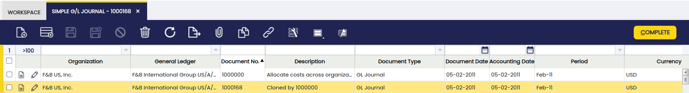

---
tags:
  - Etendo Classic
  - Financial Management
  - Simple G/L Journal
  - GL Journal
  - Accounting Transactions
---

# Asientos Manuales Simplificados

:material-menu: `Aplicación` > `Gestión Financiera` > `Contabilidad` > `Transacciones` > `Asientos Manuales Simplificados`

## Descripción general

En Etendo existe una ventana Asientos manuales que permite al usuario introducir manualmente asientos en el sistema. Esta ventana tiene tres pestañas (Lote, Cabecera y Líneas) y, en algunos casos, esto puede resultar complicado para el usuario, ya que podría ser suficiente con solo dos niveles (Cabecera y líneas). Otro inconveniente de esta ventana es que solo se pueden seleccionar esquemas contables, por lo que al contabilizar el asiento solo hay una entrada en la tabla fact\_Acct.

##### Ventajas de los Asientos Manuales Simplificados

-   Es una ventana más sencilla, ya que no es necesario introducir un lote. Hay un nivel menos de entrada de datos.
-   Es más sencillo buscar asientos. Sin el nivel de lote, es posible buscar directamente asientos específicos.
-   En esta ventana es posible ver asientos que se han creado utilizando la ventana Asientos manuales, por lo que también es posible buscarlos en ella.

## Cabecera

Una cabecera de asiento puede incluir diarios que pueden contener varias líneas de asiento.

Campo importante a destacar:

-   *Multi-libro mayor*: un indicador.
    -   Si no está marcado, a partir de ese momento se muestra el campo Libro Mayor.
    -   Si está marcado, el sistema no mostrará el campo Libro Mayor y no se tendrá en cuenta para las siguientes operaciones.

## Líneas

La pestaña de líneas permite al usuario introducir los asientos del diario, así como la información relacionada con el pago del concepto contable.

Un campo a destacar:

-   Concepto Contable: desplegable donde se muestran todos los Conceptos Contables. Tiene una visualización lógica y solo se muestra cuando **Multi-libro mayor** está marcado en la cabecera.

!!! info
    Si **Multi-libro mayor** no está marcado, en su lugar se muestra el campo Cuenta.

### Contabilidad

Información contable relacionada con el asiento de Asientos manuales.

Al Contabilizar la Cabecera:

-   Todos los asientos contables se crean con combinaciones de cuentas (Cuenta) o concepto contable. No puede haber líneas mixtas.
-   Si **Multi-Libro Mayor** está:
    -   No marcado: solo puede seleccionar cuentas que pertenezcan a un único esquema contable (definido en la cabecera), por lo que al contabilizar el documento habrá un único asiento de diario. Este comportamiento no cambiará. El proceso de contabilización es exactamente igual que en la ventana Asientos manuales.
    -   Marcado: el usuario selecciona Conceptos Contables y, dado que puede tener diferentes combinaciones válidas al contabilizar el documento, tendrá tantas entradas como cuentas distintas en las que esté definido el concepto contable y la organización definida en la cabecera.

### Tipos de Cambio

La pestaña de tipos de cambio permite al usuario introducir un tipo de cambio entre la moneda del libro mayor general de la organización y la moneda del asiento de Asientos manuales, que se utilizará al contabilizar el asiento en el libro mayor.

!!! info
    Esta pestaña solo se mostrará cuando Multi-Libro Mayor esté habilitado.

## Anulación de asiento de Asientos manuales

!!! info
    Para poder incluir esta funcionalidad, es necesario instalar el Financial Extensions Bundle. Para ello, siga las instrucciones del marketplace: [Financial Extensions Bundle](https://marketplace.etendo.cloud/#/product-details?module=9876ABEF90CC4ABABFC399544AC14558){target="\_blank"}. Para más información sobre las versiones disponibles, compatibilidad con el core y nuevas funcionalidades, visite [Financial Extensions - Notas de la versión](../../../../../whats-new/release-notes/etendo-classic/bundles/financial-extensions/release-notes.md).

Esta funcionalidad es especialmente útil para empresas que realizan un cierre mensual, en lugar de un cierre de año, pero con pagos pendientes (entrantes o salientes). Permite al usuario abrir o cerrar el período sin tener en cuenta los pagos hasta que se realicen.

Para utilizar esta funcionalidad, tanto en las ventanas "Asientos manuales" como en "Asientos Manuales Simplificados", el usuario puede hacer clic en el botón "Anular Asiento" en la barra de herramientas al seleccionar un asiento.

De esta manera, Etendo crea automáticamente un asiento de reversión que compensa el importe en las columnas de haber y debe.
>
!!! info
    Es importante tener en cuenta que, por defecto, el documento de reversión se creará como borrador. Por eso Etendo muestra la opción "Procesar Documento" al hacer clic en el botón "Anular Asiento". De esta manera, el usuario puede completar el documento.

Como se puede observar a continuación, Etendo muestra una notificación de éxito en verde con el nuevo número de asiento de Asientos manuales.

Al comparar el asiento de Asientos manuales original con el asiento de Asientos manuales de anulación, las columnas de debe y haber muestran la compensación, ya que los importes están invertidos.

##### Asiento de Asientos manuales original

##### Asiento de Asientos manuales de anulación

### Opción de cambio de descripción en la ventana Asientos Manuales Simplificados

Si el asiento se crea en la ventana Asientos Manuales Simplificados, el usuario puede cambiar la descripción del asiento, una vez que hace clic en el botón "Anular Asiento", en la ventana emergente correspondiente.

Esto resulta útil para distinguir entre el asiento original y el de anulación.

## Contabilización masiva

!!! info
    Para poder incluir esta funcionalidad, es necesario instalar el Financial Extensions Bundle. Para ello, siga las instrucciones del marketplace: [Financial Extensions Bundle](https://marketplace.etendo.cloud/#/product-details?module=9876ABEF90CC4ABABFC399544AC14558){target="\_blank"}. Para más información sobre las versiones disponibles, compatibilidad con el core y nuevas funcionalidades, visite [Financial Extensions - Notas de la versión](../../../../../whats-new/release-notes/etendo-classic/bundles/financial-extensions/release-notes.md).

La funcionalidad de Contabilización masiva permite al usuario contabilizar o descontabilizar múltiples registros seleccionando los registros correspondientes y haciendo clic en el botón **Contabilización masiva**.

Además, el Estado de Contabilización del/los registro/s se muestra en la barra de estado, en vista de formulario, o en una columna, en vista de grilla.
>
!!! info
    Para más información, visite [la guía del usuario del módulo Contabilización masiva](../../../../optional-features/bundles/financial-extensions/bulk-posting.md).

## Clonado de asiento de Asientos manuales

!!! info
    Para poder incluir esta funcionalidad, es necesario instalar el Financial Extensions Bundle. Para ello, siga las instrucciones del marketplace: [Financial Extensions Bundle](https://marketplace.etendo.cloud/#/product-details?module=9876ABEF90CC4ABABFC399544AC14558){target="_blank"}. Para más información sobre las versiones disponibles, compatibilidad con el core y nuevas funcionalidades, visite [Financial Extensions - Notas de la versión](../../../../../whats-new/release-notes/etendo-classic/bundles/financial-extensions/release-notes.md).

Con esta funcionalidad, el usuario puede clonar fácilmente un asiento seleccionado. Esta función no solo duplica el asiento, sino que también crea una descripción detallada que incluye el número de pedido original.

Para ello, seleccione el registro a clonar y haga clic en el botón copiar registro de la barra de herramientas.

De esta manera, se genera una copia del registro original, incluyendo una descripción y un número de copia, como se muestra a continuación.

Esta funcionalidad mejora la eficiencia en la gestión de asientos, facilitando la replicación y el registro preciso de transacciones.

---

This work is a derivative of [Financial Management](http://wiki.openbravo.com/wiki/Financial_Management){target="\_blank"} by [Openbravo Wiki](http://wiki.openbravo.com/wiki/Welcome_to_Openbravo){target="\_blank"}, used under [CC BY-SA 2.5 ES](https://creativecommons.org/licenses/by-sa/2.5/es/){target="\_blank"}. This work is licensed under [CC BY-SA 2.5](https://creativecommons.org/licenses/by-sa/2.5/){target="\_blank"} by [Etendo](https://etendo.software){target="\_blank"}.
