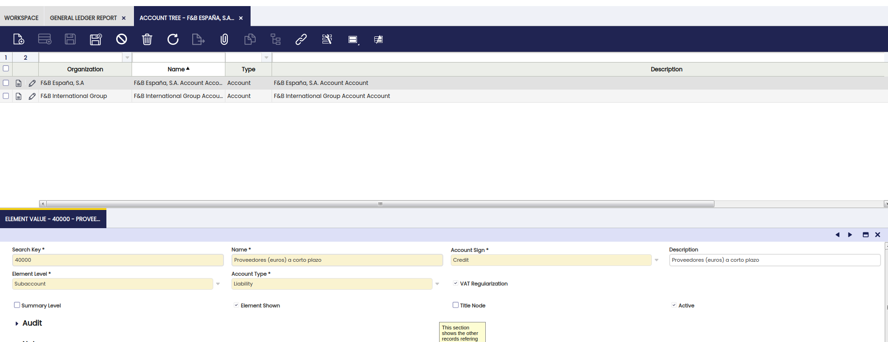
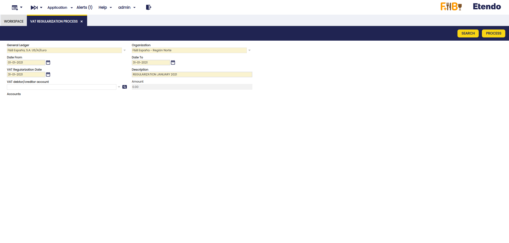
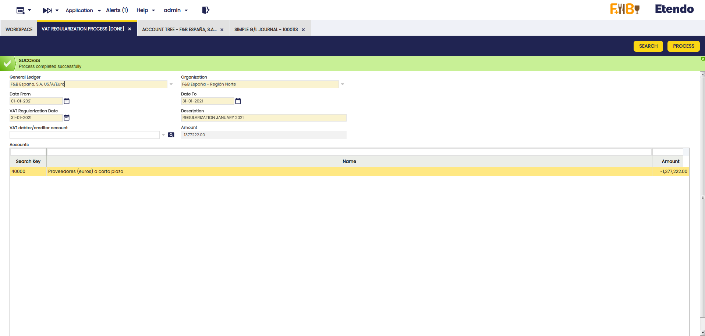
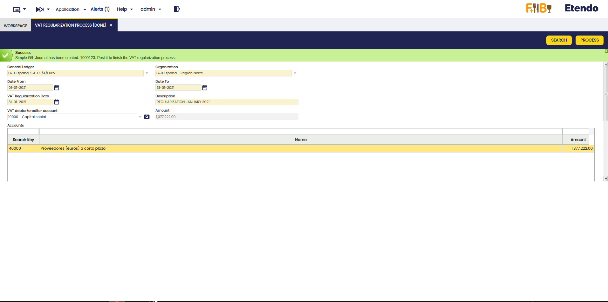
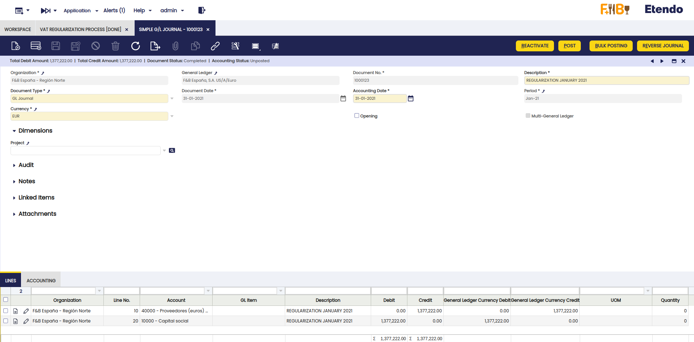
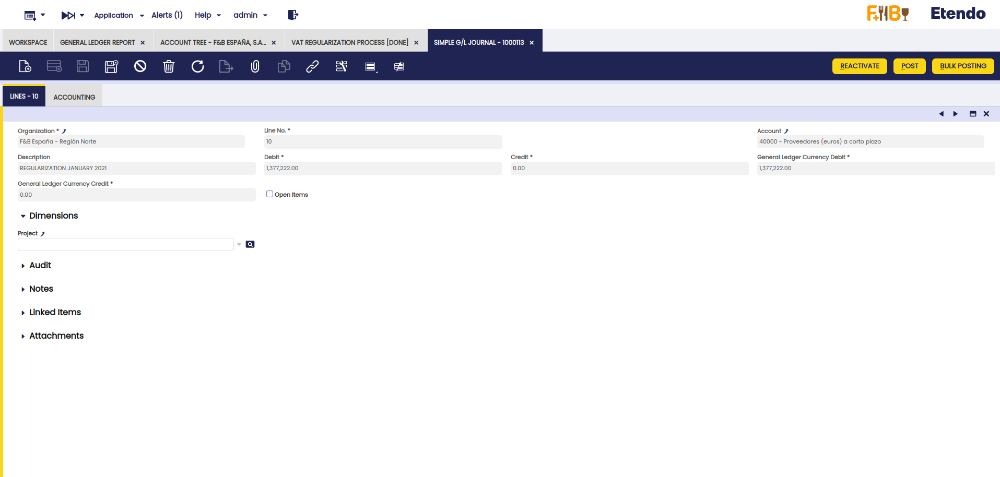
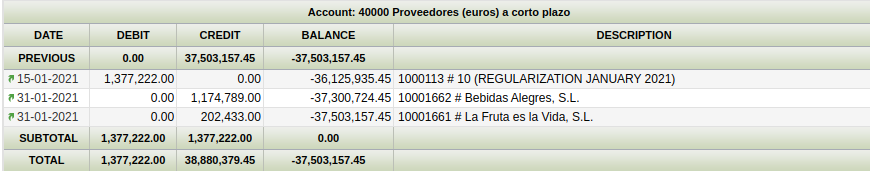

---
tags:
  - Etendo Classic
  - Financial Management
  - Accounting
  - VAT Regularization
  - Financial Extensions
---

# Regularización del IVA { #vat-regularization }

:material-menu: `Aplicación` > `Gestión Financiera` > `Contabilidad` > `Transacciones` > `Proceso de regularización del IVA`

!!!info
    Para poder incluir esta funcionalidad, es necesario instalar el Financial Extensions Bundle. Para ello, siga las instrucciones del marketplace: [Financial Extensions Bundle](https://marketplace.etendo.cloud/#/product-details?module=9876ABEF90CC4ABABFC399544AC14558){target="\_blank"}. Para más información sobre las versiones disponibles, compatibilidad con el core y nuevas funcionalidades, visite [Financial Extensions - Notas de la versión](../../../../../whats-new/release-notes/etendo-classic/bundles/financial-extensions/release-notes.md).

## Descripción general { #overview }

El módulo de Regularización del IVA permite ajustar automáticamente las cuentas para garantizar que el saldo del IVA sea correcto. Esto implica verificar las cuentas en las que este proceso es necesario y crear el asiento de Asientos manuales correspondiente para regularizar el IVA. Este proceso es esencial para mantener registros financieros precisos y el cumplimiento de las normativas fiscales.

A continuación se describen los pasos necesarios para llevarlo a cabo en un período de tiempo específico.

## Proceso de regularización del IVA { #vat-regularization-process }

### Configuración de la cuenta { #account-setup }

Para habilitar una cuenta para que forme parte del proceso de regularización del IVA, es necesario acceder a la ventana Árbol de cuentas, seleccionar la organización a la que pertenece la cuenta y, en la pestaña Cuenta Contable, seleccionar la cuenta correspondiente y marcar la casilla Regularización del IVA como activa.

### Proceso de regularización del IVA { #vat-regularization-process_1 }

1. Vaya a `Aplicación` > `Gestión Financiera` > `Contabilidad` > `Transacciones` > ventana `Proceso de regularización del IVA`.
2. Complete los siguientes campos obligatorios:
    - **Libro Mayor**: seleccione el libro mayor al que pertenece la cuenta a regularizar.
    - **Organización**: seleccione la organización a la que pertenece la cuenta.
    - **Fecha Desde**: fecha de inicio de la regularización.
    - **Fecha Hasta**: fecha de fin de la regularización.
    - **Fecha de regularización del IVA**: fecha en la que tendrá lugar la regularización.
    - **Descripción**: descripción que identifica los períodos que se están regularizando.
    
3. Haga clic en el botón **Buscar**. Se mostrará una grilla con las cuentas marcadas con la casilla Regularización del IVA, tal como se explica en [Configuración de la cuenta](#configuracion-de-la-cuenta).

4. El campo Importe muestra el valor a regularizar. Además, el campo Importe en la cabecera ofrece la suma de todos los importes de las cuentas seleccionadas para regularizar. En este caso, coincide con el importe de la línea porque solo hay una cuenta a regularizar.
5. Seleccione una cuenta en el campo Cuenta deudora/acreedora del IVA para cuadrar las cuentas una vez generado el asiento de Asientos Manuales Simplificados.

### Generación del asiento de Asientos manuales { #gl-journal-entry-generation }
1. Haga clic en el botón **Procesar** para generar el asiento de Asientos Manuales Simplificados.

    !!!important
        Recuerde que este proceso afecta a todas las cuentas resultantes de la búsqueda, por lo que la selección de las cuentas correspondientes debe realizarse al marcar la casilla de Regularización del IVA en el paso de configuración.

2. Vaya a la ventana Asientos Manuales Simplificados y filtre el campo Nº de Documento por el número generado en el proceso (p. ej. **1000123**).

3. Aquí, verifique que la cabecera se ha creado con las líneas correspondientes.

### Revisión y contabilización del asiento { #entry-review-and-posting }

1. Compruebe que se ha creado una línea por cada cuenta a regularizar (en este caso, la cuenta 40000) y que el importe a regularizar (-1.377.222,00) se ha añadido en el campo Debe en positivo.

2. Verifique que se ha creado otra línea con la cuenta seleccionada en el campo Cuenta deudora/acreedora del IVA con el importe correspondiente en el campo Haber.

3. Contabilice el asiento de Asientos manuales manual con el proceso **Contabilizar**.
4. Genere de nuevo el informe del libro mayor y verifique que el **Saldo** de la cuenta 40000 es cero, lo que indica que el IVA se ha regularizado correctamente.

!!!info
    Con este módulo, a partir de Etendo versión 24.2.0 y Financial Extensions Bundle versión 1.15.0, se ha modificado la ordenación de campos para que los asientos de Asientos manuales siempre queden ordenados al final del día. Este cambio garantiza que, en el Libro mayor y en el Informe del Libro Mayor avanzado, los asientos de Asientos manuales del día se muestren correctamente ordenados.

---

This work is a derivative of [Financial Management](http://wiki.openbravo.com/wiki/Financial_Management){target="\_blank"} by [Openbravo Wiki](http://wiki.openbravo.com/wiki/Welcome_to_Openbravo){target="\_blank"}, used under [CC BY-SA 2.5 ES](https://creativecommons.org/licenses/by-sa/2.5/es/){target="\_blank"}. This work is licensed under [CC BY-SA 2.5](https://creativecommons.org/licenses/by-sa/2.5/){target="\_blank"} by [Etendo](https://etendo.software){target="\_blank"}.
