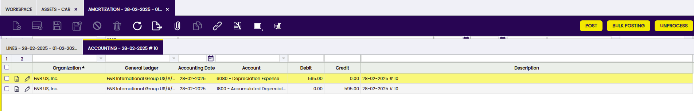
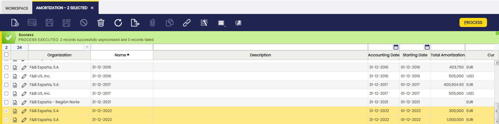

---
tags:
  - Etendo Classic
  - Financial Management
  - Assets
  - Amortization
  - Financial Extensions
---

# Amortización

:material-menu: `Application` > `Financial Management` > `Assets` > `Amortization`

## Descripción general

En la ventana Amortización se registran las amortizaciones de activos, agrupadas por fecha. Además, desde esta ventana dichos registros se procesan y se contabilizan en el libro mayor.

## Ventana Amortización

Desde la cabecera se crean amortizaciones para períodos concretos.

Campos a destacar:

- **Organización**: Entidad organizativa dentro de la entidad.
- **Nombre**: Identificador no único de un registro/documento, utilizado frecuentemente como herramienta de búsqueda.
- **Descripción**: Espacio para escribir información adicional relacionada.
- **Fecha contable**: Fecha en la que el activo debe ser registrado contablemente.
- **Fecha de inicio**: Fecha a partir de la cual comienza la amortización.
- **Amortización total**: Importe de la amortización.
- **Moneda**: Medio de intercambio monetario aceptado que puede variar según el país.
- **Proyecto**: Identificador de un proyecto definido en el módulo de Gestión de Proyectos y Servicios.

## Solapa Líneas

Cada línea muestra los activos amortizados y los detalles de la amortización.

Campos a destacar:

- **Nº línea**: Indica la línea única de un documento.
- **Activo**: El activo a amortizar.
- **Porcentaje de amortización**: Porcentaje de amortización (calculado en tiempo o en porcentaje).
- **Importe de amortización**: Importe de la amortización.
- **Moneda**: Indica la moneda que se utilizará al procesar este documento.
- **Proyecto**: Identificador de un proyecto definido en el módulo de Gestión de Proyectos y Servicios.

## Solapa Contabilidad

Información contable relacionada con la amortización una vez que el documento ha sido contabilizado.

Campos a destacar:

- **Fecha contable**: La fecha en que esta transacción se registra en el libro mayor. Esta fecha también indica a qué período contable del ejercicio fiscal pertenecerá la transacción.
- **Cuenta**: La cuenta utilizada.
- **Debe**: El importe al debe de la cuenta indica el importe de la transacción convertido a la moneda contable de esta organización.
- **Haber**: El importe al haber de la cuenta indica el importe de la transacción convertido a la moneda contable de esta organización.

!!!info 
    Para más información sobre la funcionalidad de Cuenta financiera, visite [Cuenta financiera](../../../basic-features/financial-management/receivables-and-payables/transactions/financial-account.md).

## Dimensiones Contables de Activos

<iframe width="560" height="315" src="https://www.youtube.com/embed/1a1UNCnNNcI?si=DbicgZnWjtmkScDh" title="YouTube video player" frameborder="0" allow="accelerometer; autoplay; clipboard-write; encrypted-media; gyroscope; picture-in-picture; web-share" referrerpolicy="strict-origin-when-cross-origin" allowfullscreen></iframe>

!!! info
    Para poder incluir esta funcionalidad, se debe instalar el Financial Extensions Bundle. Para ello, siga las instrucciones del marketplace: [Financial Extensions Bundle](https://marketplace.etendo.cloud/#/product-details?module=9876ABEF90CC4ABABFC399544AC14558){target="_blank"}. Para más información sobre las versiones disponibles, compatibilidad con el núcleo y nuevas funcionalidades, visite [Financial Extensions - Notas de versión](../../../../../whats-new/release-notes/etendo-classic/bundles/financial-extensions/release-notes.md).

Este módulo permite que en la ventana Amortización, a diferencia del funcionamiento estándar en el que las amortizaciones de activos se agrupaban según fechas específicas, los registros de amortización se agrupen **únicamente por períodos** (mensual o anual) en el caso del tipo calculado (tiempo), e incluso anualmente para el tipo calculado (porcentaje). Asimismo, en la agrupación no se tienen en cuenta las dimensiones.
Además, las dimensiones contables se mantienen en las líneas de amortización para su uso en la generación de asientos contables.

## Contabilización masiva

!!! info
    Para poder incluir esta funcionalidad, se debe instalar el Financial Extensions Bundle. Para ello, siga las instrucciones del marketplace: [Financial Extensions Bundle](https://marketplace.etendo.cloud/#/product-details?module=9876ABEF90CC4ABABFC399544AC14558){target="\_blank"}. Para más información sobre las versiones disponibles, compatibilidad con el núcleo y nuevas funcionalidades, visite [Financial Extensions - Notas de versión](../../../../../whats-new/release-notes/etendo-classic/bundles/financial-extensions/release-notes.md).

La funcionalidad de Contabilización masiva permite al usuario contabilizar o descontabilizar múltiples registros seleccionando los registros correspondientes y haciendo clic en el botón **Bulk posting**.

Además, el Estado contable del registro o registros se muestra en la barra de estado, en la vista de formulario, o en una columna en la vista de grilla.
> 
!!! info
    Para más información, visite [la guía de usuario del módulo de Contabilización masiva](../../../../../user-guide/etendo-classic/optional-features/bundles/financial-extensions/bulk-posting.md).

## Cómo reactivar amortizaciones

!!! info
    Para poder incluir esta funcionalidad, se debe instalar el Financial Extensions Bundle. Para ello, siga las instrucciones del marketplace: [Financial Extensions Bundle](https://marketplace.etendo.cloud/#/product-details?module=9876ABEF90CC4ABABFC399544AC14558){target="\_blank"}. Para más información sobre las versiones disponibles, compatibilidad con el núcleo y nuevas funcionalidades, visite [Financial Extensions - Notas de versión](../../../../../whats-new/release-notes/etendo-classic/bundles/financial-extensions/release-notes.md).

Etendo permite procesar y desprocesar múltiples amortizaciones. Este proceso está disponible para amortizaciones que comparten el mismo estado. El estado de la amortización se puede ver en la barra de estado.

---

This work is a derivative of [Financial Management](http://wiki.openbravo.com/wiki/Financial_Management){target="\_blank"} by [Openbravo Wiki](http://wiki.openbravo.com/wiki/Welcome_to_Openbravo){target="\_blank"}, used under [CC BY-SA 2.5 ES](https://creativecommons.org/licenses/by-sa/2.5/es/){target="\_blank"}. This work is licensed under [CC BY-SA 2.5](https://creativecommons.org/licenses/by-sa/2.5/){target="\_blank"} by [Etendo](https://etendo.software){target="\_blank"}.
