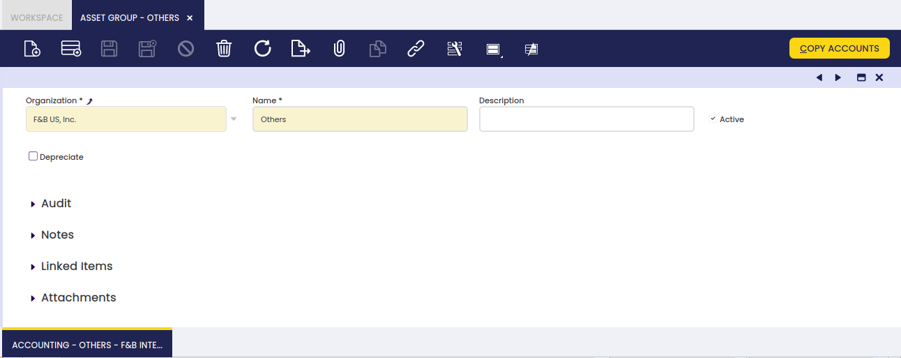
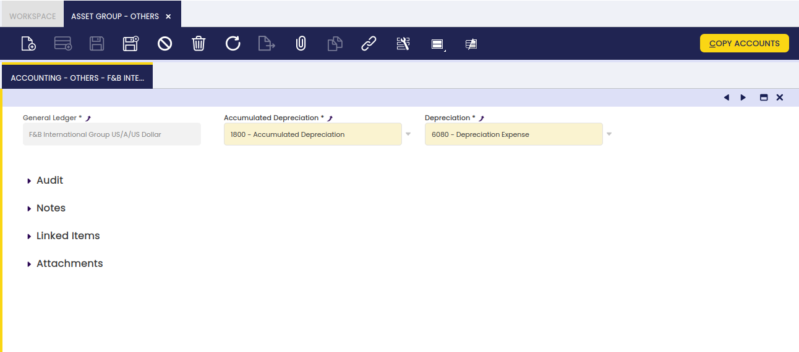

---
tags:
  - Etendo Classic
  - Financial Management
  - Assets
  - Asset Group
  - Depreciation
---

# Grupo de activos { #asset-group }

:material-menu: `Application` > `Financial Management` > `Assets` > `Asset Group`

## Descripción general { #overview }

Los activos pueden agruparse en diferentes categorías con el objetivo de facilitar su gestión y análisis de depreciación.

## Ventana Grupo de activos { #asset-group-window }

La ventana Grupo de activos permite al usuario crear y configurar cada categoría de activo que la organización pueda necesitar.

Como se muestra en la imagen anterior, la creación de una categoría de activo requiere que el usuario introduzca la siguiente información para cada categoría:

-   **Nombre** o nombre abreviado que facilite la búsqueda de una categoría.
-   **Descripción**: espacio para escribir información adicional relacionada.
-   **Depreciar**: indica si los activos de este grupo serán depreciados.
-   **Tipo de depreciación**: Lineal. Indica el método utilizado para depreciar este activo.
-   **Tipo de cálculo**: indica cómo se calculará la depreciación: Tiempo (mensual o anual) o Porcentaje (anual).
-   **Depreciación anual**: Porcentaje anual utilizado para depreciar este activo.
-   **Amortizar**: hace referencia a los períodos elegidos entre asientos de depreciación (mensual, anual).
-   **Vida útil - Meses**: Años de vida útil del activo.
-   **Vida útil - Años**: Meses de vida útil del activo.

La configuración de la depreciación se heredará de la categoría de activo al crear un nuevo activo desde la ventana Activos.

## Solapa Contabilidad { #accounting-tab }

Cada categoría de activo permite al usuario configurar un conjunto de cuentas diferente para contabilizar la depreciación del activo.

---

This work is a derivative of [Financial Management](http://wiki.openbravo.com/wiki/Financial_Management){target="\_blank"} by [Openbravo Wiki](http://wiki.openbravo.com/wiki/Welcome_to_Openbravo){target="\_blank"}, used under [CC BY-SA 2.5 ES](https://creativecommons.org/licenses/by-sa/2.5/es/){target="\_blank"}. This work is licensed under [CC BY-SA 2.5](https://creativecommons.org/licenses/by-sa/2.5/){target="\_blank"} by [Etendo](https://etendo.software){target="\_blank"}.
