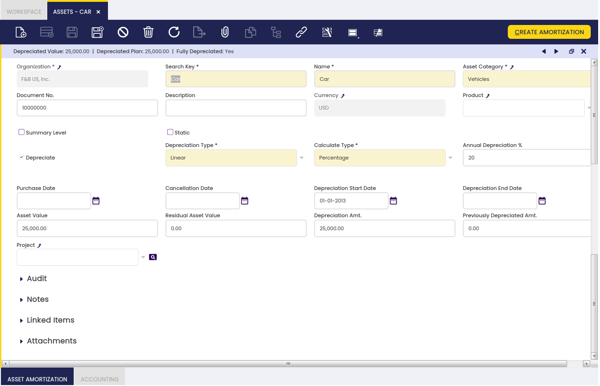
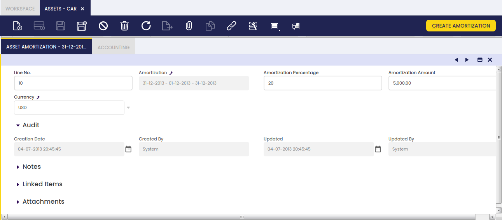
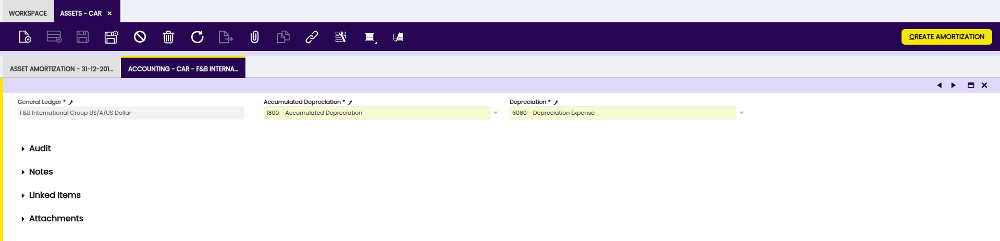
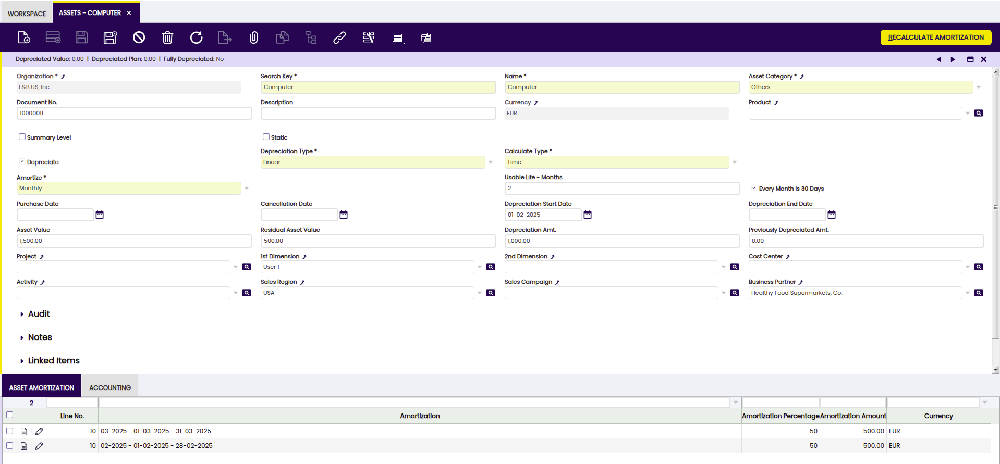

---
tags:
  - Etendo Classic
  - Financial Management
  - Assets
  - Amortization
  - Depreciation
---

# Activos

:material-menu: `Application` > `Financial Management` > `Assets` > `Assets`

## Descripción general

El usuario puede definir los activos de la empresa y configurar sus características de amortización.

## Ventana Activos

Campos a destacar:

-   **Organización**: Entidad organizativa dentro de la entidad.
-   **Clave de búsqueda**: Un método rápido para encontrar un registro concreto.
-   **Nombre**: Identificador no único de un registro/documento, utilizado frecuentemente como herramienta de búsqueda.
-   **Categoría del activo**: Clasificación de activos basada en características similares, definida en la [ventana Grupo de activos](./asset-group.md). Los campos de configuración se completarán automáticamente según las características definidas en esta ventana.
-   **Nº de documento**: Identificador generado automáticamente para todos los documentos.
-   **Descripción**: Espacio para escribir información adicional relacionada.
-   **Moneda**: Medio de intercambio monetario aceptado que puede variar según el país.
-   **Producto**: Artículo producido mediante un proceso.
-   **Nivel de resumen**: Cuando está marcado, agrupa otros activos y los muestra en vista de árbol.
-   **Estático**: Impide mover el registro a la vista de árbol.
-   **Depreciar**: El activo se utiliza internamente y será depreciado.
-   **Tipo de depreciación**: Lineal. Indica el método utilizado para depreciar este activo.
-   **Tipo de cálculo**: Indica cómo se calculará la amortización: Tiempo (mensual o anual) o Porcentaje (anual).
-   **Depreciación anual %**: Porcentaje anual de depreciación.
-   **Amortizar**: Calendario del activo.
-   **Vida útil - Años**: Años de vida útil del activo.
-   **Vida útil - Meses**: Meses de vida útil del activo.
-   **Cada mes tiene 30 días**: Si está marcado, calcula el plan de amortización considerando cada mes como un mes de 30 días y años de 365 días. Si no está marcado, considera los días reales del mes y los años bisiestos.
-   **Fecha de compra**: Fecha de compra.
-   **Fecha de cancelación**: Fecha de fin de vida útil.
-   **Fecha de inicio de depreciación**: Fecha de inicio de la depreciación. El plan de amortización se calculará a partir de esta fecha.
-   **Fecha de fin de depreciación**: Fecha de fin de la depreciación.
-   **Valor del activo**: Valor del activo.
-   **Valor residual del activo**: Importe del valor residual del activo.
-   **Importe de depreciación**: Importe de la depreciación.
-   **Importe depreciado previamente**: Este importe se resta al importe de depreciación al calcular el plan de amortización. Importe total a depreciar = Importe de depreciación - Importe depreciado previamente.
-   **Valor depreciado**: Valor depreciado.
-   **Proyecto**: Identificador de un proyecto definido en el módulo de Gestión de Proyectos y Servicios.

### Botones

- **Crear amortización**: El botón Crear amortización rellena la solapa Amortización del activo. Crea el plan de amortización basándose en la definición del activo.

- **Recalcular amortización**: El botón Recalcular amortización permite al usuario actualizar la información cuando sea necesario.

## Solapa Amortización del activo

Las amortizaciones del activo seleccionado se añaden a esta solapa.

-   **Nº línea**: Una línea que indica la posición de esta solicitud en el documento.
-   **Amortización**: La depreciación o reducción del valor de un producto a lo largo del tiempo.
-   **Porcentaje de amortización**: Porcentaje de amortización.
-   **Importe de amortización**: Importe de la amortización.
-   **Moneda**: Medio de intercambio monetario aceptado que puede variar según el país.

La solapa Amortización del activo muestra el plan de depreciación del activo en función de su vida útil y su valor, que es el importe a depreciar. El valor del activo se distribuye a lo largo de su vida útil (en meses o años), por lo que cada línea del plan de depreciación representa un porcentaje del importe total de depreciación del activo.

!!! note
    Es importante destacar que las líneas del plan de depreciación propuesto pueden eliminarse manualmente siempre que no estén procesadas ni contabilizadas. En ese caso, el proceso de creación de amortización puede ejecutarse de nuevo, recalculándose así el plan de depreciación. Esto resulta muy útil en aquellos casos en los que cambia el valor de un activo o su vida útil una vez iniciada la depreciación.

No obstante, existe una restricción a la hora de eliminar líneas si el usuario planea hacer clic en el botón Recalcular amortización posteriormente. Las líneas deben eliminarse siempre empezando por la más reciente y sin dejar líneas sin eliminar entre medias. Por ejemplo, con líneas de amortización como las siguientes:

-   Línea 10 - Línea del plan de depreciación de enero
-   Línea 20 - Línea del plan de depreciación de febrero
-   Línea 30 - Línea del plan de depreciación de marzo

La línea de depreciación de febrero no puede eliminarse hasta que no se haya eliminado la línea de depreciación de marzo.

El proceso asume que si existe la línea de depreciación de marzo, entonces existe la línea de depreciación de febrero.

## Solapa Contabilidad

El usuario puede crear y editar cuentas del libro mayor para utilizarlas en las transacciones que incluyan el activo seleccionado.

- **Contabilidad general**: El libro que contiene todas las transacciones financieras registradas para la entidad legal.
- **Depreciación acumulada**: Cuenta de depreciación acumulada.
- **Depreciación**: Cuenta de depreciación.

Las cuentas mostradas están configuradas por defecto y pueden modificarse.

## Dimensiones Contables de Activos

!!! info
    Para poder incluir esta funcionalidad, se debe instalar el Financial Extensions Bundle.
    Para ello, siga las instrucciones del marketplace: [Financial Extensions Bundle](https://marketplace.etendo.cloud/#/product-details?module=9876ABEF90CC4ABABFC399544AC14558){target="_blank"}.
    Para más información sobre las versiones disponibles, compatibilidad con el núcleo y nuevas funcionalidades, visite
    [Financial Extensions - Notas de versión](../../../../../whats-new/release-notes/etendo-classic/bundles/financial-extensions/release-notes.md).

Además de las dimensiones de Producto existentes para activos, este módulo permite a los usuarios seleccionar **dimensiones contables adicionales** que se transferirán automáticamente a las líneas de amortización, facilitando una mejor integración con los procesos contables.

Las dimensiones que el usuario puede aplicar al proceso de creación de activos son las siguientes:

- **Tercero**
- **Actividad**
- **1ª Dimensión**
- **2ª Dimensión**
- **Región de ventas**
- **Campaña**
- **Centro de coste**

!!! info
    Al crear o recalcular el plan de amortización de un activo, las dimensiones contables especificadas se transfieren a las líneas del plan de amortización.

!!! info
    Para más información sobre la configuración de dimensiones, visite [Dimensiones](../../../../etendo-classic/basic-features/financial-management/accounting/setup/general-ledger-configuration.md#dimension-tab).

### Botones

- **Crear amortización**: El botón Crear amortización genera las líneas de amortización en la solapa Amortización del activo relacionada con el activo seleccionado. Además, estas mismas líneas se añaden en la ventana Amortización, agrupándolas únicamente según el **período de depreciación** (mensual o anual) en el caso del tipo calculado (tiempo), e incluso anualmente para el tipo calculado (porcentaje).

---

This work is a derivative of [Financial Management](http://wiki.openbravo.com/wiki/Financial_Management){target="\_blank"} by [Openbravo Wiki](http://wiki.openbravo.com/wiki/Welcome_to_Openbravo){target="\_blank"}, used under [CC BY-SA 2.5 ES](https://creativecommons.org/licenses/by-sa/2.5/es/){target="\_blank"}. This work is licensed under [CC BY-SA 2.5](https://creativecommons.org/licenses/by-sa/2.5/){target="\_blank"} by [Etendo](https://etendo.software){target="\_blank"}.
