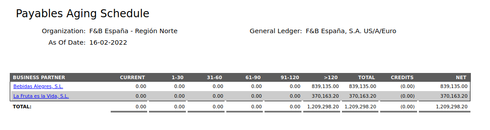
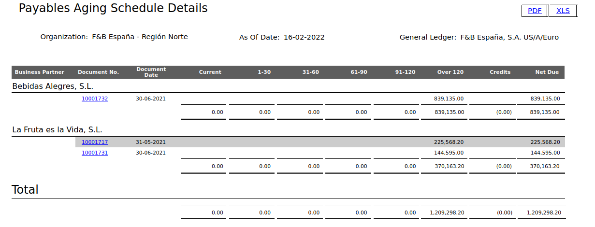

---
tags:
  - Etendo Classic
  - Financial Management
  - Payables Aging Schedule
  - Aging Report
  - Receivables and Payables
---

# Antigüedad de cuentas a pagar

:material-menu: `Application` > `Financial Management` > `Receivables and Payables` > `Analysis Tools` > `Payables Aging Schedule`

## Descripción general

El informe muestra las cuentas a pagar vencidas a la fecha que el usuario seleccione.

## Fuente de información

La fuente de información de este informe son las facturas como origen de las cuentas a cobrar y a pagar.

-   **Facturas**
    -   La fecha de vencimiento de una factura depende de las condiciones de pago y se calcula en función de la fecha de la factura.
    -   Si la factura tiene varias líneas del plan de pagos, cada línea tiene su propia fecha de vencimiento.
    -   Si existen pagos asociados a la factura, solo se tienen en cuenta para este informe aquellos que se encuentran en estado no confirmado a la fecha del filtro de fecha.

## Multi-moneda

Este informe admite multi-moneda.

-   **Facturas**: Si existe el tipo de cambio a nivel de documento, el importe se calcula en función de ese valor; si no existe, el tipo se toma a nivel de entidad (ventana Tasas de conversión).

## Filtros

-   **Organización** (Obligatorio).
-   **Esquema contable** (Obligatorio). El usuario puede filtrar los resultados por el esquema contable de la organización. Todos los importes se convertirán a la moneda del esquema contable.
-   **A fecha** (Obligatorio). Es la fecha a partir de la cual se procesará el informe. Las fechas de vencimiento pasadas y las fechas de pago se calcularán en función de esta fecha.
-   **Terceros** (Opcional). El usuario puede seleccionar múltiples terceros para filtrar los resultados.
-   **Número de días de vencimiento: Grupo Uno/Dos/Tres/Cuatro** (Obligatorio). Los resultados mostrados se agrupan según los rangos de días que el usuario debe introducir. El usuario puede introducir el día final de cada rango y la aplicación modificará automáticamente el día de inicio de los rangos siguientes. Por ejemplo: en el grupo Uno, el usuario introduce 30, por lo que el rango es 0-30; en el grupo Dos, el usuario introduce 60, por lo que el segundo rango es 31-60, y así sucesivamente.
-   **Mostrar detalles** (Opcional). Esta casilla de verificación ofrece al usuario la opción de mostrar la versión detallada o la resumida del informe. También se utiliza al imprimir y al exportar a un archivo XLS.
-   **Las facturas anuladas deben incluirse** (Solo disponible si la preferencia "Enable void documents filter in Aging Reports" está establecida en Y). Esta casilla de verificación ofrece al usuario la opción de incluir o excluir los documentos anulados del informe.
-   **Los pagos revertidos deben incluirse** (Solo disponible si la preferencia "Enable reversed payment documents filter in Aging Reports" está establecida en Y). Esta casilla de verificación ofrece al usuario la opción de incluir o excluir los documentos de pago revertidos del informe.

## Salida en HTML/PDF/Excel

El informe puede generarse en formato HTML, PDF y hoja de cálculo.

## Antigüedad de cuentas a pagar

Debe mostrar una tabla con los siguientes datos:

-   **Tercero**. Un tercero con cuentas a pagar pendientes. También es un enlace a la versión detallada del informe para ese tercero.
-   **Corriente**. Suma de todas las deudas corrientes que el tercero tiene con la organización y que no están vencidas a la fecha seleccionada.
-   **Primer rango de días**. El importe adeudado al tercero cuya fecha de vencimiento se encuentra dentro del rango.
-   **Segundo rango de días**. Igual que el anterior.
-   **Tercer rango de días**. Igual que el anterior.
-   **Cuarto rango de días**. Igual que el anterior.
-   **Quinto rango de días**. Igual que el anterior.
-   **Total**. Corriente + Todos los importes de los rangos de días.
-   **Créditos**. Importe de dinero que queda como crédito para el tercero para uso posterior. El importe aparece entre paréntesis porque debe restarse al calcular los totales.
-   **Neto**. Total - Crédito del tercero.

Si los créditos se contabilizan en la misma cuenta que las cuentas a pagar, el Neto coincidirá con el saldo del tercero. Si los créditos se contabilizan en una cuenta diferente, como los anticipos, el saldo del tercero coincidirá con el Total.

## Detalle de antigüedad de cuentas a pagar

Muestra una tabla con los siguientes datos: Al hacer clic en el enlace PDF o XLS, se genera un archivo PDF o una hoja de cálculo, respectivamente.

La información está agrupada por tercero, en caso de que el informe se ejecute para más de uno. Para cada tercero, la información mostrada es:

-   **Nº de documento**. El número del documento y también un enlace al mismo.
-   **Fecha del documento**. La fecha contable del documento.
-   **Rangos de fechas de vencimiento pasadas**. El importe pendiente de la factura. Se muestra en una columna u otra en función de la fecha de vencimiento y del filtro de fecha.
-   **Neto a pagar**. El importe pendiente de la factura a la fecha. Es la suma de los importes de los rangos de fechas de vencimiento pasadas.
-   **Créditos**. Cada línea representa un pago que ha generado crédito, y el importe es el crédito restante disponible a la fecha. El importe aparece entre paréntesis porque debe restarse al calcular los totales.
-   **Una línea de resumen para los rangos de fechas de vencimiento pasadas y los créditos**.

Si los créditos se contabilizan en la misma cuenta que las cuentas a pagar, el Neto a pagar total coincidirá con el saldo del tercero. Si los créditos se contabilizan en una cuenta diferente, como los anticipos, el saldo del tercero coincidirá con el Neto a pagar total más los créditos (deshaciendo la resta de los créditos al total).

Además, existe una línea de resumen para todos los terceros.

---

This work is a derivative of [Financial Management](http://wiki.openbravo.com/wiki/Financial_Management){target="\_blank"} by [Openbravo Wiki](http://wiki.openbravo.com/wiki/Welcome_to_Openbravo){target="\_blank"}, used under [CC BY-SA 2.5 ES](https://creativecommons.org/licenses/by-sa/2.5/es/){target="\_blank"}. This work is licensed under [CC BY-SA 2.5](https://creativecommons.org/licenses/by-sa/2.5/){target="\_blank"} by [Etendo](https://etendo.software){target="\_blank"}.
