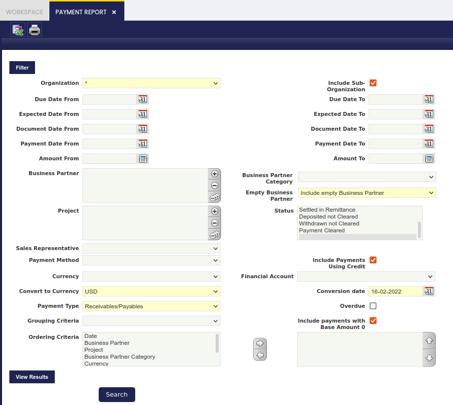
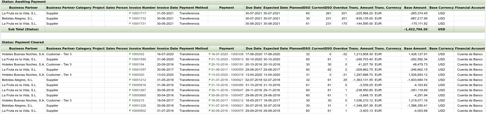

---
tags:
  - Etendo Classic
  - Financial Management
  - Payment Report
  - Receivables and Payables
  - Financial Analysis
---

# Informe de pagos y cobros { #payment-report }

:material-menu: `Application` > `Financial Management` > `Receivables and Payables` > `Analysis Tools` > `Payment Report`

## Descripción general { #overview }

El Informe de pagos y cobros muestra información sobre cobros y/o pagos, que puede filtrarse mediante un amplio conjunto de filtros disponibles.

La información de cobros y/o pagos se muestra agrupada por el estado del pago; además, también pueden definirse criterios adicionales de agrupación y ordenación.

El Informe de pagos y cobros es un informe dimensional de Etendo que contiene las siguientes opciones de filtrado específicas:

-   **Fechas**: introduzca una **Fecha desde** y una **Fecha hasta** para recuperar los datos del pago en relación con:
    -   la fecha de vencimiento del pago
    -   la fecha de pago del documento
    -   y la fecha del pago
-   **Importes**: introduzca un **Importe desde** y un **Importe hasta** para recuperar los datos del pago.
-   **Tercero vacío**: seleccione si es necesario incluir o no en el informe los pagos no relacionados con un tercero sino con un **concepto contable** o una **tarifa**. Las opciones disponibles son:
    -   **Incluir tercero vacío**: si se selecciona esta opción, el informe incluye también los pagos no relacionados con un tercero.
    -   **Excluir tercero vacío**: si se selecciona esta opción, el informe excluye cualquier pago no relacionado con un único tercero.
    -   **Solo tercero vacío**: si se selecciona esta opción, el informe incluye únicamente los pagos no relacionados con un único tercero.
-   El estado del pago: las opciones disponibles son:
    -   Pendiente de pago
    -   Pendiente de ejecución
    -   Anulado
    -   Pago realizado
    -   Cobro recibido
    -   Depositado no conciliado
    -   Reintegrado no conciliado
    -   Pago conciliado
-   El **Agente comercial**. Mostrará solo los pagos relacionados con facturas emitidas para este agente comercial.
-   El **Método de pago** y la **Cuenta financiera** del pago.
-   La casilla de verificación **"Incluir pagos mediante crédito"** permite incluir dichos pagos.
-   El campo **"Convertir a moneda"** permite al usuario seleccionar una moneda; de este modo, los "Importes de transacción" en una moneda distinta a la seleccionada se convierten a la moneda elegida y se muestran en el campo "Importe base".
-   El campo **"Fecha de conversión"** permite al usuario definir una fecha para seleccionar el tipo de conversión del sistema al cambiar los importes de las transacciones.
-   El **Tipo de pago**: las opciones disponibles son:
    -   Cobros
    -   Pagos
    -   Cobros y Pagos
-   La casilla de verificación **"Vencido"** permite al usuario incluir en el informe únicamente los pagos vencidos.
-   Por último, también es posible definir un **Criterio de agrupación** y un **Criterio de ordenación** adicionales para la presentación de los datos de pago.
    -   **Criterios de agrupación** como:
        -   Tercero
        -   Proyecto
        -   Categoría de tercero
        -   Moneda
        -   Cuenta (Cuenta financiera)
    -   **Criterios de ordenación** como:
        -   Fecha (Fecha de pago)
        -   Proyecto
        -   Categoría de tercero
        -   Moneda
        -   Fecha de vencimiento (Fecha de vencimiento del pago)
        -   Cuenta (Cuenta financiera)
        -   Tercero

!!! warning
    Tenga en cuenta que si, por ejemplo, se selecciona "Tercero" como criterio de agrupación, se eliminará de la lista de criterios de ordenación, ya que la agrupación implica la ordenación.

El Informe de pagos y cobros se lanza pulsando el botón de proceso **"Buscar"**. A continuación se muestra un ejemplo del resultado del informe:

Algunos campos relevantes a destacar:

-   **Número de factura**: la flecha verde permite al usuario navegar al plan de pagos de la factura de venta/compra si solo aparece un número de factura en este campo.
-   **Pago**: la flecha verde permite al usuario navegar al pago de la factura/documento.
-   **PlannedDSO** (Días de ventas pendientes planificados): el número de días entre la fecha de la factura y la fecha en que debía pagarse, calculado con la fórmula **(Factura) Fecha de vencimiento - Fecha de la factura**.
-   **CurrentDSO** (Días de ventas pendientes actuales):
    -   si existe un pago, este campo muestra el número de días entre la fecha de la factura y la fecha del pago, calculado con la fórmula **Fecha de pago - Fecha de la factura**.
    -   si no existe un pago, este campo muestra el número de días que la factura lleva pendiente de pago, calculado con la fórmula **Fecha actual - Fecha de la factura**.
-   **Vencido**: este campo indica si un pago se recibió a tiempo (el número de días de vencimiento es cero), antes de tiempo (el número de días de vencimiento es un número negativo) o tarde (el número de días de vencimiento es un número positivo).

Una factura marcada con (*) significa que la factura ha sido pagada mediante un pago de crédito.

Varias facturas marcadas con (**) significan que las facturas han sido pagadas con el mismo pago de crédito.

---

This work is a derivative of [Financial Management](http://wiki.openbravo.com/wiki/Financial_Management){target="\_blank"} by [Openbravo Wiki](http://wiki.openbravo.com/wiki/Welcome_to_Openbravo){target="\_blank"}, used under [CC BY-SA 2.5 ES](https://creativecommons.org/licenses/by-sa/2.5/es/){target="\_blank"}. This work is licensed under [CC BY-SA 2.5](https://creativecommons.org/licenses/by-sa/2.5/){target="\_blank"} by [Etendo](https://etendo.software){target="\_blank"}.
