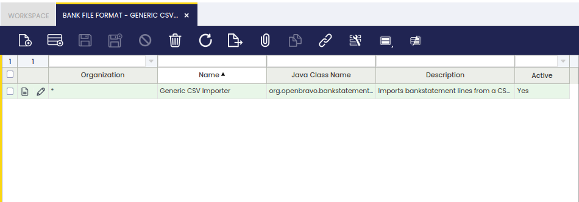

---
tags:
  - Etendo Classic
  - Financial Management
  - Bank File Format
  - Bank Statement Import
  - Receivables and Payables
---

# Formato Fichero Banco

:material-menu: `Application` > `Financial Management` > `Receivables and Payables` > `Setup` > `Formato Fichero Banco`

## Descripción general

Etendo permite al usuario importar un fichero de extracto bancario a la cuenta financiera de una organización si se ha configurado un formato de fichero de banco para dicha organización.

Etendo incluye algunos módulos que, una vez instalados, permiten al usuario importar ficheros de extracto bancario en Etendo en diferentes formatos:

-   OFX Bank Statement Format
-   CSV Generic Bank Statement Importer
-   WePay CSV Importer
-   y el español Cuaderno 43

Una vez que se importa un fichero de extracto bancario a la cuenta financiera de una organización:

-   la información general, como el nombre del fichero y la fecha de importación, se guarda en la pestaña Extractos bancarios importados de la cuenta financiera
-   y el contenido del fichero de extracto bancario se guarda línea por línea en la pestaña correspondiente Líneas de Extracto Bancario.

## Formato Fichero Banco

La ventana Formato Fichero Banco lista los módulos de formato de fichero de banco instalados para una organización.

Como se muestra en la imagen anterior, un formato de fichero de banco puede aplicarse a la organización en la ventana Enterprise Module Management tras ser instalado, por lo que está disponible para cualquier organización de la entidad.

## Excepciones

Se pueden añadir excepciones a un formato de importación de fichero de banco, de modo que no sean tomadas en cuenta por el proceso de importación.
Es posible definir el texto a excluir al asociar transacciones y líneas de extracto bancario en una cuenta financiera determinada o en todas ellas.

---

This work is a derivative of [Financial Management](http://wiki.openbravo.com/wiki/Financial_Management){target="_blank"} by [Openbravo Wiki](http://wiki.openbravo.com/wiki/Welcome_to_Openbravo){target="_blank"}, used under [CC BY-SA 2.5 ES](https://creativecommons.org/licenses/by-sa/2.5/es/){target="_blank"}. This work is licensed under [CC BY-SA 2.5](https://creativecommons.org/licenses/by-sa/2.5/){target="_blank"} by [Etendo](https://etendo.software){target="_blank"}.
