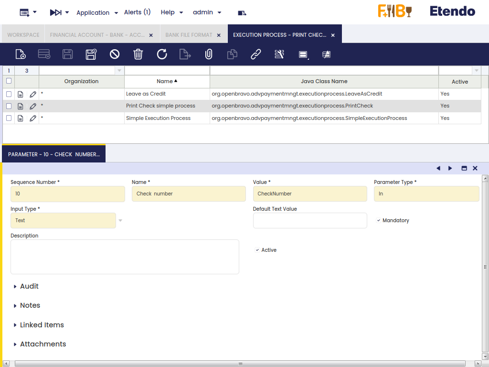

---
tags:
  - Etendo Classic
  - Financial Management
  - Execution Process
  - Payment Method
  - Receivables and Payables
---

# Proceso de Ejecución

:material-menu: `Application` > `Financial Management` > `Receivables and Payables` > `Setup` > `Execution Process`

## Descripción general

Algunos tipos de pago requieren que se ejecute una actividad adicional al completar el pago.

Por ejemplo, un pago con cheque puede requerir el registro del número de cheque y la impresión del mismo.

En términos generales, el proceso de ejecución es la definición de la(s) **actividad/es** que el sistema o el usuario debe ejecutar para que un pago quede finalmente registrado como:

-   **realizado/retirado de la cuenta financiera**
-   o **recibido/depositado en la cuenta financiera**.

## Proceso

La ventana Proceso de Ejecución lista los procesos de ejecución disponibles.

Etendo incluye por defecto los procesos de ejecución descritos a continuación:

-   **Simple Execution Process** - este proceso ejecuta una actividad del sistema que cambia el estado del pago de "A Ejecutar" a "Cobrado"/"Pagado" (o "Cobro depositado"/"Pago reintegrado")
-   **Print Check simple process** - este proceso abre una ventana que permite al usuario introducir un número de cheque durante el procesamiento del pago.
-   **Leave as Credit** - este proceso utiliza la funcionalidad de Devolución de materiales y permite al usuario convertir un cobro/pago negativo en un crédito positivo para el tercero (cliente/proveedor).

Los pagos que requieren la ejecución de una actividad separada deben configurarse para que funcionen correctamente; esto implica seleccionar la opción "**Automático**" en el campo "**Tipo de Ejecución**", de modo que se pueda seleccionar un Proceso de Ejecución de los listados anteriormente al configurar el método de pago.

## Parámetro

La pestaña Parámetro permite al usuario configurar la actividad adicional que se ejecutará al completar un pago. Por ejemplo, para registrar un número de cheque.

Como se muestra en la imagen anterior, el "**Print Check Simple Process**" tiene un parámetro llamado "**Nº de Cheque**". Dicho parámetro es un "**Tipo de parámetro**" de tipo "**In**" cuyo "**Tipo de entrada**" es "**Texto**".

La configuración anterior significa que el número de cheque debe ser introducido como texto por el usuario.

Un **tipo de parámetro "In"** también puede ser una casilla de verificación; en ese caso, en lugar de introducir un texto, el usuario debe marcar o desmarcar la casilla. También es posible definir si el valor predeterminado de la casilla de verificación será "Sí" o "No".

Además, los tipos de parámetro también pueden ser una "**Constante**", por lo que se puede especificar el "**Valor de texto predeterminado**" de la constante.

!!! info
    El valor registrado para cualquiera de los tipos de parámetro definidos anteriormente se guarda en la pestaña Parámetros del proceso de pago correspondiente.

---

This work is a derivative of [Financial Management](http://wiki.openbravo.com/wiki/Financial_Management){target="_blank"} by [Openbravo Wiki](http://wiki.openbravo.com/wiki/Welcome_to_Openbravo){target="_blank"}, used under [CC BY-SA 2.5 ES](https://creativecommons.org/licenses/by-sa/2.5/es/){target="_blank"}. This work is licensed under [CC BY-SA 2.5](https://creativecommons.org/licenses/by-sa/2.5/){target="_blank"} by [Etendo](https://etendo.software){target="_blank"}.
