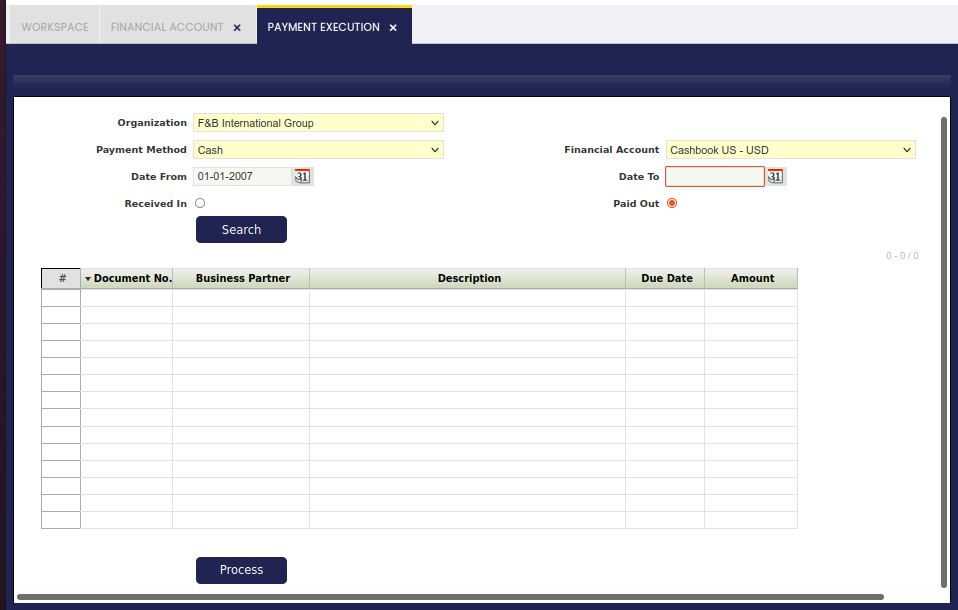

---
tags:
  - Etendo Classic
  - Financial Management
  - Payment Execution
  - Deferred Payments
  - Receivables and Payables
---

# Ejecución de Pagos/Cobros

:material-menu: `Aplicación` > `Gestión Financiera` > `Cobros y Pagos` > `Transacciones` > `Ejecución de Pagos/Cobros`

## Visión General

El formulario Ejecución de Pagos permite al usuario ejecutar masivamente pagos diferidos en estado "Pendiente de Ejecución".

Lo mismo se aplica a los pagos que fallaron durante el proceso de ejecución debido a un atasco de papel o cualquier otro problema ocurrido por un fallo de conexión.

Existen algunas opciones de filtrado obligatorias:

- la **organización**
- el **método de pago**
- y la **cuenta financiera**

!!! info
    Tenga en cuenta que el/los método/s de pago utilizado/s al recibir/realizar el/los pago/s correspondiente/s requieren un proceso de ejecución automática "diferida" configurado al asignarse y configurarse para una Cuenta Financiera determinada.

y otros filtros disponibles como:

- **Fechas de Pago Desde/Hasta**
- si el pago es un pago "**Recibido**" o un pago "**Pagado**"

Una vez que se pulsa el botón de proceso "**Buscar**", se muestran los pagos a ejecutar.

Una vez que se pulsa el botón de proceso **"Procesar"**, se muestra una nueva ventana para permitir al usuario introducir los parámetros de entrada requeridos, como el número de cheque, por ejemplo si el proceso de ejecución seleccionado en el método de pago utilizado era "Proceso simple de impresión de cheque".

Una vez que se pulsa el botón de proceso "Ejecutar", el pago cambia su estado a "Pago Realizado/Pago Recibido" o "Retiro no Saldado/Depósito no Saldado"; por tanto, el siguiente pago puede procesarse y ejecutarse.

Tenga en cuenta que se pueden seleccionar varios pagos para ejecutarse agrupados en la misma ejecución de pago.

En ese caso, más de un pago para el mismo tercero puede pagarse con el mismo número de cheque.

---

This work is a derivative of [Financial Management](http://wiki.openbravo.com/wiki/Financial_Management){target="\_blank"} by [Openbravo Wiki](http://wiki.openbravo.com/wiki/Welcome_to_Openbravo){target="\_blank"}, used under [CC BY-SA 2.5 ES](https://creativecommons.org/licenses/by-sa/2.5/es/){target="\_blank"}. This work is licensed under [CC BY-SA 2.5](https://creativecommons.org/licenses/by-sa/2.5/){target="\_blank"} by [Etendo](https://etendo.software){target="\_blank"}.
