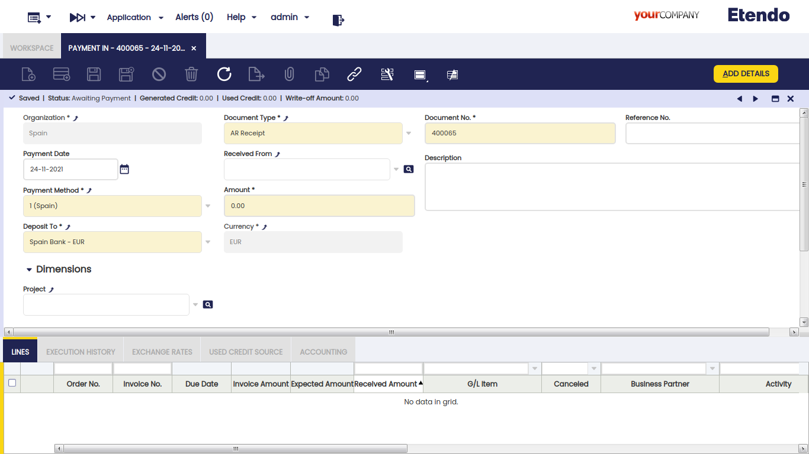
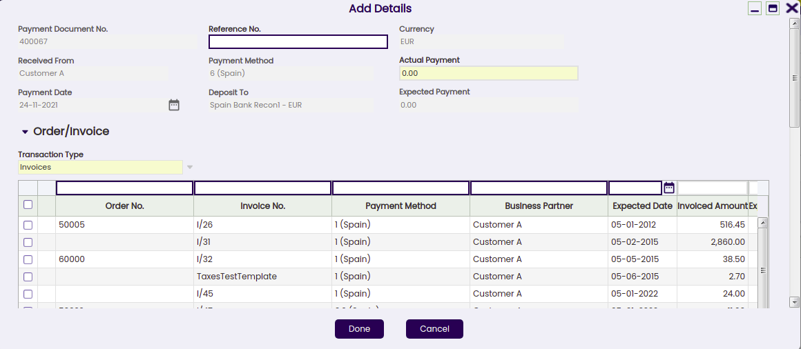
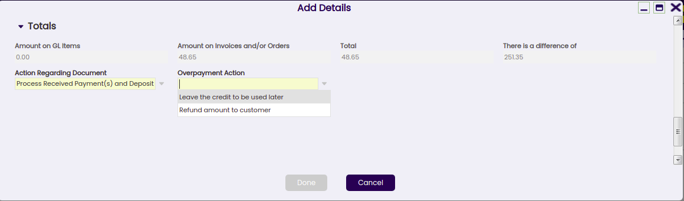
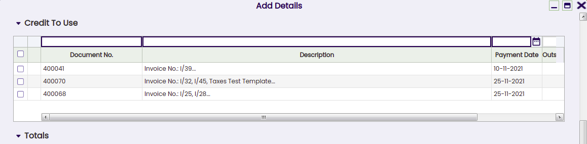
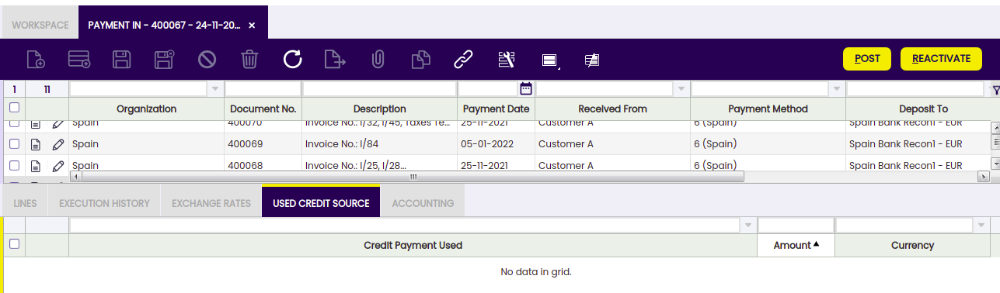
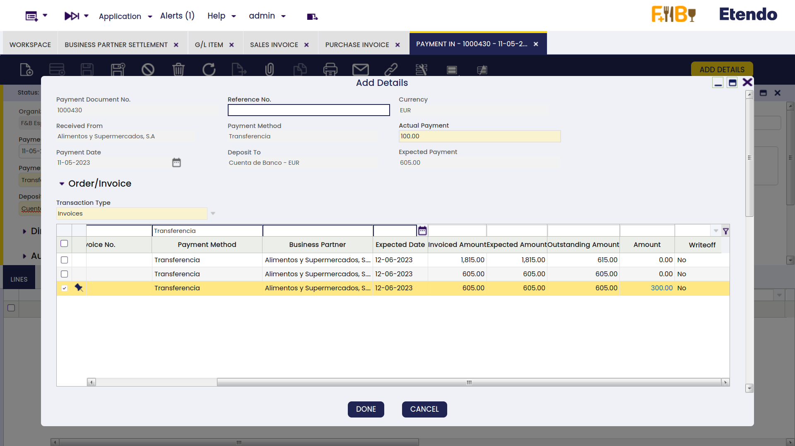
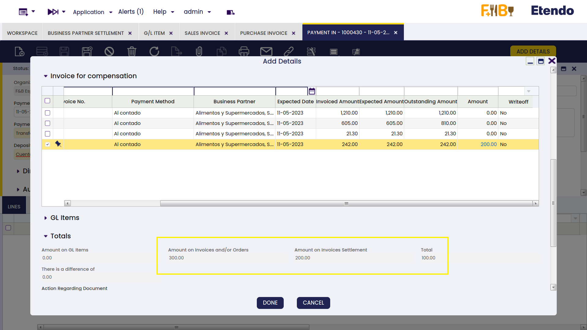
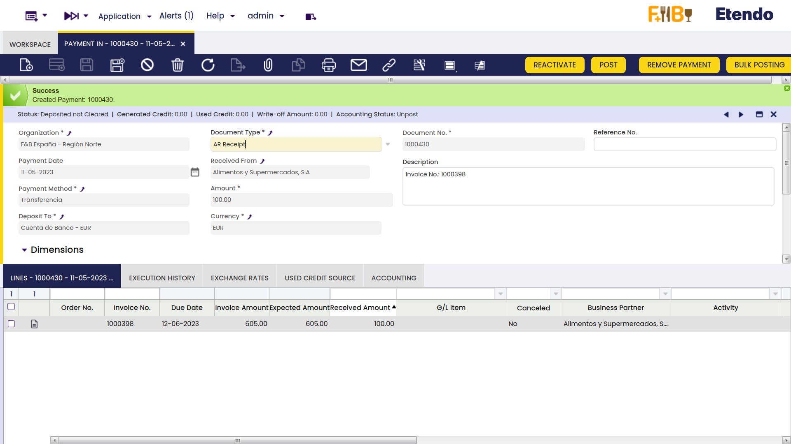

---
tags:
  - Etendo Classic
  - Financial Management
  - Payment In
  - Customer Payments
  - Receivables and Payables
---

# Cobros

:material-menu: `Aplicación` > `Gestión Financiera` > `Cobros y Pagos` > `Transacciones` > `Cobros`

## Visión General

Los cobros y anticipos recibidos de clientes pueden registrarse y gestionarse en la ventana **Cobros**. Además, los pagos de conceptos contables no relacionados con pedidos/facturas también pueden gestionarse en esta ventana.

Los cobros de clientes pueden recibirse contra:

- Pedidos de Venta, lo que en efecto es un _anticipo_.  
  Posteriormente, cuando se crea una factura a partir del pedido que ya tiene un cobro recibido, la factura hereda automáticamente el cobro recibido contra el pedido.
- Facturas de Venta, lo que en efecto es un cobro de factura recibido de un cliente.  
  Los pagos anteriores a la fecha contable de la factura también se consideran un _anticipo_.
- Y Conceptos Contables, lo que en efecto es el pago de cualquier otro ingreso recibido de un cliente, por ejemplo una multa.  
  Este tipo de pagos puede crearse en esta ventana al seleccionar el "Tipo de Transacción" Concepto Contable, o puede completarse automáticamente como pago en esta ventana si se crea en un Libro Diario.  
  Independientemente de la forma en que se creen, ambos casos se gestionan de la misma manera según el Método de Pago utilizado.

!!! info
    Etendo permite al usuario registrar cobros recibidos de un único cliente o registrar cobros recibidos de varios clientes al mismo tiempo.

Al final del proceso, una transacción de "Cobro" implicará la creación de una transacción de "Depósito" en la Cuenta Financiera correspondiente.

La creación de la transacción de depósito en la cuenta financiera puede realizarse:

- manualmente, usando el proceso Agregar Transacción de la cuenta financiera.
- o automáticamente, si el método de pago utilizado está configurado para ello, lo que implica la selección de la casilla de verificación "Depósito Automático".

## Cabecera

La ventana Cobro permite al usuario registrar y gestionar los cobros de clientes recibidos contra diferentes tipos de documentos emitidos por la organización, como pedidos y facturas. Esta ventana también permite al usuario gestionar los cobros de clientes ya registrados en la ventana de factura de ventas, de la misma manera que los pagos de conceptos contables recibidos en un Libro Diario.

Solo hay unos pocos campos obligatorios a completar al registrar un pago en esta ventana:

- la **Organización** que está recibiendo el pago
- el **Número de Pago** que sigue la secuencia de documentos correspondiente
- el **Método de Pago** utilizado para recibir el pago. Existe una casilla de verificación en la ventana "Agregar Pago" que posteriormente permite al usuario seleccionar documentos vinculados a métodos de pago alternativos.
- y la **Cuenta Financiera** donde se va a depositar el dinero.

Otros campos relevantes a destacar son:

- el **Importe** recibido. No es necesario introducirlo al crear un nuevo registro.
- el campo **Recibido De** muestra el cliente del que el usuario está recibiendo el pago. No es necesario introducirlo al crear un nuevo registro.
  - **Si no se selecciona un cliente,** implica la creación de un pago que puede cobrar el pago de diferentes documentos relacionados con diferentes clientes.
  - **Si se selecciona un cliente,** implica la creación de un pago que puede cobrar el pago de diferentes documentos del mismo cliente. En este caso, el valor de los campos "Método de Pago" y "Depositar En" cambia si el cliente tiene asignado un método de pago y una cuenta financiera específicos para usar al cobrar sus facturas.
- **Nº de Referencia**: este campo se utiliza para reflejar el número impreso en el documento justificante de pago recibido del cliente.
- y la **Moneda**. Es posible seleccionar una moneda diferente a la moneda de la cuenta financiera al recibir un pago. Para ello, el método de pago utilizado y asignado a la cuenta financiera del pago debe estar configurado para recibir pagos en múltiples monedas.

### Ventana Agregar Pago

El botón **Agregar Detalles** abre la ventana **Agregar Pago**, donde pueden seleccionarse los documentos que se están pagando.

!!! info
    La ventana "Agregar Pago" ya se explica en el [artículo Plan de Pago de Factura de Ventas](../../sales-management/transactions.md#payment).

### Pago de varios tipos de documentos de diferentes clientes

Si no se ha seleccionado ningún cliente en el campo "Recibido De", es posible registrar el pago de diferentes clientes al mismo tiempo simplemente seleccionando las transacciones a pagar.

!!! info
    Tenga en cuenta que Etendo permite al usuario filtrar de nuevo por un tercero determinado si no se introdujo en el campo "Recibido De" por error. Cuando esto ocurre, los pagos deben realizarse ejecutándolos por el importe exacto.

El importe del **Pago Real** introducido se distribuye automáticamente entre las deudas pendientes (facturas o pedidos pendientes de pago). Es posible evitar esta distribución automática estableciendo la Preferencia _Agregar Pago: Distribuir importes automáticamente_ en 'N'.

El usuario puede marcar o desmarcar las transacciones según sea necesario, y también puede modificar los importes mostrados en el campo "Importe".

Es importante tener en cuenta que:

- En este escenario, no es posible generar crédito ni reembolsar un importe restante al cliente, ya que ambas acciones deben estar relacionadas con un único cliente.  
  Por tanto, si el importe pagado y reflejado en el campo de pago real es mayor que la suma del importe total bruto de la factura seleccionada, se muestra un mensaje de error indicando que "Hay una diferencia de importe sin ninguna acción seleccionada".  
  En ese caso, es necesario reducir el importe del pago real o seleccionar otro pedido/factura a pagar.
- Si el Pago Real es inferior al Pago Esperado, el importe restante puede dejarse como:
  - un **pago parcial**, lo que significa registrar un pago parcial donde la deuda restante se pagará posteriormente registrando un nuevo cobro.
  - o puede **cancelarse**, si se selecciona esta opción significa registrar un pago parcial donde la deuda restante no se va a pagar; en este último caso:
    - la factura del cliente se establece como totalmente pagada
    - la contabilización de la factura en el libro mayor liquida el importe total de créditos de clientes
    - mientras que la contabilización del pago en el libro mayor usa la cuenta de Cancelaciones para contabilizar el importe cancelado.

### Procesamiento de un pago

Existen dos opciones disponibles al **procesar** un cobro creado en esta ventana:

- Procesar Cobro(s) Recibido(s)
- o Procesar Cobro(s) Recibido(s) y depositar.

Ambas opciones anteriores procesan el cobro recibido, pero la segunda también crea la correspondiente transacción de "Depósito" en la Cuenta Financiera utilizada.

Esta última opción es la única que se muestra si el método de pago utilizado y asignado a la cuenta financiera donde se va a depositar el dinero está configurado como "Depósito Automático" = Sí.

Además:

- Un mensaje del sistema muestra el número del pago creado.
- La información de resumen del pago se refleja en la **Barra de Estado** de la ventana **Cobros**.
- El campo **Descripción** se actualiza con los números de Factura y Pedido pagados y el importe dejado como crédito.
- Los registros de detalle del pago se introducen en la pestaña **Líneas**.
- Este proceso también actualiza la información del **Plan de Cobros** y del **Monitor de Pagos** de todos los documentos involucrados.
- El **Estado del Pago** cambia a _Pendiente de Ejecución_ cuando se define un **Tipo de Ejecución** _Automático_, o a _Pago Recibido_ si la ejecución es _Manual_.  
  Si hay un proceso de ejecución definido, puede ejecutarse haciendo clic en el botón "**Ejecutar Pago**". La información aparecerá en la pestaña Historial de Ejecución.

Tenga en cuenta que no es necesario procesar:

- los cobros de clientes recibidos en la ventana Factura (Cliente), ya que estos se procesan allí mismo.
- ni los pagos de conceptos contables recibidos en la ventana Libro Diario, ya que estos implican el procesamiento automático del cobro recibido.

### Reactivación de un pago

Un pago ya procesado con estado "Pago Recibido" o "Pendiente de Ejecución" puede ser Reactivado. Esta opción permite al usuario editar datos de pago incorrectos o eliminar un pago creado por error.

El botón "Reactivar" permite al usuario realizar lo explicado anteriormente, ya que pueden seleccionarse dos acciones diferentes:

- **Reactivar**: Esta opción reactiva el pago, manteniendo las líneas del pago.  
  Una vez reactivado el pago de esta manera, el usuario puede modificar fácilmente la información del pago usando el botón "Agregar Detalles" y procesarlo de nuevo.
- **Reactivar y Eliminar líneas**: Esta opción reactiva el pago y elimina todas las líneas del pago.  
  Esta es la opción a usar si el pago fue creado por error y, por tanto, debe eliminarse completamente.  
  Una vez reactivado el pago de esta manera, el usuario puede eliminar la cabecera del pago sin necesidad de eliminar primero las líneas del pago.

Un pago ya procesado y depositado con estado "Depositado no Saldado" también puede ser "Reactivado" como se describe anteriormente, pero una vez que la correspondiente transacción de depósito haya sido eliminada de la cuenta financiera.

### Contabilización de un pago

Un cobro recibido y procesado en la ventana **Cobros** puede contabilizarse si el método de pago utilizado al crear el pago lo permite una vez asignado a la cuenta financiera a través de la cual se recibe el pago. Si no es el caso, Etendo muestra una advertencia: "Documento deshabilitado para contabilidad".

Una contabilización de cobro recibido se ve así:

|                                                                      |                 |                 |
| -------------------------------------------------------------------- | --------------- | --------------- |
| Cuenta                                                               | Debe            | Haber           |
| Al Recibir usar la "Cuenta de Pago en Tránsito Cobro" (ej.)          | Importe del pago |                 |
| Créditos de Clientes                                                 |                 | Importe del pago |

La contabilización será diferente cuando el importe provenga parcial o totalmente de una deuda clasificada como dudosa.

### Anulación de un pago

Un pago ya procesado con estado "Pendiente de Ejecución" puede ser "**Anulado**". El botón de proceso "Reactivar" permite al usuario hacerlo, pero solo para pagos en estado "Pendiente de Ejecución".

!!! info
    _Recuerde que un pago puede obtener el estado de pendiente de ejecución si el método de pago utilizado y asignado a la cuenta financiera está configurado para tener un "Tipo de Ejecución" automático y también está seleccionada la casilla de verificación "Diferido"._

La acción de Anular establece la/s línea/s del pago como "**Cancelada/s**", lo que significa que el documento (pedido o factura) en realidad no está pagado y, por tanto, se puede crear o agregar un nuevo pago.

### Pagos de crédito

No es posible generar crédito en un pago que no esté relacionado con un único cliente; por tanto, la funcionalidad de generación de crédito requiere:

- seleccionar un tercero (o cliente) en el campo "**Recibido De**" de la ventana **Cobros**.
- e introducir el importe que se dejará como crédito en el campo "**Importe**" de la ventana **Cobros**.

La creación de un pago de crédito requiere no seleccionar ningún documento a pagar en la ventana "Agregar Pago" que se muestra tras pulsar el botón de proceso "Agregar Detalles", sino dejar el importe para usarlo posteriormente.

Un pago de crédito estará disponible para el cliente tras procesar un pago como se indica anteriormente.

Este pago de crédito especifica el importe de crédito generado en el campo "Descripción" de la cabecera del pago de crédito.

Posteriormente, el crédito disponible generado para ese cliente puede usarse para pagos futuros:

- en la ventana "Agregar Pago", una vez que se crea un nuevo pago para ese cliente en la ventana Cobros, seleccionando simplemente una línea y estableciendo el importe en la **grilla de crédito a usar**.

- o en la ventana "Seleccionar Pagos de Crédito" que se muestra automáticamente al completar una nueva factura de cliente.

A continuación, el campo "Descripción" de la cabecera del pago de crédito también especificará las transacciones/documentos donde se utilizó el crédito.

La pestaña Origen de Crédito Utilizado de la ventana de Cobros muestra el pago de crédito utilizado para pagar un documento (pedido, factura o concepto contable) del cliente.

### Pagos en múltiples monedas

Etendo permite al usuario recibir pagos en una moneda diferente a la moneda de la cuenta financiera.

Para ello, el método de pago asignado a la cuenta financiera utilizada para recibir el pago debe estar configurado para permitirlo, lo que implica seleccionar la casilla de verificación "Recibir Pagos en Múltiples Monedas".

### Anticipos que superan el importe de la factura a pagar

Etendo permite al usuario realizar anticipos agregando pagos a los pedidos. La factura de ventas creada a partir del pedido heredará el pago realizado por el pedido.

Puede ocurrir que el importe anticipado real supere el importe de la factura a pagar, por lo que la factura de ventas permanece como "Pago Completo" = "No" hasta que:

- se crea un cobro "negativo" para reflejar que la organización está devolviendo al cliente la diferencia, de modo que el saldo final del pago sea igual al importe de la factura de ventas.
- o se crea un pago de crédito para usarse posteriormente al registrar el pago de otra factura de ventas del mismo cliente.  
  Este pago de crédito debe crearse como un nuevo cobro por un importe de 0,00 y relacionado con la factura de ventas con anticipo, de esa manera la factura con anticipo se establece como "Pago Completo" = "Sí".

## Líneas

La pestaña de líneas contiene una lista de los documentos pagados por el pago.

### Historial de Ejecución

La pestaña de historial de ejecución muestra información sobre el historial de los intentos de ejecución del pago.

Para algunos tipos de pago se necesitan pasos adicionales. Por ejemplo, un cobro recibido con un cheque que necesita completarse con el número de cheque del cliente.

En ese caso, el método de pago vinculado al pago debe estar configurado para requerir un proceso de **Tipo de Ejecución** "Automático".

Todo lo anterior implica un paso adicional a realizar en la ventana **Cobros**, que es ejecutar el pago usando el botón de proceso "**Ejecutar Pago**".

Este botón de proceso solo se muestra en caso de pago/s vinculados a un proceso de ejecución automática para el que esté seleccionada la casilla de verificación "**Diferido**".

Si la casilla de verificación "Diferido" no está seleccionada, el paso adicional sigue siendo necesario, pero se ejecutará automáticamente sin ninguna acción del usuario final.

La pestaña Historial de Ejecución es una pestaña de solo lectura que muestra información sobre la ejecución del pago, como la fecha de ejecución, una vez que el pago ha sido ejecutado.

### Tipos de cambio

La pestaña de tipos de cambio permite al usuario introducir un tipo de cambio entre la moneda del libro mayor de la organización y la moneda del cobro recibido, para usarlo al contabilizar el pago en el libro mayor.

### Origen de crédito utilizado

Un pago de crédito puede usarse para liquidar más de un pago de documento. Esta tabla realiza un seguimiento de los documentos donde se ha utilizado un pago de crédito.

La creación de un pago de "Crédito" ya se explica en la sección Pagos de Crédito de este artículo, así como la forma en que un pago de "Crédito" o el crédito disponible del cliente aparecerá en futuros pagos del cliente.

Esta pestaña de solo lectura muestra el pago de crédito utilizado para pagar un documento (pedido, factura o concepto contable) del cliente.

## Eliminación de Pagos

El objetivo de esta funcionalidad es eliminar y reactivar pagos de forma ágil y sencilla. Además, permite eliminar y reactivar transacciones bancarias y conciliaciones.

!!! info
    Para poder incluir esta funcionalidad, se debe instalar el Financial Extensions Bundle. Para ello, siga las instrucciones del marketplace: [Financial Extensions Bundle](https://marketplace.etendo.cloud/#/product-details?module=9876ABEF90CC4ABABFC399544AC14558){target="_blank"}. Para más información sobre las versiones disponibles, la compatibilidad con el núcleo y las nuevas funcionalidades, visite [Financial Extensions - Notas de versión](../../../../../../whats-new/release-notes/etendo-classic/bundles/financial-extensions/release-notes.md).

Desde esta ventana, es posible eliminar pagos seleccionando el registro correspondiente y haciendo clic en el botón Eliminar Pago.
Por otro lado, es posible reactivar pagos desde la misma ventana con el botón "Reactivación Avanzada". Esta funcionalidad permite al usuario reactivar el pago sin eliminar manualmente sus transacciones asociadas, lo cual es necesario si se usa el botón "Reactivar" del núcleo. Esto devolverá el pago al estado "Pendiente de Pago" y se podrán agregar nuevos detalles del pago.

En ambos casos:

- Si el pago está incluido en la cuenta financiera, es decir, si está en estado Depositado/Retirado no Saldado, la transacción correspondiente también se eliminará (ventana Cuenta Financiera > pestaña Transacción).

- Si el pago está conciliado mediante un método automático, entonces, además de la transacción en la cuenta financiera, se eliminará la línea del extracto bancario al que estaba vinculado (ventana Cuenta Financiera > Extractos Bancarios Importados) y la línea correspondiente de la conciliación bancaria (Cuenta Financiera > Conciliaciones).

!!! info
    Si el pago está contabilizado, el asiento contable se eliminará.

## Contabilización Masiva

!!! info
    Para poder incluir esta funcionalidad, se debe instalar el Financial Extensions Bundle. Para ello, siga las instrucciones del marketplace: [Financial Extensions Bundle](https://marketplace.etendo.cloud/#/product-details?module=9876ABEF90CC4ABABFC399544AC14558){target="_blank"}. Para más información sobre las versiones disponibles, la compatibilidad con el núcleo y las nuevas funcionalidades, visite [Financial Extensions - Notas de versión](../../../../../../whats-new/release-notes/etendo-classic/bundles/financial-extensions/release-notes.md).

La funcionalidad de Contabilización Masiva permite al usuario contabilizar o descontabilizar múltiples registros seleccionándolos y haciendo clic en el botón **Contabilización masiva**.

Además, el Estado de Contabilización del/los registro/s se muestra en la barra de estado, en la vista de formulario, o en una columna, en la vista de grilla.

!!! info
    Para más información, visite [la guía de usuario del módulo Contabilización Masiva](../../../../optional-features/bundles/financial-extensions/bulk-posting.md).

## Liquidación Avanzada de Terceros

!!! info
    Para poder incluir esta funcionalidad, se debe instalar el Financial Extensions Bundle. Para ello, siga las instrucciones del marketplace: [Financial Extensions Bundle](https://marketplace.etendo.cloud/#/product-details?module=9876ABEF90CC4ABABFC399544AC14558){target="\_blank"}. Para más información sobre las versiones disponibles, la compatibilidad con el núcleo y las nuevas funcionalidades, visite [Financial Extensions - Notas de versión](../../../../../../whats-new/release-notes/etendo-classic/bundles/financial-extensions/release-notes.md).

Desde la ventana **Cobros**, es posible crear una liquidación haciendo clic en el botón **Agregar Detalles**. En la ventana emergente, Etendo muestra una lista de facturas a liquidar, cada una con su número de factura correspondiente; aquí el usuario puede seleccionar la factura o facturas correspondientes a compensar. Primero, establezca el **importe del Pago Real** a pagar y, luego, seleccione la/s factura/s para crear una liquidación y defina el importe correspondiente a pagar de cada factura.

Desde la **pestaña Factura de Compensación**, seleccione la/s factura/s de compra que se utilizarán para pagar y establezca el importe necesario de la/s factura/s a compensar.

A continuación, en la pestaña **Totales**, Etendo muestra los importes de referencia totales a compensar.

Tras hacer clic en el botón Aceptar, el sistema compensa las facturas y créditos del tercero correspondiente y crea un registro de liquidación.

El registro de liquidación queda registrado en la ventana **Liquidaciones de Terceros**, donde se mostrarán las líneas de la/s factura/s (de ventas y compras) utilizadas para compensar.

!!! info
    Para más información, visite la [Guía de Usuario del Módulo Liquidaciones de Terceros](../../../../optional-features/bundles/financial-extensions/business-partner-settlement.md).

## Gestión Avanzada de Cuentas Bancarias

!!! info
    Para poder incluir esta funcionalidad, se debe instalar el módulo Gestión Avanzada de Cuentas Bancarias del Financial Extensions Bundle. Para ello, siga las instrucciones del marketplace: [Financial Extensions Bundle](https://marketplace.etendo.cloud/#/product-details?module=9876ABEF90CC4ABABFC399544AC14558){target="\_blank"}. Para más información sobre las versiones disponibles, la compatibilidad con el núcleo y las nuevas funcionalidades, visite [Financial Extensions - Notas de versión](../../../../../../whats-new/release-notes/etendo-classic/bundles/financial-extensions/release-notes.md).

Este módulo incluye la columna Cuenta bancaria en la ventana emergente Agregar detalles para poder filtrar los posibles pagos por cuenta bancaria.

!!! info
    Para más información, visite la [guía de usuario de Gestión Avanzada de Cuentas Bancarias](../../../../optional-features/bundles/financial-extensions/advanced-bank-account-management.md).

---

This work is a derivative of [Financial Management](http://wiki.openbravo.com/wiki/Financial_Management){target="\_blank"} by [Openbravo Wiki](http://wiki.openbravo.com/wiki/Welcome_to_Openbravo){target="\_blank"}, used under [CC BY-SA 2.5 ES](https://creativecommons.org/licenses/by-sa/2.5/es/){target="\_blank"}. This work is licensed under [CC BY-SA 2.5](https://creativecommons.org/licenses/by-sa/2.5/){target="\_blank"} by [Etendo](https://etendo.software){target="\_blank"}.
