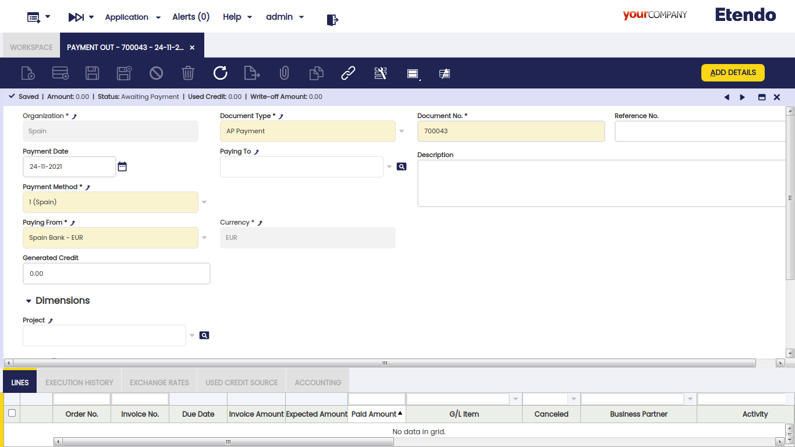
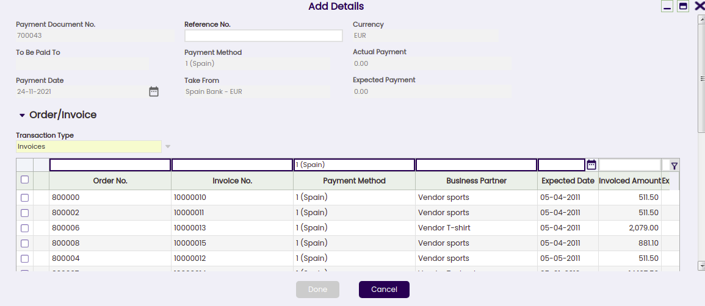
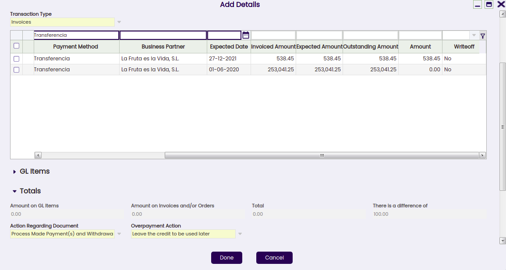
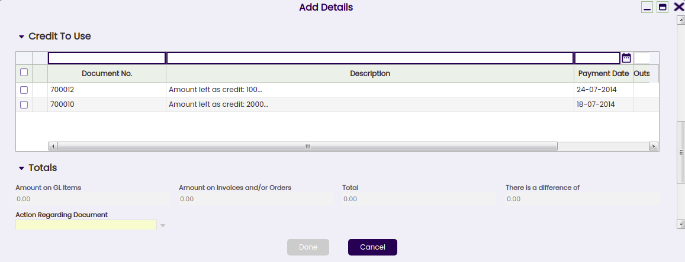
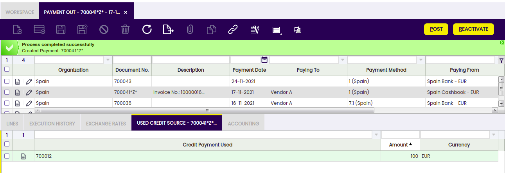

---
tags:
  - Etendo Classic
  - Financial Management
  - Payment Out
  - Supplier Payments
  - Receivables and Payables
---

# Pago

:material-menu: `Aplicación` > `Gestión Financiera` > `Cobros y Pagos` > `Transacciones` > `Pago`

## Visión General

Los pagos y anticipos a proveedores pueden realizarse y gestionarse en la ventana Pago. Los pagos de conceptos contables no relacionados con pedidos/facturas también pueden gestionarse en esta ventana.

Los pagos pueden realizarse contra diferentes tipos de documentos:

- Pedidos de Compra, lo que en efecto es un _anticipo_.  
  Posteriormente, cuando se crea una factura a partir del pedido que ya tiene un pago recibido contra él, la factura hereda automáticamente el pago recibido contra el pedido.
- Facturas de Compra, lo que en efecto es el pago de una factura de proveedor.  
  Los pagos anteriores a la fecha contable de la factura también se consideran un _anticipo_.
- Y Conceptos Contables, lo que en efecto es el pago de cualquier otro gasto a un proveedor, por ejemplo una multa u otros tipos de comisión no incluida en una factura.  
  Este tipo de pagos puede crearse en esta ventana agregando el Concepto Contable correspondiente y el importe "Pagado", o puede completarse automáticamente como concepto contable si se crea como pago de Concepto Contable en un Libro Diario.  
  Independientemente de la forma en que se creen, ambos casos se gestionan de la misma manera según el Método de Pago utilizado.

Los pagos pueden crearse **para pagar a** un **único proveedor** o **para pagar a** varios **proveedores** al mismo tiempo.

Al final del proceso, una transacción de "**Pago**" implicará la creación de una transacción de "**Retiro**" en la Cuenta Financiera correspondiente.

La creación de la transacción de retiro en la cuenta financiera puede realizarse:

- manualmente, usando el proceso Agregar Transacción de la cuenta financiera.
- o automáticamente, si el método de pago utilizado está configurado para ello, lo que implica la selección de la casilla de verificación "Retiro Automático".

## Cabecera

La ventana Pago permite al usuario realizar y gestionar los pagos a proveedores para liquidar diferentes tipos de documentos como pedidos y facturas. Esta ventana también permite al usuario gestionar los pagos a proveedores ya realizados en la ventana Factura (Proveedor), de la misma manera que los pagos de conceptos contables realizados en un Libro Diario.

Solo hay unos pocos campos obligatorios a completar al realizar un pago en esta ventana:

- la **Organización** que está pagando
- el **Número de Pago** que sigue la secuencia de documentos correspondiente.
- el **Método de Pago** a usar para realizar el pago. Existe una casilla de verificación en la ventana "Agregar Pago" que posteriormente permite seleccionar documentos vinculados a métodos de pago alternativos.
- y la **Cuenta Financiera** de la que se va a tomar el dinero en el campo "**Pagado Desde**".

Otros campos relevantes a destacar son:

- El campo **Pagado A**, es decir, el proveedor al que se está realizando el pago; no es necesario introducirlo al crear un nuevo registro.
  - Si no se selecciona un proveedor, implica la creación de un pago para pagar diferentes documentos de diferentes proveedores.
  - Si se selecciona un proveedor, implica la creación de un pago para pagar diferentes documentos del mismo proveedor. En este caso, el valor de los campos "Método de Pago" y "Pagado Desde" cambia si el proveedor tiene asignado un método de pago y una cuenta financiera específicos para usar al pagar sus facturas.
- **Nº de Referencia**: este campo se utiliza para reflejar el número asociado al pago en el sistema de documentación del Proveedor, si lo hubiera.
- **Moneda**. Es posible seleccionar una moneda diferente a la moneda de la cuenta financiera al realizar un pago. Para ello, el método de pago utilizado y asignado a la cuenta financiera del pago debe estar configurado para realizar pagos en múltiples monedas.

### Ventana Agregar Pago

El botón **Agregar Detalles** abre la ventana **Agregar Pago**, donde pueden seleccionarse los documentos pendientes a pagar.

La ventana **Agregar Pago** ya se explica en el artículo de pago de Factura de Compra.

### Pago de varios tipos de documentos de diferentes proveedores

Si no se ha seleccionado ningún proveedor en el campo "Pagado A", es posible pagar diferentes tipos de transacciones de diferentes proveedores simplemente seleccionándolos.

!!! info
    Etendo permite al usuario filtrar de nuevo por un tercero determinado si no se introdujo en el campo "Pagado A" por error.

El campo "Pago Real Pagado" mostrará entonces la suma de todos los valores de las transacciones que se están seleccionando para pagar.

Una vez procesado el pago, la pestaña de líneas lista todos los pedidos y facturas e incluso los conceptos contables incluidos en el pago, igual que el campo "**Descripción**" de la cabecera del pago.

### Reactivación de un pago

Un pago ya procesado con estado "Pago Realizado" o "Pendiente de Ejecución" puede ser **Reactivado**. Esta opción permite a los usuarios editar datos de pago incorrectos o eliminar un pago creado por error.

El botón "Reactivar" permite al usuario realizar lo explicado anteriormente, ya que pueden seleccionarse dos acciones diferentes:

- **Reactivar**: Esta opción reactiva el pago, manteniendo las líneas del pago.  
  Una vez reactivado el pago, el usuario puede modificar fácilmente la información del pago usando el botón "Agregar Detalles" y procesarlo de nuevo.
- **Reactivar y Eliminar líneas**: Esta opción reactiva el pago y elimina todas las líneas del pago.  
  Esta es la opción a usar si el pago fue creado por error y, por tanto, debe eliminarse completamente.  
  Una vez reactivado el pago, el usuario puede eliminar la cabecera del pago sin necesidad de eliminar primero las líneas del pago.

Un pago ya procesado y retirado con estado "Retirado no Saldado" también puede ser "**Reactivado**" como se describe anteriormente, pero una vez que la correspondiente transacción de retiro haya sido eliminada de la cuenta financiera.

### Contabilización de un pago

Un pago realizado y procesado desde la ventana Pago puede contabilizarse si el método de pago utilizado al crear el pago lo permite una vez asignado a la cuenta financiera a través de la cual se realiza el pago. Si no es el caso, Etendo muestra una advertencia: "Documento deshabilitado para contabilidad".

Una contabilización de pago realizado se ve así:

|                                                                          |                 |                 |
| ------------------------------------------------------------------------ | --------------- | --------------- |
| Cuenta                                                                   | Debe            | Haber           |
| Deuda con Proveedores                                                    | Importe del pago |                 |
| Al Pagar usar la "Cuenta de Pago en Tránsito Pago" (ej.)                 |                 | Importe del pago |

### Anulación de un pago

Un pago ya procesado con estado "Pendiente de Ejecución" puede ser "**Anulado**". El botón de proceso "Reactivar" permite al usuario hacerlo, pero solo para pagos en estado "Pendiente de Ejecución".

!!! info
    _Recuerde que un pago puede obtener el estado de pendiente de ejecución si el método de pago utilizado y asignado a la cuenta financiera está configurado para tener un "Tipo de Ejecución" automático y también está seleccionada la casilla de verificación "Diferido"._

La acción de Anular establece la/s línea/s del pago como "**Cancelada/s**", lo que significa que el documento (pedido o factura) en realidad no está pagado y, por tanto, se puede crear o agregar un nuevo pago.

### Pagos de crédito

El campo "**Crédito Generado**" que se encuentra en la cabecera de "Pago", permite al usuario generar crédito (o un pago de crédito en términos de Etendo) para un tercero simplemente introduciendo el importe del crédito en ese campo.

No es posible generar crédito en un pago que no esté relacionado con un único proveedor o acreedor; por tanto, la funcionalidad de generación de crédito requiere que el usuario seleccione un tercero en el campo "Pagado A".

La creación de un pago de crédito requiere no seleccionar ningún documento a pagar en la **ventana "Agregar Pago"** que se muestra tras pulsar el botón de proceso "**Agregar Detalles**", sino dejar el importe de crédito para usarlo posteriormente.

Se crea un pago de crédito tras procesarlo. Este pago de crédito especifica el importe dejado como crédito en el campo "Descripción" de la cabecera del pago de crédito.

Posteriormente, el crédito disponible generado para ese proveedor puede usarse para pagar al proveedor:

- en la ventana "**Agregar Pago**" una vez que se crea un nuevo Pago para ese proveedor, seleccionando simplemente el crédito en la sección "Crédito a Usar".

- o en la ventana "**Seleccionar Pagos de Crédito**" que se muestra **automáticamente** al completar una nueva factura del proveedor.

!!! info
    En ambos casos, el campo "Descripción" de la cabecera del pago de crédito también especificará las transacciones/documentos donde se utilizó el crédito.

La pestaña Origen de Crédito Utilizado de la ventana de pago muestra el pago de crédito utilizado para pagar un documento (pedido, factura o concepto contable) del proveedor.

### Pagos en múltiples monedas

Etendo permite al usuario realizar pagos en una moneda diferente a la moneda de la cuenta financiera.

Para usar esta opción, el método de pago asignado a la cuenta financiera utilizada para realizar el pago debe estar configurado para permitirlo, lo que implica seleccionar la casilla de verificación "Realizar Pagos en Múltiples Monedas".

### Anticipos que superan el importe de la factura a pagar

Etendo permite realizar anticipos agregando pagos a los pedidos. La factura de compra creada a partir del pedido heredará el pago realizado por el pedido.

Cuando el importe anticipado real supera el importe de la factura a pagar, la factura de compra permanece como **"Pago Completo" = "No"** hasta que:

- se crea un pago "negativo" para reflejar que el proveedor está devolviendo a la organización la diferencia, de modo que el saldo final del pago sea igual al importe de la factura de compra.
- o se crea un pago de crédito para usarse posteriormente al pagar otra factura al mismo proveedor.  
  Este pago de crédito debe crearse como un nuevo pago relacionado con la factura de compra con anticipo, de esa manera la factura con anticipo se establece como **"Pago Completo" = "Sí"**.

## Líneas

La pestaña de líneas contiene una lista de los documentos a pagar o ya pagados por el pago.

### Historial de Ejecución

La pestaña de historial de ejecución muestra información sobre el historial de los intentos de ejecución del pago.

Para algunos tipos de pago se necesitan pasos adicionales. Por ejemplo, un pago con un cheque que necesita completarse con un número de cheque.

En ese caso, el método de pago vinculado al pago debe estar configurado para requerir un proceso de **Tipo de Ejecución** "Automático".

Todo lo anterior implica un paso adicional a realizar en la ventana Pago, que es ejecutar el pago usando el botón de proceso "**Ejecutar Pago**".

Este botón de proceso solo se muestra en caso de pago/s vinculados a un proceso de ejecución automática para el que esté seleccionada la casilla de verificación "**Diferido**".

Si la casilla de verificación "Diferido" no está seleccionada, el paso adicional sigue siendo necesario, pero se ejecutará automáticamente sin ninguna acción del usuario final.

La pestaña Historial de Ejecución es una pestaña de solo lectura que muestra información sobre la ejecución del pago, como la fecha de ejecución, una vez que el pago ha sido ejecutado.

### Tipos de cambio

La pestaña de tipos de cambio permite al usuario introducir un tipo de cambio entre la moneda del libro mayor de la organización y la moneda del pago realizado, para usarlo al contabilizar el pago en el libro mayor.

### Origen de crédito utilizado

Un pago de crédito puede usarse para liquidar más de un pago de documento. Esta tabla realiza un seguimiento de los documentos donde se ha utilizado un pago de crédito.

La creación de un pago de "Crédito" ya se explica en la sección Pagos de Crédito de este artículo, así como la forma en que un pago de "Crédito" o el crédito disponible puede usarse posteriormente para pagar a un proveedor.

Esta pestaña de solo lectura muestra el pago de crédito utilizado para pagar un documento (pedido, factura o concepto contable) del proveedor.

## Eliminación de Pagos

El objetivo de esta funcionalidad es eliminar y reactivar pagos de forma ágil y sencilla. Además, permite eliminar y reactivar transacciones bancarias y conciliaciones.

!!! info
    Para poder incluir esta funcionalidad, se debe instalar el Financial Extensions Bundle. Para ello, siga las instrucciones del marketplace: [Financial Extensions Bundle](https://marketplace.etendo.cloud/#/product-details?module=9876ABEF90CC4ABABFC399544AC14558){target="_blank"}. Para más información sobre las versiones disponibles, la compatibilidad con el núcleo y las nuevas funcionalidades, visite [Financial Extensions - Notas de versión](../../../../../../whats-new/release-notes/etendo-classic/bundles/financial-extensions/release-notes.md).

Desde esta ventana, es posible eliminar pagos seleccionando el registro correspondiente y haciendo clic en el botón Eliminar Pago.
Por otro lado, es posible reactivar pagos desde la misma ventana con el botón "Reactivación Avanzada". Esta funcionalidad permite al usuario reactivar el pago sin eliminar manualmente sus transacciones asociadas, lo cual es necesario si se usa el botón "Reactivar" del núcleo. Esto devolverá el pago al estado "Pendiente de Pago" y se podrán agregar nuevos detalles del pago.

En ambos casos:

- Si el pago está incluido en la cuenta financiera, es decir, si está en estado Depositado/Retirado no Saldado, la transacción correspondiente también se eliminará (ventana Cuenta Financiera > pestaña Transacción).

- Si el pago está conciliado mediante un método automático, entonces, además de la transacción en la cuenta financiera, se eliminará la línea del extracto bancario al que estaba vinculado (ventana Cuenta Financiera > Extractos Bancarios Importados) y la línea correspondiente de la conciliación bancaria (Cuenta Financiera > Conciliaciones).

!!! info
    Si el pago está contabilizado, el asiento contable se eliminará.

## Contabilización Masiva

!!! info
    Para poder incluir esta funcionalidad, se debe instalar el Financial Extensions Bundle. Para ello, siga las instrucciones del marketplace: [Financial Extensions Bundle](https://marketplace.etendo.cloud/#/product-details?module=9876ABEF90CC4ABABFC399544AC14558){target="_blank"}. Para más información sobre las versiones disponibles, la compatibilidad con el núcleo y las nuevas funcionalidades, visite [Financial Extensions - Notas de versión](../../../../../../whats-new/release-notes/etendo-classic/bundles/financial-extensions/release-notes.md).

La funcionalidad de Contabilización Masiva permite al usuario contabilizar o descontabilizar múltiples registros seleccionándolos y haciendo clic en el botón **Contabilización masiva**.

Además, el Estado de Contabilización del/los registro/s se muestra en la barra de estado, en la vista de formulario, o en una columna, en la vista de grilla.

!!! info
    Para más información, visite [la guía de usuario del módulo Contabilización Masiva](../../../../optional-features/bundles/financial-extensions/bulk-posting.md).

## Liquidación Avanzada de Terceros

!!! info
    Para poder incluir esta funcionalidad, se debe instalar el Financial Extensions Bundle. Para ello, siga las instrucciones del marketplace: [Financial Extensions Bundle](https://marketplace.etendo.cloud/#/product-details?module=9876ABEF90CC4ABABFC399544AC14558){target="\_blank"}. Para más información sobre las versiones disponibles, la compatibilidad con el núcleo y las nuevas funcionalidades, visite [Financial Extensions - Notas de versión](../../../../../../whats-new/release-notes/etendo-classic/bundles/financial-extensions/release-notes.md).

  
Desde la ventana **Pago**, es posible crear una liquidación haciendo clic en el botón **Agregar Detalles**.
En la ventana emergente, Etendo muestra una lista de facturas a liquidar, cada una con su número de factura correspondiente; aquí el usuario puede seleccionar la factura o facturas correspondientes a compensar. Se establece el **importe del Pago Real** a pagar y, luego, se selecciona la/s factura/s para crear una liquidación y se define el importe correspondiente a pagar de cada factura.

Desde la **pestaña Factura de Compensación**, seleccione la/s factura/s de ventas que se utilizarán para pagar y establezca el importe necesario de la/s factura/s a compensar.

A continuación, en la pestaña **Totales**, Etendo muestra los importes de referencia totales a compensar.

Tras hacer clic en el botón Aceptar, el sistema compensa las facturas y créditos del tercero correspondiente y crea un registro de liquidación.

El registro de liquidación queda registrado en la ventana **Liquidaciones de Terceros**, donde se mostrarán las líneas de la/s factura/s (de ventas y compras) utilizadas para compensar.

!!! info
    Para más información, visite la [Guía de Usuario del Módulo Liquidaciones de Terceros](../../../../optional-features/bundles/financial-extensions/business-partner-settlement.md).
  
## Gestión Avanzada de Cuentas Bancarias

!!! info
    Para poder incluir esta funcionalidad, se debe instalar el módulo Gestión Avanzada de Cuentas Bancarias del Financial Extensions Bundle. Para ello, siga las instrucciones del marketplace: [Financial Extensions Bundle](https://marketplace.etendo.cloud/#/product-details?module=9876ABEF90CC4ABABFC399544AC14558){target="\_blank"}. Para más información sobre las versiones disponibles, la compatibilidad con el núcleo y las nuevas funcionalidades, visite [Financial Extensions - Notas de versión](../../../../../../whats-new/release-notes/etendo-classic/bundles/financial-extensions/release-notes.md).

Este módulo incluye la columna Cuenta bancaria en la ventana emergente Agregar detalles para poder filtrar los posibles pagos por cuenta bancaria.

!!! info
    Para más información, visite la [guía de usuario de Gestión Avanzada de Cuentas Bancarias](../../../../optional-features/bundles/financial-extensions/advanced-bank-account-management.md).

---

This work is a derivative of [Financial Management](http://wiki.openbravo.com/wiki/Financial_Management){target="\_blank"} by [Openbravo Wiki](http://wiki.openbravo.com/wiki/Welcome_to_Openbravo){target="\_blank"}, used under [CC BY-SA 2.5 ES](https://creativecommons.org/licenses/by-sa/2.5/es/){target="\_blank"}. This work is licensed under [CC BY-SA 2.5](https://creativecommons.org/licenses/by-sa/2.5/){target="\_blank"} by [Etendo](https://etendo.software){target="\_blank"}.
