---
tags:
  - Etendo Classic
  - Financial Management
  - Remittance
  - Bank Remittance
  - Receivables and Payables
---

# Remesa { #remittance }

:material-menu: `Aplicación` > `Gestión Financiera` > `Cobros y Pagos` > `Transacciones` > `Remesa`

<iframe width="560" height="315" src="https://www.youtube.com/embed/6z3t-E_sV0E" title="YouTube video player" frameborder="0" allow="accelerometer; autoplay; clipboard-write; encrypted-media; gyroscope; picture-in-picture; web-share" allowfullscreen></iframe>

!!! info
    Para poder incluir esta funcionalidad, se debe instalar el Financial Extensions Bundle. Para ello, siga las instrucciones del marketplace: [Financial Extensions Bundle](https://marketplace.etendo.cloud/#/product-details?module=9876ABEF90CC4ABABFC399544AC14558){target="_blank"}. Para más información sobre las versiones disponibles, la compatibilidad con el núcleo y las nuevas funcionalidades, visite [Financial Extensions - Notas de versión](../../../../../../whats-new/release-notes/etendo-classic/bundles/financial-extensions/release-notes.md).

## Visión General { #overview }

En la ventana Remesa, el usuario puede crear remesas para gestionar cobros o pagos a clientes o proveedores.

Una remesa es un grupo de pagos (de entrada/salida) o pedidos/facturas que pueden remitirse al banco para su pago. El banco gestionará entonces el cobro del dinero a los clientes o el pago a los proveedores/suministradores.

## Configuración { #configuration }

Para poder usar esta funcionalidad, es necesario configurar algunos aspectos previamente.

- Dataset de Remesa: es necesario instalar el dataset de Remesa antes de usar la ventana Remesa.

    Para ello, vaya a la ventana *Gestión de Módulos de Empresa* y seleccione el dataset correspondiente como se muestra a continuación.

    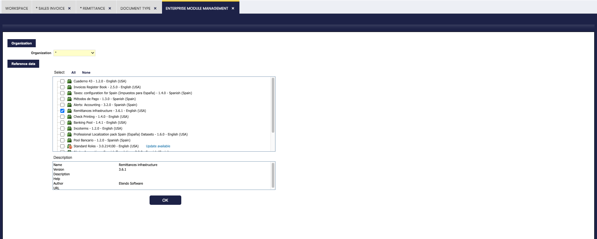

    !!! info
        Para más información, visite [Gestión de Módulos de Empresa](../../general-setup/enterprise-model/enterprise-module-management.md).

- Tipo de Remesa: Es necesario definir un tipo de remesa con un determinado método de pago en la ventana *Tipo de Remesa*.

    !!! info
        Para más información, visite [ventana Tipo de Remesa](../../financial-management/receivables-and-payables/setup/remittance-type.md).

- Cuenta bancaria predeterminada del Tercero: Para cada tercero, es posible definir una cuenta bancaria que se seleccione por defecto cada vez que sea necesario crear una remesa.

    !!! info
        Para más información, visite [Cuenta Bancaria](../../master-data-management/master-data/business-partner.md#bank-account) en la sección Tercero.

## Ventana Remesa { #remittance-window }

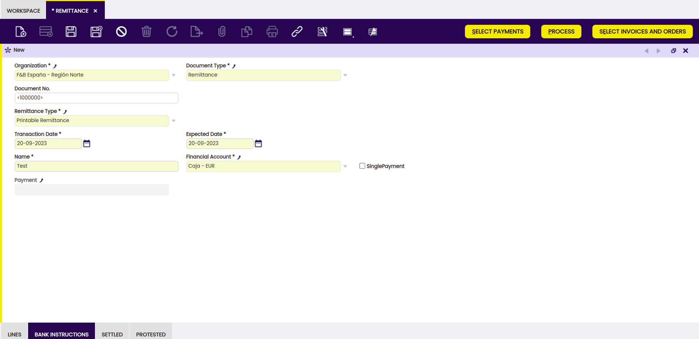

Como se muestra en la imagen anterior, es necesario completar los campos de la ventana y aparecen diferentes botones para continuar con el proceso.

### Botones { #buttons }

**Seleccionar Pagos**

Con este botón, el usuario puede seleccionar un pago para incluirlo en la remesa.

**Procesar**

Con este botón, el usuario procesa los pagos y agrupa las líneas según las opciones que se muestran en la ventana emergente correspondiente.

!!! info
    Si el módulo Remesa Automatizada del Financial Extensions Bundle está instalado, este proceso incluye el establecimiento de la fecha y la liquidación de la remesa. Para más información, visite [la guía de usuario de Remesa Automatizada](../../../../optional-features/bundles/financial-extensions/automated-remittance.md).
   

**Seleccionar Facturas y Pedidos**

En la ventana Remesa, se muestra el botón *seleccionar facturas y pedidos*. Con este botón, el usuario puede seleccionar no solo facturas, sino también pedidos para incluir en la remesa. En la ventana emergente que se muestra al hacer clic en este botón, el usuario puede ordenar y filtrar cada columna; los pagos de entrada y de salida se muestran al mismo tiempo y los pedidos y las facturas se muestran juntos.

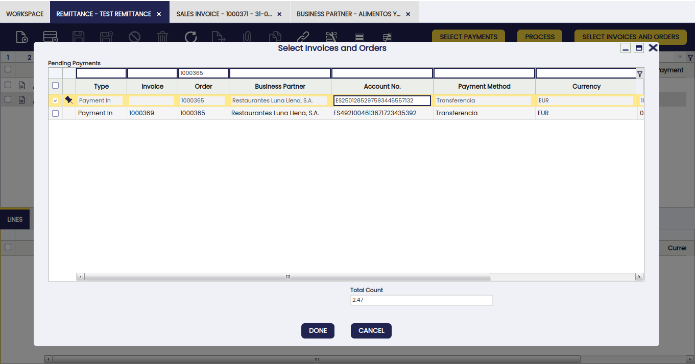

**Protestar Remesa**

!!!info
    Este botón solo está disponible si el módulo Remesa Automatizada del Financial Extensions Bundle está instalado. Para instalarlo, siga las instrucciones del marketplace: [Financial Extensions Bundle](https://marketplace.etendo.cloud/#/product-details?module=9876ABEF90CC4ABABFC399544AC14558){target="_blank"}.

El botón Protestar Remesa permite la protesta automática de remesas. Esta función facilita la gestión de protestas y la reliquidación de futuras remesas.

!!! info
    Para más información, visite [la guía de usuario de Remesa Automatizada](../../../../optional-features/bundles/financial-extensions/automated-remittance.md).

## Tipos de Remesas { #types-of-remittances }

Existen dos tipos de remesas:

**Remesas Sin Descuento:** pedidos/facturas de compras y/o ventas y/o pagos (de entrada/salida) se agrupan en una remesa que se envía al banco para su gestión.

- La remesa genera una serie de pagos según la agrupación requerida por el usuario (por tercero, fecha de vencimiento, entre otros). El banco suele cobrar una determinada cantidad por la gestión de cada uno de estos pagos, de ahí el intento de agruparlos.
- El banco deduce el importe de la remesa de la cuenta financiera en el momento en que se envía la remesa, encargándose de gestionar los pagos.

**Remesas con Descuento:** pedidos/facturas de ventas y/o pagos se agrupan en una remesa que se envía al banco. El banco adelanta el importe de la remesa y luego la gestiona por sí mismo.

- La remesa genera tantos pagos (de entrada/salida) como los incorporados en la remesa, más uno por el importe global, que es el que se lleva a la cuenta financiera por el anticipo de dicho importe.
- El banco informa de los pagos (de entrada/salida) que han sido liquidados (normalmente, si en un mes el banco no responde, estos pagos se consideran liquidados) y de los que han sido protestados.

=== "Remesa Sin Descuento"
    Para crear una Remesa Sin Descuento, siga estos pasos:

    1. Agregue una nueva remesa a la ventana Remesa y seleccione "Remesa imprimible" como tipo de remesa, ya que indica que es una remesa sin descuento.

        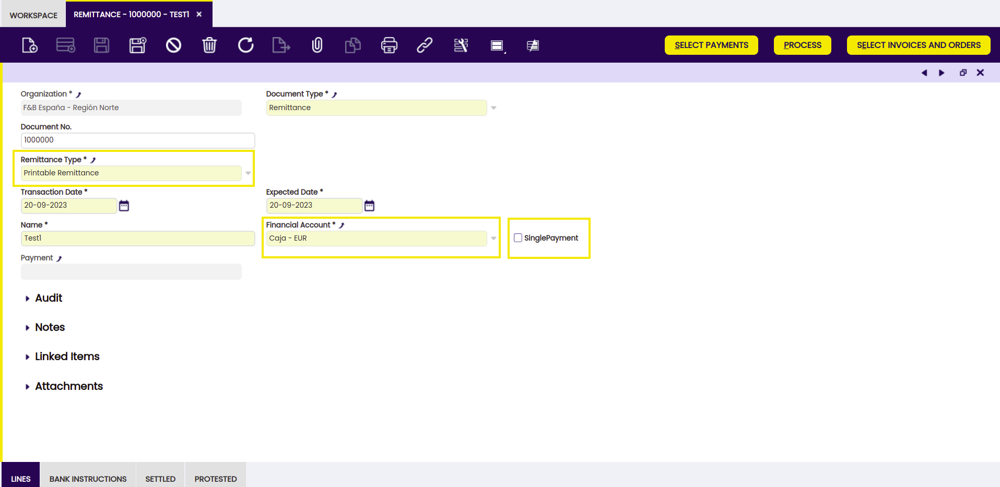

    2. Al hacer clic en el botón "Seleccionar Facturas y Pedidos", el sistema muestra un pop-up con, por defecto, el selector "Mostrar cobros/pagos para métodos de pago alternativos" desmarcado, mostrando solo las facturas que tienen el método de pago Remesa.
        Al marcar esta casilla de verificación, el sistema muestra todas las facturas y pedidos pendientes de llevar al banco. Seleccione las operaciones que necesite remitir y procese.

        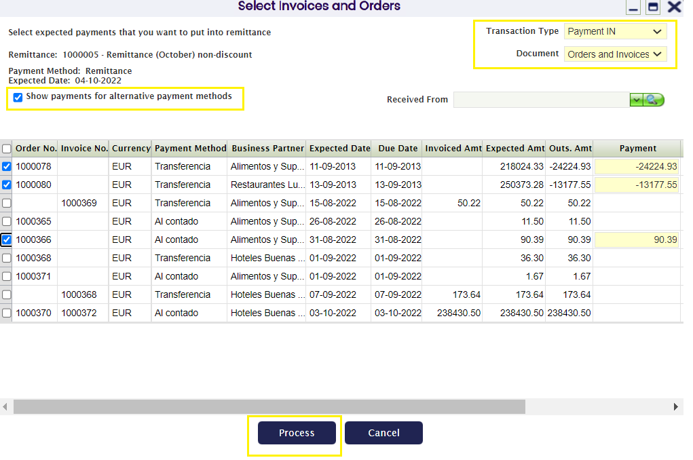

        De modo que el sistema inserta las líneas seleccionadas:

        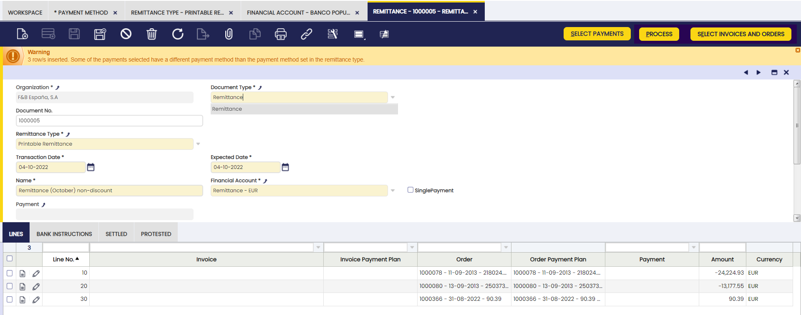

    3. Si no se van a añadir más operaciones a la remesa, procese el pago haciendo clic en el botón "Procesar".

        !!! warning
            Al usar el botón "procesar" y agrupar líneas, es necesario que las cuentas bancarias de esas líneas de un documento de remesa coincidan. Si son diferentes entre sí, Etendo muestra una notificación de error como se ve a continuación.

        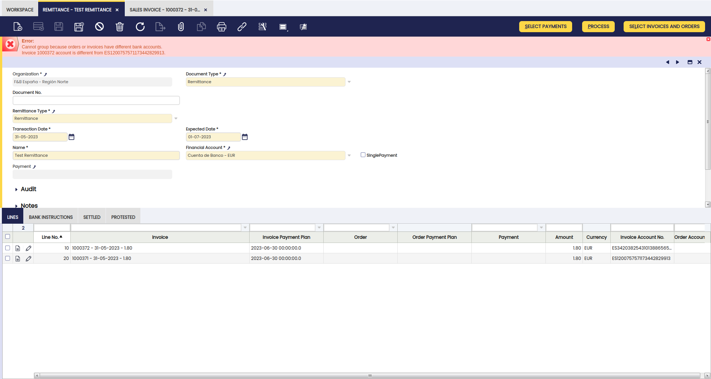

        !!! info
            Las cuentas bancarias pueden definirse en la cabecera de facturas de [compra](../../procurement-management/transactions.md#remittance_1) y [ventas](../../sales-management/transactions.md#remittance_1), así como en pedidos de [compra](../../procurement-management/transactions.md#remittance) y [ventas](../../sales-management/transactions.md#remittance).

    4. Al procesar, el sistema muestra las siguientes opciones:

        - Sin agrupación: genera un pago por cada una de las líneas seleccionadas.
        - Agrupar por factura: genera un pago por cada factura (en caso de que haya más de una).
        - Agrupar por factura y fecha de vencimiento: genera un pago por cada factura y fecha de vencimiento.
        - Agrupar por tercero: genera tantos pagos como terceros haya en las líneas seleccionadas. Asigna el importe total de todas las líneas correspondientes a cada tercero.
        - Agrupar por tercero y fecha de vencimiento: crea tantos pagos como terceros y fechas de pago haya en las líneas seleccionadas.
        - Agrupar por pedido: genera un pago por cada pedido (en caso de que haya más de uno).
        - Agrupar por pedido y fecha de vencimiento: genera un pago por cada pedido y fecha de vencimiento.

        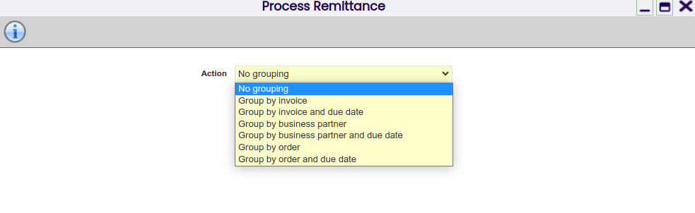

    **Ejemplo**

    Como ejemplo, creemos el pago seleccionando la opción Agrupar por tercero.  
    Al procesar, se han creado 3 pagos para las 3 líneas incluidas en la remesa, dado que todas corresponden al mismo tercero.

    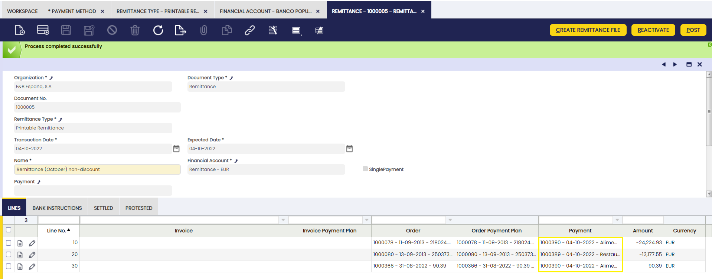

    Al navegar al pago, puede observarse que el estado de los pagos creados es "Remesado".

    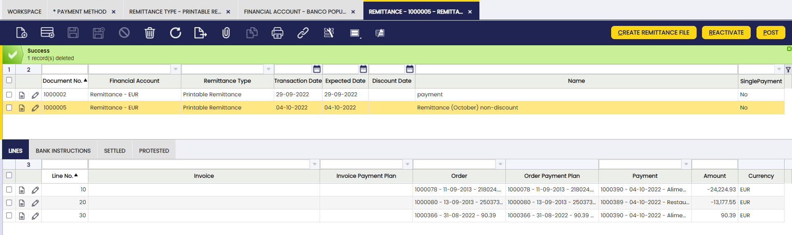

    Cuando se contabiliza la remesa, se obtiene un asiento contable, según las cuentas definidas.

    #### Liquidación / Devolución de Remesa

    Una vez que el banco confirma los pagos correspondientes, acceda a la ventana "Liquidación / Devolución de Remesas" y verifique las remesas liquidadas y protestadas.

    !!! info
        La fecha seleccionada es la fecha de contabilización del documento creado.

    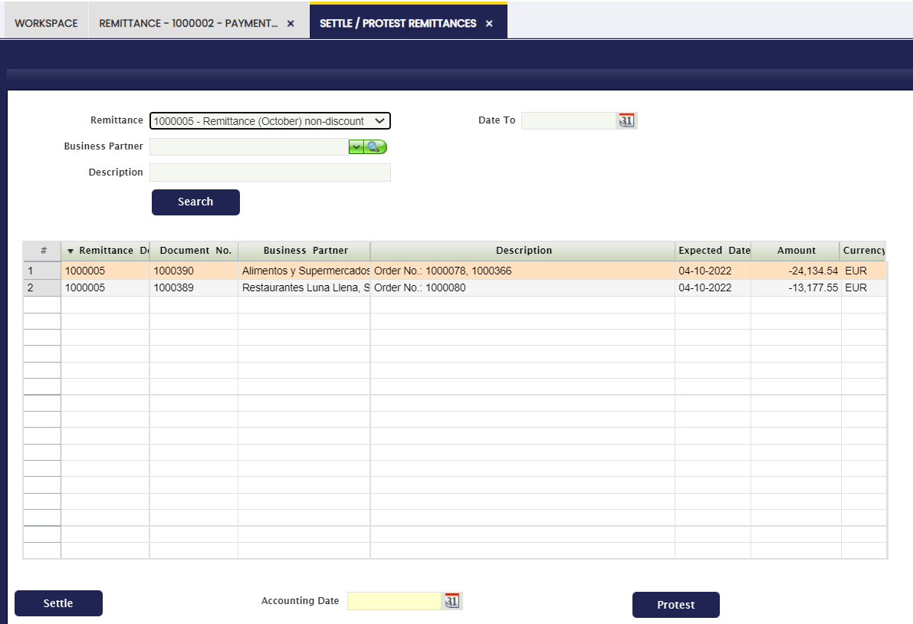

    Al liquidar la primera línea, se observa que la línea se ha añadido a la pestaña de liquidadas de la remesa correspondiente.

    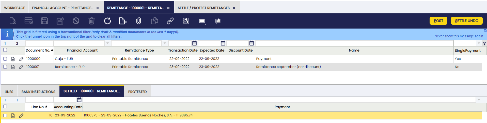

    Una vez contabilizada la remesa, se obtiene el asiento contable según la configuración indicada. La contabilización debe realizarse línea a línea de las transacciones liquidadas.
    Las líneas de remesa devueltas aparecerán en la pestaña de devueltas.

    La contabilización de las operaciones devueltas se contabiliza de la misma manera que las operaciones liquidadas, desde el 401 del extracto de remesa hasta el 400, dejando nuevamente la deuda pendiente.

    !!! info
        Las transacciones devueltas podrán gestionarse posteriormente en otras remesas o directamente en las cuentas financieras.

    El estado de las transacciones de remesa liquidadas cambia a "Retirado no Saldado" y en el caso de pagos de salida a "Depositado no Saldado".

    Si uno de los pagos ha sido devuelto, el estado del documento se establece como "Pendiente de Ejecución".

    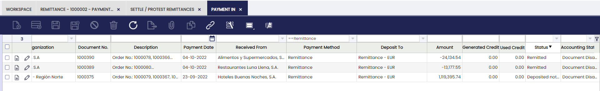

    !!! info
        Es posible imprimir tanto las remesas sin descuento como las remesas con descuento desde la impresora de la barra de herramientas.

    #### Pagos liquidados a la cuenta financiera

    !!! info
        Tras la liquidación, el sistema ha transferido automáticamente estos pagos a la cuenta financiera indicada en los pagos.

    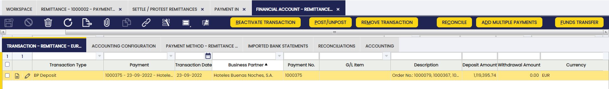

    ##### Conciliar Pagos

    La opción Conciliar Pagos en cualquier proceso de remesa se refiere a la acción de comparar y ajustar registros financieros para garantizar que los pagos estén registrados con precisión y correctamente. Usando el botón *conciliar* en la ventana *cuenta financiera*, es posible acceder a la ventana que se muestra a continuación.

    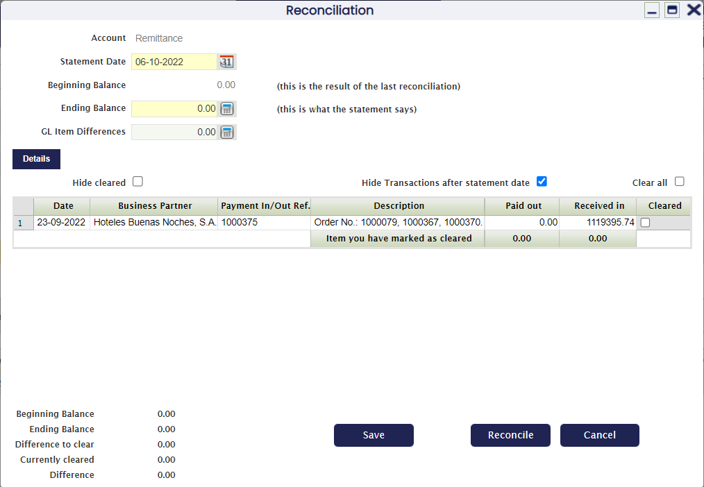

=== "Remesa con Descuento"

    Para crear una remesa con descuento, siga estos pasos:

    1. Cree una remesa desde la ventana Remesas. Seleccione como tipo de remesa "Remesas con Descuento". Una vez creada la cabecera, agregue las líneas, ya sean facturas, pedidos o pagos, que deben incluirse en esta remesa.

        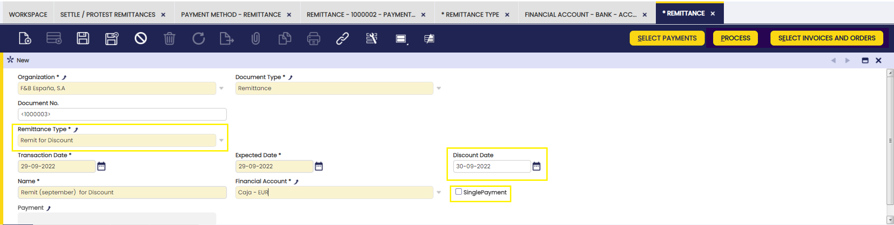

    2. Al hacer clic en "Seleccionar Facturas y Pedidos", el sistema muestra un pop-up con, por defecto, el selector "Mostrar cobros/pagos para métodos de pago alternativos" desmarcado, mostrando solo las facturas que tienen el método de pago Remesa.
        Al marcar esta casilla de verificación, el sistema muestra todas las facturas y pedidos pendientes de llevar al banco. Seleccione las operaciones que necesite remitir y procese.

        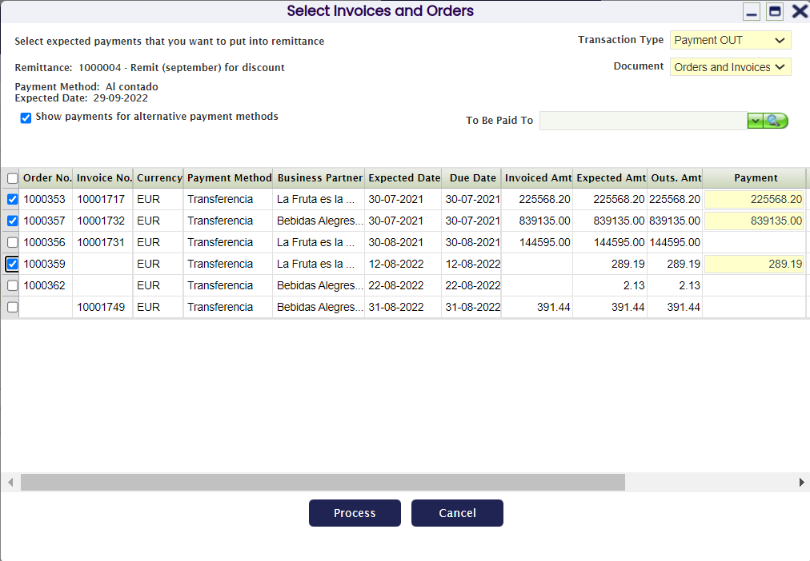

        El sistema inserta las líneas seleccionadas:

        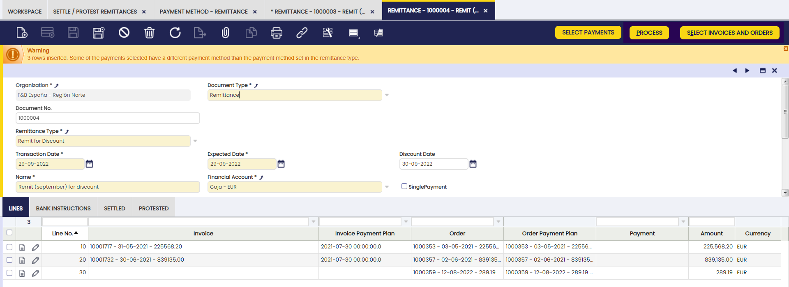

    3. Si no se van a añadir más operaciones a la remesa, procese el pago haciendo clic en el botón "Procesar".

        !!! warning
            Al usar el botón "procesar" y agrupar líneas, es necesario que las cuentas bancarias de esas líneas de un documento de remesa coincidan. Si son diferentes entre sí, Etendo muestra una notificación de error como se ve a continuación.

        

        !!! info
            Las cuentas bancarias pueden definirse en la cabecera de facturas de [compra](../../procurement-management/transactions.md#remittance_1) y [ventas](../../sales-management/transactions.md#remittance_1), así como en pedidos de [compra](../../procurement-management/transactions.md#remittance) y [ventas](../../sales-management/transactions.md#remittance).

    4. Al procesar, el sistema muestra las siguientes opciones:
        - Sin agrupación: genera un pago por cada una de las líneas seleccionadas.
        - Agrupar por factura: genera un pago por cada factura (en caso de que haya más de una).
        - Agrupar por factura y fecha de vencimiento: genera un pago por cada factura y fecha de vencimiento.
        - Agrupar por tercero: genera tantos pagos como terceros haya en las líneas seleccionadas. Asigna el importe total de todas las líneas correspondientes a cada tercero.
        - Agrupar por tercero y fecha de vencimiento: crea tantos pagos como terceros y fechas de pago haya en las líneas seleccionadas.
        - Agrupar por pedido: genera un pago por cada pedido (en caso de que haya más de uno).
        - Agrupar por pedido y fecha de vencimiento: genera un pago por cada pedido y fecha de vencimiento.

        En este caso, se recomienda seleccionar la opción "Sin agrupación", ya que se generarán tantos pagos como operaciones tenga la remesa y un pago suma de todas las operaciones, que es el que el banco adelantará. El resto de los pagos se liquidarán según se conozcan.

        

    5. El siguiente paso es llevar al banco el pago suma de las transacciones de la remesa, ya que en estos casos el banco adelanta el dinero. Desde la ventana de cuenta financiera, agregue el pago a la transacción y concílielo con el extracto bancario.
      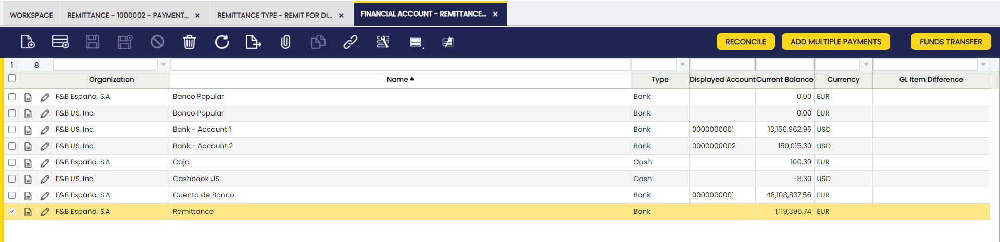

    6. Finalmente, liquide los pagos ejecutados y/o devuelva los necesarios.
      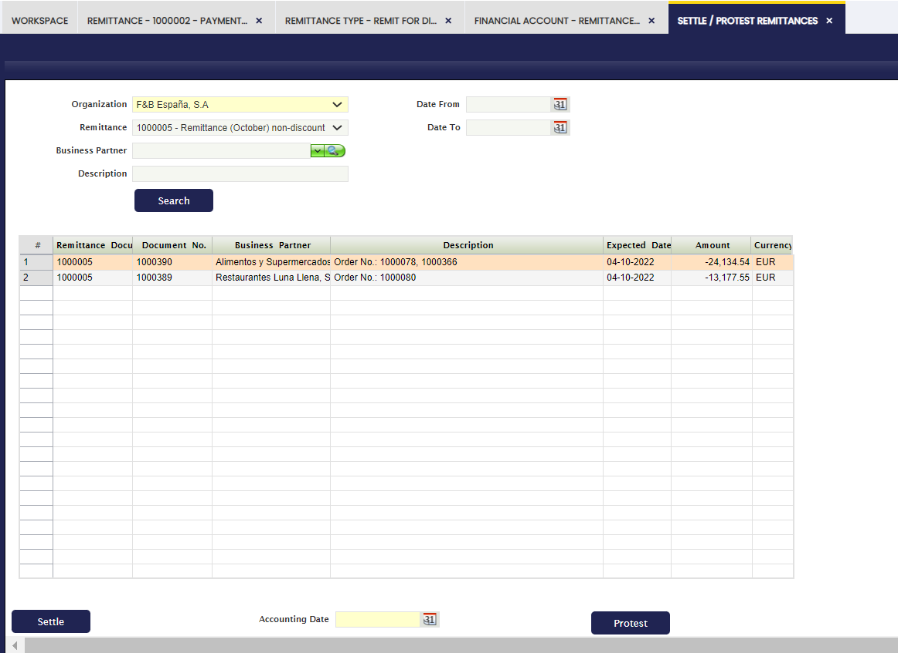
      El estado de los cobros liquidados cambió a Liquidado en Remesa y el estado de los pagos totales de las operaciones de la remesa cambió a Pago saldado.

---

This work is a derivative of [Financial Management](http://wiki.openbravo.com/wiki/Financial_Management){target="\_blank"} by [Openbravo Wiki](http://wiki.openbravo.com/wiki/Welcome_to_Openbravo){target="\_blank"}, used under [CC BY-SA 2.5 ES](https://creativecommons.org/licenses/by-sa/2.5/es/){target="\_blank"}. This work is licensed under [CC BY-SA 2.5](https://creativecommons.org/licenses/by-sa/2.5/){target="\_blank"} by [Etendo](https://etendo.software){target="\_blank"}.
