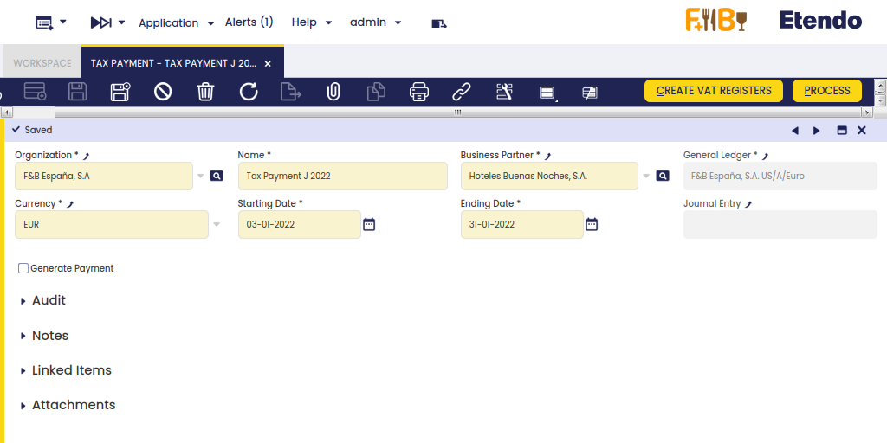
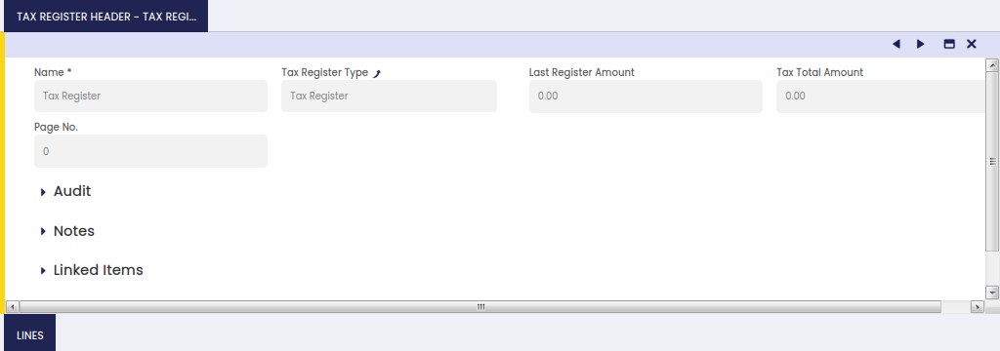
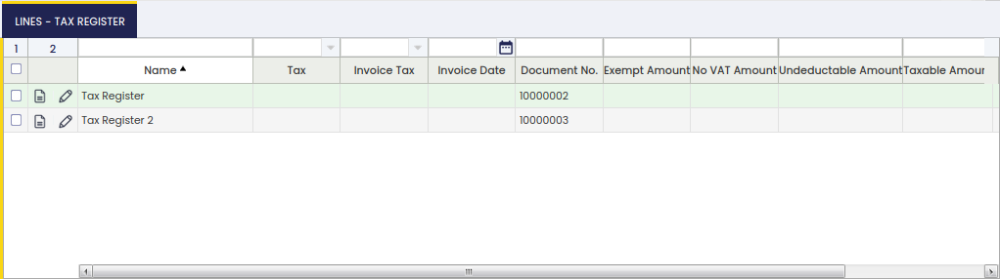

---
tags:
  - Etendo Classic
  - Financial Management
  - Tax Payment
  - VAT Settlement
  - Receivables and Payables
---

# Pago del impuesto { #tax-payment }

:material-menu: `Aplicación` > `Gestión Financiera` > `Cobros y Pagos` > `Transacciones` > `Pago del impuesto`

## Visión General { #overview }

El proceso "Pago del impuesto" ayuda a calcular el importe de los impuestos a pagar a la autoridad tributaria o a recibir de ella.

Impuestos como el IVA se liquidan como la diferencia entre:

- el IVA que cobra una organización y pagan sus clientes, es decir, el IVA Repercutido o IVA recaudado en Ventas
- y el IVA que paga una organización a otras empresas por los suministros que recibe, es decir, el IVA Soportado o IVA pagado en Compras

El proceso de pago del impuesto puede ejecutarse una vez realizada la configuración detallada a continuación:

- Debe crearse un tercero como Autoridad Tributaria en la ventana de terceros. Este tercero debe configurarse tanto como "Cliente" como "Proveedor", porque a veces la organización tendrá que pagar a la autoridad tributaria y otras veces al contrario.
- Debe crearse un Concepto Contable y luego vincularse a cada Tipo de Registro de Impuesto. El Concepto Contable se utilizará para contabilizar el pago de impuesto correspondiente en el libro mayor.
  - La "**Cuenta de Débito del Concepto Contable**" es la cuenta a usar al contabilizar un pago de impuesto a recibir de la autoridad tributaria.
  - La "**Cuenta de Crédito del Concepto Contable**" es la cuenta a usar al contabilizar un pago de impuesto a realizar a la autoridad tributaria.
- Tantos Tipos de Registro de Impuesto como sean necesarios se vinculan a los tipos impositivos de cada tipo a tener en cuenta para el cálculo del pago de impuestos.

## Cabecera { #header }

La ventana de pago del impuesto permite al usuario calcular el importe de los impuestos a pagar a la autoridad tributaria o a recibir de ella dentro de un período de tiempo determinado. También permite al usuario generar el pago correspondiente hacia/desde la autoridad tributaria.

Como se muestra en la imagen anterior, los campos a completar son:

- **Organización**: es la organización para la que debe calcularse el pago de impuestos.
- **Nombre**: el nombre del cálculo del pago de impuestos.
- **Tercero**: es el tercero de la autoridad tributaria que recibe el pago de impuestos o realiza el pago de impuestos.
- **Moneda**: la moneda del pago de impuestos.
- **Fecha de Inicio**: es la primera fecha a tener en cuenta para el cálculo del impuesto.
  - Impuestos como el IVA se liquidan mensualmente, por lo que la fecha de inicio puede ser el primer día de un mes determinado.
- **Fecha de Fin**: es la última fecha a tener en cuenta para el cálculo del impuesto.
  - Impuestos como el IVA se liquidan mensualmente, por lo que la fecha de fin puede ser el último día de un mes determinado.
- **Asiento Contable**: es un campo de solo lectura que enlaza con el asiento contable creado una vez que el pago de impuestos se procesa y se incluye por tanto en un Libro Diario.
- **Casilla de verificación Generar Pago**: esta casilla de verificación permite al usuario configurar si se va a crear un cobro/pago tras procesar el pago de impuestos.
- Esta casilla de verificación no debe seleccionarse en aquellos casos en que la autoridad tributaria deba pagar a la organización pero, en lugar de hacerlo, compense los importes a pagar por la organización.

El botón **Crear Registros de IVA** ejecuta el proceso de pago de impuestos y consigue que el importe de impuesto de cada "Tipo de Registro de Impuesto" se rellene automáticamente en la pestaña "Cabecera del Registro de Impuesto".

El botón **Procesar** procesa el pago de impuestos e incluye la contabilización de la liquidación de impuestos en un **Libro Diario** accesible desde el campo "**Asiento Contable**" de la ventana **Pago del impuesto**.

El botón "**Desprocesar**" deshace el pago de impuestos y elimina el Libro Diario creado.

## Cabecera del Registro de Impuesto { #tax-register-header }

La pestaña Cabecera del Registro de Impuesto permite al usuario ver el importe de impuesto calculado por cada "Tipo de Registro de Impuesto" configurado.

## Líneas { #lines }

La pestaña de líneas es una pestaña de solo lectura que lista todas las transacciones de impuesto relacionadas con los tipos impositivos configurados como parte de un "Tipo de Registro de Impuesto".

Algunos campos relevantes a destacar son:

- **Impuesto**: es el tipo impositivo incluido como parte del "Tipo de Registro de Impuesto".
- **Impuesto de Factura**: es la factura vinculada al tipo impositivo.
- **Fecha de Factura**: es la fecha de la factura.
- **Nº de Documento**: es el número de documento, por ejemplo un número de factura.
- **Importe Exento**: es un importe de impuesto exento que no se incluirá en el pago de impuestos. La configuración se encuentra en la pestaña de cliente del tercero.
- **Importe Sin IVA**: importe que no se incluye en el cálculo del impuesto.
- **Importe No Deducible**: importe que no es deducible.
- **Base Imponible**: es la base imponible utilizada para el cálculo del importe del impuesto.
- **Importe del Impuesto**: es el importe del impuesto.
- **Importe Total**: es el importe bruto total del documento/factura.

---

This work is a derivative of [Financial Management](http://wiki.openbravo.com/wiki/Financial_Management){target="\_blank"} by [Openbravo Wiki](http://wiki.openbravo.com/wiki/Welcome_to_Openbravo){target="\_blank"}, used under [CC BY-SA 2.5 ES](https://creativecommons.org/licenses/by-sa/2.5/es/){target="\_blank"}. This work is licensed under [CC BY-SA 2.5](https://creativecommons.org/licenses/by-sa/2.5/){target="\_blank"} by [Etendo](https://etendo.software){target="\_blank"}.
